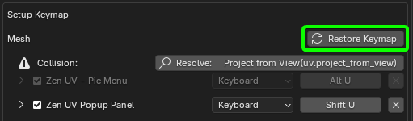

# Preferences

To open Zen UV Preferences go to Blender left top corner **Edit** -> **Preferences** -> **Add-ons** -> **Zen UV**.

!!! Tip

    Another way is to LMB click on the widget [**Sticky UV Editor**](sticky_uv_editor.md), holding Ctrl+Shift keys.

    

## Update Zen UV

Here you can find information about available new versions and update Zen UV using **Update Zen UV** button. More about installation and update process you care read [**here**](installation.md).

---

## Keymap

Configure shortcuts on some important operators of the addon.

---
### Zen Modifier Key

The key is a modifier that is used in combination with a mouse.

Some systems, for example, [**Advanced UV Maps**](adv_uv-maps.md), involve the use of an additional key along with a click. Depending on the navigation settings, this key may not work. If this is your case, change Zen Modifier Key to a suitable one.

---
### Keymap Tracking And Resolving System

When installing a new addon, there is always a possibility that the hotkeys configured in the addon may conflict with the user's custom hotkeys. To detect such situations and inform the user about hotkey conflicts within the addon, we have developed a corresponding system.

You can find information about conflicts in two different Zen UV panels:

1. The main panel [**Preferences**](preferences.md/#preferences) in the N-Panel.

|No collision| Collision present|
|---|---|
|||

2. The **Addon Preferences** panel in the [**Keymap**](addon_prefs.md/#keymap) tab.

|No collision| Collision present|
|---|---|
|||

---
#### Resolving Collisions

There are several options for resolving collisions.

1. In the [**Preferences**](preferences.md/#preferences) panel in the N-Panel.

    - Click the hotkey button. In this example, `Alt U`.

      

    - A settings dialog will appear.
      

    - Change the hotkey or disable it by unchecking the box if you don't need it. After resolving the conflict, you will receive a confirmation message saying everything is fine.
      

2. In the **Addon Preferences** panel under the [**Keymap**](addon_prefs.md/#keymap) tab:
    

    - Use the Resolve button. A settings dialog will open.
      

    - Change the hotkey or disable it by unchecking the box if you don't need it. After resolving the conflict, you will receive a confirmation message saying everything is fine.
      

---

##### Using the Restore Keymap Mechanism

!!! Warning
    Using the Restore Keymap mechanism will reset the entire section to its initial state. You may lose your custom settings.

This type of restoration requires caution, as it restores the entire section. In this example, it's the "Mesh" section.

When you click on the **Restore Keymap** button, a warning will appear.

This warning informs you that 98 keymap items will be restored.

---

##### Restoring a Deleted Keymap

If a keymap has been deleted, it can only be restored by resetting the entire section, which will reset all keymaps in that section to their default settings.

---
## UI

Settings related to the user interface, including the Zen UV combo panel and other UI elements.

---
### Addon N-Panel Name

The name of the addon tab in the N-Panel. You can choose from two options:

 - Zen
 - Zen UV

If you own any addon developed by [zenmasters](https://zenmasters.team), selecting 'Zen' will group all addons under one tab. You only need to switch the name to 'Zen' in all addons and restart Blender.

Here's an example of how to group all addons under one tab in Blender:

  - Open the addon settings (Edit > Preferences > Add-ons).
  - For each addon you want to group, find the tab name field.
  - Change the tab name to "Zen" for all addons.
  - After changing the name in all addons, restart Blender.

This will group all the addons under a single "Zen" tab in the N-Panel.

|  |
| --- |
| An example of how to group all Zen addons under one tab in Blender |

---
### Pie Menu

[<u>The Pie Menu article</u>](user_interface.md#pie-menu)

- **Display Pie Assist** - Display Pie Help Assist Panel
- **Pie Assist Font Size** - Pie Assist Font Size

---
### Right menu

- **Right Menu Assist** - Enables or disables the 'Add to ZenUV Favorites' option in the right-click menu. More info in the article [User Interface](user_interface.md/#right-menu-assist)

---
### Adv UV Maps

Enables or disables the use of an eyedropper in the object selection tool in the panel [Adv UV Maps](adv_uv-maps.md#transfer-uv).

- **Enable Object Eye Dropper** - Warning! If enabled active object becomes multi-user

---
### Combo Panel subpanels setup

This menu allows you to enable, disable, or toggle subpanels for Zen UV tools into a floating state. Since the addon uses different panels with different functions for various contexts, the settings are displayed separately for the UV Editor (on the left) and the 3D Viewport (on the right). You can adjust the same settings in the [Preferences](preferences.md#panels) panel.

---
## Modules

Panel for managing [**Zen UV Core Library**](installation.md) and **Zen UV Relax Application**.

### Relax application

- **Call Relax Application in Shell** - Relax application is invoked via the shell and is platform-dependent
NOTE: Use this method if application can not be started via Blender

### Ministry Of Flat

Ministry Of Flat is a third-party software designed for automatic UV unwrapping.
This software is designed **exclusively for Windows**, so this operator will not be available on **Linux** or **Mac OS**.
Here you can find information about its author, whether it is installed, and where to locate the installed module.  
For more details, refer to [this article](unwrap.md#auto-unwrap).

### User Script

Also here you can set your custom [**User Script**](user_script.md).

---
## Sticky UV Editor

Sticky UV Editor is a system that allows opening UV Editor on the left or the right from the active 3D Viewport or as a separate window. Information about Sticky UV you can find in the [**Sticky UV Editor**](sticky_uv_editor.md#sticky-uv-editor) article.

---
## Help

A section where you can find links to this [**Documentation**](index.md), support via [**Discord**](https://discord.gg/wGpFeME), and download examples for learning and testing. You can find a copy of this section in the [**Help**](help.md) subpanel of the addon's main panel.

