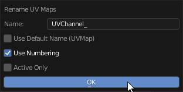

# Advanced UV Maps
Advanced UV Maps section created to have quick access to Object Data Properties — UV Maps.
It allows to select the active, add, remove, and rename UV Maps from the list.

If more than one object is selected, you can synchronously work with UV maps of the selected objects.

!!! Panel
    

!!! tip
    Watch the video explaining how **Advanced UV Maps** works.

    

    <iframe src="https://www.youtube.com/embed/Y7dG2i-FASs?start=541&end=619" style="position: absolute; top: 0; left: 0; width: 100%; height: 100%;" allowfullscreen="" seamless="" frameborder="0"></iframe>
    

---
## Clean UV Maps
Remove inactive UV Map.

!!! tip
    Hold [Zen Modifier Key](addon_prefs.md/#zen-modifier-key) (default 'Alt') to apply on all selected objects.

---
## Rename UV Maps
Rename UV Map using pattern. The pattern can be defined in the operator popup.

   - **Name** - The pattern.
   - **Use Default Name** - Use the native name defined in Blender.
   - **Use Numbering** - Add numbers to the end of the name.
   - **Active Only** - Rename Active UV Maps only.

!!! tip
    Hold [Zen Modifier Key](addon_prefs.md/#zen-modifier-key) (default 'Alt') to apply on all selected objects.

---
## Duplicate active UV Map 
Duplicate the active UV Map or create a new one depending on the operator's properties.

!!! tip
    Hold [Zen Modifier Key](addon_prefs.md/#zen-modifier-key) (default 'Alt') to apply on all selected objects.

---
## Remove active UV Map 
Remove active UV Map.

!!! tip
    Hold [Zen Modifier Key](addon_prefs.md/#zen-modifier-key) (default 'Alt') to apply on all selected objects.

---
## Sync UV Maps IDs 
Set the same active UV Map index for all selected objects.
Alt + Click - activates automatic synchronization mode.

In automatic synchronization mode:

    If the background of the button is blue, the UVs are synchronized.

    If the background of the button is purple, the UVs are out of sync.

---

## Copy UV / Paste UV

Allows transferring the UV coordinates between UV Maps.

**Copy UV** - Copy the UV coordinates of the selection.

**Paste UV** - Paste the UV coordinates.