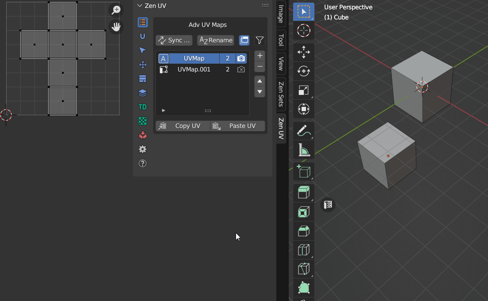
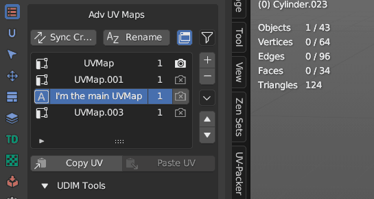
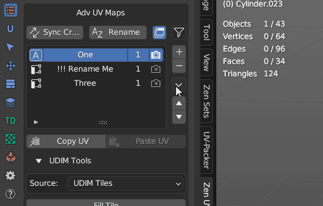
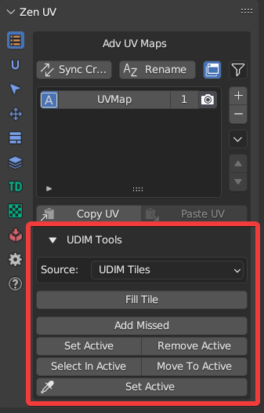
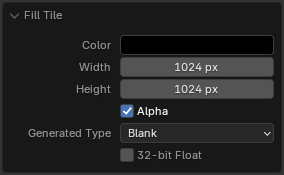
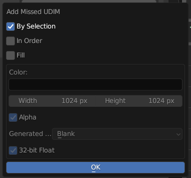
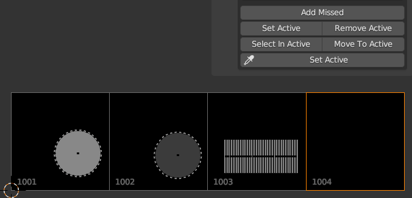
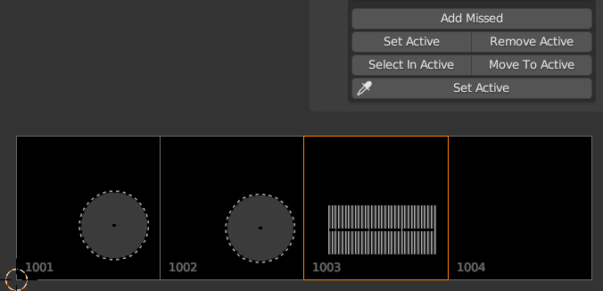
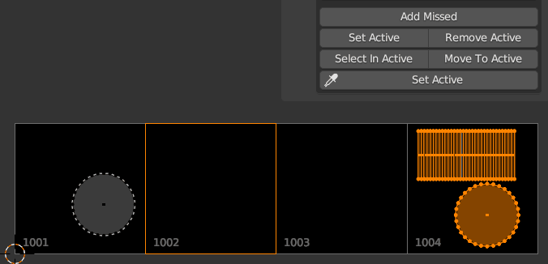
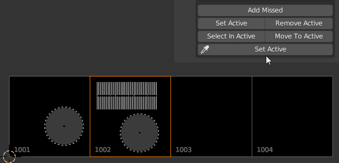

# Advanced UV Maps
Advanced UV Maps section created to have quick access to Object Data Properties — UV Maps.
It allows to select the active, add, remove, and rename UV Maps from the list.

If more than one object is selected, you can synchronously work with UV maps of the selected objects.

!!! Panel
     | Edit Mode | Object Mode| 
     |---|---|  
     |  ||  

<!-- !!! tip
    Watch the video explaining how **Advanced UV Maps** works.

    

    <iframe src="https://www.youtube.com/embed/Y7dG2i-FASs?start=541&end=619" style="position: absolute; top: 0; left: 0; width: 100%; height: 100%;" allowfullscreen="" seamless="" frameborder="0"></iframe>
    
 -->

## Advanced UV Maps List
The list can work in two modes:

- Multi object mode
- Single object mode

| List Description |
|---|
|  |

| List Color | Individual for every column |
|---|---|
| Default color | All selectected objects has the same active UV Map, render, same position in the list |
| Red color | At least one object differs with one of the UV Map parameters |

| 1. Active UV Map status | |
|---|---|
|  | UV Map is active |
|  | UV Map is not active |

| 2. UV Map name | |
|---|---|
| Name is highlighted | All selected objects have UV Map with the name |
| Name is grayed out | At least one object from selection does not have UV Map with the name |

| 3. UV Map count and position status | |
|---|---|
| First or single digit | Number of objects that have UV Map with the selected name |
| Second digit | Selected objects count |

| 4. Active Render UV Map status | |
|---|---|
|  | UV Map is active for render |
|  | UV Map is not active for render |

### UV Maps Status Detection
Advanced Maps system detects synchronization status of all UV Maps in the selected objects. It is possible to disable some parameters which are not neccessary for you to detect.

|  |
|---|
| |

---
## Duplicate active UV Map

!!! Button
    

Duplicate the active UV Map or create a new one depending on the operator's properties.

## Remove active UV Map

!!! Button
    

!!! Warning
    Zen UV monitors the state of objects. If you delete all UV maps, all [Finished](unwrap.md#finishing-system) and [Excluded](pack.md#excluded-system) tags will also be removed.

---

## Rename UV Maps

Rename UV maps of selected objects

!!! Properties
    

- **UV Maps source** - Rename UV maps mode
    - *Selected* - Operates on the currently selected UV Map items in the list
    - *All* - Operates on all UV Map items in the list
- *Find* - The text to search for in names
    - _1) if text is empty then all name will be renamed_
    - _2) if 'Use Regex' is set then text must be a valid regular expression_
- **Replace** - The text to replace for in matching names found from the 'Find' text
- **Show Replace Templates Settings** - Show list of template names to rename UV maps
- **Match Case** - Search results must exactly match the case of the 'Find' text
- **Use Regex** - Replace by regular expression in the 'Find' text
- **Generate Template Names** - Rename UV maps from replace preset templates
- **Counter** - Integer value will be added to the end of the name
- **Start from** - If Counter property is used, integer value will be started from this value
- **Preview** - Preview the generated name

|  |
|---|
|Rename UV Maps|

### Generate UV Map names from template

If you have naming convension for UV Maps in your projects, you can create template preset and quickly rename all UV Maps in one click

| UV Map naming preset |
|---|
|  |

---

## Sync UV Maps 
If your model requires UV Maps to have the same postion, name, active or render status you can synchronize them

---

## Copy UV / Paste UV

Allows transferring the UV coordinates between UV Maps.

!!! note
    Available in Edit Mesh mode if geometry of selected objects is the same.

|  |
|---|

#### Copy UV 

Copy the UV coordinates of the selection.

#### Paste UV 

Paste the UV coordinates.

---

## Adv UV Maps Tools

#### Clean UV Maps

Remove all inactive UV Maps.

---

#### Set UV Map Name by Index

Set UV Map name by its Index in the list.

---

## Transfer UV
|  |
|---|

| Transfer Modes | |
|---|---|
| Matching geometry | Objects must be of type mesh and must have a matching topology |
| Advanced | Transfer UV maps by generating an interpolated mapping between source and target mesh elements |
| Layout | Transfer layout of UV maps from active to selected meshes |

!!! Warning
    Using the eyedropper tool assigns multi-user data to the object. You can disable this functionality in the [Addon Preferences](addon_prefs.md#adv-uv-maps)

---

## UDIM tools

[**UDIM workflow**](https://docs.blender.org/manual/en/latest/modeling/meshes/uv/workflows/udims.html) is a special workflow that allow to spread UV islands across several different textures of the model.

!!! note
    Available only in UV Editor context in Edit Mode.
    The image Source must be set to 'UDIM Tiles'.

---

#### Fill Tile

Fill active UDIM tile with a generated image

!!! Properties
    

- **Color** - Default fill color
- **Width** - Image width
- **Height** - Image height
- **Alpha** - Create an image with an alpha channel
- **Generated Type** - Fill the image with a grid for UV map testing
    - *Blank* - Generate a blank image
    - *UV Grid* - Generated grid to test UV mappings
    - *Color Grid* - Generated Improved UV grid to test UV mappings
- **32-bit Float** - Create image with 32-bit floating-point bit depth

---

#### Add Missed

Create the missing UDIM Tile at the Island location. 

!!! Properties
    

- **By Selection** - Use selection to determine where where UDIM tile will be created
- **In order** - Create all the missing tiles in order until it reaches the last missed tile with the selection
- **Fill** - Fill tile with settings below

- **Color** - New tile color
- **Width** - Tile width
- **Height** - tile height
- **Alpha** - Create an image with an alpha channel
- **Generated Type** - Fill the image with a grid for UV map testing
    - *Blank* - Generate a blank image
    - *UV Grid* - Generated grid to test UV mappings
    - *Color Grid* - Generated Improved UV grid to test UV mappings
- **32-bit Float** - Create image with 32-bit floating-point bit depth

---

#### Set Active 

Set the active UDIM Tile based on the selection.

!!! Properties
    This operator has no properties

  

---

#### Remove Active

Remove the active UDIM Tile

!!! Properties
    This operator has no properties

---

#### Select in Active 

Select Islands in bounding box of active UDIM Tile or UV Area

!!! Properties
    This operator has no properties

---

#### Move to active

Move islands to active, or UDIM Tile defined by number

[Read the full description of the operator in the Transform article](transform.md#move-to-uv-area)

||
|---|
|Move to active UDIM tile|

---

#### Set Active (eyedropper)

Set active UDIM Tile by eyedropper

!!! Properties
    This operator has no properties

