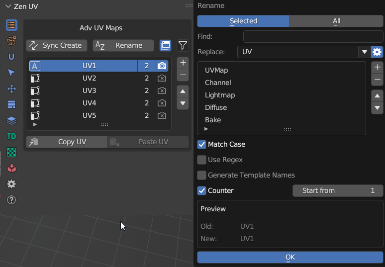
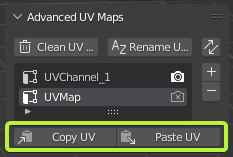

# Advanced UV Maps
Advanced UV Maps section created to have quick access to Object Data Properties — UV Maps.
It allows to select the active, add, remove, and rename UV Maps from the list.

If more than one object is selected, you can synchronously work with UV maps of the selected objects.

| Edit Mesh |
|---|
|  |

| Object |
|---|
|  |

<!-- !!! tip
    Watch the video explaining how **Advanced UV Maps** works.

    

    <iframe src="https://www.youtube.com/embed/Y7dG2i-FASs?start=541&end=619" style="position: absolute; top: 0; left: 0; width: 100%; height: 100%;" allowfullscreen="" seamless="" frameborder="0"></iframe>
    
 -->

## Advanced UV Maps List
The list can work in two modes:
- Multi object mode
- Single object mode

| List Description |
|---|
|  |

| List Color | Individual for every column |
|---|---|
| Default color | All selectected objects has the same active UV Map, render, same position in the list |
| Red color | At least one object differs with one of the UV Map parameters |

| 1. Active UV Map status | |
|---|---|
|  | UV Map is active |
|  | UV Map is not active |

| 2. UV Map name | |
|---|---|
| Name is highlighted | All selected objects have UV Map with the name |
| Name is grayed out | At least one object from selection does not have UV Map with the name |

| 3. UV Map count and position status | |
|---|---|
| First or single digit | Number of objects that have UV Map with the selected name |
| Second digit | Selected objects count |

| 4. Active Render UV Map status | |
|---|---|
|  | UV Map is active for render |
|  | UV Map is not active for render |

---
## Duplicate active UV Map 
Duplicate the active UV Map or create a new one depending on the operator's properties.

## Remove active UV Map 

---
## Rename UV Maps

| Rename Settings |
|---|
|  |

| UV Maps source | |
|---|---|
| Selected | Operates on the currently selected UV Map items in the list |
| All | Operates on all UV Map items in the list |

| Options | |
|---|---|
| Find | The text to search for in names |
| | _1) if text is empty then all name will be renamed_ |
| | _2) if 'Use Regex' is set then text must be a valid regular expression_ |
| Replace | The text to replace for in matching names found from the 'Find' text |
| Match Case | Search results must exactly match the case of the 'Find' text |
| Use Regex | Replace by regular expression in the 'Find' text |

### Generate UV Map names from template
If you have naming convension for UV Maps in your projects, you can create template preset and quickly rename all UV Maps in one click

| UV Map naming preset |
|---|
|  |

## Sync UV Maps 
If your model requires UV Maps to have the same postion, name, active or render status you can synchronize them

---

## Copy UV / Paste UV

Allows transferring the UV coordinates between UV Maps.

**Copy UV** - Copy the UV coordinates of the selection.

**Paste UV** - Paste the UV coordinates.