# UV Checker

This panel contains tools to check the state of UVs on the model, visually and technically.

!!! Panel
     | 3D Viewport | UV Editor| 
     |---|---|  
     |  || 

!!! Tip
    Display and Select **Crease**, **Sharp**, **Bevel**, **Seams** and **UV No Sync** operators are absent on the panel in UV Editor. To use these operators you need to switch to 3D Viewport context.

### Checker Texture

Add/Remove Checker Texture to/from the mesh.  `Alt+T`

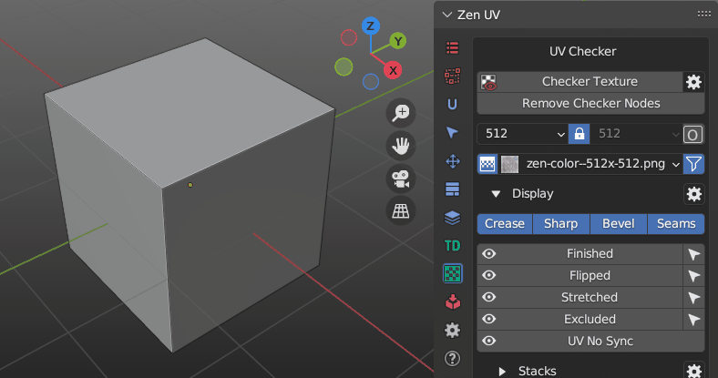 

---
#### Checker Preferences

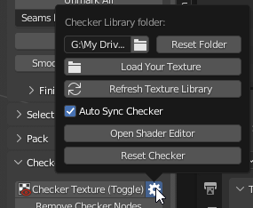

- **Checker Library Folder** - Checker Library Folder indicates the folder with which Zen UV Checker will work. All textures in * .JPG, * .PNG formats that are inside this folder will be collected in Checker Textures list and can be used to display on selected models.
- **Reset Folder** - Reset Checker Library path to Default State.
- **Load Your Texture** - Open File Browser and add the selected texture to the Checker Library.
- **Refresh Texture Library** - Refresh Textures from Checker Library Folder.
- **Auto Sync Checker** - Automatically sync selected Checker Texture with Viewport.
- **Open Shader Editor** - Open Shader Editor with Zen UV Checker Node.
- **Reset Checker** - Reset Zen UV Checker to Default state.

---
#### Operator mechanism

Checker Texture Toggle is adding/removing Zen UV Checker Node on/from top of your materials in Shader Editor. Your materials are safe!

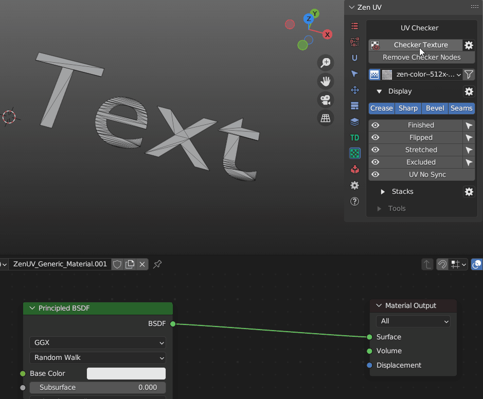

---
### Remove Checker Nodes

Remove Zen UV Checker Nodes from all the scene materials.

### Checker Textures Selector

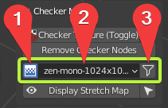

#### 1. Interpolation 

Switch texture interpolation in the Checker Node between Linear and Closest.
  

#### 2. Checker Textures

The Checker Textures field is used to select the checker texture that will be displayed on the selected models. It contains full list of default textures.

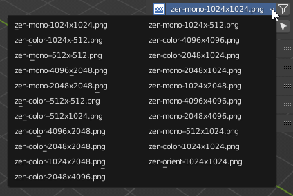

Any texture can be tiled or offset but only in the Material Preview or Rendered modes.

Every texture has an bright green pixel in U = 0, V = 0 coordinates.
If you see green faces - keep in mind that they do not have UV coordinates.
  

#### 3. Filter 

Enable resolution fields to filter existing textures by X or/and Y resolutions.
Includes a Lock button for filtering square format textures.

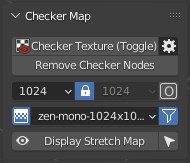

Includes an "O" button for activating Orient Checker texture.
Screenshot when Orient filtering is on.
  
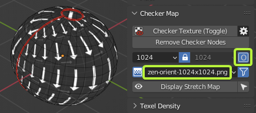

---

### Darken Image

UV Editor panel contains an extra Display operator designed to adjust the darkening of an Image in the context of the UV Editor. More info in the [**Darken Image**](user_interface.md#darken-image) article.

---

### Display

All useful for checking UVs Draw operators and their settings.

---
#### Blender Draw System

!!! SubPanel 
    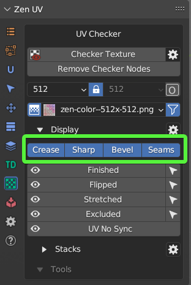

- **Crease** - Display Creases created for Subdivision Surface modifier.
- **Sharp** - Display Sharp Edges.
- **Bevel** - Display Weights created for Bevel modifier.
- **Seams** - Display Seams.

!!! Tip 
    Blender Draw System visually overlap each other that's why it's recommended to use only Display Seams for UV process.

---
#### Zen UV Draw System

| 3D Viewport | UV Editor|
|---|---|  
| 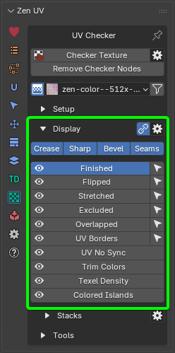 | 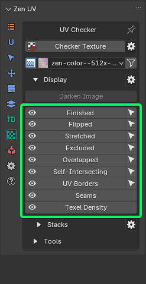 | 

##### Finished

Display and Select Finished Islands. You can [read more about Finishing System here](unwrap.md#finishing-system).

##### Flipped

Display and Select Flipped Islands.

##### Stretched
Display an angle-based stretching map.

!!! Tip
    To have the display in real time mode (as on the gif) activate **Stretched Dynamic** in Zen UV Draw System Preferences.

##### Excluded

Display and select islands excluded from packing.

##### Overlapped

Display and select overlapped islands.

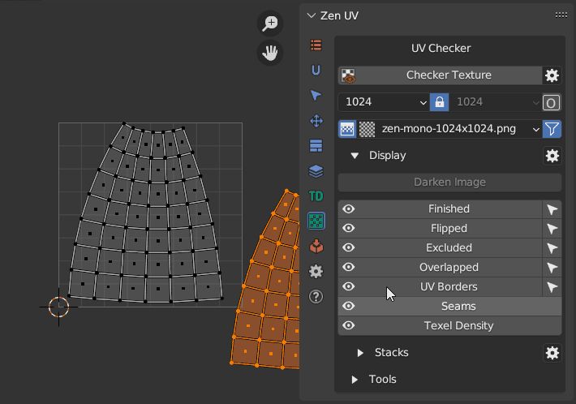

#### Self-Intersecting

Detects and selects faces where UV edges intersect.
[More info about the operator](select.md#select-self-intersecting-faces)

---

#### Texel Density

Displays Texel Density according to the settings in the [TD](texel_density.md) panel.

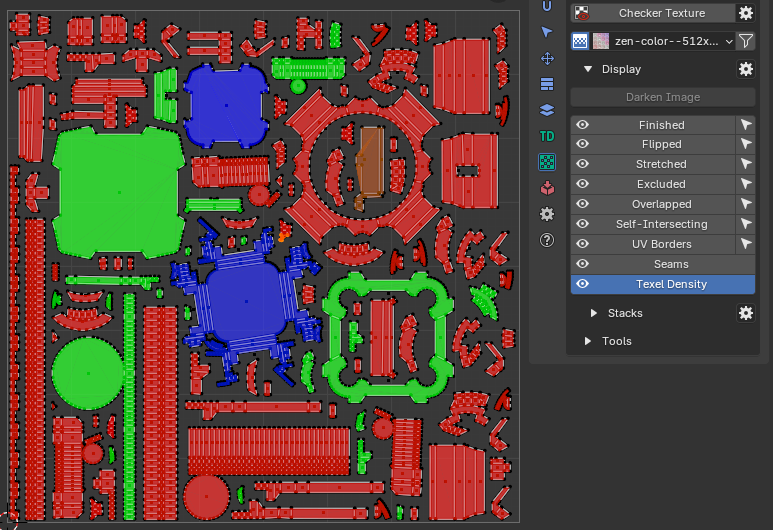
---

#### Trim Colors

Displays the association of islands with trims created in the [Trimsheet](trimsheet.md) system.

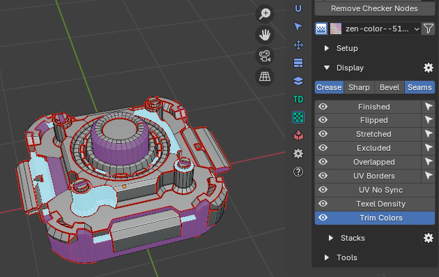

---

##### UV No Sync

Display in 3D Viewport faces selected in UV Editor when UV Sync is Off. 

##### Seams

Display Seams in UV Editor.

!!! Note
    Available only in UV Editor.

##### UV Borders

Display UV Borders (Margin) in UV Editor and 3D Viewport.
Line width depends on [**Margin**](pack.md#margin) and [**Texture Size**](pack.md#texture-size) from Pack panel. 

##### UV Object

Display UVs in Object mode without entering Edit mode.

!!! Note
    Available only in UV Editor and Object mode.

##### Stacks

!!! Panel 
    

    Display and Select **Similar**, **Similar of Selection**, **Stacked**, **Manual Stacks**. 
    You can read full information about [Stacks Display and its settings here](stack.md#stacks-display-and-select).

##### Zen UV Draw System Preferences (Edit Mode)

!!! Panel 
    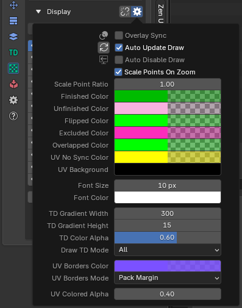

- **Overlay Sync** - Draw is synchronised with Overlay On-Off settings.
- **Auto Update Draw** - Update draw cache every time when mesh is changed.
- **Auto Disable Draw** - Switch draw system off when object mode (Edit, Object) is changed.
- **Scale Points on Zoom** - Scale Points when zoom is changed.
 
- **Scale Points Ratio** - Scale ratio when Point size is changed in UV Area.
- **Finished Color** - Finished Islands Viewport Display color.
- **Unfinished Color** - Unfinished Islands Viewport Display color.
- **Flipped Color** - Flipped Islands Display color.
- **Excluded Color** - Excluded Islands Display color.
- **Overlapped Color** - Overlapped Islands Display color.
- **UV No Sync Color** - Display color for selected Islands in UV No Sync mode.
- **Font Size** - Font size for Drawing labels.
- **Font Color** - Font color for Drawing labels.
 
- **TD Gradient Width** - TD Gradient widget Width.
- **TD Gradient Height** - TD Gradient widget Height.
- **TD Color Alpha** - TD Color widget Alpha.
- **Draw TD Mode** - Draw TD Mode, combination of gradient and viewport.

- **UV Borders Color** - UV Borders Display color.
- **UV Borders Mode** - Modes of UV Borders Display color.

---
##### Zen UV Draw System Preferences (Object Mode)

!!! Panel 
    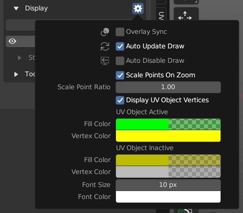

- **Overlay Sync** - Draw is synchronised with Overlay On-Off settings.
- **Auto Update Draw** - Update draw cache every time when mesh is changed.
- **Auto Disable Draw** - Switch draw system off when object mode (Edit, Object) is changed.
- **Scale Points on Zoom** - Scale Points when zoom is changed.
- **Scale Points Ratio** - Scale ratio when Point size is changed in UV Area.
- **Display UV Object Vertices** - Show vertices in UV Object mode.

**UV Object Active**

- **Fill Color** - Active object UVs fill color.
- **Vertex Color** - Active object UVs vertex color.

**UV Object Inctive**

- **Fill Color** - Selected object UVs fill color.
- **Vertex Color** - Selected object UVs vertex color.
- **Font Size** - Font size for Drawing labels.
- **Font Color** - Font color for Drawing labels.

---

### How to set hotkey to specific draw mode
1. Right click on desired draw mode

| 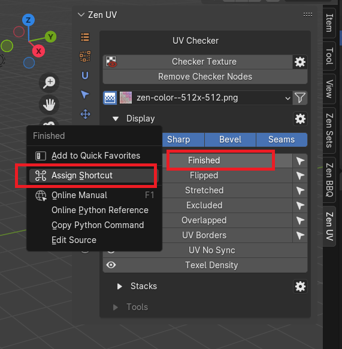 |
|---|
| |

2. Assign hotkey
3. Find hotkey in the list of hotkeys
4. Copy context attribute path to the clipboard

|  |
|---|
| |

5. Change operator name to `wm.context_toggle_enum`
6. Paste context attribute from the clipboard
7. Set 1 enum value to desired mode and set 2 enum value to `NONE`.

| 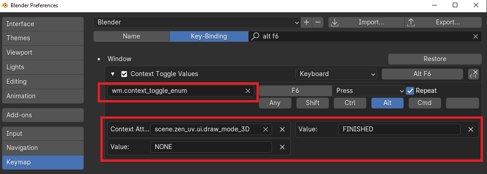 |
|---|
| |

---

### Tools

Tools for analyzing and finding Mesh errors that can negatively affect UV operations.

| 3D Viewport | UV Editor| 
|---|---|  
|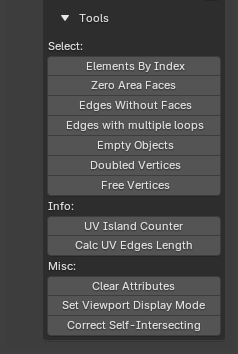 | 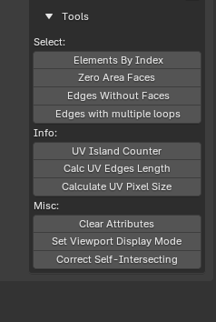 | 

#### Elements by Index
Select elements by their indices.

#### Zero Area Faces
Select faces with Zero UV area.

#### Edges Without Faces
Select edges without faces.

#### Edges with multiple loops
Select edges with Multiple Loops.

#### Empty objects
Select objects that don't contain faces.

#### Doubled Vertices
Select vertices that have the same coordinates.

#### Free Vertices
Selects vertices that have no connected faces or edges.

#### UV Islands Counter

Count UV Islands of selected objects and display the result.

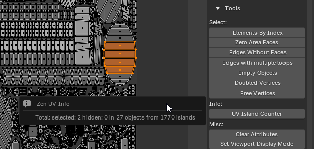

More detailed information can be obtained by opening the system console. For Windows, go to the main menu of the Blender **Window** -> **Toggle System Console**.

In the example below, you can see information on all selected objects.

Object name | total UV islands in the object | number of visible islands | number of selected islands | number of hidden islands.

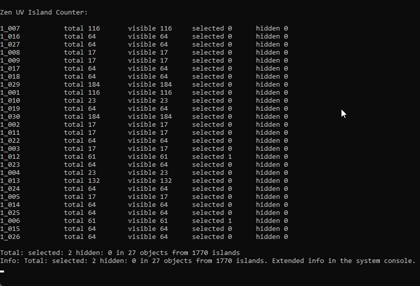

#### Calc UV Edges Length
Calculates the lengths of the selected edges.

The operator has no properties. Instead, it displays information in the status bar, popup window, and system console. The pixels size calculates from the active image in the UV Editor.
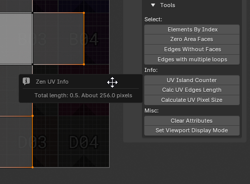

|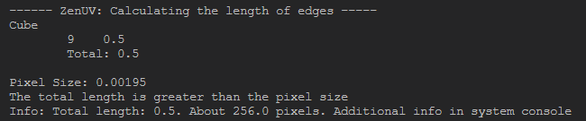|
|---|
|*Calc UV Edges Length* console output example|

---
#### Calculate UV Pixel Size
Calculates the size of a specified number of pixels in UV units and as a percentage.

!!! Properties
    

- **Pixel Count** - Number of pixels for the calculation.
- **Image Source** - Choose the source for image dimensions.
    - *Custom Image Size* - Use custom width and height.
    - *Active Image in UV Editor* - Use active image in the UV Editor.
- **Custom Width** - Width of the custom image in pixels.
- **Custom Height** - Height of the custom image in pixels.
- **UV Pixel Width (Units)** - Width of the specified pixels in UV space.
- **UV Pixel Height (Units)** - Height of the specified pixels in UV space.
- **UV Pixel Width (%)** - Width of the specified pixels as a percentage of the UV space.
- **UV Pixel Height (%)** - Height of the specified pixels as a percentage of the UV space.

---
#### Set Viewport Display Mode
Set viewport display mode for all selected objects.

!!! Properties
    

- **Display as** - Selection of the display type to be set.
    - *Bounds* - Display the bounds of the object
    - *Wire* - Display the object as a wireframe
    - *Solid* - Display the object as a solid (if solid drawing is enabled in the viewport)
    - *Textured* - Display the object with textures (if textures are enabled in the viewport)

---
#### Clear Attributes

Clear mesh attributes used in Zen UV. Finished and Excluded.

---

#### Correct Self-Intersecting

Correct faces that [have intersecting](select.md#select-self-intersecting-faces) uv edges by re-unwrapping its island.
