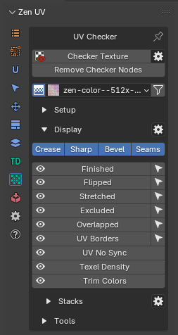
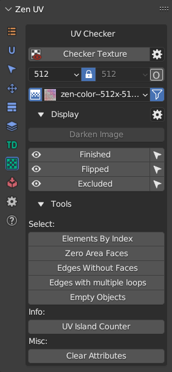
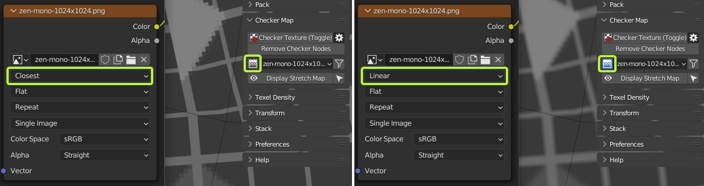
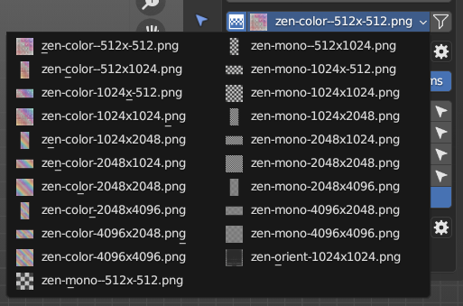
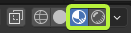
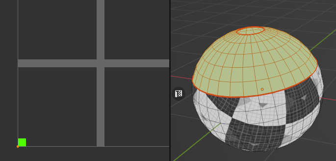
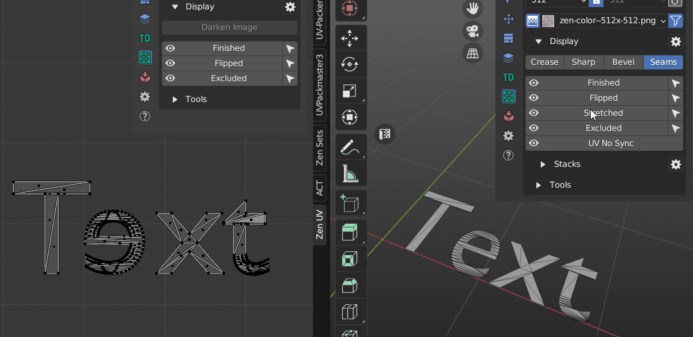
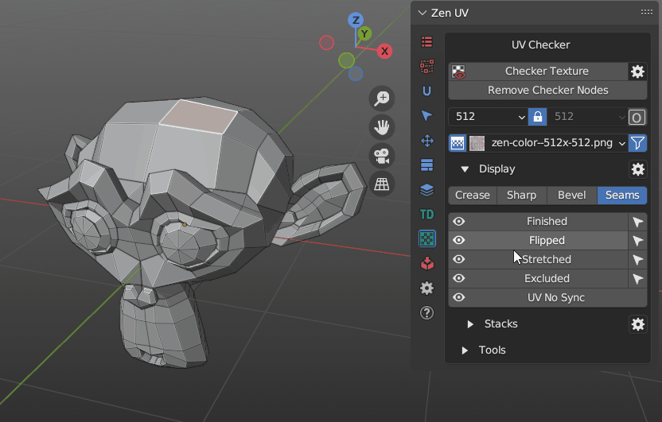
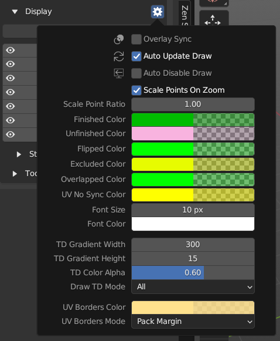

# UV Checker

This panel contains tools to check the state of UVs on the model, visually and technically.

!!! Panel
    

!!! Tip
    

    Display and Select **Crease**, **Sharp**, **Bevel**, **Seams**, **Stretched** and **UV No Sync** and **Stacks** operators are absent on the panel in UV Editor. To use these operators you need to switch to 3D Viewport context.

    Also, UV Editor panel contains extra Display operator [**Darken Image. Click to read full information**](user_interface.md#darken-image).

### Checker Texture  `Alt+T`

Add/Remove Checker Texture to/from the mesh.

 

!!! Preferences
    

    - **Checker Library Folder**.Checker Library Folder indicates the folder with which Zen UV Checker will work. All textures in * .JPG, * .PNG formats that are inside this folder will be collected in Checker Textures list and can be used to display on selected models.
    - **Reset Folder**. Reset Checker Library path to Default State.
    - **Load Your Texture**. Open File Browser and add the selected texture to the Checker Library.
    - **Refresh Texture Library**. Refresh Textures from Checker Library Folder.
    - **Auto Sync Checker**. Automatically sync selected Checker Texture with Viewport.
    - **Open Shader Editor**. Open Shader Editor with Zen UV Checker Node.
    - **Reset Checker**. Reset Zen UV Checker to Default state.

#### Operator mechanism

Checker Texture Toggle is adding/removing Zen UV Checker Node on/from top of your materials in Shader Editor. Your materials are safe!

### Remove Checker Nodes

Remove Zen UV Checker Nodes from all the scene materials.

### Checker Textures Selector

#### 1. Interpolation 

- Switch texture interpolation in the Checker Node between Linear and Closest.
  

#### 2. Checker Textures

- The Checker Textures field is used to select the checker texture that will be displayed on the selected models.
- A full list of default textures.

- Any texture can be tiled or offset but only in the Material Preview or Rendered modes.

- Every texture has an bright green pixel in U = 0, V = 0 coordinates.
- If you see green faces - keep in mind that they do not have UV coordinates.
  

#### 3. Filter 

- Enable resolution fields to filter existing textures by X or/and Y resolutions.
- Includes a Lock button for filtering square format textures.
- Includes an "O" button for activating Orient Checker texture.

- Orient filtering is on.
  

---

### Display

All useful for checking UVs Draw operators and their settings.

#### Blender Draw System

!!! Panel 
    

    - **Crease**. Display Creases created for Subdivision Surface modifier. 
    - **Sharp**. Display Sharp Edges.
    - **Bevel**. Display Weights created for Bevel modifier.
    - **Seams**. Display Seams.

!!! Tip 
    Blender Draw System visually overlap each other that's why it's recommended to use only Display Seams for UV process.

#### Zen UV Draw System

##### Finished

Display and Select Finished Islands. You can [read more about Finishing System here](unwrap.md#finishing-system).

##### Flipped

Display and Select Flipped Islands.

##### Stretched
Display an angle-based stretching map.

!!! Tip
    To have the display in real time mode (as on the gif) activate **Stretched Dynamic** in Zen UV Draw System Preferences.

##### Excluded

Display and Select Islands Excluded from Packing.

##### UV No Sync

Display in 3D Viewport faces selected in UV Editor when UV Sync is Off. 

##### Stacks

!!! Panel 
    

    Display and Select **Similar**, **Similar of Selection**, **Stacked**, **Manual Stacks**. 
    You can read full information about [Stacks Display and its settings here](stack.md#stacks-display).

##### Zen UV Draw System Preferences

!!! Panel 
    

    - **Overlay Sync**. Draw is synchronised with Overlay On-Off settings.
    - **Finished Color**. Finished Islands Viewport Display color.
    - **Unfinished Color**. Unfinished Islands Viewport Display color.
    - **Flipped Color**. Flipped Islands Display color.
    - **Excluded Color**. Excluded Islands Display color.
    - **UV No Sync Color**. Display color for selected Islands in UV No Sync mode.
    - **Font Size**. Font size for Drawing labels.
    - **Font Color**. Font color for Drawing labels.
    - **Stretched Dynamic**. Display Stretched in Dynamic (dragging etc.).

---

### How to set hotkey to specific draw mode
1. Right click on desired draw mode

|  |
|---|
| |

2. Assign hotkey
3. Find hotkey in the list of hotkeys
4. Copy context attribute path to the clipboard

|  |
|---|
| |

5. Change operator name to `wm.context_toggle_enum`
6. Paste context attribute from the clipboard
7. Set 1 enum value to desired mode and set 2 enum value to `NONE`.

|  |
|---|
| |

---

### Tools

Tools for analyzing and finding Mesh errors that can negatively affect UV operations.

#### Elements by Index
Select elements by their indices.

#### Zero Area Faces
Select faces with Zero UV area.

#### Edges Without Faces
Select edges without faces.

#### Edges with multiple loops
Select edges with Multiple Loops.

#### UV Islands Counter

Count UV Islands of selected objects and display the result.

 

#### Clear Attributes

Clear mesh attributes used in Zen UV. Finished and Excluded.

