# Favourites

## Prerequisites
Zen UV has a lot of different operators and tools that are located in different panels. And we decided to make Favorites to collect frequently used operators in one place.

!!! Panel
    | 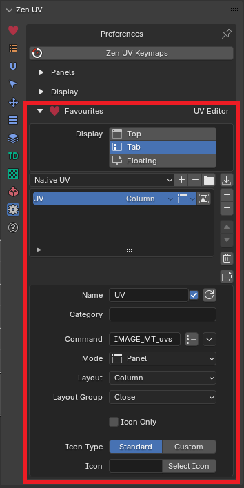 | 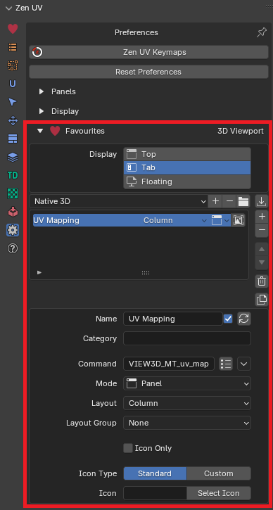 |
    |---|---|
    | UV Editor | View 3D |

!!! tip
    Watch the video explaining how to organize **Favourites**.

    

    <iframe src="https://www.youtube.com/embed/W-m9hAitLQU?start=17&end=150" style="position: absolute; top: 0; left: 0; width: 100%; height: 100%;" allowfullscreen="" seamless="" frameborder="0"></iframe>
    

## Display Modes
You can choose a combination of one or several display favourites panel options.

| 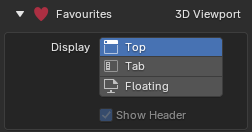 |
|---|
| Favourites Display Modes |

### Top Display Mode
Favourites will be placed at the top of N-Panel.

| 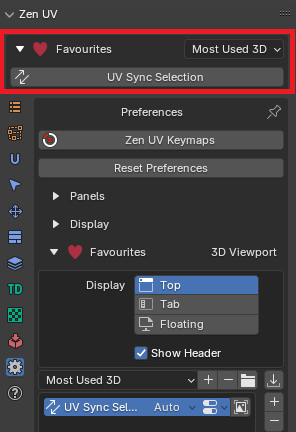 |
|---|
| Top display mode |

#### Show Header
If **Show Header** option in top mode is unset than favourites header is not showing

| 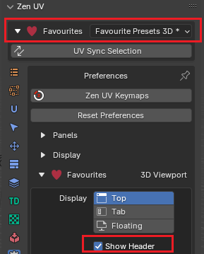 |
|---|
| Show header in top mode |

### Tab Display Mode
Favourites will be represented as the tab page of N-Panel.

| 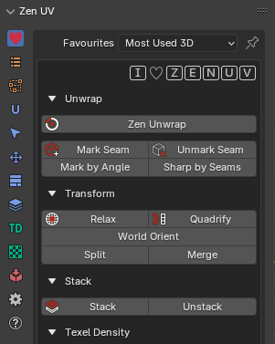 |
|---|
| Tab display mode |

### Float Display Mode
Favourites will be represented as the separate floating panel.

| 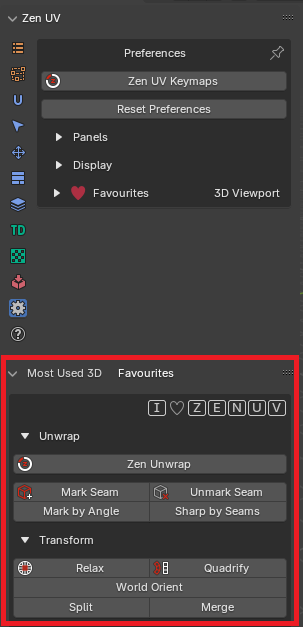 |
|---|
| Float display mode |

## Favourite Items List View
This control is used for managing lists of favourite [items](#favourite-item). In addition to the main list, there is a Filtering panel on the bottom (hidden by default) and modification buttons on the right.

| 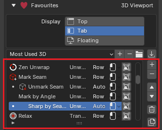 |
|---|
| List View |

### Select
To select an [item](#favourite-item), click `LMB` on it.

### Rename
By double-clicking on an [item](#favourite-item), you can edit its name via a text field. This can also be achieved by clicking it with `Ctrl-LMB`.

### Resize
The list view can be resized to show more or fewer [items](#favourite-item). Hover the mouse over the handle `::::`, then click and drag to expand or shrink the list.

### Filter
Detailed information about filter is written in [general list view description](https://docs.blender.org/manual/en/dev/interface/controls/templates/list_view.html#ui-list-view)

### Add +
Adds a new [item](#favourite-item).

### Remove -
Removes the selected [item](#favourite-item).

### Move (up/down arrow icon)
Moves the selected [item](#favourite-item) up/down one position.

### Delete All
Deletes all [items](#favourite-item)ms in the [list](#favourite-items-list-view)

### Duplicate
Duplicates [item](#favourite-item) with copying all its properties.

## Favourite Item
Is used to define UI element in favourites panel.

| 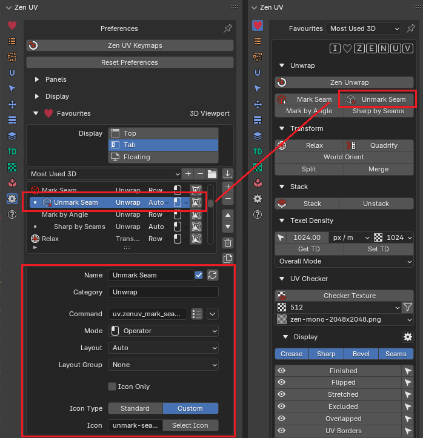 |
|---|
| Favourite item and the corresponding UI element |

### Name
Is used to display text in UI and is an identifier in the [list](#favourite-items-list-view).

#### Display Name Option
You can disable name by unchecking tickmark at the right corner in the name property field.

| 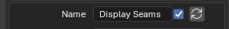 | 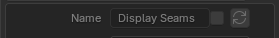 |
|---|---|
| 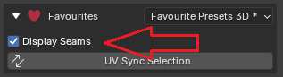 | 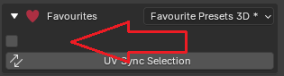 |
| Display name enabled | Display name disabled |

### Category
If you want to group items in collapsible panel, you can mark them with the same category and they automatically will be groupped.

| 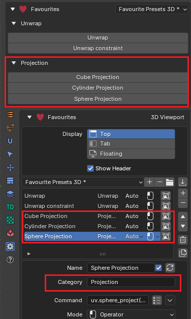 |
|---|
| Category example |

### Command and Mode
These two options depends on each other and are the main instrument to draw favourite item in the UI.

#### Mode
- **Operator** - Displays an [operator button](https://docs.blender.org/manual/en/4.2/interface/controls/buttons/buttons.html#operator-buttons) in UI

!!! Command
    | 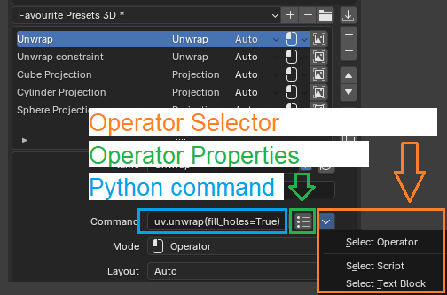 |
    |---|
    | Command interface in **Operator** mode |

    **Python Command** - is a text field where operator identifier or operator identifier with properties (optionally) should be set
    
        `uv.unwrap`
        `uv.unwrap(fill_holes=True)`
    
    **Operator Properties** - is a popup window to edit operator properties without necesserity to write them manually

    | 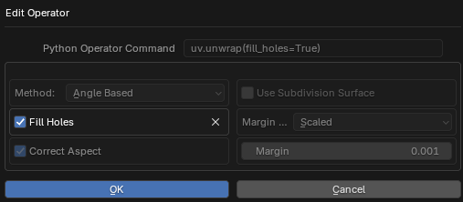 |
    |---|
    | Operator properties editor |

    **Operator Selector** - wizzard to define operator identifier in different ways

    - **Select Operator** - Select operator which will be added to the favourites

    | 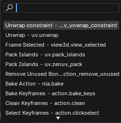 |
    |---|
    | Select operator from list of available operators |
    
    - **Select Script** - Select user script which will be loaded and executed
    - **Select Text Block** - Select user text datablock which will be loaded and executed

- **Panel** - Displays a [panel](https://docs.blender.org/manual/en/4.2/interface/window_system/tabs_panels.html#panels) in UI
- **Property** - Displays a [property field](https://docs.blender.org/manual/en/4.2/interface/controls/buttons/fields.html#fields) in UI
- **Label** - Displays a text string in UI
- **Script** - Displays a UI block defined as python script
