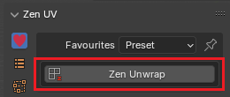
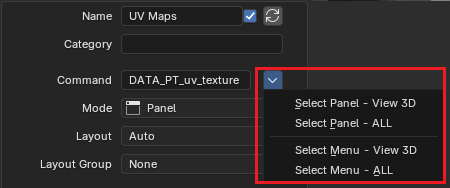
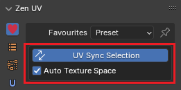
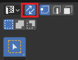
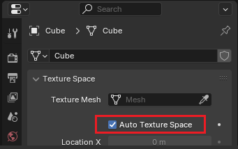

# Favourites

## Prerequisites
Zen UV has a lot of different operators and tools that are located in different panels. And we decided to make Favorites to collect frequently used operators in one place. Also there is an option to build in Blender native panels: such as [UV Maps](https://docs.blender.org/manual/en/4.2/modeling/meshes/uv/uv_texture_spaces.html#uv-maps) or [Attributes](https://docs.blender.org/manual/en/4.2/modeling/meshes/properties/object_data.html#attributes).

!!! Panel
    |  |  |
    |---|---|
    | UV Editor | View 3D |

!!! tip
    Watch the video explaining how to organize **Favourites**.

    

    <iframe src="https://www.youtube.com/embed/W-m9hAitLQU?start=17&end=150" style="position: absolute; top: 0; left: 0; width: 100%; height: 100%;" allowfullscreen="" seamless="" frameborder="0"></iframe>
    

## Display Modes
You can choose a combination of one or several display favourites panel options.

|  |
|---|
| Favourites Display Modes |

### Top Display Mode
Favourites will be placed at the top of N-Panel.

|  |
|---|
| Top display mode |

#### Show Header
If **Show Header** option in top mode is unset than favourites header is not showing

|  |
|---|
| Show header in top mode |

### Tab Display Mode
Favourites will be represented as the tab page of N-Panel.

|  |
|---|
| Tab display mode |

### Float Display Mode
Favourites will be represented as the separate floating panel.

|  |
|---|
| Float display mode |

## Favourite Items List View
This control is used for managing lists of favourite [items](#favourite-item). In addition to the main list, there is a Filtering panel on the bottom (hidden by default) and modification buttons on the right.

|  |
|---|
| List View |

### Select
To select an [item](#favourite-item), click `LMB` on it.

### Rename
By double-clicking on an [item](#favourite-item), you can edit its name via a text field. This can also be achieved by clicking it with `Ctrl-LMB`.

### Resize
The list view can be resized to show more or fewer [items](#favourite-item). Hover the mouse over the handle `::::`, then click and drag to expand or shrink the list.

### Filter
Detailed information about filter is written in [general list view description](https://docs.blender.org/manual/en/dev/interface/controls/templates/list_view.html#ui-list-view)

### Add +
Adds a new [item](#favourite-item).

### Remove -
Removes the selected [item](#favourite-item).

### Move (up/down arrow icon)
Moves the selected [item](#favourite-item) up/down one position.

### Delete All
Deletes all [items](#favourite-item)ms in the [list](#favourite-items-list-view)

### Duplicate
Duplicates [item](#favourite-item) with copying all its properties.

## Favourite Item
Is used to define UI element in favourites panel.

|  |
|---|
| Favourite item and the corresponding UI element |

### Name
Is used to display text in UI and is an identifier in the [list](#favourite-items-list-view).

#### Display Name Option
You can disable name by unchecking tickmark at the right corner in the name property field.

|  |  |
|---|---|
|  |  |
| Display name enabled | Display name disabled |

### Category
If you want to group items in collapsible panel, you can mark them with the same category and they automatically will be groupped.

|  |
|---|
| Category example |

### Command and Mode
These two options depends on each other and are the main instrument to draw favourite item in the UI.

#### Mode
##### Operator
Displays an [operator button](https://docs.blender.org/manual/en/4.2/interface/controls/buttons/buttons.html#operator-buttons) in UI

|  |
|---|
| Example of embedded **Zen Unwrap** operator |

!!! Command
    |  |
    |---|
    | Command interface in **Operator** mode |

    **Python Command** - is a text field where operator identifier or operator identifier with properties (optionally) should be set
    
    | Command Example | Description |
    |---|---|
    | uv.unwrap | UV Unwrap with last context properties |
    | uv.unwrap(fill_holes=True) | UV Unwrap with enable always 'Fill Holes' property |
    
**Operator Properties** - is a popup window to edit operator properties without necesserity to write them manually

|  |
|---|
| Operator properties editor |

**Operator Selector** - wizzard to define operator identifier in different ways

- **Select Operator** - Select operator which will be added to the favourites

|  |
|---|
| Select operator from list of available operators |

- **Select Text Block** - Select user text datablock which will be loaded and executed when operator button will be clicked

|  |
|---|
| Example of executing Text data-block |

- **Select Script** - Select user script which will be loaded and executed when operator button will be clicked. **It works in the same way as Select Text procedure with the only difference that code will be loaded from script.**

##### Panel
Displays a [panel](https://docs.blender.org/manual/en/4.2/interface/window_system/tabs_panels.html#panels) in UI

|  |
|---|
| Example of Blender **UV Maps** panel embedded |

!!! Command
    **Python Command** - must be a valid python [panel](https://docs.blender.org/manual/en/4.2/interface/window_system/tabs_panels.html#panels) or [menu](https://docs.blender.org/manual/en/4.2/interface/controls/buttons/menus.html#popup-menus) identifier

    | Command Example | Description |
    |---|---|
    | DATA_PT_uv_texture | UV Maps Panel |
    | VIEW3D_MT_uv_map | UV Mapping Menu |

- **Command Menu** - popup menu where a panel or menu could be selected from the list

|  |
|---|
| Command Menu in 3D Viewport context |    

#### Property
Displays a [property field](https://docs.blender.org/manual/en/4.2/interface/controls/buttons/fields.html#fields) in UI

|  |
|---|
| Example of **UV Sync Selection** and **Auto Texture Space** properties embedded |    

!!! Command
    **Python Command** - must be a valid [context variable](https://docs.blender.org/api/current/bpy.context.html) that is available through Python API

    | Command Example | Description | Preview |
    |---|---|---|
    | scene.tool_settings.use_uv_select_sync | UV Sync Selection |  |
    | active_object.data.use_auto_texspace | Auto Texture Space |  |

- **Label** - Displays a text string in UI
- **Script** - Displays a UI block defined as python script
