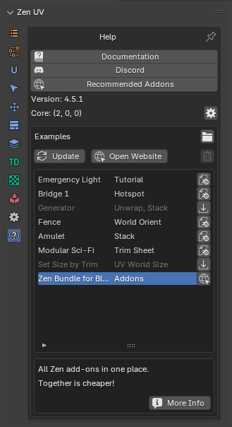
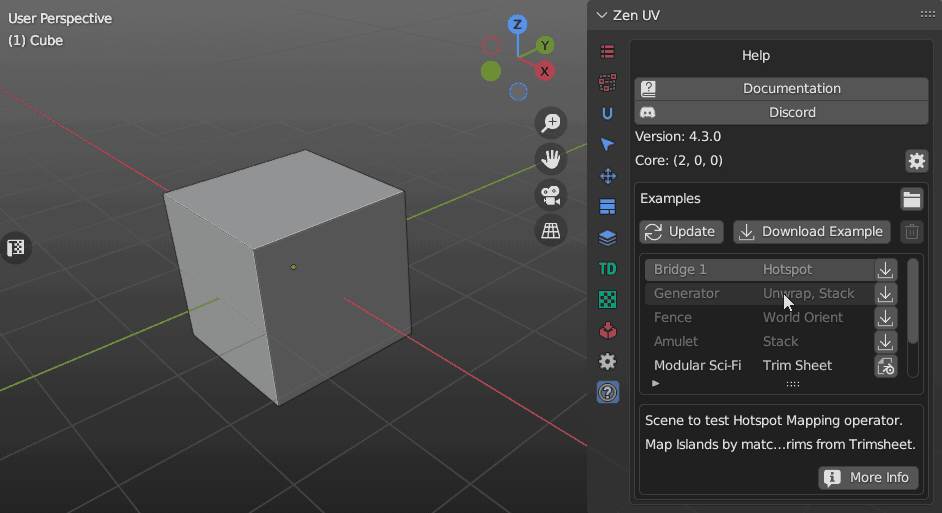
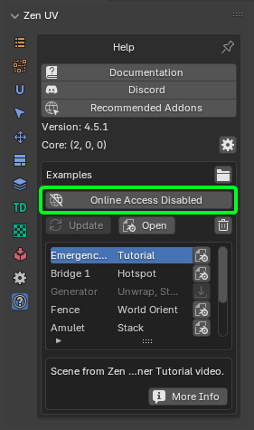

# Help

!!! Panel
    

### [Documentation](index.md)

[**Link**](index.md) to the documentation of the current version.

###  [**Discord**](https://discord.gg/wGpFeME)

[**Discord channel**](https://discord.gg/wGpFeME) for user feedback, bug reports, and help with Zen UV.

### Recommended Addons

Links to addons that [zenmasters](https://zenmasters.team) recommends for use.

### Version

Current version of the [**Zen UV**](https://www.blendermarket.com/products/zen-uv).

### Core

Current version of [**Zen UV Core Library**](https://sergeytyapkin.gumroad.com/l/ZenUVCore)
If Zen UV Core Library is not installed you need to [**follow this instruction to install it**](installation.md#zen-uv-core-library-installation).

## Examples

The examples contain scenes with examples of models and sites recommended for review.
Here you can find models from [**Zen UV YouTube Playlist**](https://youtube.com/playlist?list=PLWaOMtLS0nN2ZA_5id0FNbPTu0s_XNT3o).

!!! Subpanel
     

Starting from Blender version 4.2.1, internet access is disabled by default. In this case, Zen UV cannot retrieve examples stored online. If access is deactivated, you'll see a button that opens Blender's settings, where you need to enable the Allow Online Access option.

### Update
Update the list of examples.

### Download Example
Download selected scene.

### Open Folder  
Open folder with downloaded Example scenes.

### Open
Open selected scene.

### Open Website   
Open selected website.

### Delete
Delete selected scene.

### More Info
Open webpage with all the information about example.