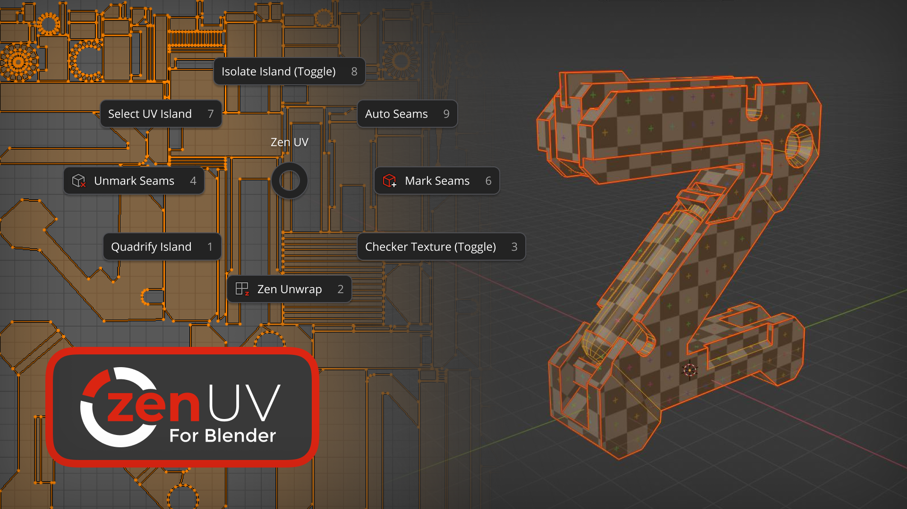

# Zen UV 5.0 for Blender.
<!--  -->

<iframe src="https://www.youtube.com/embed/P4bdBuHKOSg" style="position: absolute; top: 0; left: 0; width: 100%; height: 100%;" allowfullscreen="" seamless="" frameborder="0"></iframe>

 

## Professional toolset for creating UVs in Blender

 [**Gumroad**](https://gumroad.com/l/zenuv4) |  [**BlenderMarket**](https://www.blendermarket.com/products/zen-uv) |  [**Discord**](https://discord.gg/wGpFeME)

<!-- blank line -->
----
<!-- blank line -->
## Main Features

- [**Zen Gizmo.**](transform_tool.md) Move, Rotate, Scale, Fit, Align and Flip UV Islands in 3D View and UV Editor using Zen Gizmo.
- [**Zen Relax.**](transform.md#relax) Unique Unwrapping algorithm for Organic models.
- [**Trimsheet System.**](trimsheet_creation.md#creating-your-trim-sheet-with-zen-uv) Create/Display Trims and Map UV Islands on them using Transform operators.
- [**Hotspot Mapping.**](trimsheet_hotspot.md) Map UV Islands on Trims by matching them by Area, Aspect, World Size and Tags.
- [**Stack System.**](stack.md) Stack/Unstack similar/non-similar UV Islands on top of each other.
- [**Zen Unwrap.**](unwrap.md#zen-unwrap) Context-sensitive Unwrap with control over Seams and Sharp Edges.
- [**Transform System.**](transform.md#world-orient) Move, Rotate, Scale, Flip, Fit, Orient, Sort and Align UV Islands and Vertices.
- [**World Orient.**](transform.md#world-orient) Rotate UV Islands according to the model's position in World Space.
- [**Quadrify.**](transform.md#quadrify-islands) Straighten UV Islands and selected Faces consisting of quads.
- [**Randomize.**](transform.md#randomize) Randomize Position, Rotation, Scale of UV Islands and Vertices.
- [**Mirror.**](transform.md#mirror-uv) Mirroring UVs for mirrored models. Mirror Seams on the model.
- [**Match and Stitch.**](transform.md#match-and-stitch) Match UV Islands Position, Rotation, Scale and Stitch Vertices if it’s possible.
- [**Reshape Island.**](transform.md#reshape-island) Straighten selected Edge loops and relax connected Vertices.
- [**Advanced UV Maps.**](adv_uv-maps.md) Sync, Clean and Rename UV Maps for multiple selected models.
- [**Marking System.**](unwrap.md#mark-system) Mark Seams and/or Sharps by Angle/Sharps/Seams/Open Edges/UV Borders and manually.
- [**Finished System.**](unwrap.md#finishing-system) Visually control the state of Unwrapping process using Finished/Unfinished tags.
- [**Select System.**](select.md) Select Seams, Sharps, Open Edges, UV Borders, Overlapped, Flipped, Quaded and Similar UV Islands.
- [**Seam Groups.**](seam_groups.md) Create and manage multiple Seam Groups in case if you have multiple UV Maps.
- [**Copy/Paste UVs.**](stack.md#copy-paste-system) Copy/Paste UVs and and their parameters (Structure, TD, Position, Size) between UV Islands/UV Maps.
- [**Texel Density (TD).**](texel_density.md) Get, Set and Display Texel Density in Scene and World sizes.
- [**Checker Texture.**](checker.md#checker-texture) Apply Сhecker Textures of different types, sizes and formats to the model.
- [**Sticky UV Editor.**](sticky_uv_editor.md) Quick access to UV Editor by opening side panel using widget button.
- [**Display UV Islands.**](checker.md#zen-uv-draw-system) Display Overlapped, Stacked, Flipped, Stretched and Excluded UV Islands in 3D View and UV Editor.
- [**Display UV Borders.**](checker.md#uv-borders) Display UV Islands Margin (Padding) in 3D View and UV Editor.
- [**Display UV No Sync.**](checker.md#uv-no-sync) Display in 3D View Faces selected in UV Editor when UV Sync is Off.
- [**UDIM Tools.**](adv_uv-maps.md#udim-tools) Tools for creating and managing UDIM tiles.
- [**Favorites.**](favourites.md) Create your own quick access panel consisting of the most used operators, scripts and panels.

!!! Tip
    [**Follow Step-by-step tutorial**](tutorial.md) to learn effective Zen UV workflows.

## Default Shortcuts
- Zen UV Pie Menu  --- `Alt + U`
- Zen UV Popup Menu --- `Shift + U`
- Checker Texture (Toggle) --- `Alt + T`
- Sticky UV Editor (Toggle) --- `Shift + T`

## Required Blender version
We support Blender versions in the same way as Blender developers do whithin two-years period for LTS and major release versions.

Currently we support Blender 3.6 LTS version and higher official versions.

| Blender Version | Release Date | End of support |
|---|---|---|
| 3.6 LTS | June 27, 2023 | June 27, 2025 |
| 4.2 LTS | July 16, 2024 | July 16, 2026 |
