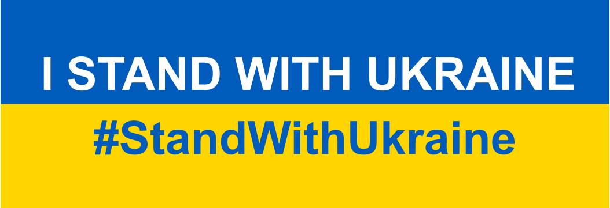

# Zen UV v4.1 for Blender.
<!--  -->

<iframe src="https://www.youtube.com/embed/P4bdBuHKOSg" style="position: absolute; top: 0; left: 0; width: 100%; height: 100%;" allowfullscreen="" seamless="" frameborder="0"></iframe>

 

**Zen UV** is not just a set of tools, it is ready to use the pipeline for fast creating UVs in Blender. It represents an intuitive system created by professionals and refined in real projects.

**Enjoy this experience with us!**

 [**Gumroad**](https://gumroad.com/l/zenuv4) |  [**BlenderMarket**](https://www.blendermarket.com/products/zen-uv) |  [**Discord**](https://discord.gg/wGpFeME)

<!-- blank line -->
----
<!-- blank line -->
## Main Features
-   [**Zen UV Transform tool**](transform_tool.md). Move, Rotate, Scale, Fit, Align and Flip Islands in 3D View and UV Editor using Zen UV Gizmo.
-   [**Stack System.**](stack.md) Stack and Unstack UV Islands automatically and manually. Extremely useful for increasing Texel Density and baking.
-   [**Relax Operator**.](transform.md#relax) This is a new unwrapping method that is well suited for working with organic models.
-   [**Trimsheet system**](trimsheet.md). [Create Trimsheets](trimsheet_creation.md) and Move, Rotate, Scale, Fit, Align and Flip Islands inside Trims.
- [**Hotspot Mapping**.](trimsheet_hotspot.md) Quick UV Mapping method that compares the parameters of Islands and Trims and makes automatic mapping based on the given settings.
-   [**World Orient**](transform.md#world-orient) operator that rotates UV Islands the way they are oriented in the model.
-   [**Checker Map System**](checker.md) is a node-based system that contains Checker Textures designed specifically for Zen UV. Square and rectangular formats. Check UV's state on the model without ruining existing materials!
-   [**Copy/Paste Operators.**](stack.md#copy-paste-system) Copy/Paste parameters (Structure,TD, Position, Size) between Islands/Faces/Maps.
-   [**Quadrify Islands Operator**](transform.md#quadrify-islands) to straighten rectangular-shaped UV Islands. 
-   [**Full set of Transform operators**.](transform.md) Move, Rotate, Scale, Flip, Fit, Orient, Sort and Align Islands and Elements (vertices, edges, polygons).
-   **Display Flipped operator** to display Flipped Islands in UV Editor.
-   [**Finished System.**](unwrap.md#finishing-system) It helps to control and manage the state of unwrapping UV Islands (Finished/Unfinished) by tags and visually.
-   [**Different Pack Engines**.](operators.md#pack-engine) Yes, you can use UVPackmaster 2, 3 and UV-Packer with Zen UV.
-   [**Zen Unwrap Operator**](unwrap.md#zen-unwrap) to mark selected edges/faces as Seams and/or Sharp edges and Unwrap by Marked edges after.
- [**Unwrap Constraint operator**](unwrap.md#unwrap-constraint) to unwrap Islands along a certain axis.
- **Match and Stitch operator** to match Islands position, rotation, scale and stitch vertices if it’s possible.
-   [**Marking System**](unwrap.md#mark-system) that helps you to mark Seams and/or Sharp automatically by angle, by existing UV Borders/Sharp Edges, and manually.
-   [**Seam Groups.**](seam_groups.md) Work with more than one Seam set!
-   [**Texel Density.**](texel_density.md) Get, Set, and Check Texel Density of UV Islands.
-   [**Sticky UV Editor**](sticky_uv_editor.md) for quick access to UV Editor.
-   [**Advanced UV Maps**.](adv_uv-maps.md) Duplicate, remove, clean, and rename UV Maps of the selected objects in sync.  
-   [**Hard Ops add-on integration**.](preferences.md#display-subpanel) It allows displaying UV manipulations in 3D View!
-   [**Smooth by Sharp (Toggle).**](unwrap.md#smooth-by-sharp-toggle) Set smoothing for perfect normal map bakes in one click!
- Quick support on the [**Discord channel**](https://discord.gg/wGpFeME).

## Default Shortcuts
- Zen UV Pie Menu  --- `Alt + U`
- Zen UV Popup Menu --- `Shift + U`
- Checker Texture (Toggle) --- `Alt + T`
- Sticky UV Editor (Toggle) --- `Shift + T`

## Required Blender version 
2.93+