# Installation and update

## Installation

1. Go to **Edit** -> **Preferences**.
2. Go to **Add-ons**.
3. Press **Install**.
4. Select Zen UV.zip.
5. Press **Install Add-on**.
6. Enable Zen UV add-on using checkbox and restart Blender. 
7. Done! Let's go further and [**install Zen UV Core Library**](installation.md#zen-uv-core-library-installation) to enable [**Stack**](stack.md#stack) feature!  

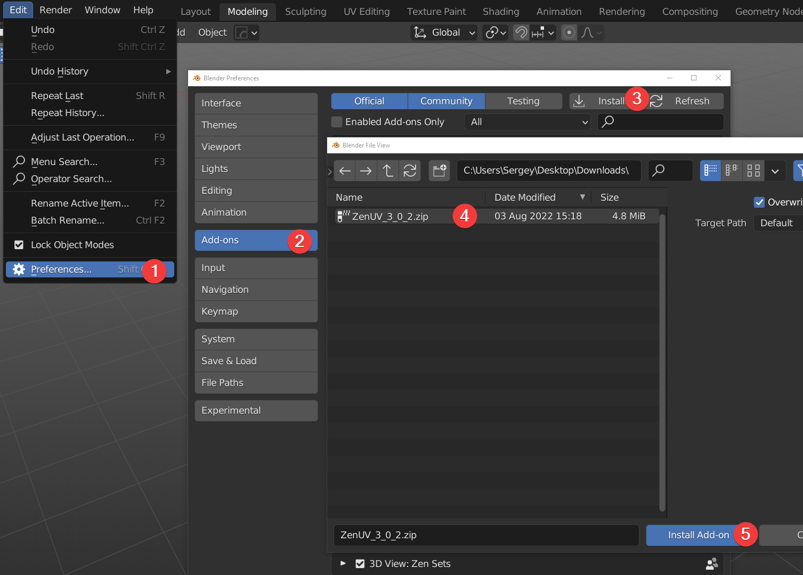
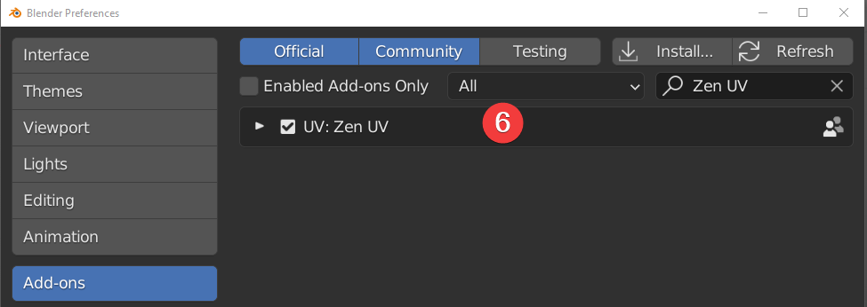

## Zen UV Core Library Installation

!!! Library
    Zen UV Core library is an additional library of the Zen UV add-on to get the fastest computations ([Stack](stack.md#stack) algorithm) in C++ which is impossible to be implemented in Python. It is distributed separately from the add-on as it is licensed differently from the GPL (Apache License 2.0). Zen UV Core library does not collect or send any data. It does not use any network connections: either internet or local. It is supported on Windows, Mac OS 11 (M1 CPU Universal app only), and Linux platforms.

1. Go to **Preferences** -> **Add-ons**.
2. Find installed and enabled Zen UV add-on.
3. Go to **Modules**.
4. Press [**Download Zen UV Core Library (FREE)**](https://gumroad.com/l/ZenUVCore) if you don't have it.
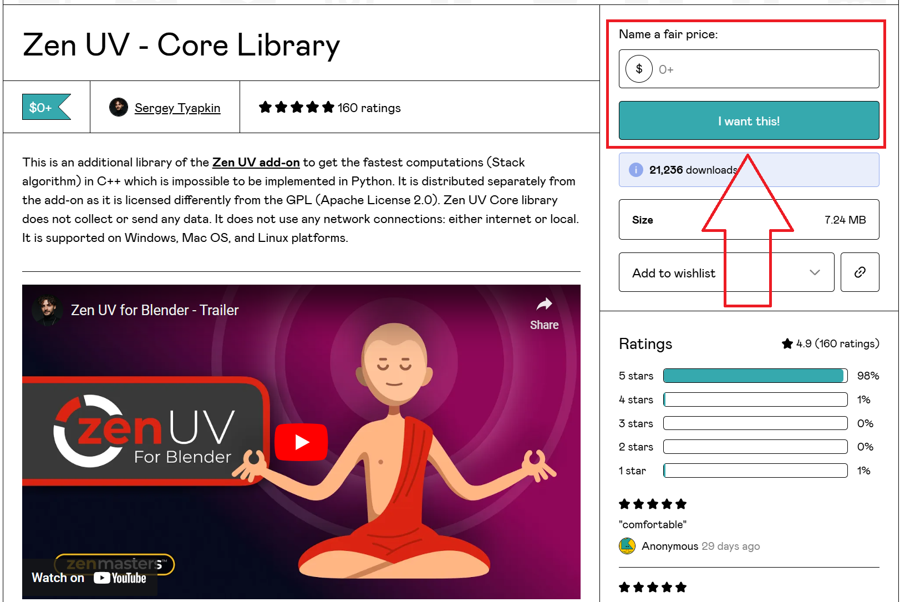
5. Register on the **gumroad.com** website
6. Enter the amount in the price field:
- 0 - if you want to get it completely free
- 1+ - if you want to donate to the development of ZenUV
7. Press **I want this!** button
8. Unpack downloaded archive in any location on your drive
9. Press **Install Zen UV Core Library**.
10. Select Zen UV Core Library file.
11. Press **Install Zen UV Core Library**.
12. Done! Now the add-on is fully installed and you can use all the features!

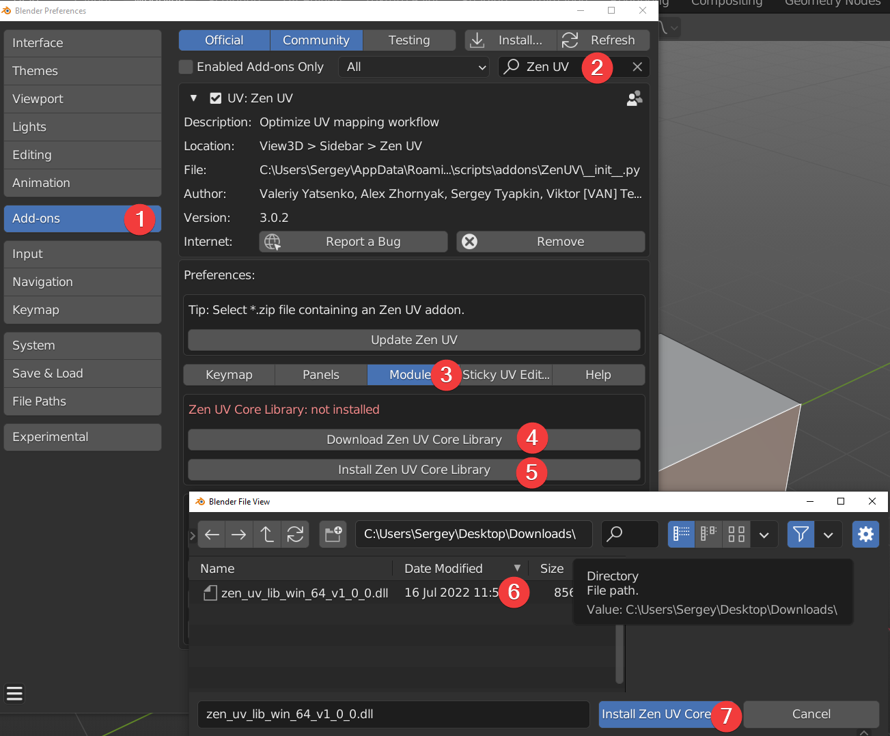
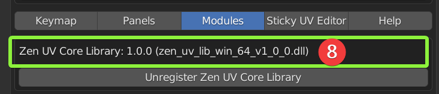

---

### Zen UV Core Library installation for Mac M1-M2 (Silicon App)

!!! Library
    The new macOS M1-M2 has increased security checks that necessitates users to perform a security override for Zen UV Core to work. Specifically, Zen UV uses dynamic "zen_uv_core* .dylib" libraries that need to have its security allowed. Therefore, their installation will require additional steps described below.

!!! Certificate
    You can make sure that the library is legal and has a valid certificate using this command.
    ```codesign -d --verbose=2 --extract-certificates <path/to/zen_uv_lib_mac_silicon_64_v1_0_0.dylib>```
    
1. Go to **Preferences** -> **Add-ons**.
2. Find installed and enabled Zen UV add-on.
3. Go to **Modules**.
4. Press [**Download Zen UV Core Library (FREE)**](https://gumroad.com/l/ZenUVCore) if you don't have it.
5. Open **zen_uv_lib_mac_silicon_64_v1_0_0.dylib** library file folowing [instruction from Apple](https://support.apple.com/guide/mac-help/open-a-mac-app-from-an-unidentified-developer-mh40616/mac) or images below.
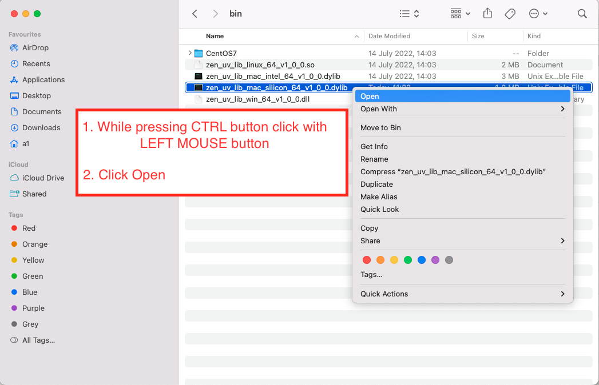
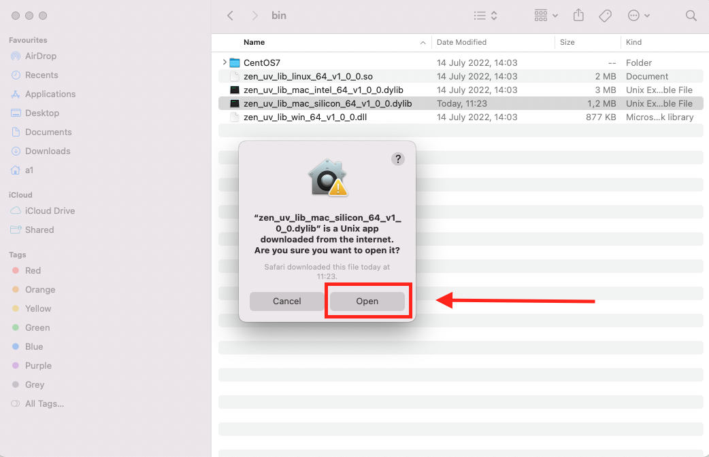
1. Go to Blender and Select **zen_uv_lib_mac_silicon_64_v1_0_0.dylib**. 
2. Press **Install Zen UV Core Library**.
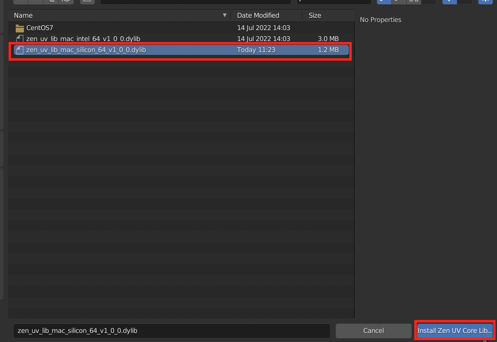
8. Press **Open** in a popup window.
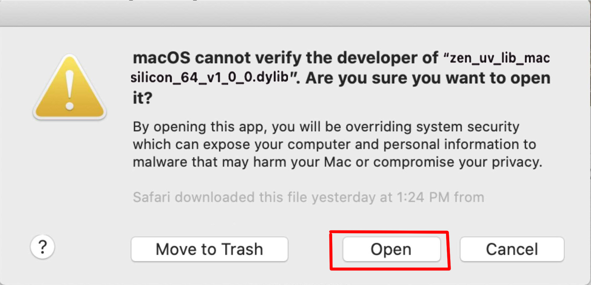
9. Done! Now the add-on is fully installed and you can use all the features!

---

## Update

1. Go to **Preferences** -> **Add-ons**.
2. Find installed and enabled Zen UV add-on.
3. Press **Update Zen UV**.
4. Select new version Zen UV.zip.
5. Press **Update Zen UV** and restart Blender.
6. [**Install Zen UV Core Library**](installation.md#zen-uv-core-library-installation).
7. Done!

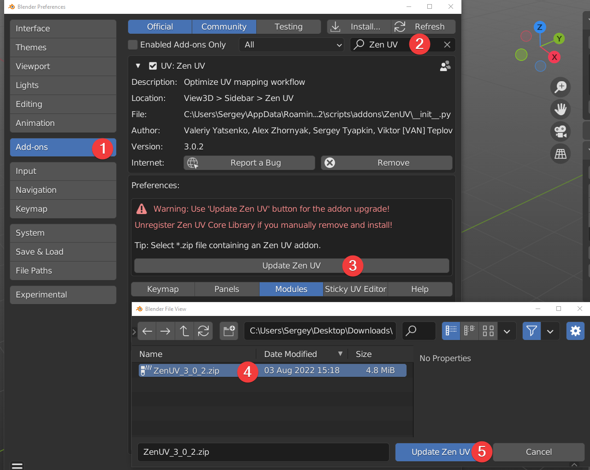

### Manual Update

!!! Manual
    Use this update method if for some reason you need to update the add-on using Blender's standard method. In all other cases, we recommend using [**Zen UV Update**](installation.md#update). 
    
1. Go to **Preferences** -> **Add-ons**.
2. Find installed and enabled Zen UV add-on.
3. Go to **Modules**.
4. Press **Unregister Zen UV Core Libary**.
5. Press **Install**.
6. Select new version Zen UV.zip.
7. Press **Install Add-on** and restart Blender.
8. [**Install Zen UV Core Library**](installation.md#zen-uv-core-library-installation).
9. Done!

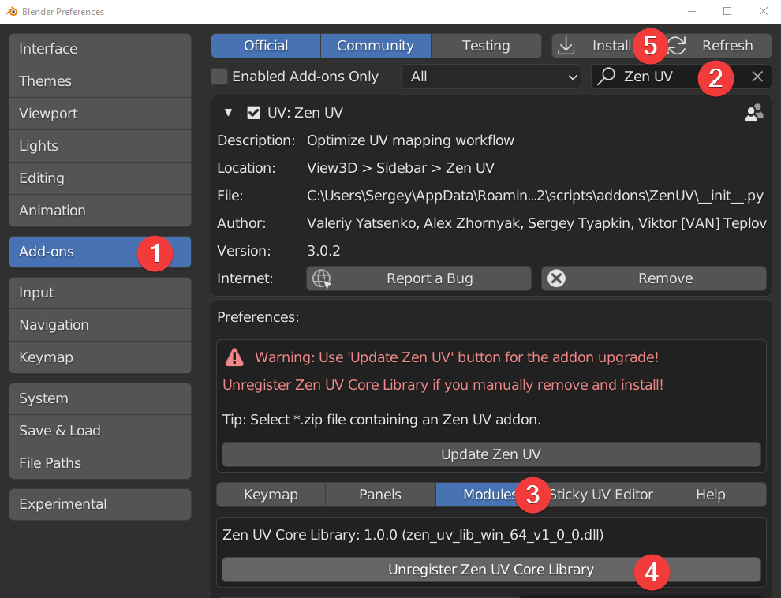
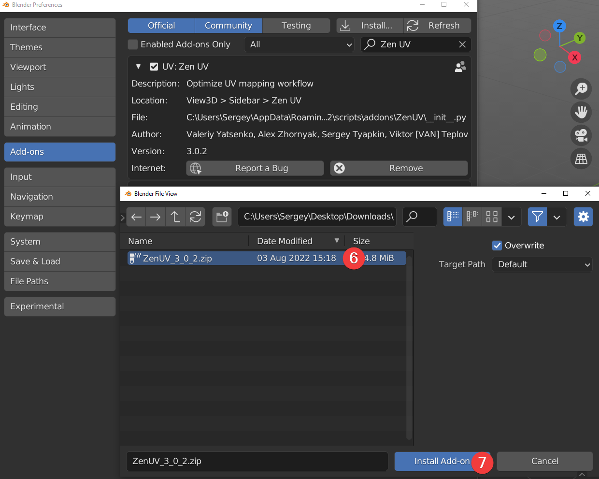

### Still have problems with update?

1. Go to Blender add-ons folder. (C:\Users\Sergey\AppData\Roaming\Blender Foundation\Blender\3.2\scripts\addons).
2. Delete Zen UV folder manually.
3. [**Install Zen UV add-on**](installation.md#installation).
4. Done!

## [Zen Relax Application](transform.md#relax) Validity Check
The validity and correctness of Zen Relax application data file is essential to be working without errors.

1. Open file `crc.md5` with any text editor
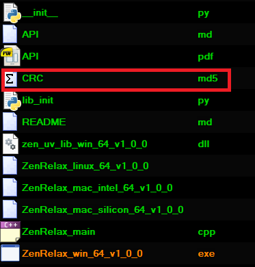

2. Pay attention to the present checksum values
**Example:**
```
950a6ed131b4cc48a8978a451a09e13d *ZenRelax_linux_64_v1_0_0
a3aa5cd73d4f1f7fcd1c62ec9147dc2c *ZenRelax_mac_intel_64_v1_0_0
f5c0c064ba189f02a05ea62c7e3c04f4 *ZenRelax_mac_silicon_64_v1_0_0
a195e82d9dbebefa5193d3409ed61cd4 *ZenRelax_win_64_v1_0_0.exe
```

3. Compare the checksum of Relax application on your system with the checksum given in `crc.md5` file

### Validation Check (Windows)
Validate checksum with `certutil` command

```batch
certutil -hashfile "c:\Users\<UserName>\AppData\Roaming\Blender Foundation\Blender\3.3\scripts\addons\ZenUV\utils\clib\ZenRelax_win_64_v1_0_0.exe" MD5
```

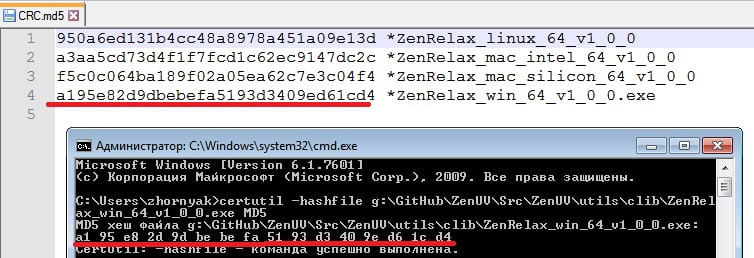
