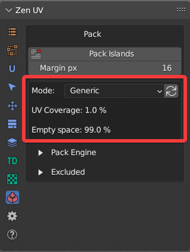
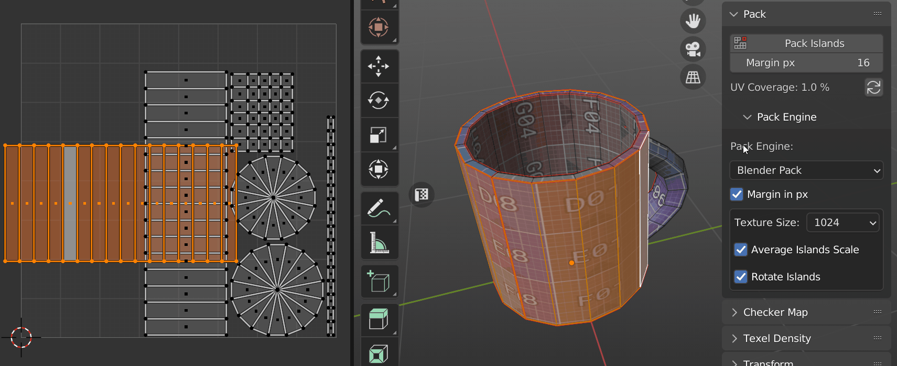
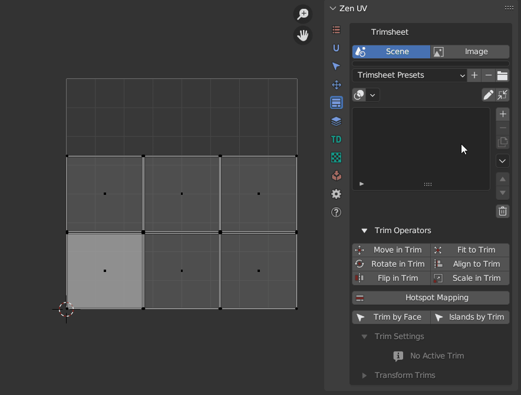
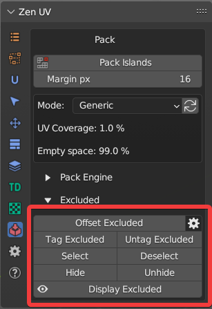
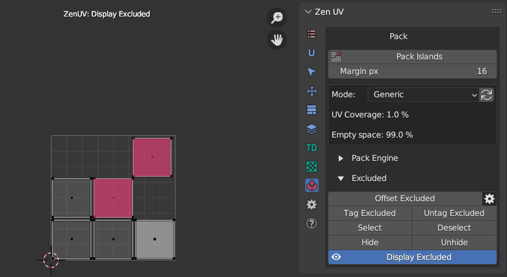

# Pack

This panel contains tools to pack UV Islands in UV Area.

!!! Panel
    

### Pack Islands

Pack all Islands using selected [**Pack Engine**](pack.md#pack-engine).

### Margin

Set space between Islands for Pack Islands operation.
If you want to display Margin in UV Editor use **Display UV Borders** operator. 

!!! tip
    It's important to have enough space (Margin) between UV Islands to avoid visual artefacts  connected with texture filtering in game engine renders.

    Here are suggested Margin values to use for different size textures:

    - 256 - 2px
    - 512 - 4px
    - 1024 - 8px
    - 2048 - 16px
    - 4096 - 32px
    - 8192 - 64px
  
### UV Coverage

Calculate Islands UV Coverage and Empty space for active UV map. Increasing UV Coverage value leads to the increasing [Texel Density](texel_density.md) value, this in turn leads to the more efficient UV space usage and you can see more pixels on your model using the same texture.

!!! SubPanel
    

#### Get UV Coverage

Get Islands UV Coverage by given settings.

|Options| |
|---|---|
| Generic | The size of each Island is calculated and added to the total value |
| Selected | Show area for selected Islands only |
| Exclude Stacked | Exclude Stacked Islands from calculations |

!!! tip
    To increase UV Coverage value and achieve efficient UV space usage (80-90% of UV Coverage):

    - Cut big Islands into smaller pieces if you have too much empty space. 
    - Upscale small objects on UV map to fill empty space.
    - Downscale UV Islands that are barely visible on the model (e.g. bottom, back parts, etc.). In this case, don't forget to disable **Average Islands Scale** option when packing.

## Pack Engine

!!! Panel
    

### Supported Pack Engines
Zen UV supports three Pack engines:

- **Blender Pack**
- [**UV Packmaster 2, 3**](https://uvpackmaster.com)
- [**UV Packer**](https://www.uv-packer.com/)

!!! tip
    If you want to use specific **UV Packmaster Pack Engine** features that are not present in Zen UV interface you can transfer existing settings to UVPackmaster using this **Transfer settings** button.

    

    Then you can open **UV Packmaster** interface and complete the setup.

### Pack Engine Preferences

The main preferences of each Pack Engine are placed in Zen UV interface. To use all the preferences please go to the main interface of the engine (UV Packer, UV Packmaster). 

Below listed preferences from all Pack Engines. If you want to obtain information about Specific preferences for some engine, please refer to the documentation of the corresponding engine.

!!! SubPanel
     | Blender|UVPackmaster|UV-Packer| 
     |---|---|---|    
     ||| |

#### Texture Size

Texture Size preset, works in pair with [**Margin**](pack.md#margin).

#### Average Islands Scale

Average Islands Scale before Pack Islands operation.

#### Rotate Islands

Allow Pack Engine rotate Islands.

#### Pack Selected Islands

Pack only Selected Islands.

#### Fixed Scale

Do not scale Islands during Pack. 

!!! Note
    Available only for UVPackmaster Pack Engine.

#### Lock Overlapping

Lock overlapping Islands during Pack. 
UVPackmaster has extra settings:

|Options| |
|---|---|
| Disabled | Overlapping Islands won't be locked |
| Any Part | Islands will be locked together if they overlap by any part |
| Exact | Islands will be locked together if they have the same area and bounding boxes |

!!! Note
    Available only for Blender and UVPackmaster Pack Engine.

!!! tip
    It's recommended to use this option if you have [**Stacked**](stack.md) Islands to save [**Stacks**](stack.md) while packing.

#### Packing Mode

A packing mode determines how UV islands are processed on the general level during packing.
More information you can find [**here**.](https://uvpackmaster.com/doc3/blender/3.2.1/30-packing-modes/) 

|Options| |
|---|---|
| Single Tiles | Overlapping Islands won't be locked |
| Tile | Islands will be locked together if they overlap by any part |
| Groups to Tiles | Islands will be locked together if they have the same area and bounding boxes |
| Groups Together | Islands will be locked together if they have the same area and bounding boxes |

!!! Note
    Available only for UVPackmaster Pack Engine.

#### Pack in Trim
Pack Islands into Trim.

!!! Note
    Available only for Blender and UVPackmaster Pack Engine.

#### Margin Method

Choose method to process Margin if UV Islands are scaled.

!!! Note
    Available only for Blender Pack Engine.

## Excluded System

System for managing Islands excluded from Pack.

!!! Panel
    

!!! Note
    Available only for Blender and UVPackmaster Pack Engine.

### Offset Excluded

Move Islands tagged as Excluded from Packing out of UV Area.

### Tag Excluded

Tag Islands as Excluded from Packing.

### Untag Excluded

Untag Islands tagged as Excluded from Packing.

### Select

Select Islands tagged as Excluded from Packing.

### Deselect

Deselect Islands tagged as Excluded from Packing.

### Hide

Hide Islands tagged as Excluded from Packing.

### Unhide

Unhide Islands tagged as Excluded from Packing.

### Display Excluded

Display Islands tagged as Excluded from Packing.

#### Display Excluded Preferences

|Options||
|---|---|
|Auto Update Draw | Update Draw cache every time when mesh is changed |
| Excluded Color | Excluded Islands viewport display color |

