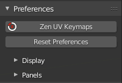
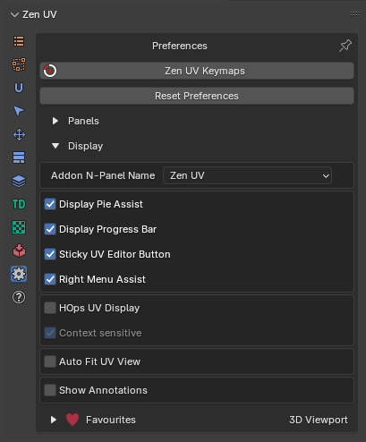
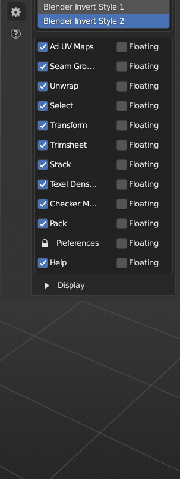
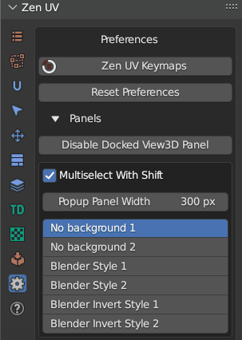

# Preferences System

---

## Preferences subpanel
!!! Panel
    

 -  **Zen UV Keymaps** - Set Shortcuts for Zen UV Menus.
 - **Reset Preferences** - Reset Zen UV preferences to the Default state.

---

## Display subpanel

 - **HOps UV Display** - Display UV in 3D View using Hard Ops addon.
 - **Context-sensitive** - Enable HOps UV Display if UV Editor is open.
 - **Auto Fit UV View** - Automatically Fit and Zoom UV viewport.
 - **Show Seams** - Display UV Seams.
 - **Show Sharp Edges** - Display Sharp edges. It can be overlapped by Seams/Bevel Weights/Crease Edges display.
 - **Show Bevel Weights** - Display Sharp edges. It can be overlapped by Seams/Bevel Weights/Crease Edges display.
 - **Show Crease Edges** - Display crease edges created for the Subdivision modifier. It can be overlapped by Seams/Bevel Weights display.

---

## Panels subpanel

Disabling Panels.Use these checkboxes disable some panels if you don't use them.

Floating Panels. If you like old style menu make all the panels Floating.

Panels Icon Style. If you don't see active panel icons with your current Blender color theme you can change the icon style. 

