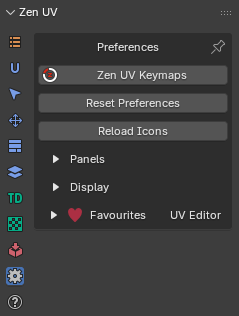
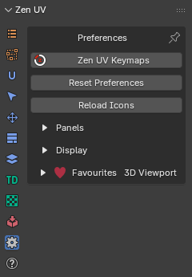
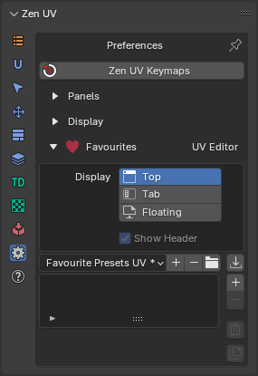

# Preferences

|UV Editor|3D View|
|---|---|  
|||

## Operators
### Zen UV Keymaps
When activated, it opens the Blender Preferences window with the [**Keymap**](addon_prefs.md#keymap) section pre-selected, allowing users to view or customize shortcut bindings immediately.

### Reset Preferences
Reset Zen UV Preferences to default state.

### Reload Icons
The **Reload Icons** operator restores all custom addon icons that may have disappeared or become corrupted—typically due to interference from third-party addons or Blender’s internal icon caching issues.

!!! NOTE
    - This operator does not permanently fix Blender’s icon caching bug, but provides a fast workaround
    - If icons still fail to reload, try restarting Blender or checking for conflicting addons

---

## Panels

!!! Subpanel
    

- **Disable Docked View3D Panel** - Disable Compact UI.

    

- **Multiselect With Shift** - Set Active Panels with holding Shift hotkey.
- **Popup Panel Width** - Set Popup menu `Shift + U` width.

- **Selector Orientation** - Orient Icons vertically or horizontally. 
    

- **Panels Icon Style** - Change Icon Style. If you don't see active panel icons with your current Blender color theme you can change the icon style.

    

- **Disabling Panels** - Enable Add-on Panels. You can use these checkboxes disable some panels if you don't use them.

    

- **Floating Panels** - Show Panel as a separate Panel. If you like old style menu make all the panels Floating.

    

---

## Display

The Display panel allows you to switch certain display features used across different parts of the UI.

!!! Subpanel
    

---

- **Addon N-Panel Name** - Name of the addon tab in N-Panel. You can set it to Zen to combine all Zen addons in one tab. Requires Blender restart. More info in the article [Addon Preferences](addon_prefs.md/#addon-n-panel-name)

---

- **Display Pie Assist** - Display hints for Pie menu. More info in the article [Pie Menu Assist](user_interface.md/#pie-menu-assist)

- **Display Progress Bar** - Display the progress of the operator execution process/ More info in the article [User Interface](user_interface.md/#progress-bar).

- **Sticky UV Editor Button** - Enable Sticky UV Editor button. More info in the article [Sticky UV Editor](sticky_uv_editor.md/#about)

- **Right Menu Assist** - Context assistance by right menu click. More info in the article [User Interface](user_interface.md/#right-menu-assist)

---

### HOps UV Display
  

- **HOps UV Display** - Display UV trasnforms in 3D View using Hard Ops addon.
- **Context-sensitive** - Enable HOps UV Display only if UV Editor is open.
- **Auto Fit UV View** - Automatically Fit and Zoom UV viewport.
- **Show Annotations** - Show operator data using Blender annotations.

---

## Favourites
The [Favourites](favourites.md) panel allows you to create custom panels with toolsets that are convenient or necessary for your current tasks. The ability to quickly switch panels using the preset system and the ease of creating these panels significantly speeds up daily tasks. In the Favourites panel, you can add not only operators and properties from the addon but also any Blender operators. More info in the article [Favourites](favourites.md).

!!! Subpanel
    
