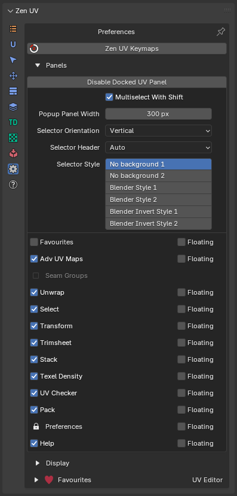
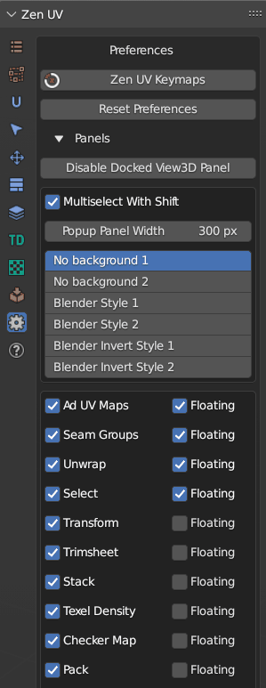

# Preferences

!!! Panel
     

###  **Zen UV Keymaps**
Set Shortcuts for Zen UV menus.

### **Reset Preferences**
Reset Zen UV Preferences to default state.

---

## Panels

!!! Subpanel
     

### **Disable Docked View3D Panel**
Disable Compact UI.

### **Multiselect With Shift**  
Set Active Panels with holding Shift hotkey.

### **Popup Panel Width** 
Set Popup menu `Shift + U` width.

### **Selector Orientation**
Orient Icons vertically or horizontally. 
 

### **Panels Icon Style** 
Change Icon Style. If you don't see active panel icons with your current Blender color theme you can change the icon style.

### **Disabling Panels**
Enable Add-on Panels. You can use these checkboxes disable some panels if you don't use them.

### **Floating Panels**
Show Panel as a separate Panel. If you like old style menu make all the panels Floating.
  

---

## Display

!!! Subpanel
    

### **Display Pie Assist** 
Display hints for Pie menu.

### **Display Progress Bar**

**Progress Bar** is designed to display the progress of the operator execution process. Not all operators use the **Progress Bar**, only those that require complex calculations.
On some operating systems of the **Linux** family, the **Progress Bar** can cause Blender to crash. To avoid this situation, you can disable the Progress Bar in **Panel - Preferences - Display Progress Bar.**

### **HOps UV Display**
Display UV trasnforms in 3D View using Hard Ops addon.
 
  

### **Context-sensitive**
Enable HOps UV Display if UV Editor is open.

### **Auto Fit UV View**
Automatically Fit and Zoom UV viewport.

### **Sticky UV Editor Button**
Enable Sticky UV Editor button.

### **Show Seams**
Display UV Seams in 3D Viewport.

### **Show Sharp Edges**
Display Sharp edges in 3D Viewport. It can be overlapped by Seams/Bevel Weights/Crease Edges display.

### **Show Bevel Weights**
Display Sharp edges in 3D Viewport. It can be overlapped by Seams/Bevel Weights/Crease Edges display.

### **Show Crease Edges**
Display crease edges created for the Subdivision modifier in 3D Viewport. It can be overlapped by Seams/Bevel Weights display.