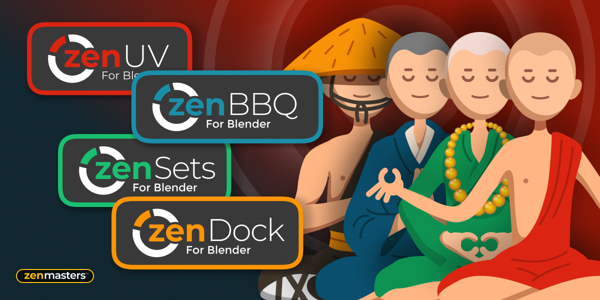
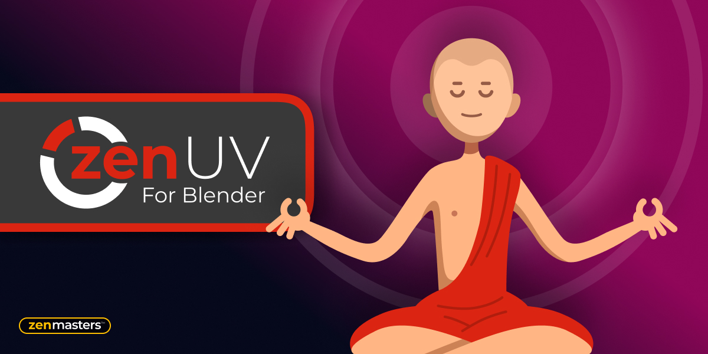
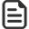
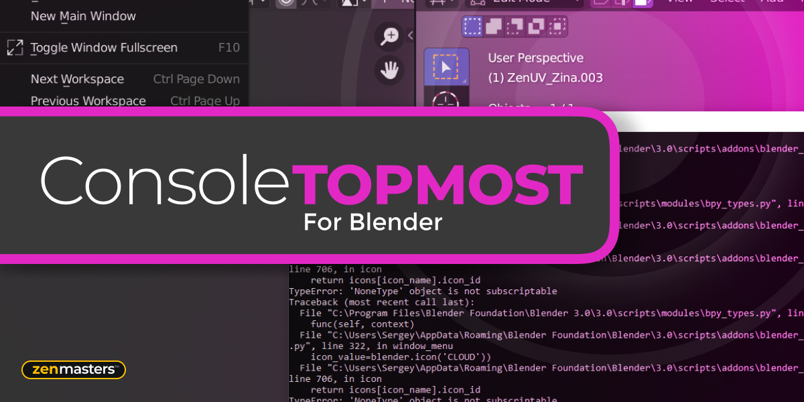

# Recommended Add-ons

## Zen Bundle

All four Zen add-ons in one place! 

!!! tip
    By purchasing Zen Bundle you'll save 25%!

  [**Blender Market**](https://www.blendermarket.com/products/zen-bundle)      [**Gumroad**](https://sergeytyapkin.gumroad.com/l/ZenBundle)

---

## Zen UV

Zen UV is not just a set of tools, it is ready to use pipeline for fast creating UV’s in Blender. It represents an intuitive system created by professionals and refined in real projects. Enjoy this experience with us!

  [**Blender Market**](https://www.blendermarket.com/products/zen-uv)      [**Gumroad**](https://gumroad.com/l/ZenUV4)

 [**Zen UV Documentation**](https://zen-masters.github.io/Zen-UV/)

---

## Zen Sets

Zen Sets is an add-on for creating, managing, and visualizing native Vertex Groups, Face Maps and custom Zen Sets Groups based on Objects, Collections and Mesh Elements selection. Save the selection of Verts / Edges / Faces and Objects to bring it back whenever you want! Modify and display Groups by color in Viewport and UV Editor in a couple of clicks!

  [**Blender Market**](https://www.blendermarket.com/products/zen-sets)      [**Gumroad**](https://gumroad.com/l/ZenSets)

 [**Zen Sets Documentation**](https://zen-masters.github.io/Zen-Sets/)

---

## Zen Dock

Zen Dock - window bar add-on for managing Areas in One Click! Add Custom Toggle Buttons with different contexts and directions for opening panels. Minimize, Maximize, Close and Restore Areas wherever you want!

  [**Blender Market**](https://blendermarket.com/products/zen-dock)      [**Gumroad**](https://gumroad.com/l/zendock)

 [**Zen Dock Documentation**](https://zenmastersteam.github.io/Zen-Dock/)

---

## Zen BBQ

Zen BBQ is an add-on for creating, adjusting, and visualizing Bevels in a couple of clicks! Are you tired of preparing geometry for the Subd or Bevel modifiers? Look no further!

  [**Blender Market**](https://www.blendermarket.com/products/zen-bbq)      [**Gumroad**](https://gumroad.com/l/ZenBBQ)

 [**Zen BBQ Documentation**](https://zen-masters.github.io/Zen-BBQ/)

---

## Checker

Check the state of UV’s on the model easily with Checker for Blender! **FREE**.

  [**Blender Market**](https://www.blendermarket.com/products/checker)      [**Gumroad**](https://gumroad.com/l/zenuv_checker)

 [**Checker Documentation**](checker.md)

---

## Console Top Most

Are you tired of switching back to the System Console window in Blender? There is a way out!
Console Top Most add-on makes the System Console to the TOPMOST window!

  [**Blender Market**](https://www.blendermarket.com/products/zen-console-top-most-for-blender)      [**Gumroad**](https://gumroad.com/l/ZenConsoleTopMost)

