# Recommended Add-ons
## Modeling
| | | |
|---|---|---|
|  [HardOps and BoxCutter Bundle](https://blendermarket.com/products/hard-ops--boxcutter-ultimate-bundle?ref=1462 "The ultimate hard surface suite.") | [HardOps](https://blendermarket.com/products/hardopsofficial?ref=1462 "The number #1 hard surface modelling toolkit.") | [BoxCutter](https://blendermarket.com/products/boxcutter?ref=1462 "The number #1 boolean cutter.")  |
|  [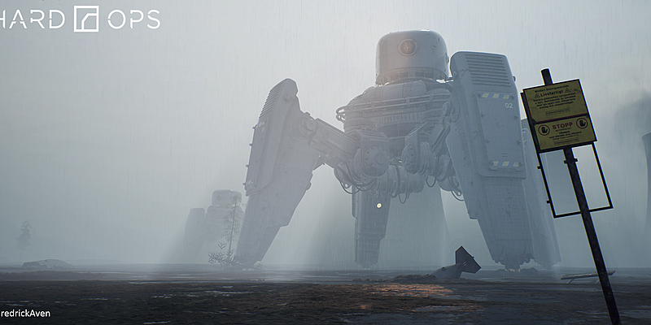{: style="width:200px"}](https://blendermarket.com/products/hard-ops--boxcutter-ultimate-bundle?ref=1462 "The ultimate hard surface suite.") | [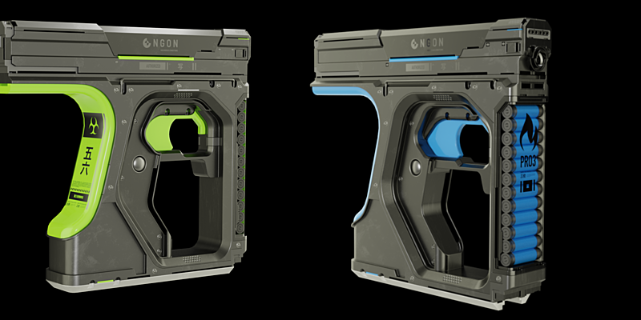{: style="width:200px"}](https://blendermarket.com/products/hardopsofficial?ref=1462 "The number #1 hard surface modelling toolkit.") | [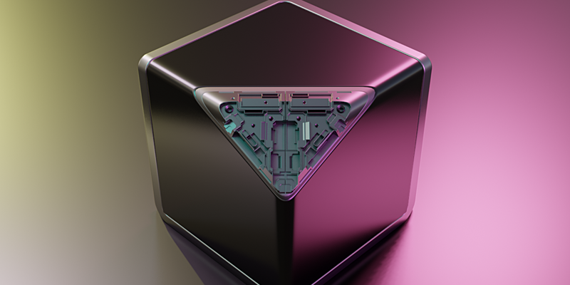{: style="width:200px"}](https://blendermarket.com/products/boxcutter?ref=1462 "The number #1 boolean cutter.")  |
|  [MESHmachine](https://blendermarket.com/products/meshmachine?ref=1462 "MESHmachine is a blender mesh modeling addon with a focus on hard surface work without subdivision surfaces.") | [DECALmachine](https://blendermarket.com/products/decalmachine?ref=1462 "DECALmachine is a blender addon, which through mesh Decals, allows for surface detailing in a very non-committal, non-destructive, UV-less way. As such it represents an alternative approach to hard surface texturing.") | [CURVEmachine](https://blendermarket.com/products/curvemachine?ref=1462 "CURVEmachine can be seen as MESHmachine's little brother. It aims to make POLY Curve editing more flexible, and like MM's fillet toolset, makes working with curve radii/arcs and non-circular blends essentially non-destructive.")  |
|  [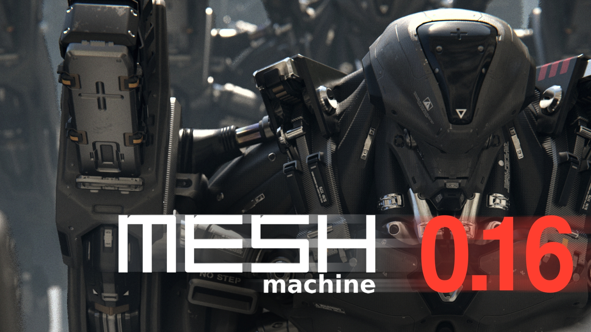{: style="width:200px"}](https://blendermarket.com/products/meshmachine?ref=1462 "MESHmachine is a blender mesh modeling addon with a focus on hard surface work without subdivision surfaces.") | [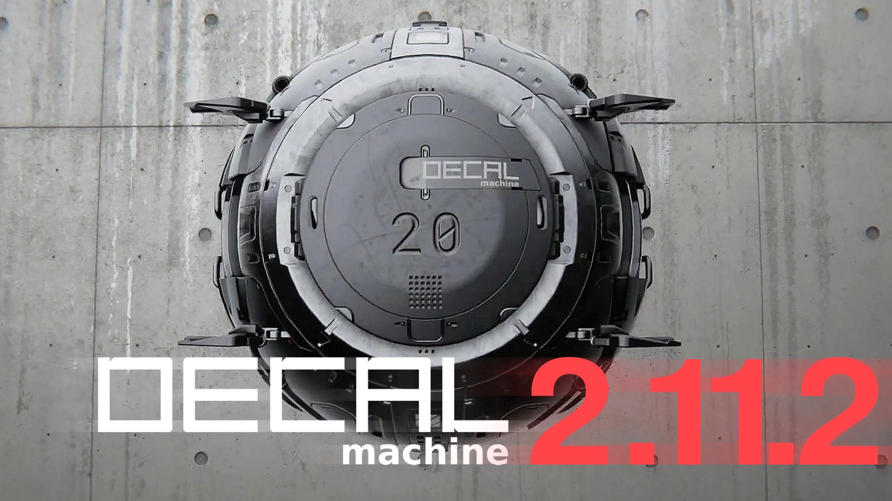{: style="width:200px"}](https://blendermarket.com/products/decalmachine?ref=1462 "DECALmachine is a blender addon, which through mesh Decals, allows for surface detailing in a very non-committal, non-destructive, UV-less way. As such it represents an alternative approach to hard surface texturing.") | [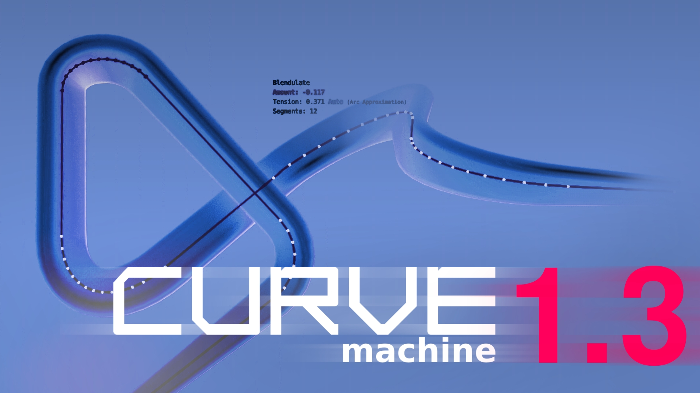{: style="width:200px"}](https://blendermarket.com/products/curvemachine?ref=1462 "CURVEmachine can be seen as MESHmachine's little brother. It aims to make POLY Curve editing more flexible, and like MM's fillet toolset, makes working with curve radii/arcs and non-circular blends essentially non-destructive.")  |
|  [PUNCHit](https://blendermarket.com/products/punchit?ref=1462 "PUNCHit is a dedicated, single-purpose blender addon featuring a negative manifold extrusion tool, that attempts to work more reliably and be more flexible, than Blender's native manifold extrusion.") | [MACHIN3tools](https://blendermarket.com/products/machin3tools?ref=1462 "MACHIN3tools is a continuously evolving collection of blender tools and pie menus in a single customizable package.") | [Cablerator](https://blendermarket.com/products/cbl?ref=1462 "Cablerator is a tool for creating and editing hanging cables.")  |
|  [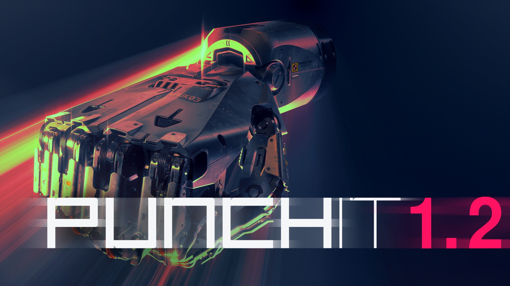{: style="width:200px"}](https://blendermarket.com/products/punchit?ref=1462 "PUNCHit is a dedicated, single-purpose blender addon featuring a negative manifold extrusion tool, that attempts to work more reliably and be more flexible, than Blender's native manifold extrusion.") | [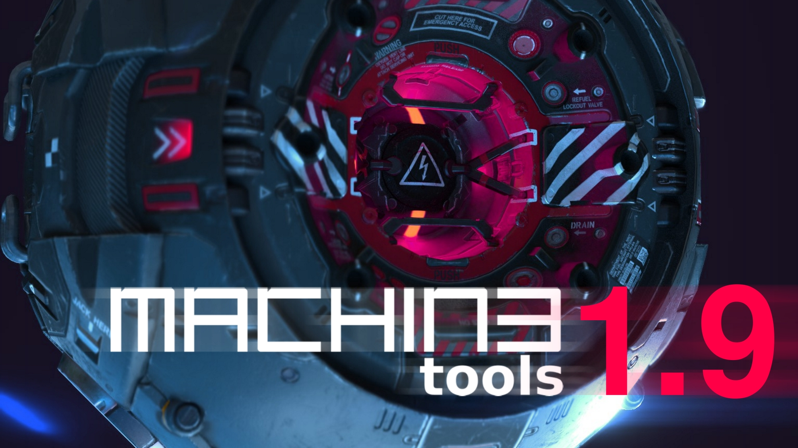{: style="width:200px"}](https://blendermarket.com/products/machin3tools?ref=1462 "MACHIN3tools is a continuously evolving collection of blender tools and pie menus in a single customizable package.") | [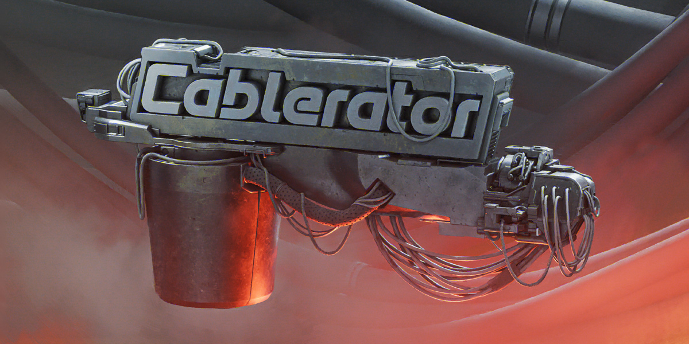{: style="width:200px"}](https://blendermarket.com/products/cbl?ref=1462 "Cablerator is a tool for creating and editing hanging cables.")  |
|  [Qblocker](https://blendermarket.com/products/qblocker "QBlocker is an object creation Addon for Blender that generates parametric objects with fast placement, similar to other 3D software. The tool includes some basic object types, custom snapping, and a working plane for more precision.") | [Geo-Scatter](https://blendermarket.com/products/scatter?ref=1462 "The #1 scattering add-on for Blender.") | [KeKit](https://blendermarket.com/products/kekit?ref=1462 "The Add-On provides extensive options for customizing & optimizing workflows.")  |
|  [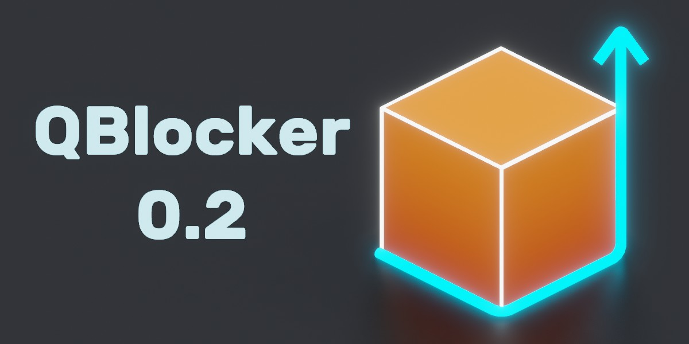{: style="width:200px"}](https://blendermarket.com/products/qblocker "QBlocker is an object creation Addon for Blender that generates parametric objects with fast placement, similar to other 3D software. The tool includes some basic object types, custom snapping, and a working plane for more precision.") | [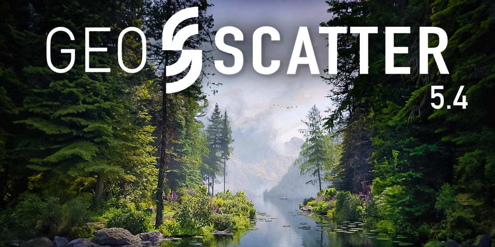{: style="width:200px"}](https://blendermarket.com/products/scatter?ref=1462 "The #1 scattering add-on for Blender.") | [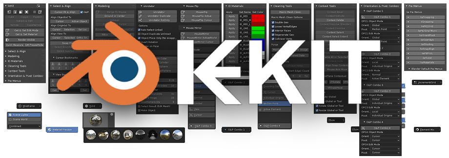{: style="width:200px"}](https://blendermarket.com/products/kekit?ref=1462 "The Add-On provides extensive options for customizing & optimizing workflows.")  |
|  [Random Flow](https://blendermarket.com/products/random-flow?ref=1462 "Random Flow is a random mesh generator designed for fast and easy hard surface prototyping and concept art.") | [Curves To Mesh](https://blendermarket.com/products/curves-to-mesh?ref=1462 "Curves to Mesh is an add-on for experienced 3D modellers who need to create mesh surfaces from bezier curves.") | [Conform Object](https://blendermarket.com/products/conform-object?ref=1462 "For any 3D modeler that needs to project smaller objects onto a larger object surface in one direction.")  |
|  [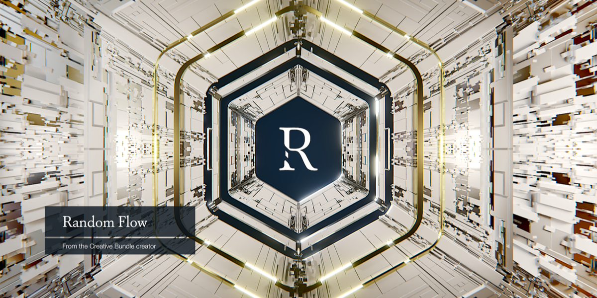{: style="width:200px"}](https://blendermarket.com/products/random-flow?ref=1462 "Random Flow is a random mesh generator designed for fast and easy hard surface prototyping and concept art.") | [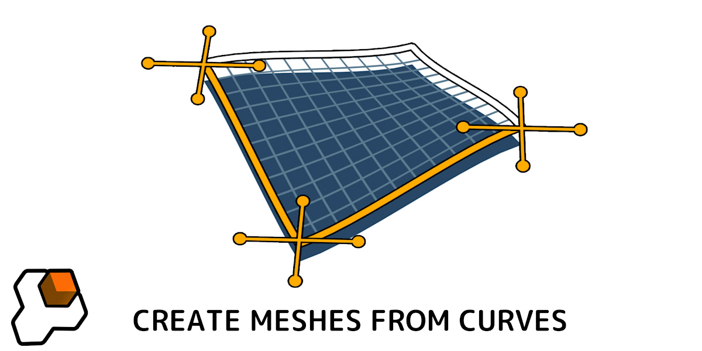{: style="width:200px"}](https://blendermarket.com/products/curves-to-mesh?ref=1462 "Curves to Mesh is an add-on for experienced 3D modellers who need to create mesh surfaces from bezier curves.") | [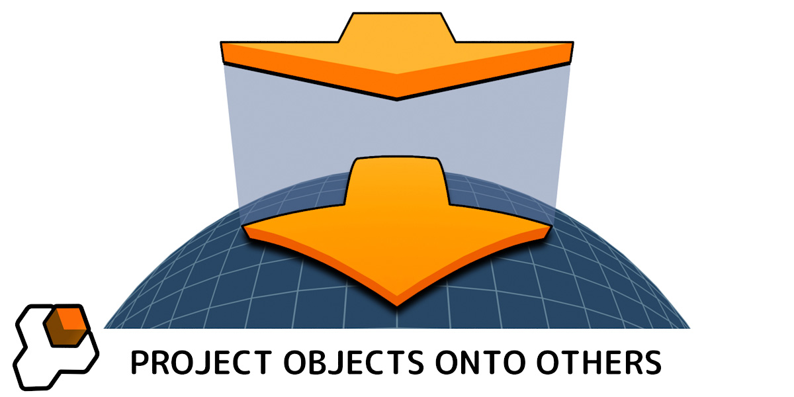{: style="width:200px"}](https://blendermarket.com/products/conform-object?ref=1462 "For any 3D modeler that needs to project smaller objects onto a larger object surface in one direction.")  |
|  [ConjureSDF](https://blendermarket.com/products/conjuresdf "SDF Render for smooth and non-distructive hard surface models.") | [Ocd (One Click Damage)](https://blendermarket.com/products/ocd?ref=1462 "This ultimate tool adds realistic wear with just a click. Choose your model, adjust, and instantly enjoy a highly detailed, lifelike asset.") | [Simply Cloth Pro](https://blendermarket.com/products/simply-cloth?ref=1462 "Simply Cloth Pro is the must-have tool for expediting cloth-related tasks in Blender.")  |
|  [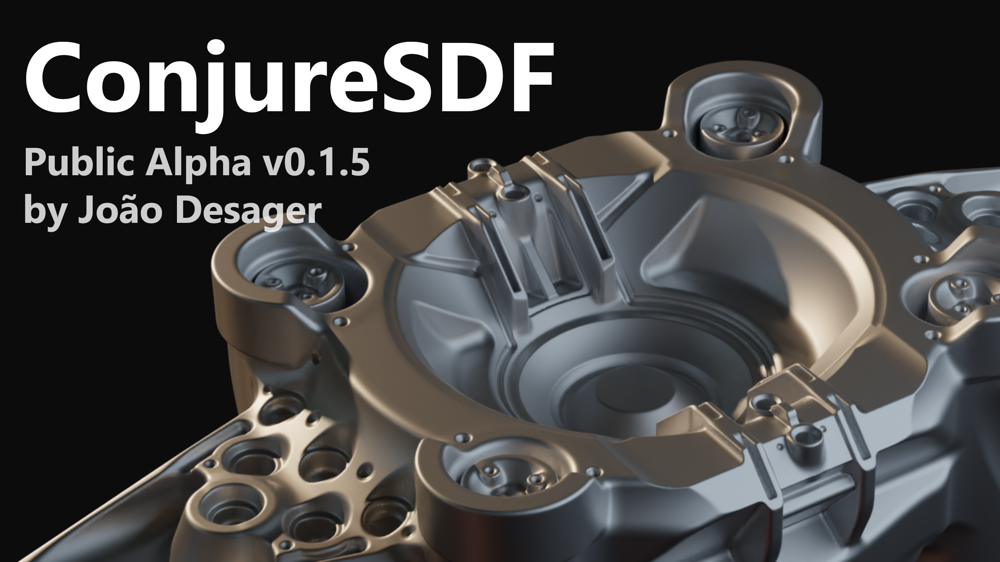{: style="width:200px"}](https://blendermarket.com/products/conjuresdf "SDF Render for smooth and non-distructive hard surface models.") | [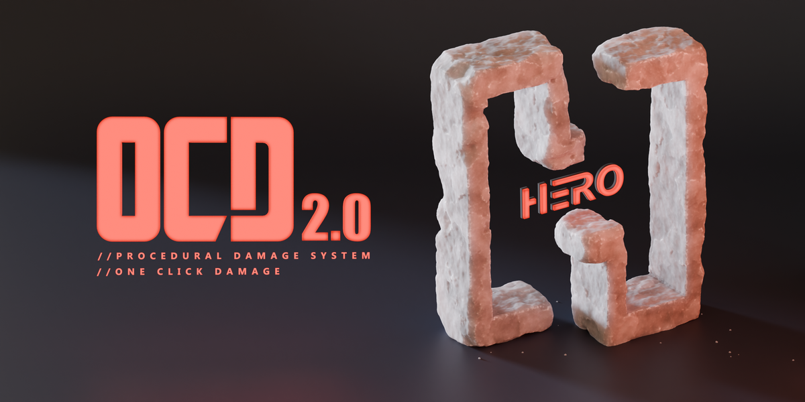{: style="width:200px"}](https://blendermarket.com/products/ocd?ref=1462 "This ultimate tool adds realistic wear with just a click. Choose your model, adjust, and instantly enjoy a highly detailed, lifelike asset.") | [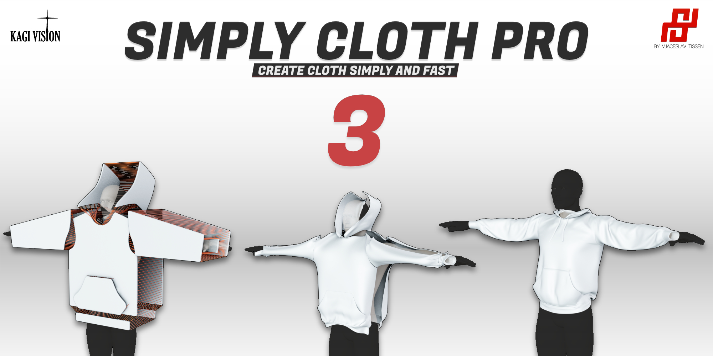{: style="width:200px"}](https://blendermarket.com/products/simply-cloth?ref=1462 "Simply Cloth Pro is the must-have tool for expediting cloth-related tasks in Blender.")  |

## Animation
| | | |
|---|---|---|
|  [Auto-Rig Pro](https://blendermarket.com/products/auto-rig-pro?ref=1462 "Auto-Rig Pro is an addon for Blender to rig characters, retarget animations, and provide Fbx/Gltf export, with settings for Unity, Unreal Engine, Godot.") | [Auto-Rig Pro: Quick Rig](https://blendermarket.com/products/auto-rig-pro-quick-rig?ref=1462 "Quick Rig turns rapidly any skeleton + mesh into a full Auto-Rig Pro armature with controllers ready for animation, including weights preservation, IK-FK generation, animation support.") | [Animation Layers](https://blendermarket.com/products/animation-layers?ref=1462 "Edit your animation or mocap data quickly using a standard animation layers UI and workflow directly in your 3D viewport with an extra layers functionality.")  |
|  [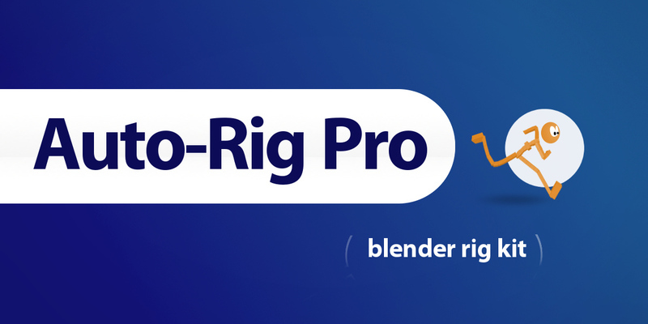{: style="width:200px"}](https://blendermarket.com/products/auto-rig-pro?ref=1462 "Auto-Rig Pro is an addon for Blender to rig characters, retarget animations, and provide Fbx/Gltf export, with settings for Unity, Unreal Engine, Godot.") | [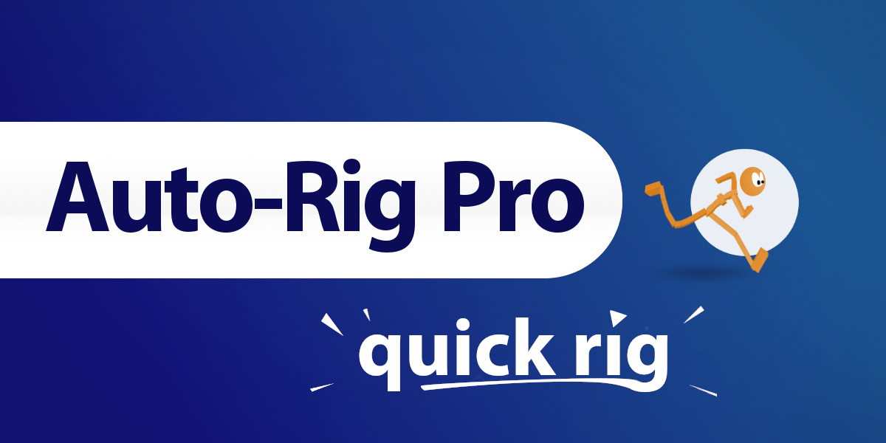{: style="width:200px"}](https://blendermarket.com/products/auto-rig-pro-quick-rig?ref=1462 "Quick Rig turns rapidly any skeleton + mesh into a full Auto-Rig Pro armature with controllers ready for animation, including weights preservation, IK-FK generation, animation support.") | [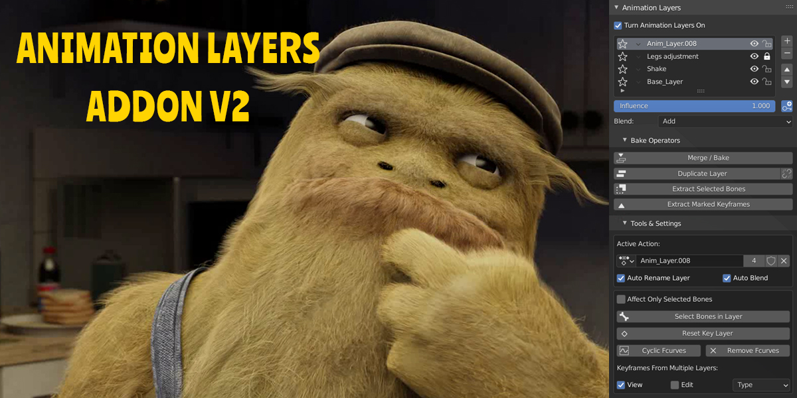{: style="width:200px"}](https://blendermarket.com/products/animation-layers?ref=1462 "Edit your animation or mocap data quickly using a standard animation layers UI and workflow directly in your 3D viewport with an extra layers functionality.")  |
|  [Voxel Heat Diffuse Skinning](https://blendermarket.com/products/voxel-heat-diffuse-skinning?ref=1462 "Skinning add-on for generating perfect vertex weights.") | [FaceIt](https://blendermarket.com/products/faceit?ref=1462 "Faceit is an all-in-one facial rigging, motion capture and animation add-on.") | [X-Muscle System](https://blendermarket.com/products/x-muscle-system?ref=1462 "X-Muscle System is advanced, physics based tissue simulator for Blender.")  |
|  [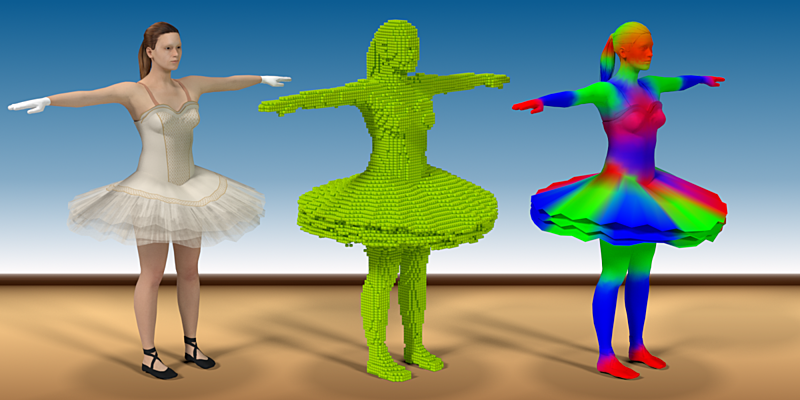{: style="width:200px"}](https://blendermarket.com/products/voxel-heat-diffuse-skinning?ref=1462 "Skinning add-on for generating perfect vertex weights.") | [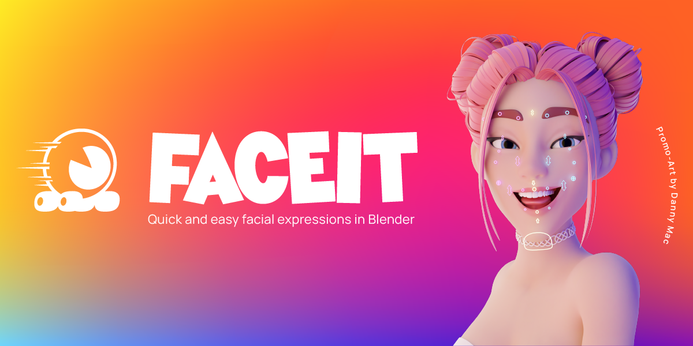{: style="width:200px"}](https://blendermarket.com/products/faceit?ref=1462 "Faceit is an all-in-one facial rigging, motion capture and animation add-on.") | [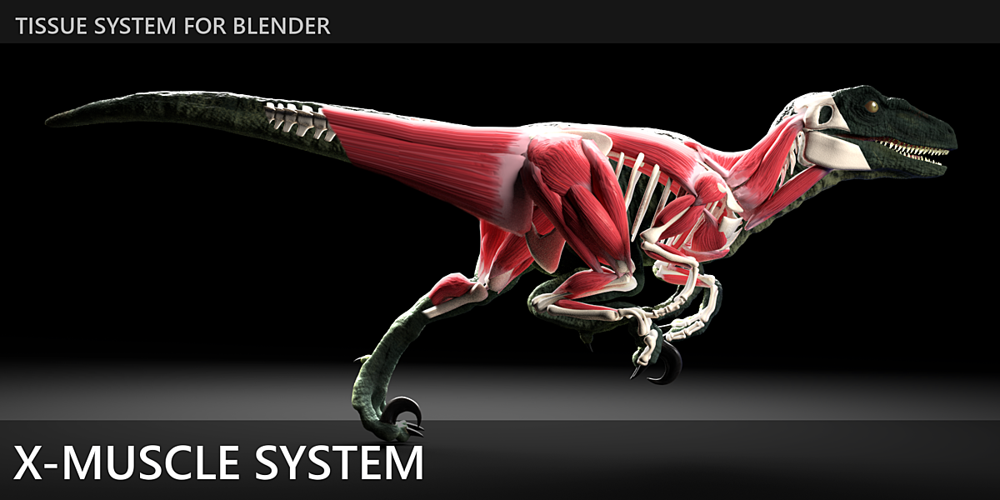{: style="width:200px"}](https://blendermarket.com/products/x-muscle-system?ref=1462 "X-Muscle System is advanced, physics based tissue simulator for Blender.")  |

## UV
| | | |
|---|---|---|
|  [UVPackmaster](https://blendermarket.com/products/uvpackmaster?ref=1462 "Best UV Packer for Blender. Supported by the Zen UV addon.") | [Zen UV](https://blendermarket.com/products/zen-uv "Professional add-on for creating UVs in Blender") | |
|  [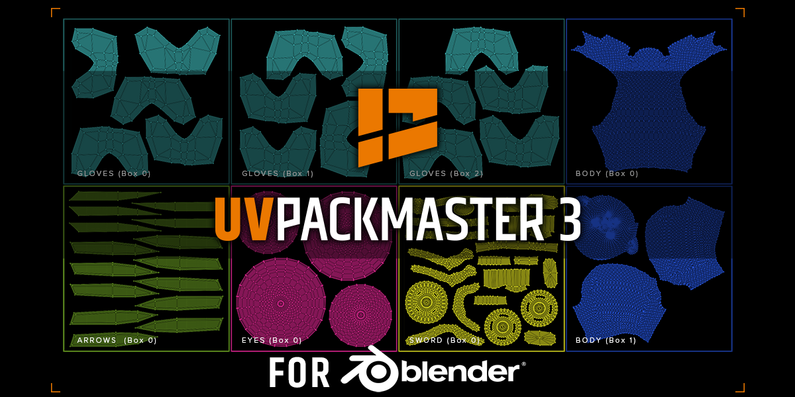{: style="width:200px"}](https://blendermarket.com/products/uvpackmaster?ref=1462 "Best UV Packer for Blender. Supported by the Zen UV addon.") | [{: style="width:200px"}](https://blendermarket.com/products/zen-uv "Professional add-on for creating UVs in Blender") | |

## Interface
| | | |
|---|---|---|
|  [Pie Menu Editor](https://blendermarket.com/products/pie-menu-editor "An add-on for Blender 3.0+ that allows you to create pie menus, menus, popup dialogs, side panels and toolbars without coding.") | [Clean Panels Pro](https://blendermarket.com/products/clean-panels-pro?ref=1462 "Organize Add-on in N-Panel.") | [Zen Dock](https://blendermarket.com/products/zen-dock "Window bar add-on for managing Areas in One Click!")  |
|  [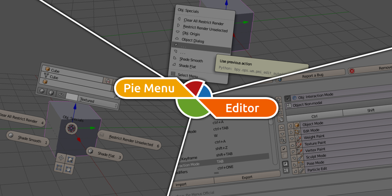{: style="width:200px"}](https://blendermarket.com/products/pie-menu-editor "An add-on for Blender 3.0+ that allows you to create pie menus, menus, popup dialogs, side panels and toolbars without coding.") | [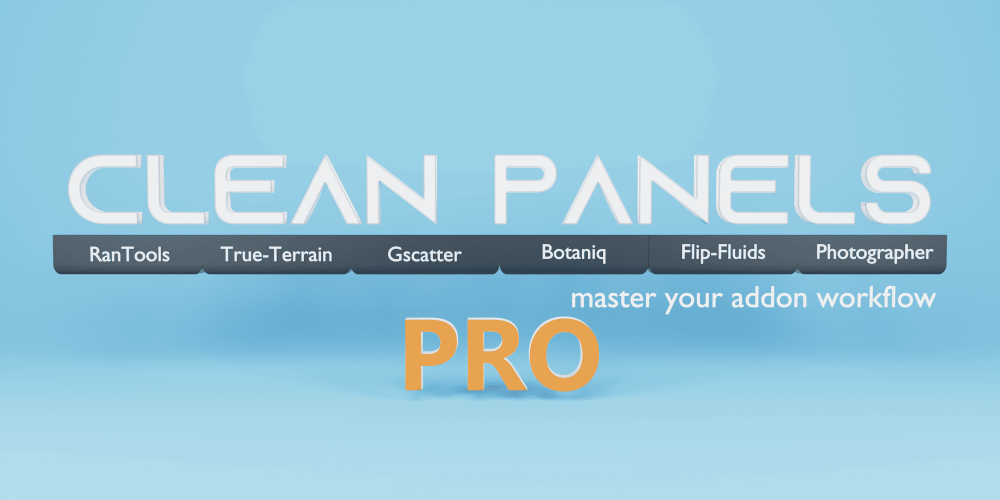{: style="width:200px"}](https://blendermarket.com/products/clean-panels-pro?ref=1462 "Organize Add-on in N-Panel.") | [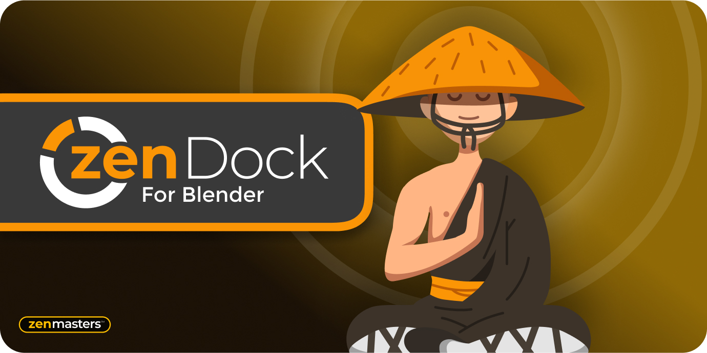{: style="width:200px"}](https://blendermarket.com/products/zen-dock "Window bar add-on for managing Areas in One Click!")  |

## VFX
| | | |
|---|---|---|
|  [Rbdlab](https://blendermarket.com/products/rbdlab?ref=1462 "RBDLab MetalSoft is a revolutionary tool for Blender. From fracturing objects, destroying them and creating details with debris, dust and smoke, to deforming metal, creating cloth, softbodies.") | [Fluidlab](https://blendermarket.com/products/fluidlab?ref=1462 "FluidLab is a powerful tool for generating realistic simulations of fluids, viscous bodies, slimes and other fluids.") | [Vdblab](https://blendermarket.com/products/vdblab?ref=1462 "VDBLab is a powerful tool for creating explosions.")  |
|  [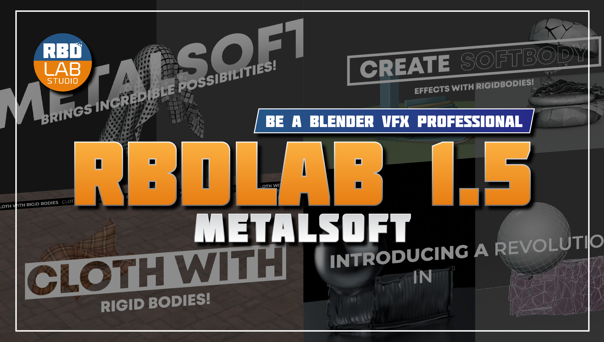{: style="width:200px"}](https://blendermarket.com/products/rbdlab?ref=1462 "RBDLab MetalSoft is a revolutionary tool for Blender. From fracturing objects, destroying them and creating details with debris, dust and smoke, to deforming metal, creating cloth, softbodies.") | [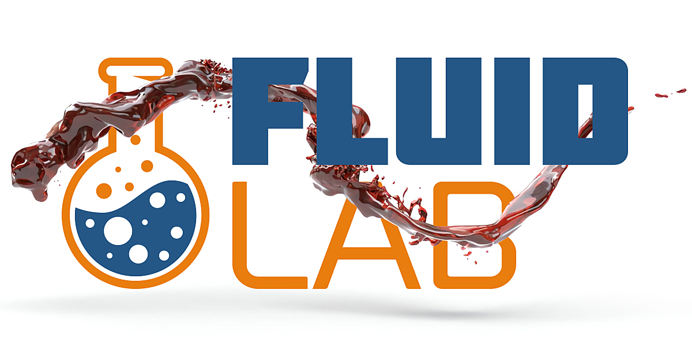{: style="width:200px"}](https://blendermarket.com/products/fluidlab?ref=1462 "FluidLab is a powerful tool for generating realistic simulations of fluids, viscous bodies, slimes and other fluids.") | [{: style="width:200px"}](https://blendermarket.com/products/vdblab?ref=1462 "VDBLab is a powerful tool for creating explosions.")  |

## Render
| | | |
|---|---|---|
|  [Renderset](https://blendermarket.com/products/render-manager-addon-renderset?ref=1462 "Change Render context of your scene with a click of a button!") | [Perspective Plotter](https://blendermarket.com/products/perspective-plotter?ref=1462 "Match a camera to an image with Perspective Plotter, an interactive Blender add-on for modelers, architects and artists. This is useful for creating 3D models from 2D sketches, matching a 3D scene to a 2D photo, or animating a camera dynamically.") | [Zen BBQ](https://blendermarket.com/products/zen-bbq "Zen BBQ is an add-on for creating, adjusting, and visualizing Bevels in a couple of clicks!")  |
|  [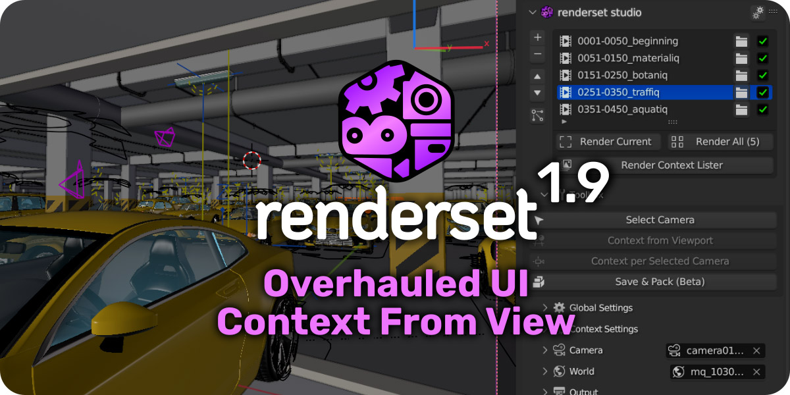{: style="width:200px"}](https://blendermarket.com/products/render-manager-addon-renderset?ref=1462 "Change Render context of your scene with a click of a button!") | [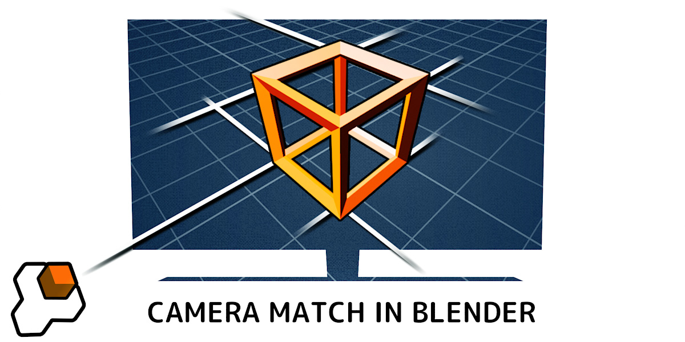{: style="width:200px"}](https://blendermarket.com/products/perspective-plotter?ref=1462 "Match a camera to an image with Perspective Plotter, an interactive Blender add-on for modelers, architects and artists. This is useful for creating 3D models from 2D sketches, matching a 3D scene to a 2D photo, or animating a camera dynamically.") | [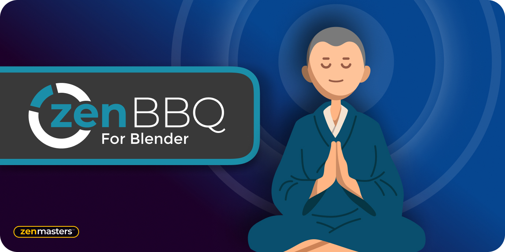{: style="width:200px"}](https://blendermarket.com/products/zen-bbq "Zen BBQ is an add-on for creating, adjusting, and visualizing Bevels in a couple of clicks!")  |

## Other
| | | |
|---|---|---|
|  [Better Fbx Importer & Exporter](https://blendermarket.com/products/better-fbx-importer--exporter?ref=1462 "The add-on is compatible with all FBX versions, from ASCII to binary, from FBX 5.3 to FBX 2020.") | [GrabDoc](https://blendermarket.com/products/grabdoc "GrabDoc is a Blender 4.0+ add-on for quickly baking trim sheets and tileable texture maps.") | [Node Organizer](https://blendermarket.com/products/node-organizer?ref=1462 "This addon utilizes our unique algorithm to automatically organize your selected nodes.")  |
|  [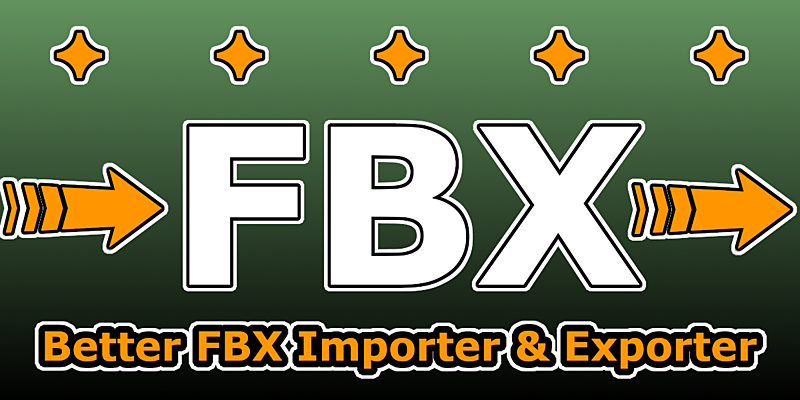{: style="width:200px"}](https://blendermarket.com/products/better-fbx-importer--exporter?ref=1462 "The add-on is compatible with all FBX versions, from ASCII to binary, from FBX 5.3 to FBX 2020.") | [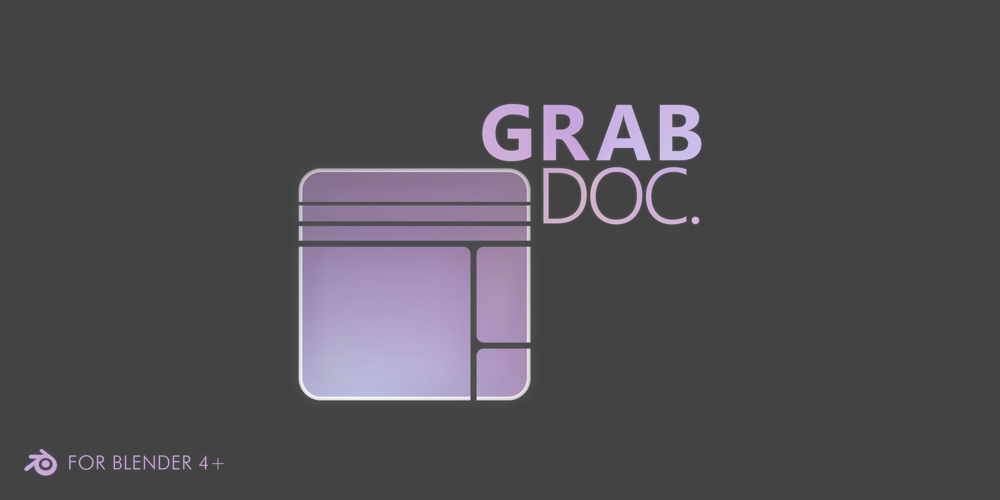{: style="width:200px"}](https://blendermarket.com/products/grabdoc "GrabDoc is a Blender 4.0+ add-on for quickly baking trim sheets and tileable texture maps.") | [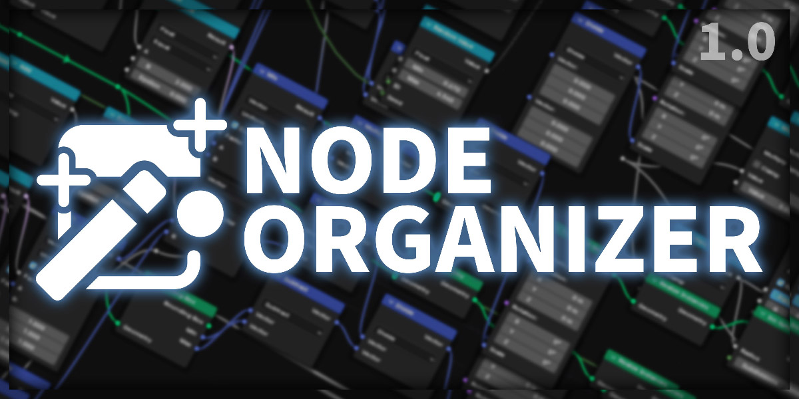{: style="width:200px"}](https://blendermarket.com/products/node-organizer?ref=1462 "This addon utilizes our unique algorithm to automatically organize your selected nodes.")  |
|  [Node Preview](https://blendermarket.com/products/node-preview?ref=1462 "This addon displays rendered thumbnails above shader nodes.") | [Memsaver](https://blendermarket.com/products/memsaver-scene-memory-optimizer?ref=1462 "Memsaver is an add-on for reducing scene VRAM consumption.") | [Zen Sets](https://blendermarket.com/products/zen-sets "Zen Sets is an add-on for creating, managing, and visualizing native Vertex Groups, Face Maps and custom Zen Sets Groups based on Objects, Collections and Mesh Elements selection.")  |
|  [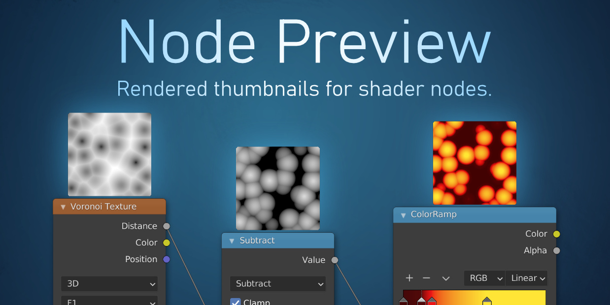{: style="width:200px"}](https://blendermarket.com/products/node-preview?ref=1462 "This addon displays rendered thumbnails above shader nodes.") | [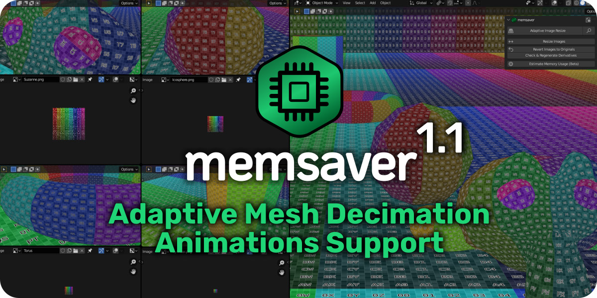{: style="width:200px"}](https://blendermarket.com/products/memsaver-scene-memory-optimizer?ref=1462 "Memsaver is an add-on for reducing scene VRAM consumption.") | [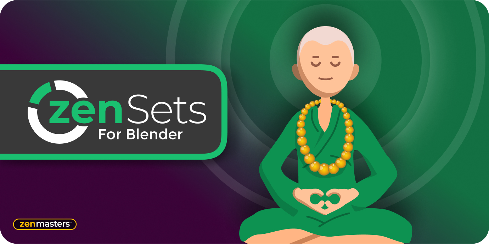{: style="width:200px"}](https://blendermarket.com/products/zen-sets "Zen Sets is an add-on for creating, managing, and visualizing native Vertex Groups, Face Maps and custom Zen Sets Groups based on Objects, Collections and Mesh Elements selection.")  |

## Assets
| | | |
|---|---|---|
|  [Realtime Materials For Blender](https://blendermarket.com/products/realtime-materials-for-blender?ref=1462 "The Realtime Materials Addon is a Library of over 300 procedural materials.") | [Botaniq](https://blendermarket.com/products/botaniq-trees?ref=1462 "Tree library botaniq is an ever-expanding library of optimized & realistic 3D vegetation - mostly trees and grass.") | [Traffiq](https://blendermarket.com/products/car-library-traffiq-vehicles-for-blender?ref=1462 "Car Library - Rigged Cars, Contemporary Cars, Old Cars.")  |
|  [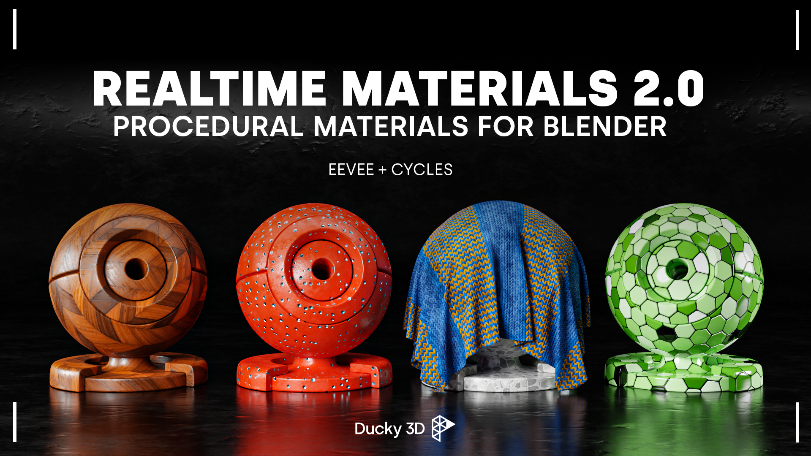{: style="width:200px"}](https://blendermarket.com/products/realtime-materials-for-blender?ref=1462 "The Realtime Materials Addon is a Library of over 300 procedural materials.") | [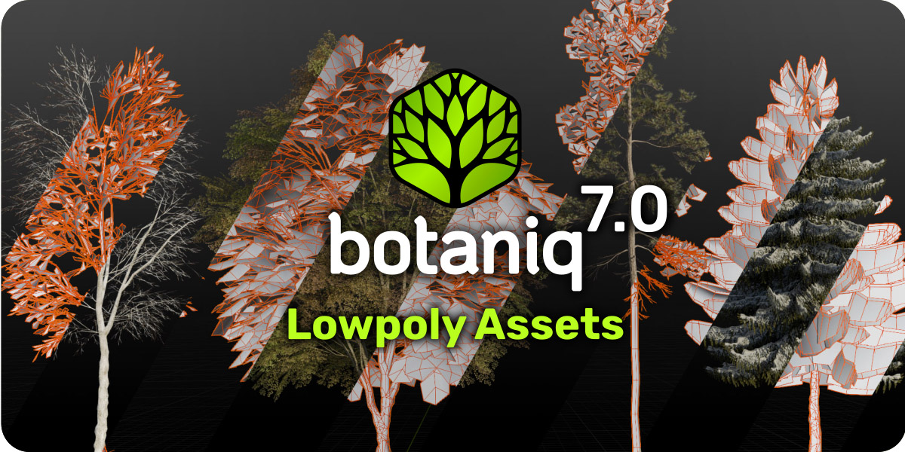{: style="width:200px"}](https://blendermarket.com/products/botaniq-trees?ref=1462 "Tree library botaniq is an ever-expanding library of optimized & realistic 3D vegetation - mostly trees and grass.") | [{: style="width:200px"}](https://blendermarket.com/products/car-library-traffiq-vehicles-for-blender?ref=1462 "Car Library - Rigged Cars, Contemporary Cars, Old Cars.")  |
|  [Materialiq](https://blendermarket.com/products/materialiq?ref=1462 "370+ adjustable materials. 12 categories.") | [Aquatiq](https://blendermarket.com/products/aquatiq-water-library?ref=1462 "Add water effects to your scene super quickly with Aquatiq.") | [Cloudscapes](https://blendermarket.com/products/cloudscapes?ref=1462 "CloudScapes is a photorealistic 3D volumetric clouds library for Blender in VDB format. It includes 18 categories of clouds and more than 390 different clouds according to the real clouds with explosion and more.")  |
|  [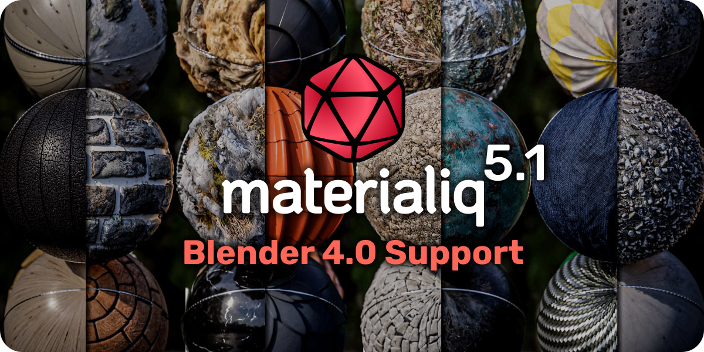{: style="width:200px"}](https://blendermarket.com/products/materialiq?ref=1462 "370+ adjustable materials. 12 categories.") | [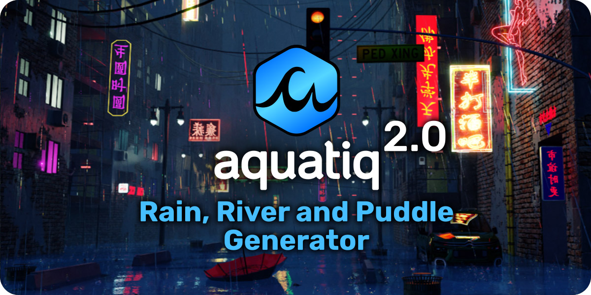{: style="width:200px"}](https://blendermarket.com/products/aquatiq-water-library?ref=1462 "Add water effects to your scene super quickly with Aquatiq.") | [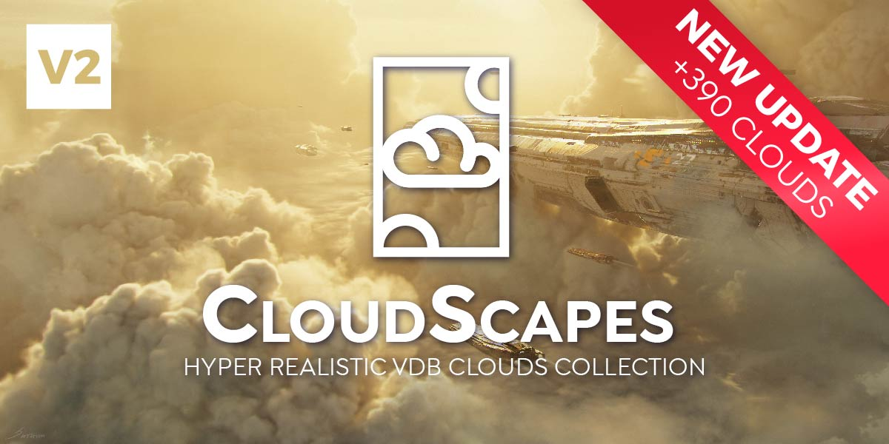{: style="width:200px"}](https://blendermarket.com/products/cloudscapes?ref=1462 "CloudScapes is a photorealistic 3D volumetric clouds library for Blender in VDB format. It includes 18 categories of clouds and more than 390 different clouds according to the real clouds with explosion and more.")  |
|  [Grassblade](https://blendermarket.com/products/grassblade?ref=1462 "It's a complete and easy-to-use solution for designers, Archviz and CG Artists who need to create photoreal lawns, grasslands, fields or meadows with ease.") | [Tree Vegetation](https://blendermarket.com/products/vegetation-tree-addon-animation?ref=1462 "Tree Vegetation is an addon for Blender, compatible with Eevee and Cycles. It contains a big library of diverse and varied plants, trees, shrubs, tropical plants, tree hedges, ornamental plants, garden plants, rock.") | [Car Transportation](https://blendermarket.com/products/transportation?ref=1462 "Transportation is a complete Blender add-on that does not only help manage a huge library of HD vehicles and cars rigged on Blender. but also, shaders, hdri and backplates.")  |
|  [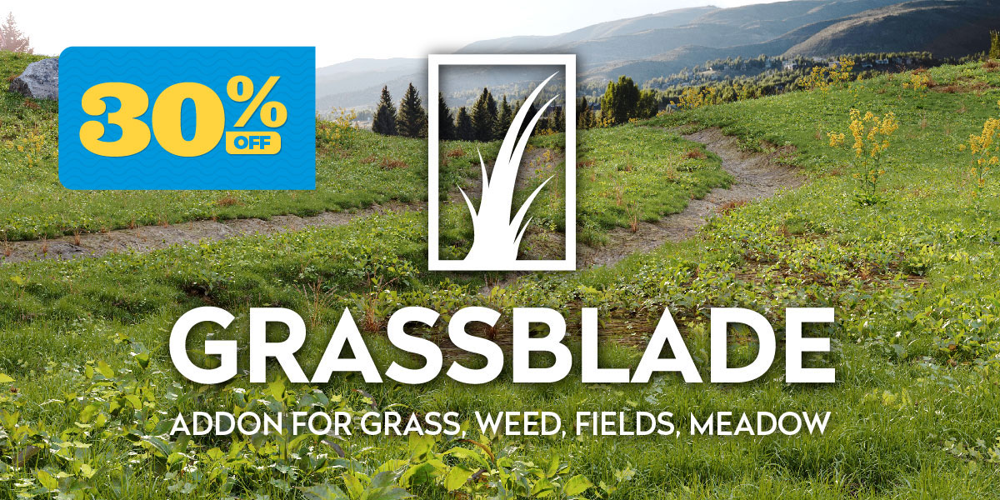{: style="width:200px"}](https://blendermarket.com/products/grassblade?ref=1462 "It's a complete and easy-to-use solution for designers, Archviz and CG Artists who need to create photoreal lawns, grasslands, fields or meadows with ease.") | [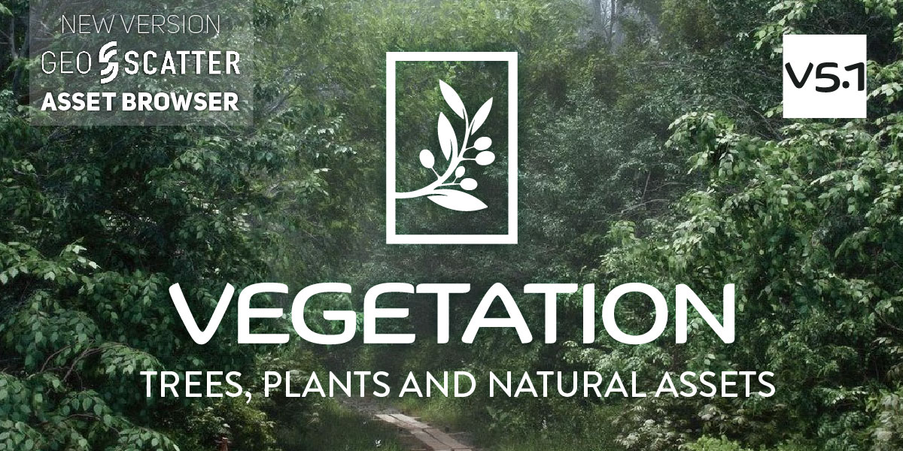{: style="width:200px"}](https://blendermarket.com/products/vegetation-tree-addon-animation?ref=1462 "Tree Vegetation is an addon for Blender, compatible with Eevee and Cycles. It contains a big library of diverse and varied plants, trees, shrubs, tropical plants, tree hedges, ornamental plants, garden plants, rock.") | [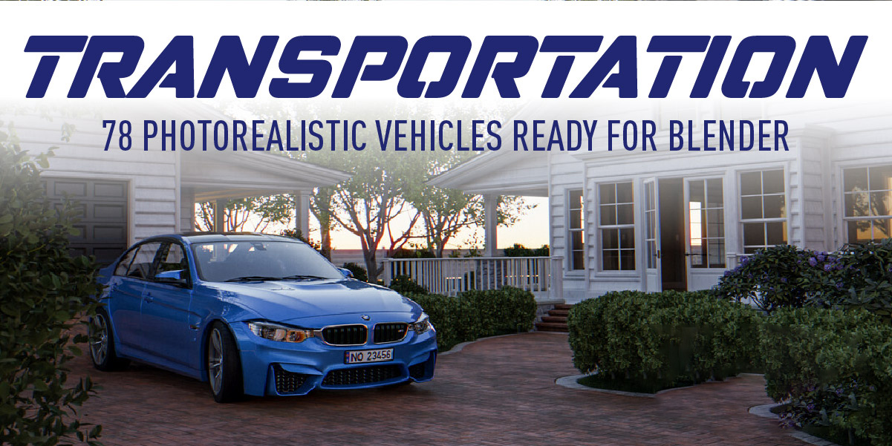{: style="width:200px"}](https://blendermarket.com/products/transportation?ref=1462 "Transportation is a complete Blender add-on that does not only help manage a huge library of HD vehicles and cars rigged on Blender. but also, shaders, hdri and backplates.")  |
|  [Forestation](https://blendermarket.com/products/forestation?ref=1462 "Forestation addon for Blender is a production tool for designers, CGartist, archviz artists and many others. A large selection of 3D scanned trees is available.") | [Gardener](https://blendermarket.com/products/gardener?ref=1462 "Gardener is the new essential tool to create photorealistic bushes, hedges, and shrubs in 1 click!") | [Population](https://blendermarket.com/products/population?ref=1462 "Population is a Human crowd simulator for Blender. Populate your scenes in just a few clicks!")  |
|  [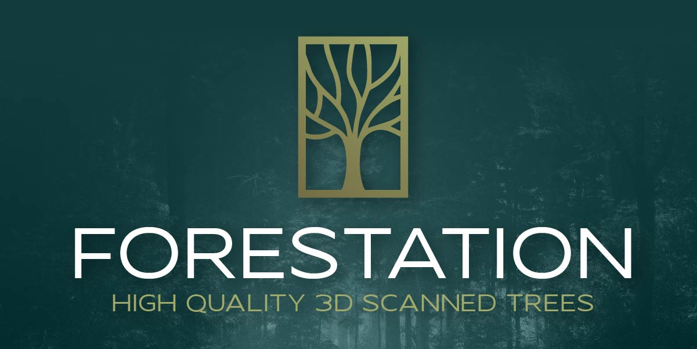{: style="width:200px"}](https://blendermarket.com/products/forestation?ref=1462 "Forestation addon for Blender is a production tool for designers, CGartist, archviz artists and many others. A large selection of 3D scanned trees is available.") | [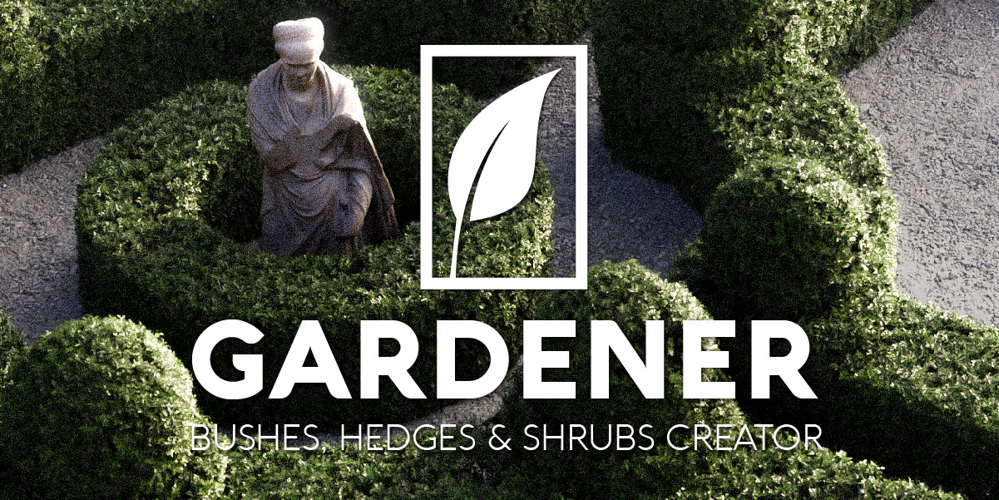{: style="width:200px"}](https://blendermarket.com/products/gardener?ref=1462 "Gardener is the new essential tool to create photorealistic bushes, hedges, and shrubs in 1 click!") | [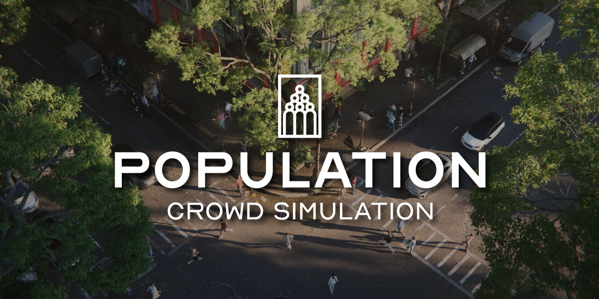{: style="width:200px"}](https://blendermarket.com/products/population?ref=1462 "Population is a Human crowd simulator for Blender. Populate your scenes in just a few clicks!")  |
|  [Mountain Scapes](https://blendermarket.com/products/mountainscapes?ref=1462 "Mountain Scapes contains 152 ready-to-use 3D assets. 44 HD models and 108 classic models. They are divided into different categories to suit all uses: snow-covered mountains, rocks, cliffs, green and tropical mountains.") | [City Scapes](https://blendermarket.com/products/city-scapes?ref=1462 "City Scapes is a library of 96 ready-to-use assets. Click/drag into Blender using the Asset Browser. Quickly create a realistic background with these 3D photoscanned assets.") | |
|  [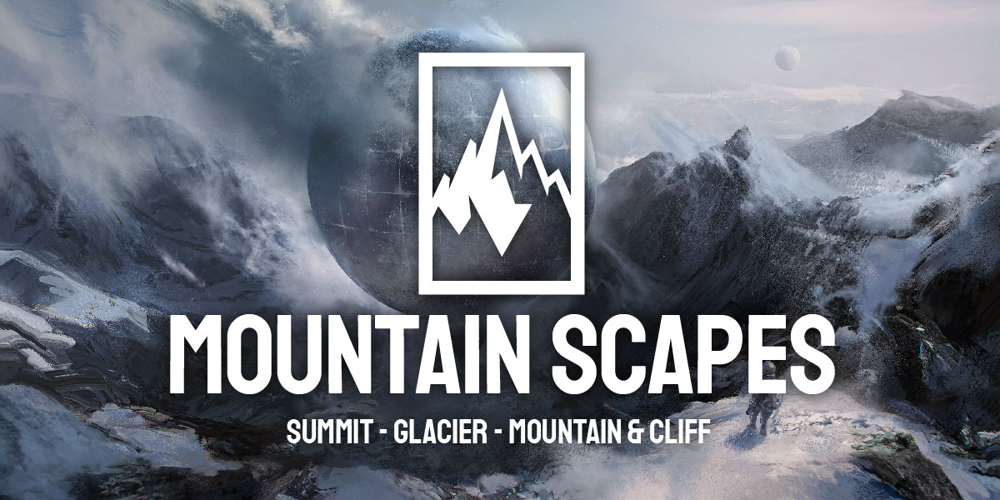{: style="width:200px"}](https://blendermarket.com/products/mountainscapes?ref=1462 "Mountain Scapes contains 152 ready-to-use 3D assets. 44 HD models and 108 classic models. They are divided into different categories to suit all uses: snow-covered mountains, rocks, cliffs, green and tropical mountains.") | [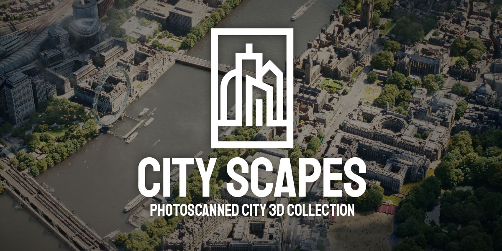{: style="width:200px"}](https://blendermarket.com/products/city-scapes?ref=1462 "City Scapes is a library of 96 ready-to-use assets. Click/drag into Blender using the Asset Browser. Quickly create a realistic background with these 3D photoscanned assets.") | |
