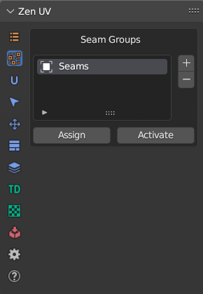
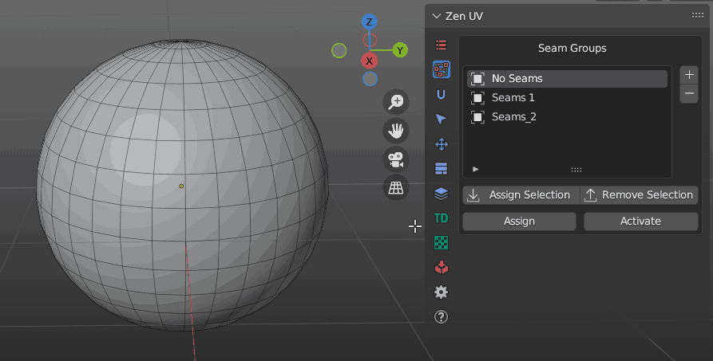
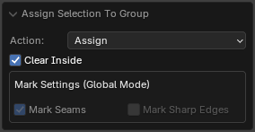
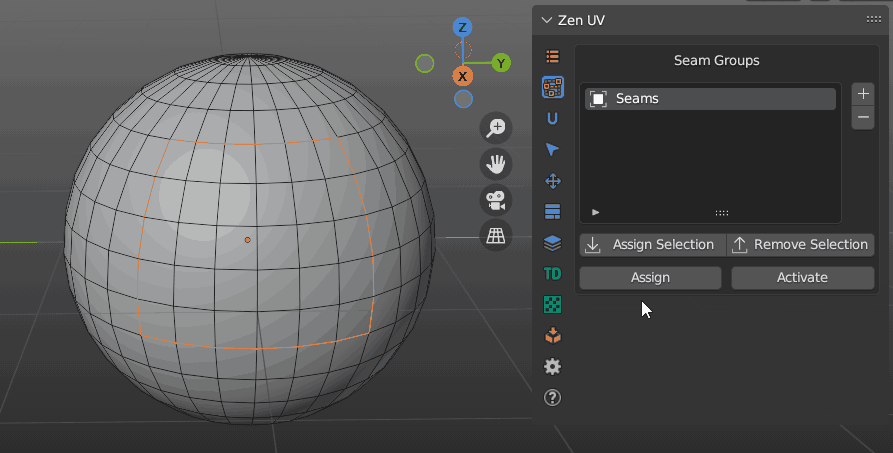
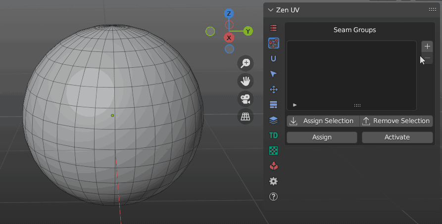

# Seam Groups

Seam Group operators allow to operate on more than one Seam Group

!!! Panel
    

!!! tip
    Switching between Seam Groups in the list won't automatically set Seams from active Seam Group. 
    To set Seams from active Seam Group click **Activate**.

---

### Assign

Assign Seams to selected Seam Group

!!! Properties
    This operator has no properties

||
|---|
|Assign seams to selected seam group|

---

### Activate

!!! Properties
    This operator has no properties

Set Seams from selected Seam Group to selected mesh

---

### Assign Selection

Mark Selection with Seams and Assign to active Seam Group

### Remove Selection
Remove Selection from active Seam Group

!!! Properties
    

- **Action** - Action to be performed
    - *Assign* - Assign a selection to the active group
    - *Remove* - Remove a selection from an active group
- **Clear Inside** - Clear marking inside of selected faces
- **Mark Seams** - Automatically assign Seams
- **Mark Sharp Edges** - Automatically assign Sharp edges

||
|---|
|Assign selection to group|

---

### Add group

 Add a new Seam Group to the list

### Delete group

 Delete the selected Seam Group from the list

||
|---|
|Add / Delete group|