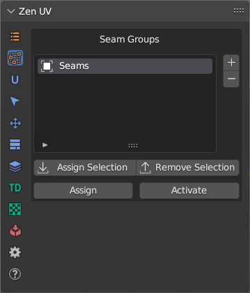

# Seam Groups

Seam Group operators allow to operate on more than one Seam Group.

!!! Panel
    

!!! tip
    Switching between Seam Groups in the list won't automatically set Seams from active Seam Group. 
    To set Seams from active Seam Group click **Activate**. 

### Assign
Assign Seams to selected Seam Group.

### Activate
Set Seams from selected Seam Group to selected mesh.

### Assign Selection
Mark Selection with Seams and Assign to active Seam Group.

### Remove Selection
Remove Selection from active Seam Group.

### Add 
Add a new Seam Group to the list.

### Delete 
Delete the selected Seam Group from the list.