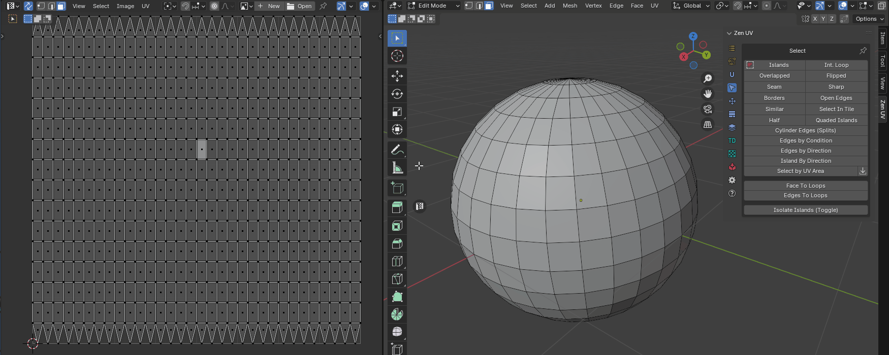
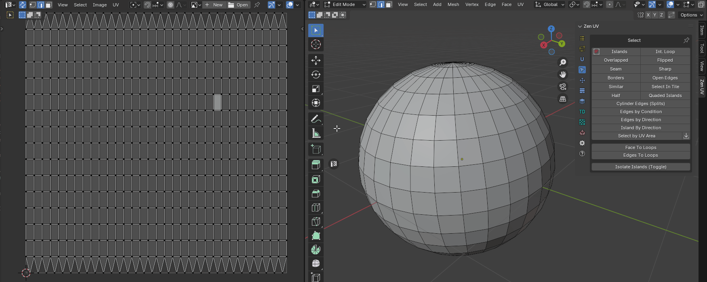
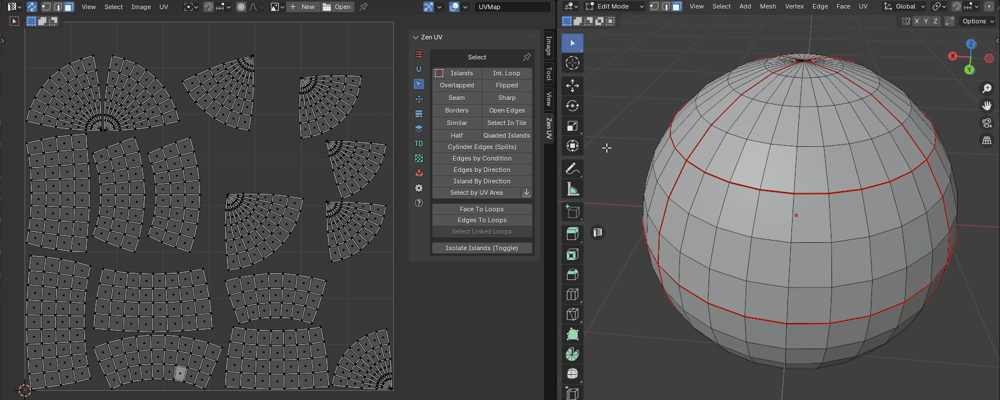

# Select

!!! Panel
    | 3D Viewport | UV Editor| 
    |---|---|  
    |  || 

<table>
<thead>
<tr>
<th colspan="4" style="text-align: center;">Table of contents</th>
</tr>
</thead>
<tbody>
<tr>
<td style="text-align: center;"><a href="#select-islands">Islands</a></td>
<td style="text-align: center;"><a href="#select-int-loop">Int. Loop</a></td>
<td style="text-align: center;"><a href="#select-cylinder-edges-splits">Cylinder Edges (Splits)</a></td>
<td style="text-align: center;"><a href="#convert-edges-to-loops">Edges To Loops</a></td>
</tr>
<tr>
<td style="text-align: center;"><a href="#select-overlapped">Overlapped</a></td>
<td style="text-align: center;"><a href="#select-flipped">Flipped</a></td>
<td style="text-align: center;"><a href="#select-edges-by-condition">Edges by Condition</a></td>
<td style="text-align: center;"><a href="#convert-loops-to-face">Loop to Face</a></td>
</tr>
<tr>
<td style="text-align: center;"><a href="#select-seam">Seam</a></td>
<td style="text-align: center;"><a href="#select-sharp">Sharp</a></td>
<td style="text-align: center;"><a href="#select-edges-by-direction">Edges by Direction</a></td>
<td style="text-align: center;"><a href="#convert-loop-to-edge">Loop to Edge</a></td>
</tr>
<tr>
<td style="text-align: center;"><a href="#select-uv-borders">Borders</a></td>
<td style="text-align: center;"><a href="#select-open-edges">Open Edges</a></td>
<td style="text-align: center;"><a href="#select-islands-by-direction">Island by Direction</a></td>
<td style="text-align: center;"><a href="#select-linked-loops">Select Linked Loops</a></td>
</tr>
<tr>
<td style="text-align: center;"><a href="#select-similar">Similar</a></td>
<td style="text-align: center;"><a href="#select-in-tile">Select in Tile</a></td>
<td style="text-align: center;"><a href="#select-by-uv-area">Select by UV Area</a></td>
<td style="text-align: center;"><a href="#isolate-islands-toggle">Isolate Islands (Toggle)</a></td>
</tr>
<tr>
<td style="text-align: center;"><a href="#select-half">Half</a></td>
<td style="text-align: center;"><a href="#select-quaded-islands">Quaded Islands</a></td>
<td style="text-align: center;"><a href="#convert-face-to-loops">Face To Loops</a></td>
<td style="text-align: center;"></td>
</tr>
</tbody>
</table>

---
### Select Islands
Select Islands by selected edge/face of the Islands. 

|  |
| --- |
| Select islands |

---
### Select Int. Loop
Inter seam loop. Select Edge Loop with respect to Seams. 

|  |
| --- |
| Select inter seam loop |

---
### Select Overlapped
Select Overlapped Islands.

|  |
| --- |
| Select overlapped |

---
### Select Flipped
Select Flipped Islands.

|  |
| --- |
| Select flipped |

---
### Select Seam
Select Edges Marked as Seams.

|  |
| --- |
| Select Seam |

!!! Preferences
      

 - **Clear Selection** - Clear initial selection
 - **Mode** - Selection type
    - *Select* - Select edges
    - *Deselect* - Deselect edges

---
### Select Sharp
Select Edges Marked as Sharp.

|  |
| --- |
| Select sharp |

!!! Preferences
      

 - **Clear Selection** - Clear initial selection
 - **Mode** - Selection type
    - *Select* - Select edges
    - *Deselect* - Deselect edges

---
### Select UV Borders
Select existing UV Borders.

|  |
| --- |
| Select UV Borders |

!!! Preferences
      

- **Clear Selection** - Clear initial selection
- **Mode** - Selection type
    - *All borders* - All UV border edges
    - *By Island* - By selected island
    - *By Faces* - By selected faces

---
### Select Open Edges
Select open edges the way that looks in the 3D viewport. Including the open edges that appeared after the faces were hidden.

|  |
| --- |
| Select open edges |

!!! Preferences
      

 - **Clear Selection** - Clear initial selection
 - **Mode** - Selection type
    - *Select* - Select edges
    - *Deselect* - Deselect edges

---
### Select Similar
Select Islands similar to those selected.

|  |
| --- |
| Select similar |

!!! Preferences
      

- **Area Matching** - Set strict requirements to Islands Area Matching when Stacking. Disable this option if the Islands have a slightly different Area
- **Select Primary** - Select Primary Island
- **Select Similar** - Select Similar Islands

---
### Select in Tile
Select Islands in bounding box of active UDIM Tile or UV Area.

|  |
| --- |
| Select in tile |

!!! Preferences
      

- **Clear Selection** - Clear initial selection
- **Base** - What to select relative to:
    - *UV Area* - UV Area square
    - *UDIM tile number* - UDIM tile number
    - *Active UDIM* - Active UDIM tile
    - *Any UDIM* - Any UDIM tile
- **Location**
    - *Inside* - Inside of UV Area
    - *Outside* - Outside of UV Area
    - *Cross* - Crossing of UV Area borders
- **Tile Number** - Number of UDIM tile

---
### Select Half
Select part of the model according to its location relative to the coordinate axis.

|  |
| --- |
| Select half |

|  |
| --- |
| Select half. Include Zero option|

!!! Preferences
      

- **Clear Selection** - Clear initial selection
- **Axis Direction** - Axis direction
    - *"+"* - Positive
    - *"-"* - Negative
- **Mesh Axis** - The axis along which the selection is made
    - *X* - X Axis
    - *Y* - Y Axis
    - *Z* - Z Axis
- **Include Zero** - Including zero coordinates

---
### Select Quaded Islands
Select islands that consist only of quads.

|  |
| --- |
| Select quaded islands |

!!! Preferences
      

 - **Clear Selection** - Clear initial selection
 - **Mode** - Selection type
    - *Select* - Select edges
    - *Deselect* - Deselect edges

### Select Cylinder Edges (Splits)
Select island edges that belong to the same mesh edge and split the island by itself.

|  |
| --- |
| Select splits |

!!! Preferences
      

 - **Clear Selection** - Clear initial selection
 - **Mode** - Selection type
    - *Select* - Select edges
    - *Deselect* - Deselect edges

### Select Edges by Condition
Select edges based on various conditions and logic operations with NOT support.

|  |
| --- |
| Select edges by condition |

!!! Preferences
      

- **Clear Selection** - Clear initial selection
- **Edge Is** - Select first condition
    - *Sharp* - Select edges that are markerd sharp
    - *Seam* - Select edges that are markerd seam
    - *Splits* - Selects edges that belong to the same mesh edge and split the island by itself
    - *Borders* - Select edges that are UV borders
    - *Open* - Select edges that are open. Including those adjacent to hidden faces
- **Second Condition** - Apply second condition (Entering this parameter is optional)
- **Boolean Operation** - boolean logic operator
    - *And*
    - *Or*
    - *Xor*
    - *Nor*
- **Apply Not** - Append logical "Not"
- **Edge Is** - Select second condition
    - *Sharp* - Select edges that are markerd sharp
    - *Seam* - Select edges that are markerd seam
    - *Splits* - Selects edges that belong to the same mesh edge and split the island by itself
    - *Borders* - Select edges that are UV borders
    - *Open* - Select edges that are open. Including those adjacent to hidden faces

---
### Select Edges By Direction
Select edges by direction along U or V axis.

|  |
| --- |
| Select edges by direction |

---
### Select Islands By Direction
Select island by direction.

|  |
| --- |
| Select island by direction |

!!! Properties
    

- **Clear Selection** - Clear initial selection
- **Type** - What type of islands will be selected
    - *Horizontal* - Horizontally oriented islands
    - *Vertical* - Vertically oriented islands
    - *Radial* - Islands that are shaped like a circle
    - *Not Aligned* - Islands that are not aligned with the axes

---
### Select by UV Area
Select faces by their UV area.
The operator consists of two buttons. Where the first is the main operator and the second is an auxiliary operator. You can use it to get the area of the selection.

!!! Panel
    

!!! Preferences
    

  - **Mode** - What should be selected? Islands or faces.
    - *Island* - Island selection mode
    - *Faces* - Faces selection mode
  - **Clear selection** - Clear the previous selection.
  - **Condition** - The conditions under which the selection will be made.
    - *Zero Area* - Elements with zero area value.
    - *Within range* - Elements, the area of which is within a specified range.
    - *More than* - Elements with an area greater than the specified value.
    - *Equal to* - Elements, the area of which is equal to a specified value.
    - *Less than* - Elements with an area smaller than the specified value.
  - **With Threshold** - Calculation threshold.

---
#### Get Selected Area:
After you run this operator, the Multiplied Area value goes into the Select by UV Area operator.

!!! Prperties
    

  - **Mode** - The area of what should be obtained? Islands or faces.
    - *Island* - Island selection mode
    - *Faces* - Faces selection mode
  - **Average** - Averaging.
  - **Real Area** - The area within the UV Editor is very small. This value shows the real area.
  - **Real UV Area** - Same value as Real Area, but in full size.
  - **Multiplied Area** - The same value as the Real Area, but multiplied for easier use.

---
### Convert Face to Loops
Convert selected mesh faces to UV loops.

|  |
| --- |
| Select Face to Loops |

---
### Convert Edges to Loops
Convert selected mesh edges to UV loops.

|  |
| --- |
| Select Edges to Loops |

---
### Convert Loops to Face
Only for UV Sync Selection - off. Convert selected UV loops to mesh face selection.

|  |
| --- |
| Convert Loops to Face |

---
### Convert Loop to Edge
Only for UV Sync Selection - off. Convert selected UV loop to mesh edge selection.

|  |
| --- |
| Convert Loop to Edge |

---
### Select Linked Loops
Only for UV Sync Selection - off. Selects all loops belonging to the mesh vertex based on any already selected loop.

|  |
| --- |
| Select Linked Loops |

### Isolate Islands (Toggle)
Isolate Islands (Toggle).

|  |
| --- |
| Isolate islands |

---
