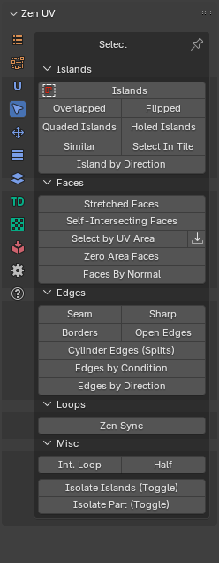
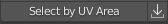

# Select

!!! Panel
    | 3D Viewport | UV Editor| 
    |---|---|  
    |  || 

!!! Tip 
    Select **Seam** and **Sharp** are absent on the panel in **UV Editor**.
    To use these operators you need to switch to **3D Viewport** context. 

---
### Islands 
Select Islands by selected edge/face of the Islands.

### Int. Loop
Inter seam loop. Select Edge Loop with respect to Seams. 

### Overlapped
Select Overlapped Islands.

### Flipped
Select Flipped Islands.

### Seam
Select Edges Marked as Seams.

### Sharp
Select Edges Marked as Sharp.

### Select UV Borders
Select existing UV Borders.

### Similar
Select Islands similar to those selected.

### Select in Tile
Select Islands in bounding box of active UDIM Tile or UV Area.

 

### Select Half
Select part of the model according to its location relative to the coordinate axis.

### Select Edges By Direction
Select edges by direction along U or V axis.

### Select by UV Area
The operator consists of two buttons. Where the first is the main operator and the second is an auxiliary operator. You can use it to get the area of the selection.

---
#### Operator Select by UV Area:

  - **Mode** - What should be selected? Islands or faces.
  - **Clear selection** - Clear the previous selection.
  - **Condition** - The conditions under which the selection will be made.
    - **Zero Area** - Elements with zero area value.
    - **Within range** - Elements, the area of which is within a specified range.
    - **More than** - Elements with an area greater than the specified value.
    - **Equal to** - Elements, the area of which is equal to a specified value.
    - **Less than** - Elements with an area smaller than the specified value.
  - **With Threshold** - Calculation threshold.

#### Operator Get Selected Area:
After you run this operator, the Multiplied Area value goes into the Select by UV Area operator.

  - **Mode** - The area of what should be obtained? Islands or faces.
  - **Average** - Averaging.
  - **Real Area** - The area within the UV Editor is very small. This value shows the real area.
  - **Real UV Area** - Same value as Real Area, but in full size.
  - **Multiplied Area** - The same value as the Real Area, but multiplied for easier use.

### Isolate Islands (Toggle)
Isolate Islands (Toggle).

