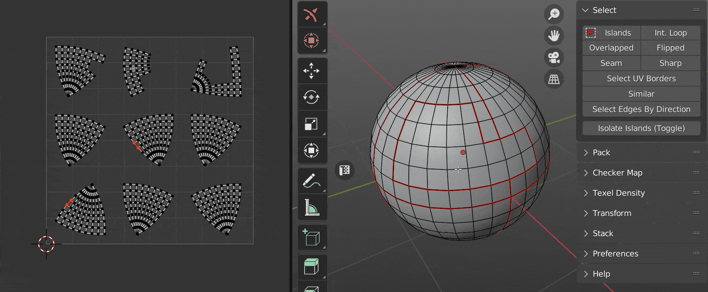
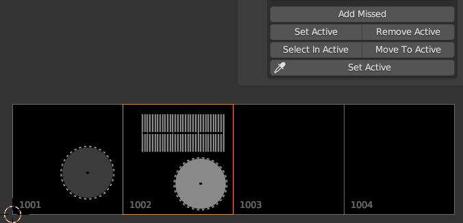
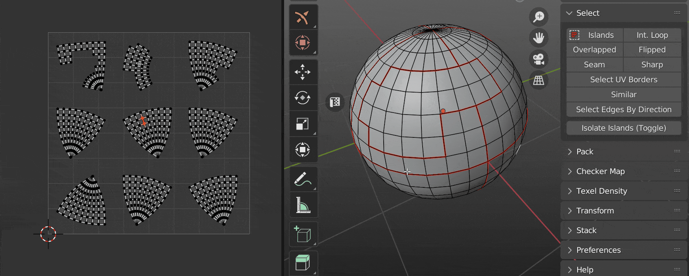
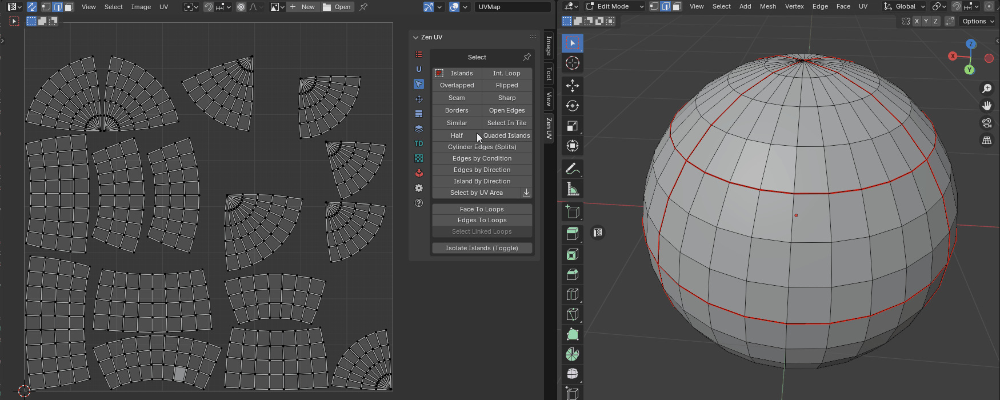

# Select

!!! Panel
    | 3D Viewport | UV Editor| 
    |---|---|  
    |  || 

<table>
<thead>
<tr>
<th colspan="4" style="text-align: center;">Table of contents</th>
</tr>
</thead>
<tbody>
<tr>
<td style="text-align: center;"><a href="#select-islands">Islands</a></td>
<td style="text-align: center;"><a href="#select-int-loop">Int. Loop</a></td>
<td style="text-align: center;"><a href="#select-cylinder-edges-splits">Cylinder Edges (Splits)</a></td>
<td style="text-align: center;"><a href="#convert-edges-to-loops">Edges To Loops</a></td>
</tr>
<tr>
<td style="text-align: center;"><a href="#select-overlapped">Overlapped</a></td>
<td style="text-align: center;"><a href="#select-flipped">Flipped</a></td>
<td style="text-align: center;"><a href="#select-edges-by-condition">Edges by Condition</a></td>
<td style="text-align: center;"><a href="#convert-loops-to-face">Loop to Face</a></td>
</tr>
<tr>
<td style="text-align: center;"><a href="#select-seam">Seam</a></td>
<td style="text-align: center;"><a href="#select-sharp">Sharp</a></td>
<td style="text-align: center;"><a href="#select-edges-by-direction">Edges by Direction</a></td>
<td style="text-align: center;"><a href="#convert-loop-to-edge">Loop to Edge</a></td>
</tr>
<tr>
<td style="text-align: center;"><a href="#select-uv-borders">Borders</a></td>
<td style="text-align: center;"><a href="#select-open-edges">Open Edges</a></td>
<td style="text-align: center;"><a href="#select-islands-by-direction">Island by Direction</a></td>
<td style="text-align: center;"><a href="#select-linked-loops">Select Linked Loops</a></td>
</tr>
<tr>
<td style="text-align: center;"><a href="#select-similar">Similar</a></td>
<td style="text-align: center;"><a href="#select-in-tile">Select in Tile</a></td>
<td style="text-align: center;"><a href="#select-by-uv-area">Select by UV Area</a></td>
<td style="text-align: center;"><a href="#isolate-islands-toggle">Isolate Islands (Toggle)</a></td>
</tr>
<tr>
<td style="text-align: center;"><a href="#select-half">Half</a></td>
<td style="text-align: center;"><a href="#select-quaded-islands">Quaded Islands</a></td>
<td style="text-align: center;"><a href="#convert-face-to-loops">Face To Loops</a></td>
<td style="text-align: center;"></td>
</tr>
</tbody>
</table>

---
### Select Islands
Select Islands by selected edge/face of the Islands. 

|  |
| --- |
| Select islands |

---
### Select Int. Loop
Inter seam loop. Select Edge Loop with respect to Seams. 

|  |
| --- |
| Select inter seam loop |

---
### Select Overlapped
Select Overlapped Islands.

|  |
| --- |
| Select overlapped |

---
### Select Flipped
Select Flipped Islands.

|  |
| --- |
| Select flipped |

---
### Select Seam
Select Edges Marked as Seams.

|  |
| --- |
| Select Seam |

---
### Select Sharp
Select Edges Marked as Sharp.

|  |
| --- |
| Select sharp |

---
### Select UV Borders
Select existing UV Borders.

|  |
| --- |
| Select UV Borders |

---
### Select Open Edges
Select open edges the way that looks in the 3D viewport. Including the open edges that appeared after the faces were hidden.

|  |
| --- |
| Select open edges |

---
### Select Similar
Select Islands similar to those selected.

|  |
| --- |
| Select similar |

---
### Select in Tile
Select Islands in bounding box of active UDIM Tile or UV Area.

|  |
| --- |
| Select in tile |

---
### Select Half
Select part of the model according to its location relative to the coordinate axis.

|  |
| --- |
| Select half |

|  |
| --- |
| Select half. Include Zero option|

---
### Select Quaded Islands
Select islands that consist only of quads.

|  |
| --- |
| Select quaded islands |

### Select Cylinder Edges (Splits)
Select island edges that belong to the same mesh edge and split the island by itself.

|  |
| --- |
| Select splits |

### Select Edges by Condition
Select edges based on various conditions and logic operations with NOT support.

|  |
| --- |
| Select edges by condition |

---
### Select Edges By Direction
Select edges by direction along U or V axis.

|  |
| --- |
| Select edges by direction |

---
### Select Islands By Direction
Select island by direction.

|  |
| --- |
| Select island by direction |

### Select by UV Area
The operator consists of two buttons. Where the first is the main operator and the second is an auxiliary operator. You can use it to get the area of the selection.

|  |
| --- |
| Select by UV area |

---
#### Select by UV Area:
Select faces by their UV area.

|  |
| --- |
| Operator settings |

  - **Mode** - What should be selected? Islands or faces.
  - **Clear selection** - Clear the previous selection.
  - **Condition** - The conditions under which the selection will be made.
    - **Zero Area** - Elements with zero area value.
    - **Within range** - Elements, the area of which is within a specified range.
    - **More than** - Elements with an area greater than the specified value.
    - **Equal to** - Elements, the area of which is equal to a specified value.
    - **Less than** - Elements with an area smaller than the specified value.
  - **With Threshold** - Calculation threshold.

---
#### Get Selected Area:
After you run this operator, the Multiplied Area value goes into the Select by UV Area operator.

|  |
| --- |
| Operator settings |

  - **Mode** - The area of what should be obtained? Islands or faces.
  - **Average** - Averaging.
  - **Real Area** - The area within the UV Editor is very small. This value shows the real area.
  - **Real UV Area** - Same value as Real Area, but in full size.
  - **Multiplied Area** - The same value as the Real Area, but multiplied for easier use.

---
### Convert Face to Loops
Convert selected mesh faces to UV loops.

|  |
| --- |
| Select Face to Loops |

---
### Convert Edges to Loops
Convert selected mesh edges to UV loops.

|  |
| --- |
| Select Edges to Loops |

---
### Convert Loops to Face
Only for UV Sync Selection - off. Convert selected UV loops to mesh face selection.

|  |
| --- |
| Convert Loops to Face |

---
### Convert Loop to Edge
Only for UV Sync Selection - off. Convert selected UV loop to mesh edge selection.

|  |
| --- |
| Convert Loop to Edge |

---
### Select Linked Loops
Only for UV Sync Selection - off. Selects all loops belonging to the mesh vertex based on any already selected loop.

|  |
| --- |
| Select Linked Loops |

### Isolate Islands (Toggle)
Isolate Islands (Toggle).

|  |
| --- |
| Isolate islands |

---
