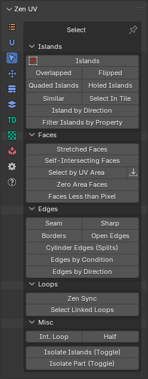
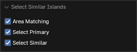
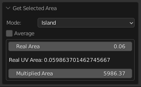
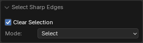
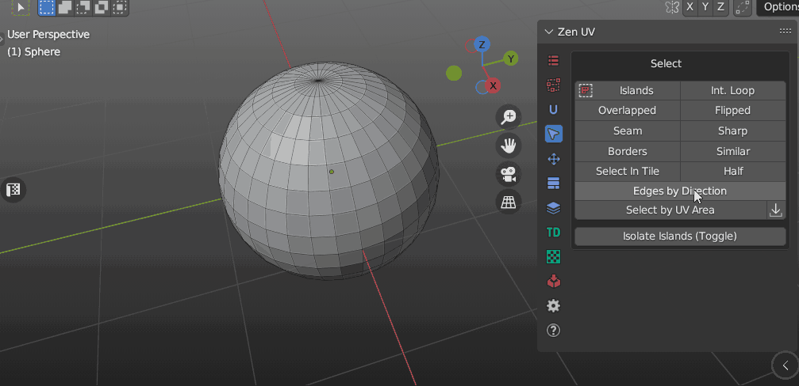
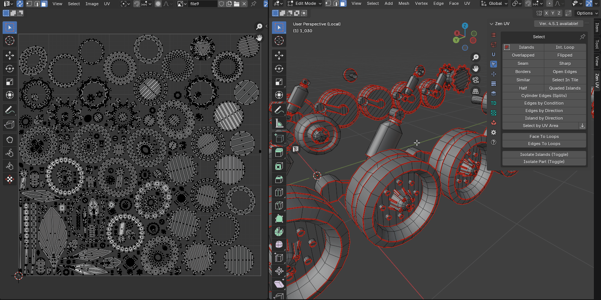

# Select

!!! Panel
    | 3D Viewport | UV Editor| 
    |---|---|  
    |  || 

---
## Table of contents

- [<u>**Islands**</u>](#islands)
    - [Select Islands](#select-islands)
    - [Select Overlapped](#select-overlapped)
    - [Select Flipped](#select-flipped)
    - [Select Quaded Islands](#select-quaded-islands)
    - [Select Holed Islands](#select-holed-islands)
    - [Select Similar](#select-similar)
    - [Select in Tile](#select-in-tile)
    - [Select Islands By Direction](#select-islands-by-direction)
    - [Filter Islands by Property](#filter-islands-by-property)

- [<u>**Faces**</u>](#faces)
    - [Select Stretched Faces](#select-stretched-faces)
    - [Select Self-Intersecting Faces](#select-self-intersecting-faces)
    - [Select by UV Area](#select-by-uv-area)
    - [Get Selected Area](#get-selected-area)
    - [Select Zero Area Faces](#select-zero-area-faces)
    - [Select Faces Less than Pixel](#select-faces-less-than-pixel)
    - [Select Faces By Normal](#select-faces-by-normal)

- [<u>**Edges**</u>](#edges)
    - [Select Seam](#select-seam)
    - [Select Sharp](#select-sharp)
    - [Select UV Borders](#select-uv-borders)
    - [Select Open Edges](#select-open-edges)
    - [Select Cylinder Edges (Splits)](#select-cylinder-edges-splits)
    - [Select Edges by Condition](#select-edges-by-condition)
    - [Select Edges By Direction](#select-edges-by-direction)

- [<u>**Loops**</u>](#loops)
    - [Zen Sync](#zen-sync)
    - [Select Linked Loops](#select-linked-loops)

- [<u>**Misc**</u>](#misc)
    - [Select Int. Loop](#select-int-loop)
    - [Select Half](#select-half)
    - [Isolate Islands (Toggle)](#isolate-islands-toggle)
    - [Isolate Part (Toggle)](#isolate-part-toggle)

---

## Islands

### Select Islands
Select Islands by selected edge/face of the Islands. 

|  |
| --- |
| Select islands |

---
### Select Overlapped
Select Overlapped Islands.

|  |
| --- |
| Select overlapped |

---
### Select Flipped
Select Flipped Islands.

|  |
| --- |
| Select flipped |

---
### Select Quaded Islands
Select islands that consist only of quads.

|  |
| --- |
| Select quaded islands |

!!! Properties
      

 - **Clear Selection** - Clear initial selection
 - **Mode** - Selection type
    - *Select* - Select edges
    - *Deselect* - Deselect edges

---
### Select Holed Islands
Selects islands that have holes within their geometry.

|  |
| --- |
| Select holed islands |

!!! Properties
      

- **Clear Selection** - Clear initial selection

!!! Tip
    In most cases, this operator is convenient for identifying islands that can be processed with the Quadrify operator.

---
### Select Similar
Select Islands similar to those selected.

|  |
| --- |
| Select similar |

!!! Properties
      

- **Area Matching** - Set strict requirements to Islands Area Matching when Stacking. Disable this option if the Islands have a slightly different Area
- **Select Primary** - Select Primary Island
- **Select Similar** - Select Similar Islands

---
### Select in Tile
Select Islands in bounding box of active UDIM Tile or UV Area.

|  |
| --- |
| Select in tile |

!!! Properties
      

- **Clear Selection** - Clear initial selection
- **Base** - What to select relative to:
    - *UV Area* - UV Area square
    - *UDIM tile number* - UDIM tile number
    - *Active UDIM* - Active UDIM tile
    - *Any UDIM* - Any UDIM tile
- **Location**
    - *Inside* - Inside of UV Area
    - *Outside* - Outside of UV Area
    - *Cross* - Crossing of UV Area borders
    - *Check Margin* - Select islands where the margin between islands within the defined area and the area itself are less than the specified value.
- **Tile Number** - Number of UDIM tile

---
### Select Islands By Direction
Select island by direction.

|  |
| --- |
| Select island by direction |

!!! Properties
    

- **Clear Selection** - Clear initial selection
- **Type** - What type of islands will be selected
    - *Horizontal* - Horizontally oriented islands
    - *Vertical* - Vertically oriented islands
    - *Radial* - Islands that are shaped like a circle
    - *Not Aligned* - Islands that are not aligned with the axes

---
### Filter Islands by Property
Filters islands based on specific properties.

|  |
| --- |
| Filter Islands by Property |

!!! Properties
    

    - **Group Method** - Method of defining groups.
        - *Even Split* - Uniform division.
        - *Split by Gaps* - Automatic splitting by gaps.
        - *Auto Split by Gaps* - Automatically determines the number of groups.
    - **Property** - The property by which islands will be grouped.
        - *Island Height* - Grouping based on island height.
        - *Island Width* - Grouping based on island width.
        - *Island Aspect Ratio* - Grouping based on island aspect ratio.
    - **Number of Groups** - Defines how many groups the islands will be divided into.
    - **Group Index** - Specifies which group’s islands should be selected.
    - **Threshold** - Threshold for detecting large gaps (used in **Auto Split by Gaps** mode).

!!! Tip
    This operator is useful when you need to divide a large number of islands into a limited number of zones (e.g., trims).

---

## Faces

### Select Stretched Faces

Selects faces with stretched UV coordinates

Checks each polygon angle and compares it with the corresponding angle in UV space.  
If the angle exceeds the specified threshold, the polygon will be selected.

!!! Tip  
    This operator works using the **Overlay → UV Stretch → Angle** algorithm.  
    This means you can easily select what you see or what you might have missed.  
    

!!! Properties
    

- **Influence** - Defines the selection target.
    - *Face* - Selects individual stretched faces.
    - *Island* - Selects entire islands containing stretched faces.
- **Clear Selection** - Clears the initial selection before applying the operation.
- **Threshold** - Defines the minimum stretch factor required for a face to be selected.
- **N-gons Only** - Selects only n-gons (faces with more than four edges).

---
### Select Self-Intersecting Faces

Select faces that have intersecting uv edges.

When working with **n-gons** or using third-party unwrapping software, situations may arise where polygons overlap themselves.  
This operator allows you to select problematic polygons for further correction.

---
### Select by UV Area
Select faces by their UV area.
The operator consists of two buttons. Where the first is the main operator and the second is an auxiliary operator. You can use it to get the area of the selection.

!!! Panel
    

!!! Properties
    

  - **Mode** - What should be selected? Islands or faces.
    - *Island* - Island selection mode
    - *Faces* - Faces selection mode
  - **Clear selection** - Clear the previous selection.
  - **Condition** - The conditions under which the selection will be made.
    - *Zero Area* - Elements with zero area value.
    - *Within range* - Elements, the area of which is within a specified range.
    - *More than* - Elements with an area greater than the specified value.
    - *Equal to* - Elements, the area of which is equal to a specified value.
    - *Less than* - Elements with an area smaller than the specified value.
  - **With Threshold** - Calculation threshold.

---
### Get Selected Area
After you run this operator, the Multiplied Area value goes into the Select by UV Area operator.

!!! Properties
    

  - **Mode** - The area of what should be obtained? Islands or faces.
    - *Island* - Island selection mode.
    - *Faces* - Faces selection mode.
  - **Average** - Averaging.
  - **Real Area** - The area within the UV Editor is very small. This value shows the real area.
  - **Real UV Area** - Same value as Real Area, but in full size.
  - **Multiplied Area** - The same value as the Real Area, but multiplied for easier use.

---
### Select Zero Area Faces
Selects islands with zero area.

This is the [Select by UV Area](#select-by-uv-area) operator with **Condition - Zero Area** and **Threshold - 0.0 (zero)** activated. You can adjust its settings after execution through the operator properties.

|  |
| --- |
| Activated preset "select zero area faces" with zero threshold. |

---
### Select Faces Less than Pixel
Selects faces with an area less than the specified number of pixels.

!!! Properties
    

- **Clear Selection** - Clear initial selection.
- **Pixel Count** - Number of pixels for the calculation.
- **Area Threshold** - Tolerance level for face area selection.

!!! Warning
    This operator works only in the UV Editor context and requires an active texture in the UV Editor.

---
### Select Faces By Normal

Select polygons by reference normal

This way, you can select polygons that are "not visible" from the position of the reference normal. If the reference normals are arranged in a cylindrical shape, as shown in the screenshot, you will get a correct selection around the reference normals.

!!! Properties
    

    - **Clear Initial Selection** - Clears the initial selection before applying the operation.
    - **Mode** - Defines how faces are selected based on the reference normal.
        - *Front* - Selects polygons facing the reference normal.
        - *Back* - Selects polygons oriented away from the reference normal.
        - *All* - Selects all polygons that match the reference normal.
    - **Reverse Ref. Normal** - Reverses the reference normal direction.
    - **Threshold** - Controls the accuracy of normal alignment (acts as an angular tolerance).

---

## Edges

### Select Seam
Select Edges Marked as Seams.

|  |
| --- |
| Select Seam |

!!! Properties
      

 - **Clear Selection** - Clear initial selection
 - **Mode** - Selection type
    - *Select* - Select edges
    - *Deselect* - Deselect edges

---
### Select Sharp
Select Edges Marked as Sharp.

|  |
| --- |
| Select sharp |

!!! Properties
      

 - **Clear Selection** - Clear initial selection
 - **Mode** - Selection type
    - *Select* - Select edges
    - *Deselect* - Deselect edges

---
### Select UV Borders
Select existing UV Borders.

|  |
| --- |
| Select UV Borders |

!!! Properties
      

- **Clear Selection** - Clear initial selection
- **Mode** - Selection type
    - *All borders* - All UV border edges
    - *By Island* - By selected island
    - *By Faces* - By selected faces

---
### Select Open Edges
Select open edges the way that looks in the 3D viewport. Including the open edges that appeared after the faces were hidden.

|  |
| --- |
| Select open edges |

!!! Properties
      

 - **Clear Selection** - Clear initial selection
 - **Mode** - Selection type
    - *Select* - Select edges
    - *Deselect* - Deselect edges

---
### Select Cylinder Edges (Splits)
Select island edges that belong to the same mesh edge and split the island by itself.

|  |
| --- |
| Select splits |

!!! Properties
      

 - **Clear Selection** - Clear initial selection
 - **Mode** - Selection type
    - *Select* - Select edges
    - *Deselect* - Deselect edges

---
### Select Edges by Condition
Select edges based on various conditions and logic operations with NOT support.

|  |
| --- |
| Select edges by condition |

!!! Properties
      

- **Clear Selection** - Clear initial selection
- **Edge Is** - Select first condition
    - *Sharp* - Select edges that are markerd sharp
    - *Seam* - Select edges that are markerd seam
    - *Splits* - Selects edges that belong to the same mesh edge and split the island by itself
    - *Borders* - Select edges that are UV borders
    - *Open* - Select edges that are open. Including those adjacent to hidden faces
- **Second Condition** - Apply second condition (Entering this parameter is optional)
- **Boolean Operation** - boolean logic operator
    - *And*
    - *Or*
    - *Xor*
    - *Nor*
- **Apply Not** - Append logical "Not"
- **Edge Is** - Select second condition
    - *Sharp* - Select edges that are markerd sharp
    - *Seam* - Select edges that are markerd seam
    - *Splits* - Selects edges that belong to the same mesh edge and split the island by itself
    - *Borders* - Select edges that are UV borders
    - *Open* - Select edges that are open. Including those adjacent to hidden faces

---
### Select Edges By Direction
Select edges by direction along U or V axis.

|  |
| --- |
| Select edges by direction |

---

## Loops

### Zen Sync

Keep UV and edit mode mesh selection in sync, showing all islands of unhided mesh elements.

** Edges and Faces - only supported!*

| |
|---|
|Zen Sync Example|

---
### Select Linked Loops
Only for UV Sync Selection - off. Selects all loops belonging to the mesh vertex based on any already selected loop.

|  |
| --- |
| Select Linked Loops |

---

## Misc

### Select Int. Loop
Inter seam loop. Select Edge Loop with respect to Seams. 

|  |
| --- |
| Select inter seam loop |

---
### Select Half
Select part of the model according to its location relative to the coordinate axis.

|  |
| --- |
| Select half |

|  |
| --- |
| Select half. Include Zero option|

!!! Properties
      

- **Clear Selection** - Clear initial selection
- **Axis Direction** - Axis direction
    - *"+"* - Positive
    - *"-"* - Negative
- **Mesh Axis** - The axis along which the selection is made
    - *X* - X Axis
    - *Y* - Y Axis
    - *Z* - Z Axis
- **Include Zero** - Including zero coordinates

---
### Isolate Islands (Toggle)
Isolate Islands (Toggle).

|  |
| --- |
| Isolate islands |

---
### Isolate Part (Toggle)
Isolate Part (Toggle).

|  |
| --- |
| Isolate mesh part |
