# Stack

The **Stack** system in Zen UV provides a comprehensive suite of tools for finding, grouping, and precisely aligning topologically identical UV islands. Stacking allows multiple duplicate mesh components to share the exact same UV space, significantly optimizing texture budget and increasing overall Texel Density.

With the Stack system, you can:

* **Automate Baking Preparation** — Instantly stack identical mesh fragments with exact vertex-to-vertex alignment.
* **Control Texel Density** — Flexible matching algorithms let you enforce strict 3D dimensions or allow variable mesh scaling.
* **Identify Topological Errors** — Diagnostic viewport overlays highlight flipped faces, overlaps, area distortions, and mismatched copies.
* **Handle Complex Geometry** — Utilize Manual Stacks and diagnostic table metrics to group problematic islands when automated topology checks fail due to mesh inaccuracies.

---

## Quick Start Workflow

Follow this standard workflow to efficiently process and verify UV stacks on your model:

1. **Perform Initial Auto-Stacking:**
   Click **Stack All (Exact)**. This safely groups and stacks all identical UV islands that share exact 3D dimensions without risking mesh distortion.

2. **Visually Inspect Results:**
   Enable the **Stack Types** or **Similar** display overlay (👁) to color-code islands in the viewport. Verify which islands were successfully assigned as Primaries, Replicas, or Singles.

3. **Process Remaining Complex Islands:**
   If visually identical islands remain unstacked due to minor scale or origin variations, select them and run **Stack Selected** with **Matching Mode** set to **Topology & Scale**.

4. **Manual Grouping (Fallback):**
   For non-standard or asymmetrical topology, add the target islands to a **Manual Stack** group, run **Analyze Stack** to identify parameter mismatches, and apply manual alignment.

## Stack Panel

The **Stack** panel contains tools for grouping similar UV islands into aligned stacks.

| 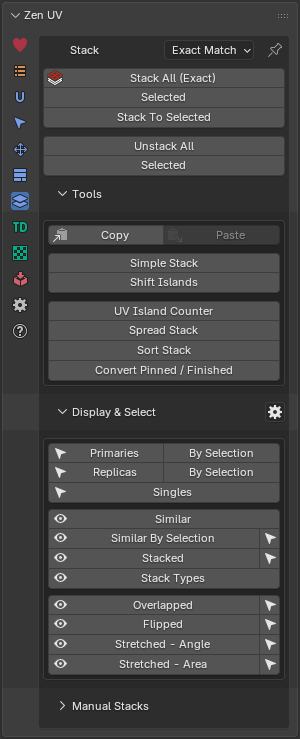 |
|:---:|
| *Fig. 1. Stack panel* |

---

## Stack Components

The Zen UV Stack System categorizes processed UV islands into three distinct types:

### Primaries
Primary islands serve as the reference base for a stack. Their UV position and geometry layout are transferred to all matching Replicas. An island is automatically designated as Primary if it is positioned closer to the UV space origin **(0,0)** and exhibits minimal topological distortion compared to other matching islands.

- **Viewport Color:** 🟧 **Orange-Red**

### Replicas
Replicas are islands that share identical topology with a Primary island but were not chosen as the base. During the stacking operation, the UV position and topology of Replicas are overwritten to match the Primary island.

- **Viewport Color:** 🟦 **Muted Blue**

### Singles
Singles are unique UV islands that have no matching topological counterparts within the selection or object.

- **Viewport Color:** 🟩 **Emerald Green**

---

## Stack Global Properties

| 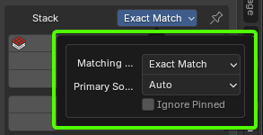 |
| :---: |
| *Fig. 2. Stack Global Properties* |

The Stack panel header contains a popup menu with global settings for the entire Stack System (Fig. 2).

**Why Global Settings Matter:**
To maintain consistency across operators and display modes, the entire Stack System relies on these unified global settings. Any operator executed from the panel automatically inherits these global parameters. However, you can temporarily override these settings on a per-operator basis in the Adjust Last Operation (Redo) panel.

### Matching Mode
Method to determine if UV islands are identical.

- **Exact Match** — Matches identical islands with the same 3D size. The most precise and strict matching method. Islands are treated as identical only if both their topology and physical 3D mesh size match completely. For example, if a mesh fragment is duplicated and scaled down in 3D space, Exact Match will not group them, preventing Texel Density discrepancies after stacking.
- **Topology & Scale** — Matches islands with the same shape, ignores 3D size. Highly accurate algorithm that allows variations in 3D mesh scale. *Warning:* Stacking islands with different 3D sizes using this mode results in uneven Texel Density across the model. Always verify Texel Density after using this algorithm.
- **Topology Only** — Matches by vertex connections only, ignores edge lengths. The most lenient method, relying strictly on vertex connectivity while ignoring edge lengths and proportions. Recommended primarily for manual stacking under visual control.

> For a detailed comparison of these algorithms, see [Matching Modes Comparison](#matching-modes-comparison).

### Primary Source
Method to determine which island acts as the main (Primary) base for the stack.

- **Auto** — Automatically select the best island as the Primary base. Dynamic selection. Each time an operator (such as Stack or Unstack) runs, the Primary island is determined automatically based on metrics like distortion level and proximity to the UV origin.
- **Pinned** — Treat pinned UV islands as the Primary source. Utilizes Blender's standard UV Pin feature. Pinned islands are prioritized as Primary bases. If a stack contains multiple pinned islands, the system selects one among them using the **Auto** criteria.
- **Finished** — Use islands marked as 'Finished' as the Primary source. Utilizes the Zen UV 'Finished' tag system. Marked islands are prioritized as Primary bases. If a stack contains multiple Finished islands, the system selects one among them using the **Auto** criteria.

### Ignore Pinned
Exclude pinned UV islands from the stacking process entirely.

Allows you to lock specific islands and prevent them from being stacked. 

!!! Note
    This option is unavailable when **Primary Source** is set to **Pinned**, as an island cannot simultaneously act as both Primary and Ignored. To exclude pinned islands while manually defining Primary bases, set **Primary Source** to **Finished**.

### Indication

| 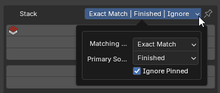 |
| :---: |
| *Fig. 3. Global properties header indication* |

When collapsed, the Stack System global settings popup conceals active configurations. To provide clear visibility into current system behavior, the panel header features a dynamic visual indicator displaying active modes (Fig. 3).

The default baseline configuration consists of:

| Property | Default Mode |
| :--- | :--- |
| **Matching Mode** | *Exact Match* |
| **Primary Source** | *Auto* |
| **Ignore Pinned** | *Off* |

**Indicator Behavior:**

- **Matching Mode** is always visible in the panel header.
- **Primary Source** and **Ignore Pinned** appear in the header label only when modified from their default values (see Fig. 4 for comparison).

|  |  |
| :---: | :---: |
| *Fig. 4. Header display comparison: Default baseline* | *Modified active properties* |

### Operator Global Mode

| 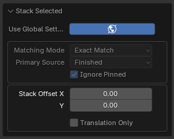 |
| :---: |
| *Fig. 5. Operator properties panel with Use Global Settings enabled* |

Every Stack operator includes a **Use Global Settings** toggle, displayed as a wide button with a globe icon in the Adjust Last Operation (Redo) panel (Fig. 5).

- **Active State (Default):** Highlighted in blue (or the active Blender theme accent color). The parameters **Matching Mode**, **Primary Source**, and **Ignore Pinned** are greyed out, dynamically reflecting the active global configuration.
- **Overriding Settings:** Disabling **Use Global Settings** allows manual customization of parameters for that specific execution. Alternatively, modifying any greyed-out parameter directly will automatically disable **Use Global Settings**.

!!! Note
    Operators executed from the UI panel automatically reset to **Use Global Settings = On** upon next invocation. However, operators bound to custom keymaps retain their saved local settings unless explicitly set to use global configuration.

## Stacking Operators

### Stack All (Exact)

Collect all similar islands into stacks.

The **Stack All (Exact)** operator processes all visible UV islands in the active object (excluding hidden ones). Regardless of current global settings, it defaults to **Matching Mode: Exact Match** as a safety measure. This prevents accidental mesh or topology distortion that less strict matching modes might introduce when processing large numbers of islands. The **Primary Source** and **Ignore Pinned** options default to their values in **Global Settings**.

!!! Properties
    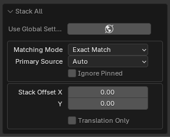

- **Use Global Settings** — Use the global Stacks system configuration instead of local operator settings.
- **Matching Mode** — Method to determine if UV islands are identical.
    - *Exact Match* — Matches identical islands with the same 3D size.
    - *Topology & Scale* — Matches islands with the same shape, ignores 3D size.
    - *Topology Only* — Matches by vertex connections only, ignores edge lengths.
- **Primary Source** — Method to determine which island acts as the main (Primary) base for the stack.
    - *Auto* — Automatically select the best island as the Primary base.
    - *Pinned* — Treat pinned UV islands as the Primary source.
    - *Finished* — Use islands marked as 'Finished' as the Primary source.
- **Ignore Pinned** — Exclude pinned UV islands from the stacking process entirely.
- **Stack Offset** — Offset distance for stacked islands along U and V axes. Allows stacking Replicas to a specific offset relative to the Primary island (for example, offsetting by +1.0 along the X/U axis). This eliminates the need for a subsequent **Unstack** operation while ensuring exact vertex-to-vertex alignment relative to the Primary base.
- **Translation Only** — Stack islands by moving them to a shared position. Bypasses advanced vertex alignment and does not require the Zen UV Core C++ library.

---

### Stack Selected

Collect all similar islands within the current selection into stacks. If the selection contains multiple distinct topology groups, each group will be stacked independently into its own stack.

!!! Properties
    

- **Use Global Settings** — Use the global Stacks system configuration instead of local operator settings.
- **Matching Mode** — Method to determine if UV islands are identical.
    - *Exact Match* — Matches identical islands with the same 3D size.
    - *Topology & Scale* — Matches islands with the same shape, ignores 3D size.
    - *Topology Only* — Matches by vertex connections only, ignores edge lengths.
- **Primary Source** — Method to determine which island acts as the main (Primary) base for the stack.
    - *Auto* — Automatically select the best island as the Primary base.
    - *Pinned* — Treat pinned UV islands as the Primary source.
    - *Finished* — Use islands marked as 'Finished' as the Primary source.
- **Ignore Pinned** — Exclude pinned UV islands from the stacking process entirely.
- **Stack Offset** — Offset distance for stacked islands along U and V axes. Allows stacking Replicas to a specific offset relative to the Primary island (for example, offsetting by $+1.0$ along the X/U axis). This eliminates the need for a subsequent **Unstack** operation while ensuring exact vertex-to-vertex alignment relative to the Primary base.
- **Translation Only** — Stack islands by moving them to a shared position. Bypasses advanced vertex alignment and does not require the Zen UV Core C++ library.

---

### Stack To Selected

Stack all matching unselected islands onto the currently selected islands. 

This operator excludes the **Primary Source** property because selected islands are explicitly treated as Primary bases. If the selection contains islands belonging to multiple separate topology groups, matching unselected islands will be stacked onto their respective selected Primaries.

!!! Properties
    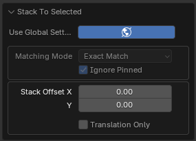

- **Use Global Settings** — Use the global Stacks system configuration instead of local operator settings.
- **Matching Mode** — Method to determine if UV islands are identical.
    - *Exact Match* — Matches identical islands with the same 3D size.
    - *Topology & Scale* — Matches islands with the same shape, ignores 3D size.
    - *Topology Only* — Matches by vertex connections only, ignores edge lengths.
- **Ignore Pinned** — Exclude pinned UV islands from the stacking process entirely.
- **Stack Offset** — Offset distance for stacked islands along U and V axes. Allows stacking Replicas to a specific offset relative to the Primary island (for example, offsetting by $+1.0$ along the X/U axis). This eliminates the need for a subsequent **Unstack** operation while ensuring exact vertex-to-vertex alignment relative to the Primary base.
- **Translation Only** — Stack islands by moving them to a shared position. Bypasses advanced vertex alignment and does not require the Zen UV Core C++ library.

## Unstacking Operators

### Unstack

Shift islands from stacks in a specified direction.

The **Unstack All** and **Unstack Selected** options on the panel trigger the same underlying **Unstack** operator. They are presented as two separate buttons strictly for workflow convenience and quick access.

!!! Properties
    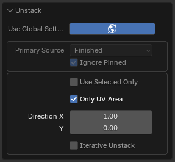

- **Use Global Settings** — Use the global Stacks system configuration instead of local operator settings.
- **Primary Source** — Method to determine which island acts as the main (Primary) base for the stack.
    - *Auto* — Automatically select the best island as the Primary base.
    - *Pinned* — Treat pinned UV islands as the Primary source.
    - *Finished* — Use islands marked as 'Finished' as the Primary source.
- **Ignore Pinned** — Exclude pinned UV islands from the stacking process entirely.
- **Use Selected Only** — Restrict the unstacking operation strictly to selected islands.
- **Only UV Area** — Unstack only islands located inside the active 0–1 UV tile space.
- **Direction** — Vector defining the direction to offset stacked Replicas (for example, +1.0 along the U axis).
- **Iterative Unstack** — Sequentially unstack islands step-by-step, moving each consecutive Replica further along the specified direction vector.

## Tools

A collection of utility tools designed to assist in the UV stacking workflow.

| 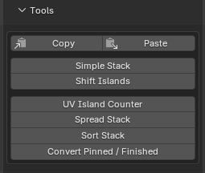 |
| :---: |
| *Fig. 6. Tools block in the Stack panel* |

---

### Copy / Paste System

The **Copy / Paste** system allows you to copy UV positional, structural, or scale parameters from source islands or faces and apply them to target selections.

- **Copy** — Copy parameters from selected islands or faces and store them in memory.
- **Paste** — Paste stored parameters onto selected targets.

#### Copy

Copy parameters of selected islands or faces to memory.

!!! Properties
    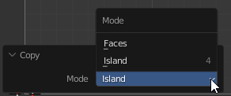

- **Mode** — Selection type to copy parameters from:
    - *Island* — Copy parameters from the selected island.
    - *Faces* — Copy parameters from the selected faces.

#### Paste

Paste previously copied parameters onto selected target islands or faces.

!!! Properties
    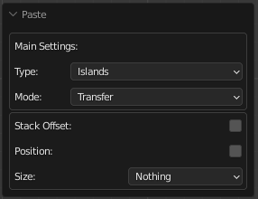

- **Type** — Selection mode processing type:
    - **Island** — Apply parameters to selected islands.
    - **Faces** — Apply parameters to selected faces.
- **Action** — Processing method to apply:
    - **Stack** — Perform alignment and stacking onto the copied source geometry.
    - **Transfer** — Transfer spatial and scaling parameters without stacking topology.

The available properties dynamically change based on the selected **Action**:

**Action — Stack:**

!!! Properties
    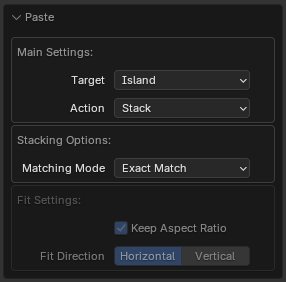

- **Matching Mode** — Method to determine if UV islands are identical:
    - *Exact Match* — Matches identical islands with the same 3D size.
    - *Topology & Scale* — Matches islands with the same shape, ignores 3D size.
    - *Topology Only* — Matches by vertex connections only, ignores edge lengths.

**Action — Transfer:**

!!! Properties
    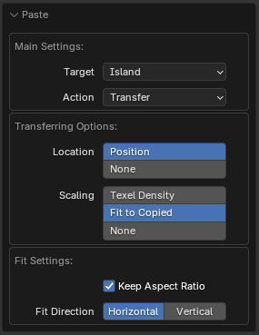

- **Location** — Position alignment method:
    - *Position* — Move selected elements to the location of the copied source.
    - *None* — Retain current position.
- **Scaling** — Scale adjustment method:
    - *Texel Density* — Match the Texel Density of the copied source.
    - *Fit to Copied* — Scale selection to fit source dimensions horizontally or vertically.
    - *None* — Retain current scale.
- **Keep Aspect Ratio** — Preserve original width/height proportions when scaling.
- **Fit Direction** — Alignment orientation used when **Scaling** is set to *Fit to Copied*:
    - *Horizontal* — Match the width of the copied source.
    - *Vertical* — Match the height of the copied source.

#### Usage Samples

| 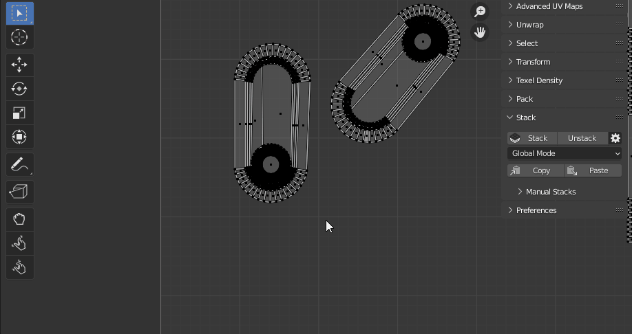 |
| :---: |
| *Fig. 7. Paste: Action — Stack* |

| 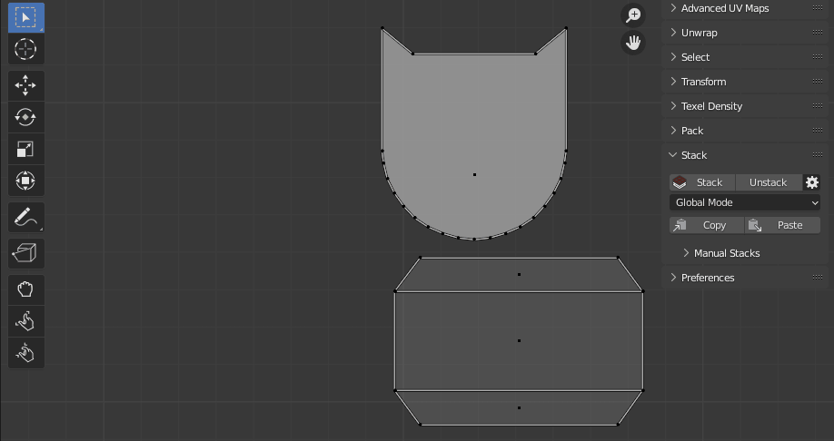 |
| :---: |
| *Fig. 8. Paste: Action — Transfer — Position* |

|  |
| :---: |
| *Fig. 9. Paste: Action — Transfer — Size & Fit* |

### Simple Stack

Stack islands together at a specific location without matching or modifying their topology.

!!! Properties
    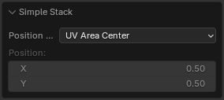

- **Position Type** — The reference position where the stacked islands will be placed:
    - *Average* — Position at the calculated average center of all selected islands.
    - *UV Area Center* — Position at the center of the active 0–1 UV tile space.
    - *Custom Position* — Position at user-defined coordinates specified in the **Position** field.
    - *2D Cursor* — Position at the current location of the 2D Cursor.
- **Position** — Custom coordinates (U, V) used when **Position Type** is set to *Custom Position*.

---

### Shift Islands

Shift selected islands by a specified offset, with options to include Primary, Replica, or Single islands.

!!! Properties
    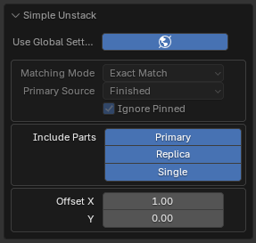

- **Use Global Settings** — Use the global Stacks system configuration instead of local operator settings.
- **Matching Mode** — Method to determine if UV islands are identical:
    - *Exact Match* — Matches identical islands with the same 3D size.
    - *Topology & Scale* — Matches islands with the same shape, ignores 3D size.
    - *Topology Only* — Matches by vertex connections only, ignores edge lengths.
- **Primary Source** — Method to determine which island acts as the main (Primary) base for the stack:
    - *Auto* — Automatically select the best island as the Primary base.
    - *Pinned* — Treat pinned UV islands as the Primary source.
    - *Finished* — Use islands marked as 'Finished' as the Primary source.
- **Ignore Pinned** — Exclude pinned UV islands from the operation entirely.
- **Include Parts** — Select island categories to include in the shift operation:
    - *Primary* — Include base (Primary) islands.
    - *Replica* — Include duplicate (Replica) islands.
    - *Single* — Include unique (Single) islands without stack duplicates.
- **Offset** — The distance vector by which all included islands (except the base island) will be shifted.

---

### UV Island Counter

Count UV islands across selected objects and display the results in a summary readout. This operator makes it easy to inspect total island counts and verify stack grouping.

| 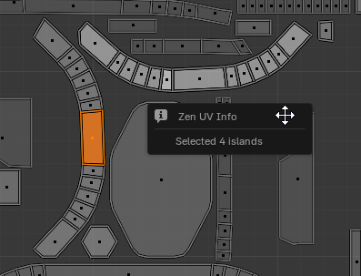 |
| :---: |
| *Fig. 10. UV Island Counter readout* |

For complete documentation on this tool, see [UV Island Counter](checker.md#uv-islands-counter).

---

### Spread Stack

Scatter overlapping UV islands from stacks across a defined layout pattern for visual inspection or manual adjustments.

| 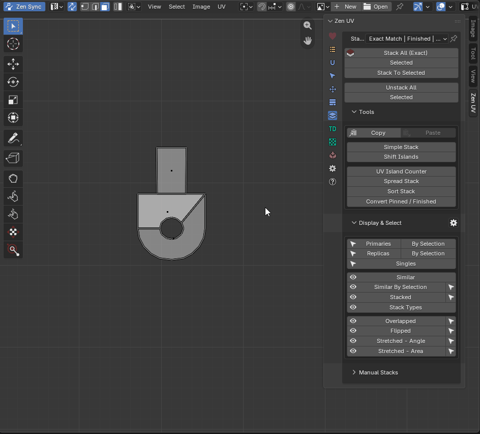 |
| :---: |
| *Fig. 11. Spread Stack operator in action* |

!!! Properties
    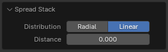

- **Distribution** — Pattern used to scatter the stacked islands:
    - *Radial* — Spread islands outward in a circular layout.
    - *Linear* — Spread islands sequentially along a straight line.
- **Distance** — Spacing interval between spread islands.

---

### Sort Stack

Organize UV elements into a structured grid layout: places Primary islands horizontally in a row, stacks their corresponding Replicas vertically above them, and appends unique Single islands to the end of the primary row.

| 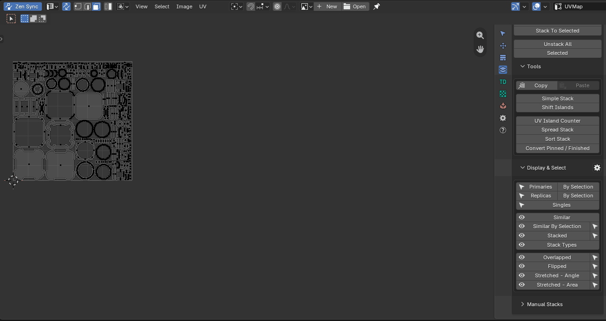 |
| :---: |
| *Fig. 12. Sort Stack in action* |

!!! Properties
    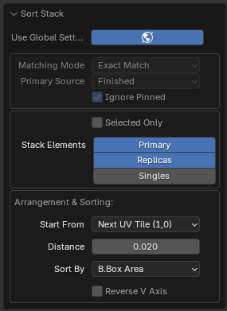

- **Use Global Settings** — Use the global Stacks system configuration instead of local operator settings.
- **Matching Mode** — Method to determine if UV islands are identical:
    - *Exact Match* — Matches identical islands with the same 3D size.
    - *Topology & Scale* — Matches islands with the same shape, ignores 3D size.
    - *Topology Only* — Matches by vertex connections only, ignores edge lengths.
- **Primary Source** — Method to determine which island acts as the main (Primary) base for the stack:
    - *Auto* — Automatically select the best island as the Primary base.
    - *Pinned* — Treat pinned UV islands as the Primary source.
    - *Finished* — Use islands marked as 'Finished' as the Primary source.
- **Ignore Pinned** — Exclude pinned UV islands from the process entirely.
- **Selected Only** — Restrict sorting strictly to selected islands.
- **Include Parts** — Island categories to include in the sorting operation:
    - *Primary* — Include base (Primary) islands.
    - *Replica* — Include duplicate (Replica) islands.
    - *Single* — Include unique (Single) islands.

**Arrangement & Sorting:**

- **Start From** — Reference point for grid placement:
    - *First UV Tile (0,0)* — Begin grid layout at the origin of the 0–1 UV tile.
    - *Next UV Tile (1,0)* — Begin grid layout at the origin of the adjacent UV tile (1.0, 0.0).
    - *2D Cursor* — Begin grid layout at the current 2D Cursor position.
- **Distance** — Spacing interval between arranged islands.
- **Sort By** — Criterion used to order UV islands or stacks prior to layout:
    - *None* — Maintain original island order without sorting.
    - *B.Box Area* — Sort stacks/islands by their bounding box surface area.
    - *Replicas Count* — Sort stacks by the number of duplicate Replicas they contain.
- **Reverse V Axis** — Invert the vertical layout direction for stacked Replicas.

---

### Convert Pinned / Finished

Convert Blender's UV Pinned status to Zen UV 'Finished' tags, or vice versa.

This operator allows seamless transitions between tagging systems when changing the **Primary Source** setting in **Global Settings** (e.g., switching primary identification from *Pinned* to *Finished*).

!!! Properties
    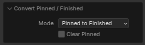

- **Mode** — Direction of status conversion:
    - *Pinned to Finished* — Convert standard Blender UV Pinned status into Zen UV 'Finished' tags.
    - *Finished to Pinned* — Convert Zen UV 'Finished' tags into standard Blender UV Pinned status.
- **Clear Pinned** — Remove UV Pinned status from vertices/islands after conversion completes.
- **Clear Finished** — Remove Zen UV 'Finished' tags from islands after conversion completes.

## Display and Select

| 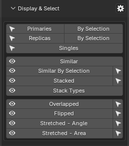 |
| :---: |
| *Fig. 13. Display and Select block in the Stack panel* |

---

### Display Properties

| 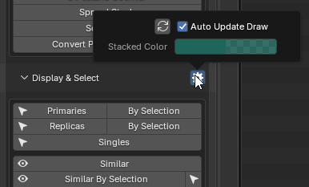 |
| :---: |
| *Fig. 14. Stack Display System Properties* |

- **Update Draw System** — Manually refresh the Zen UV viewport display cache.
    - *Shift + Click:* Toggle the **Auto Update Draw** option.
- **Stacked Color** — Viewport overlay color used to highlight currently stacked UV islands.

---

### Display Operators

Display operators (indicated by the eye icon 👁) generate color-coded viewport overlays to visualize UV topological status, stack groups, and geometric errors.

!!! Note
    Display operators do not have individual operator properties; they strictly rely on the active [Stack Global Properties](#stack-global-properties). Ensure global parameters (such as **Matching Mode**) are configured appropriately for your workflow before using these visualization tools.

- **Similar** — Highlight matching groups of islands. Unique random colors are assigned to each topological group, allowing quick visual identification of potential stacks.
- **Similar By Selection** — Highlight islands that match the topology of the currently selected reference island(s).
- **Stacked** — Highlight islands that are currently positioned in stacks.
- **Stack Types** — Color-code islands based on their [Stack Components](#stack-components) classification (Primary, Replica, or Single).
- **Overlapped** — Highlight overlapping UV islands. Useful for detecting unintended overlapping geometry or verifying whether islands remain stacked within the UV tile space after an [Unstack](#unstack) operation.
- **Flipped** — Highlight flipped (inverted) UV islands. Unintended flipped islands within active UV tile bounds often lead to shading artifacts and normal map baking errors.
- **Stretched - Angle** — Highlight angular polygon distortion within islands. Identifies internal topology squishing or stretching, helping evaluate if the chosen **Matching Mode** is suitable.
- **Stretched - Area** — Highlight surface area scale distortion. Identifies islands whose UV surface area disproportionately deviates from their physical 3D mesh area, preventing unwanted Texel Density variations.

> For detailed information on distortion analysis, see [Select Stretched Faces](select.md/#select-stretched-faces).

### Select Operators

#### Select Stack Parts

Select specific stack components: Primaries, Replicas, or Singles.

| 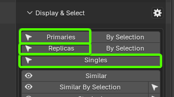 |
| :---: |
| *Fig. 15. Select stack parts operators in the UI* |

!!! Properties
    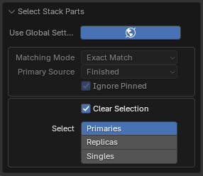

- **Use Global Settings** — Use the global Stacks system configuration instead of local operator settings.
- **Matching Mode** — Method to determine if UV islands are identical:
    - *Exact Match* — Matches identical islands with the same 3D size.
    - *Topology & Scale* — Matches islands with the same shape, ignores 3D size.
    - *Topology Only* — Matches by vertex connections only, ignores edge lengths.
- **Primary Source** — Method to determine which island acts as the main (Primary) base for the stack:
    - *Auto* — Automatically select the best island as the Primary base.
    - *Pinned* — Treat pinned UV islands as the Primary source.
    - *Finished* — Use islands marked as 'Finished' as the Primary source.
- **Ignore Pinned** — Exclude pinned UV islands from the stacking process entirely.
- **Clear Selection** — Clear the initial selection before applying the operation.
- **Select** — Stack component category to select:
    - *Primaries* — Select primary base islands.
    - *Replicas* — Select duplicate replica islands.
    - *Singles* — Select unique islands without matching stack copies.

---

#### Select Similar Islands

| 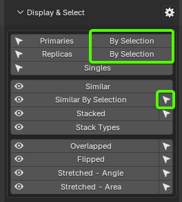 |
| :---: |
| *Fig. 16. Placement of Select Similar Islands buttons on the panel* |

For workflow convenience, the **Select Similar Islands** operator is accessible from three distinct locations in the Stack panel (Fig. 16).

Based on the active selection, the operator identifies all topologically matching islands belonging to the same stack group and selects specific stack components (such as Primaries or Replicas) according to operator settings.

---

#### Select Stacked

Select UV islands that are currently stacked together.

!!! Properties
    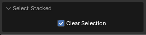

- **Clear Selection** — Clear the initial selection before applying the operation.

---

#### Select Overlap

Select all overlapping UV faces within active objects. 

> **Note:** This is Blender's native **Select Overlapped** operator, included in the Stack panel for quick access and convenience.

---

#### Select Flipped Islands

Select inverted (flipped) UV islands or faces.

!!! Properties
    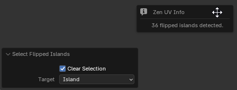

- **Clear Selection** — Clear the initial selection before applying the operation.
- **Target** — Choose selection mode:
    - *Island* — Select the entire flipped island.
    - *Face* — Select individual flipped faces.

---

#### Select Stretched Faces

Select faces with significant UV angular or area distortion.

For complete documentation on this tool, see [Select Stretched Faces](select.md#select-stretched-faces).

## Manual Stack

| 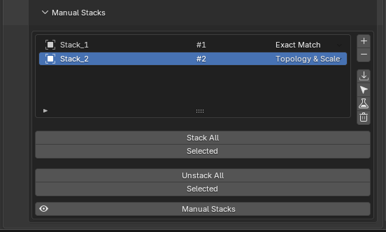 |
| :---: |
| *Fig. 17. Manual Stacks Panel* |

The **Manual Stack** system provides a dedicated UI list for manually grouping UV islands. It serves as a fallback tool when automatic stacking algorithms fail to process complex topology, or when user-defined custom groupings are required.

Each item in the UI list displays key group information:

- **Group Name**
- **Group Index**
- **Matching Mode** — Override setting applied specifically to the individual group.

**Control Buttons (Right Side):**

- **`+` (Add):** Create a new stack group.
- **`-` (Remove):** Delete the active stack group.
- **Down Arrow (Assign):** Assign currently selected UV islands to the active group.
- **Cursor (Select):** Select all UV islands assigned to the active group.
- **Flask (Analyze):** Analyze topological parameters of the active group.
- **Trash Can (Clear All):** Delete all stack groups.

---

### Analyze Stack

Analyze topological similarities and parameter metrics across islands in the selected manual group.

| 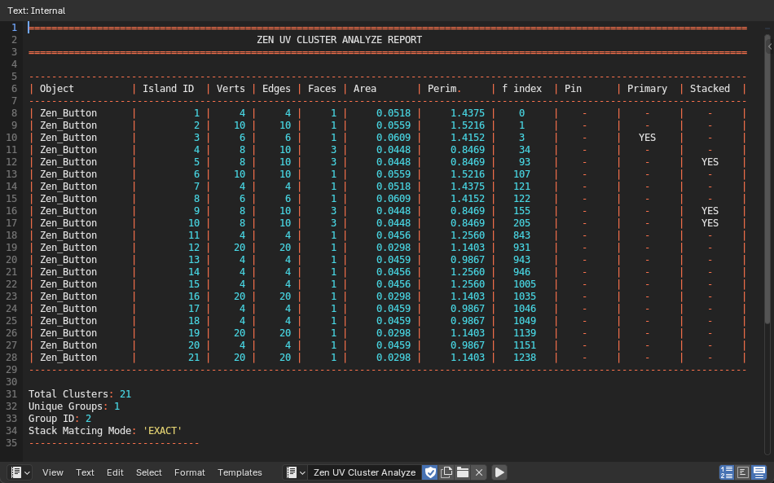 |
| :---: |
| *Fig. 18. Manual stack analysis readout* |

If islands in a manual group fail to stack automatically, add them to a Manual Stack group and run **Analyze Stack**. The resulting diagnostic table (Fig. 18) helps pinpoint topology or scale mismatches.

**Troubleshooting with Analysis Data:**

- **Vertex Count Mismatch:** If vertex counts differ across islands in the group, topological stacking is impossible.
- **Area Mismatch:** If vertex counts match but surface area differs, stacking under **Exact Match** will fail. Change the group's **Matching Mode** to **Topology & Scale**.

**Table Columns:**

- **Object** — Name of the object containing the island.
- **Island ID** — Identification index of the island.
- **Verts** — Total vertex count.
- **Edges** — Total edge count.
- **Faces** — Total face count.
- **Area** — UV surface area.
- **Perim.** — UV island perimeter length.
- **Face Index (`f index`)** — Index of a representative face on the island. Useful for isolating specific islands using [Select Element By Index](checker.md/#elements-by-index).
- **Pin** — Indicates whether standard Blender UV Pinned tags exist on the island.
- **Primary** — Indicates whether the island is designated as the Primary base within the active group.
- **Stacked** — Indicates whether the island is currently stacked.

---

### Stack All / Selected

Stack islands belonging to Manual Stack groups.

!!! Properties
    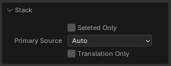

- **Selected Only** — Process only stack groups selected in the Manual Stack list.
- **Primary Source** — Method to determine which island acts as the main (Primary) base for the stack:
    - *Auto* — Automatically select the best island as the Primary base.
    - *Pinned* — Treat pinned UV islands as the Primary source.
    - *Finished* — Use islands marked as 'Finished' as the Primary source.
- **Translation Only** — Stack islands by moving them to a shared position. Bypasses advanced vertex alignment and does not require the Zen UV Core C++ library.

---

### Unstack All / Selected

Unstack islands belonging to Manual Stack groups in a specified direction.

!!! Properties
    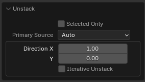

- **Selected Only** — Process only stack groups selected in the Manual Stack list.
- **Primary Source** — Method to determine which island acts as the main (Primary) base for the stack:
    - *Auto* — Automatically select the best island as the Primary base.
    - *Pinned* — Treat pinned UV islands as the Primary source.
    - *Finished* — Use islands marked as 'Finished' as the Primary source.
- **Direction** — Vector defining the direction to spread out stacked elements (for example, +1.0 along the U axis).
- **Iterative Unstack** — Sequentially unstack islands step-by-step, moving each consecutive Replica further along the specified direction vector.

---

### Display Manual Stacks

Generate a static viewport color overlay highlighting islands assigned to Manual Stack groups.

Random colors are assigned per group regardless of whether the islands are currently stacked or unstacked.

---

## Matching Modes Comparison

Below are practical examples demonstrating how different **Matching Modes** detect island similarity. These test cases are specifically designed to highlight algorithmic differences between matching methods.

---

### Sorting Example Across Matching Modes

| 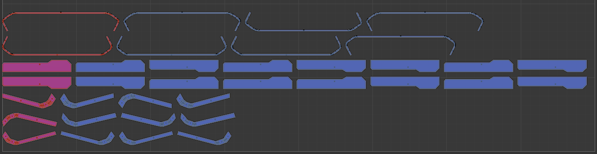 |
| :---: |
| *Fig. 19. Island grouping under the Exact Match method* |

Figure 19 illustrates island sorting under **Exact Match**. The algorithm identifies seven distinct island groups (seven potential stacks). Visually, however, there appear to be only three groups because several islands look identical. 

To determine why **Exact Match** separated visually identical islands into seven stacks, we can inspect them using [Analyze Stack](#analyze-stack).

| 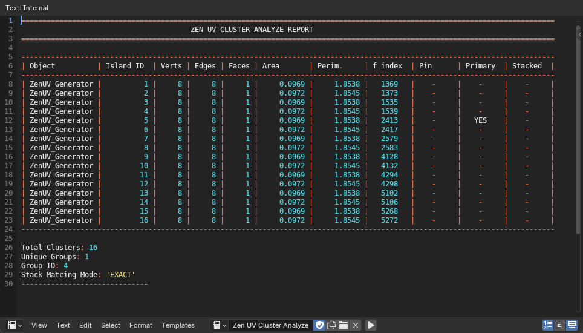 |
| :---: |
| *Fig. 20. Analyze Stack readout under Exact Match* |

Assigning the visually identical islands from the middle groups to a **Manual Stack** and running an analysis reveals subtle differences in **Area** and **Perimeter** (Fig. 20). 

Even minor mathematical discrepancies cause **Exact Match** to treat islands as unique because it strictly enforces identical 3D mesh dimensions. Such variance frequently occurs when using mesh mirroring tools with imprecise origin placement.

Let's switch the global **Matching Mode** to **Topology & Scale**.

| 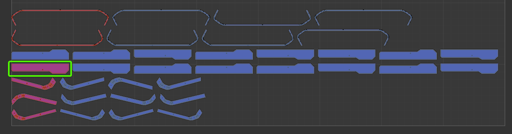 |
| :---: |
| *Fig. 21. Stack detection under Topology & Scale method* |

Comparing Fig. 21 to Fig. 19, switching to **Topology & Scale** merges the two middle groups into a single stack group, designated by a single Primary island. *(Note: Grid sorting was kept unchanged in this demonstration for visual comparison).*

While **Topology & Scale** is more permissive than **Exact Match**, how does **Topology Only** behave? 

Let's switch the global **Matching Mode** to **Topology Only**.

| 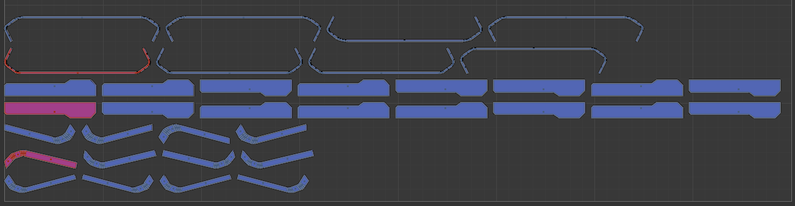 |
| :---: |
| *Fig. 22. Stack detection under Topology Only method* |

In Fig. 22, only three Primary islands remain, perfectly matching the three visual stacks expected at first glance.

---

### Why Not Use Topology Only for Everything?

If **Topology Only** produced the cleanest grouping in this example, why offer three distinct matching modes?

Because **Topology Only** evaluates connectivity while ignoring edge lengths and proportions, it frequently produces false positives by grouping radically different UV shapes that share identical vertex counts and topology.

| 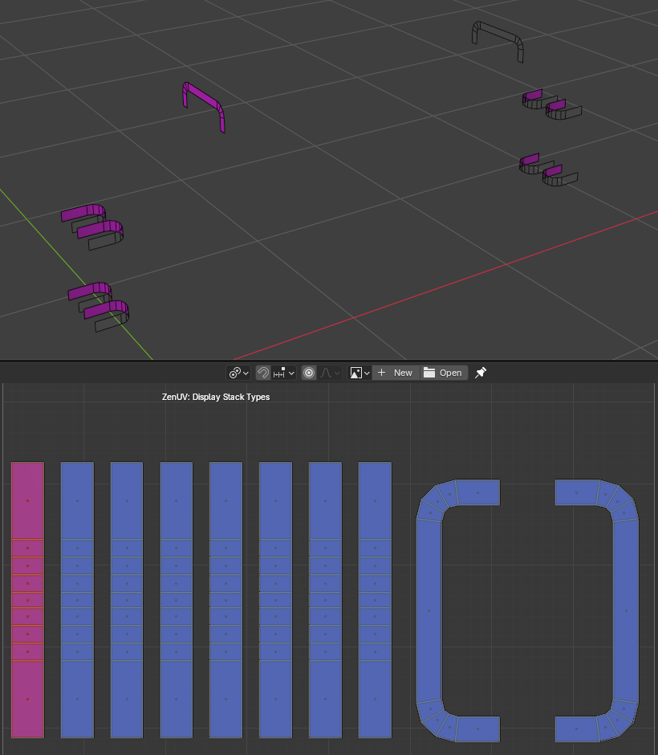 |
| :---: |
| *Fig. 23. False positive: Identical topology with different proportions* |

| 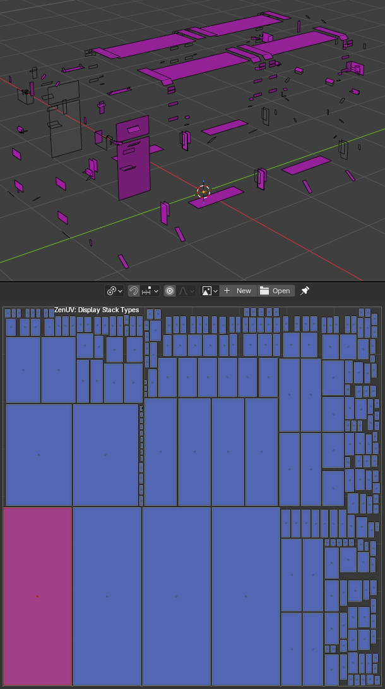 |
| :---: |
| *Fig. 24. False positive: Identical topology with modified mesh scale* |

| 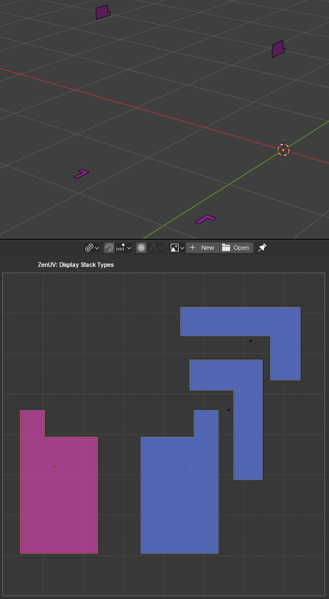 |
| :---: |
| *Fig. 25. False positive: Identical topology with different geometric shapes* |

As shown in Figures 23–25, **Topology Only** groups islands that share identical vertex connectivity even if they differ completely in 3D scale, shape, or proportions.

!!! Recommendation
    Always perform primary automated stacking using **Exact Match**. Afterward, run a visual inspection (e.g., using **Stack Types** or **Similar** overlays) and stack any remaining unmatched elements using **Topology & Scale** or **Topology Only** under manual control.