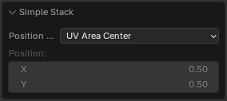
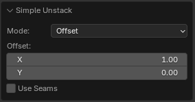
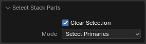

# Stack

This panel contains tools for grouping similar islands into stacks.

!!! Panel
    

!!! tip
    Watch the video explaining how **Stack** works.

    

    <iframe src="https://www.youtube.com/embed/Yj2SecY-c1Y?start=142&end=313" style="position: absolute; top: 0; left: 0; width: 100%; height: 100%;" allowfullscreen="" seamless="" frameborder="0"></iframe>
    

## Stack sys properties

!!! Properties
    

- **Move Only** - Don't fit Islands. Just move to the same position.
- **Stack Offset** - The offset value. Can be used for preventing auto merging the UV vertices.
- **Unstack Direction** - The Direction where the island will be shifted.

---
## Stack Operator
Collect all similar islands on stacks.

!!! Properties
    

- **Selected Only** - Collect all islands similar to the selected island and stack them at the location of the selected island.

---
## Simple Stack Operator
Places the islands in the stack, with no respect for their topology.\

!!! Properties
    

- **Position Type** - The position type where the islands will be placed.
    - *Average* - Averaged islands positions.
    - *UV Area Center* - The center of the UV Area.
    - *Custom Position* - Custom user defined position.
    - *2D Cursor* - The 2D Cursor location.
- **Position** - The location where stack will be placed.

---
## Simple Unstack Operator

!!! Properties
    

- **Mode** - The position where the islands will be placed.
    - *Expand* - Expand selected stack using margin. 
    - *Offset* - Offset selected stack to the right side.
- **Offset** - The amount by which all islands except the first one will be shifted.
- **Margin** - Distance between the islands.
- **Use Seams** - Use seams as an island separator to prevent stacked islands from self-welding.

---
## Unstack Operator

Shift Islands from Stacks in a given direction.

!!! Properties
    

- **Mode** - Mode to Unstack Islands
    - *Global* - Unstack all Similar Islands
    - *Stacked* - Unstack Stacked Islands
    - *Overlapped* - Unstack Overlapped Islands
    - *Selected* - Unstack Selected Islands
- **Only UV Area** - Unstack islands located in the UV Area only
- **Iterative Unstack** - Unstack Islands iteratively with moving in given direction
- **Use Seams** - Use seams as an island separator to prevent stacked islands from self-welding
- **Direction** - The unstack direction
- **Break Stacks** - Shift Islands from Stacks by given increment until all of them will be individually placed
- **Unstack Increment** -  Is a value that gradually separates stacked elements in incremental steps.

---
## Stack Components

There are 3 different types of Stacked Islands. You can select all of them in this panel.

### Primaries
Primaries this is islands which detected as a better instance. The position and the topology from Primaries will be translated to the Replicas. The island is defined as Primary if its position is closer to the center of coordinates, and the distortion of topology is less compared to other similar islands.

### Replicas

Replicas are islands that have the same topology but were not chosen as Primary. The position and topology of the Replicas will be changed in the process of Stacking.

### Singles

Singles this is islands that have no similar islands.

### Select Stack Parts
The operator block for selecting stack components is the only operator with corresponding properties.

!!! Properties
    

- **Clear Selection** - Clear initial selection.
- **Mode** - Selection mode.
    - *Select Primaries* - Selects the primary islands as the base instances for stacking.
    - *Select Replicas* - Selects the replica islands with the same topology as the primaries.
    - *Select Singles* - Selects unique islands that do not have any similar copies.

---
## Stacks Display and Select

- **Similar** - Display all similar islands. Selecting all similar islands does not make sense, as it would select all islands with copies and their duplicates, resulting in almost every island in the mesh being selected except for the [Singles](#singles). To select similar islands based on a specific island, use **Similar by Selection**.

- **Similar by Selection** - Display and select similar islands from selected sslands.
- **Stacked** - Display and select stacked islands.
- **Overlapped** - Display and select all overlapped islands.

!!! Options

    **Options for Stacked Islands**

    

- **Overlay Sync** - Draw is sincronized with Overlay On/Off mode.
- **Stacked Color** - Color for displaying Stacked Islands.
- **Only UV Area** - Display Stacks only in the UV area.

---

### UV Island Counter

Count UV islands in selected objects and display the result. With this operator, you can easily find out how many islands are in the stack.

Here you will find [full information](checker.md#uv-islands-counter) about this operator.

---

## Copy / Paste System

 - **Copy** - Copy parameters of selected Islands/Faces and save them.

 - **Paste** - Paste the parameters saved earlier to selected Islands/Faces.

[Here is full information](operators/stack_copy_paste.md) about Copy / Paste System.

---

## Manual Stack

!!! Panel
    

### Area Matching

Set strict requirements for Islands Area Matching when Stacking. Disable this option if the Islands have a slightly different Area.

### Move Only

Don't fit Islands. Just move to the same position.

### Add

Add new Stack.

### Delete

Delete selected Stack.

### Add Islands

Append selected Islands to the active Stack.

### Select Islands

Select Islands in the Stack

### Analyze Stack

Analyze Islands Similarities in the Stack. You can find details in the Zen UV Manual Stack Analyze document in the Text Editor.

### Remove All

Remove all Manual Stacks from selected Objects.

### Stack All

Collect islands on manual stacks.

### Stack Selected

Collect islands on manual mtacks using only selected manual stack.

### Unstack All

Shift Islands from manual mtacks in a given direction.

### Unstack Selected

Shift Islands from selected manual stacks in a given direction.

### Display Manual Stacks

Display Manual Stacks (Static)
