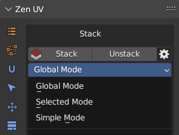
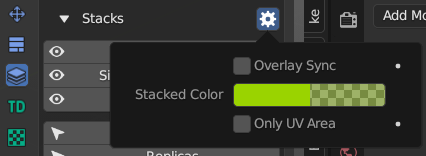

# Stack
!!! Panel
    

!!! tip
    Watch the video explaining how **Stack** works.

    

    <iframe src="https://www.youtube.com/embed/Yj2SecY-c1Y?start=142&end=313" style="position: absolute; top: 0; left: 0; width: 100%; height: 100%;" allowfullscreen="" seamless="" frameborder="0"></iframe>
    

## Stack

Collect Similar Islands on Stacks.

!!! Properties
    

    - **Move Only** - Don't fit Islands. Just move to the same position.
    - **Stack Offset** - The offset value. Can be used for preventing auto merging the UV vertices.
    - **Unstack Direction** - The Direction where the island will be shifted.

## Unstack

Shift Islands from Stacks in a given direction.

## Stack Mode

!!! Panel
    

    - **Global Mode**. Collect all Similar Islands on Stacks.
    - **Selected Mode**. Collect selected Similar Islands on Stacks.
    - **Simple Mode**. Collect selected islands in the stack, with no respect for their topology.

## Stacks 

There are 3 different types of Stacked Islands. You can select all of them in this panel.

### Primaries
Primaries this is islands which detected as a better instance. The position and the topology from Primaries will be translated to the Replicas. The island is defined as Primary if its position is closer to the center of coordinates, and the distortion of topology is less compared to other similar islands.

### Replicas

Replicas are islands that have the same topology but were not chosen as Primary. The position and topology of the Replicas will be changed in the process of Stacking.

### Singles

Singles this is islands that have no similar islands.

## Stacks Display

### Similar

Display all Similar Islands.

### Similar of Selection

Display and Select Similar Islands from Selected Islands.

### Stacked

Display and Select Stacked Islands.

!!! Options

    **Options for Stacked Islands**

    

    - **Overlay Sync**. Draw is sincronized with Overlay On/Off mode.
    - **Stacked Color**. Color for displaying Stacked Islands.
    - **Only UV Area**. Display Stacks only in the UV area.

## Copy / Paste System

 - **Copy** - Copy parameters of selected Islands/Faces and save them.

 - **Paste** - Paste the parameters saved earlier to selected Islands/Faces.

[Here is full information](operators/stack_copy_paste.md) about Copy / Paste System.

---

## Manual Stack

!!! Panel
    

### Area Matching 

Set strict requirements for Islands Area Matching when Stacking. Disable this option if the Islands have a slightly different Area.

### Move Only 

Don't fit Islands. Just move to the same position.

### Add 

Add new Stack.

### Delete 

Delete selected Stack.

### Add Islands 

Append selected Islands to the active Stack.

### Select Islands 

Select Islands in the Stack

### Analyze Stack 

Analyze Islands Similarities in the Stack. You can find details in the Zen UV Manual Stack Analyze document in the Text Editor.

### Remove All 

Remove all Manual Stacks from selected Objects.

### Stack

Collect Islands on Manual Stacks.

### Unstack

Shift Islands from Manual Stacks in a given direction.

### Stack Mode

- **Global Mode**. Collect all Similar Islands on Stacks.
- **Selected Mode**. Collect selected Similar Islands on Stacks.

### Display Manual Stacks

Display Manual Stacks (Static)
