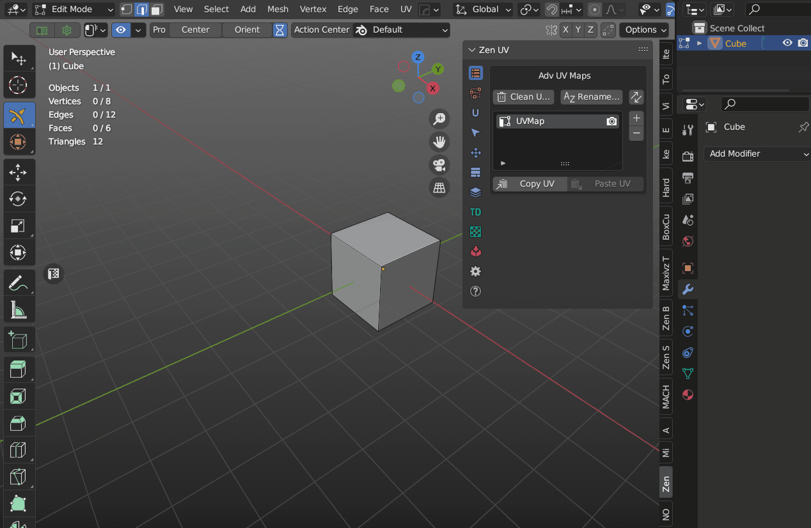
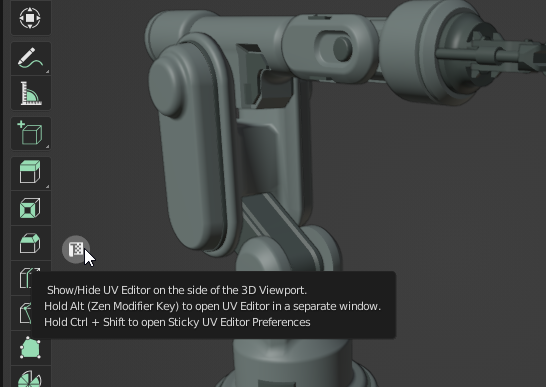
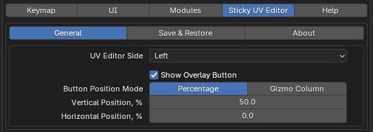
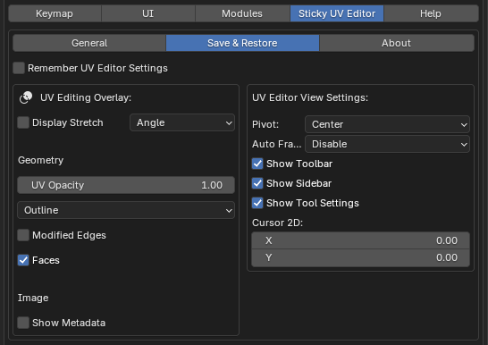

# Sticky UV Editor

Sticky UV Editor this is a system that allows opening UV Editor on the left or the right from the active 3D Viewport or as a separate window. These actions can be done by shortcuts or using a widget in the 3D Viewport.

 

The side opening UV Editor depends on the on-screen position of the widget.

## Sticky UV Editor Preferences

The properties of the Sticky UV Editor are placed in the [addon preferences](addon_prefs.md#sticky-uv-editor).

To quickly open the Sticky UV Editor settings, press Ctrl + Shift + LMB (Left Mouse Button) on the widget located in the 3D Viewport.

!!! Panel
    

### General

 - **UV Editor Side** - The side where the UV Editor will be shown.
 - **Show Overlay Button** - The visibility of the on-screen widget.
 - **Button Position Mode** - The position of the on-screen widget.
    - *Percentage* - Horizontal and vertical positions in percents
    - *Gizmo Column* - Button will be placed in viewport gizmo group column.
- **Vertical Position, %** - The vertical position of the button in percentages.
- **Horizontal Position, %** - The horizontal position of the button in percentages.

### Save and Restore

The Save and Restore tab is the copy of the Blender's UV Editor Overlay popup. Once usage of the **Remember UV Editor Settings** is not needed, all the settings from the Overlay tab will be used for every creation of the UV Editor until the user changes the options manually.

!!! Panel
    

- **Remember UV Editor Settings** - Remember changes made in UV Editor on area close event

### About

The original idea and the development of the Sticky UV Editor belong to Oleg Stepanov (DotBow).
So, here is the [link](https://github.com/DotBow/Blender-Sticky-UV-Editor-Add-on) to the page with an original addon.