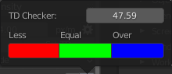

# Texel Density

Texel Density (TD) refers to the number of texture pixels (texels) per unit of surface area on a 3D model in a video game. It is important for maintaining visual quality and reducing texture stretching or blurring when a model is viewed up close or from different angles. Higher TD means more detail and sharpness on the textures, but can also result in larger file sizes and performance issues.

Usually it’s measured in pixels per centimeter (2.56px/cm) or pixels per meter (256px/m).

You can read more information about [What is Texel Density here.](https://www.beyondextent.com/deep-dives/deepdive-texeldensity#) 

--- 

Zen UV is providing all the tools you need to work with Texel Density.

!!! Panel
    

!!! Tip
    Read POLYMATTER.XYZ manual about how to choose right TD. [**JPG**](https://drive.google.com/file/d/1hJ1px7BHX7kxDmD1KAXqECNqNXCe6egu/view), [**PDF**](https://drive.google.com/file/d/1J8XA8bnrYgHr4R8PwsbM4ftqjbDZ8whN/view). 

    

### Texel Density
Shows Texel Density value.

!!! Preferences
    

    - **Units**. Texel density calculation units.
    - **Texture Size**. Image Size for Texel Density computation.

### Get TD
Get Texel Density from selected Islands.

### Set TD
Set Texel Density to selected Islands.

### Set TD Mode
Mode for setting Texel Density.

!!! Options

    - **Overall Mode**. Set Texel Density for all selected Islands together.
    - **Island Mode**. Set Texel Density individually for every selected Island.

### TD Checker

  1. Texel Density value used for Show TD operation.
  2. Copy Current TD value to TD Checker value (point 1).

!!! Preferences
    

    - **TD Checker**. Texel Density value used for Show TD operation.
    - **Less**. Viewport display color to represent Texel Density less than TD Checker value.
    - **Equal**. Viewport display color to represent Texel Density equal to TD Checker value.
    - **Over**. Viewport display color to represent Texel Density over than TD Checker value.

### Show TD

Display Texel Density in Viewport by chosen TD Checker value and colors.

!!! Warning
    - Texel Density System uses Vertex Color for displaying some information.
      Make sure viewport shading is switched to **Solid** mode.

### Hide TD

Disable displaying Texel Density in Viewport by chosen TD Checker value and colors.

---
## Texel Density Presets

### Presets Management

You can Save TD Presets for your projects and Share TD Presets with team.

!!! Panel
    

    - **Load**. Load Preset.
    - **Add**. Add new Preset.
    - **Remove**. Remove Preset.
    - **Open Presets Folder**. Open Presets Folder.

### Get

Get TD from selected Islands to active preset.

### Clear

Clear List.

### Set From Preset

Set TD from active preset to selected Islands.

### Select by TD

Select Islands By Texel Density.

!!! Options
    

    - **Under Rated**. Select islands which have TD less than minimal in the list.
    - **Over Rated**. Select islands which have TD bigger than maximal in the list.
    - **By Value**. Select by active preset value.

### Show Presets
Turn on Presets Displaying.

### Hide
Turn off Presets displaying.

