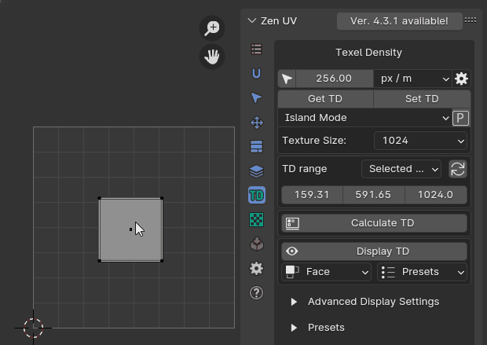
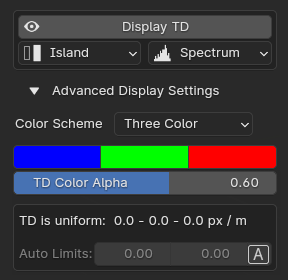
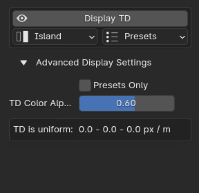
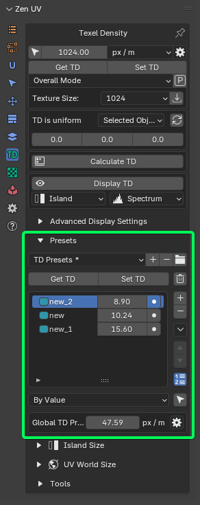
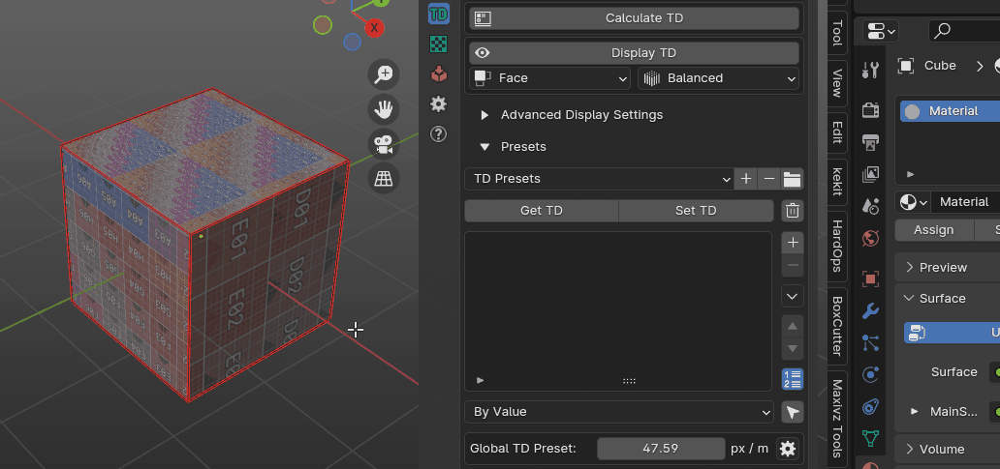
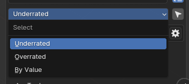
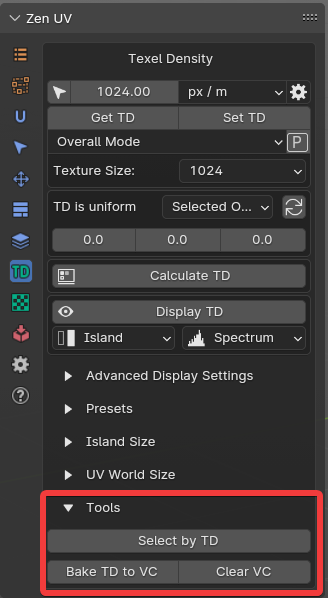

# Texel Density

Texel Density (TD) refers to the number of texture pixels (texels) per unit of surface area on a 3D model in a video game. It is important for maintaining visual quality and reducing texture stretching or blurring when a model is viewed up close or from different angles. Higher TD means more detail and sharpness on the textures, but can also result in larger file sizes and performance issues.

Usually it’s measured in pixels per centimeter (2.56px/cm) or pixels per meter (256px/m).

You can read more information about [What is Texel Density here.](https://www.beyondextent.com/deep-dives/deepdive-texeldensity#) 

--- 

Zen UV is providing all the tools you need to work with Texel Density.

!!! Panel
    

### Texel Density Value
Shows Texel Density value.

#### **TD Calc Precision**. 
Specifies how many percents of the Island's polygon will be used to determine Texel Density.

!!! Properties
    

### Select by TD
Select Islands by choosen Texel Density.

!!! Properties
    

| Preferences | |
|---|---|
| ⮟ **Influence**  |  Calculation Mode. |
| • Island |  Per each Island. |
| • Face |  Per each Face. |
| **Clear Selection** |  Clear initial Selection. |
| ⮟ **Selection Mode** | Selection Mode. |
| • Treshold |  Use TD basic value and Treshold. |
| • Range |  Use the range specified by the Minimum and Maximum TD values. |
| • Skip |  Do not select Islands by TD values. |
| **Presets:**  |
| **Select Underrated** | Select Islands with TD value less than the smallest TD value in the presets. |
| **Select Overrated** | Select Islands with TD value less than the highest TD value in the presets. |

### Get TD
Get Texel Density from selected Islands.

### Set TD
Set Texel Density to selected Islands.

| Modes | |
|---|---|
| **Overall Mode**  |  Set Texel Density for all selected Islands together. |
| **Island Mode**  |  Set Texel Density individually for every selected Island.|

### Use Pivot
Use Pivot point when Setting Texel Density. 
From Center or from other 8 directions.

!!! SubPanel
    

### Texture Size
Texture Size for TD calculations.

### TD Range

!!! SubPanel
    

#### Get TD Range
Calculates current minimum, average and maximum TD values on the model. By clicking on the number fields you can choose Islands with given TD value.

| Modes | |
|---|---|
| **Select objects**  |  Calculates current minimum and maximum TD values on the selected objects. |
| **Scene**  |  Calculates current minimum and maximum TD values in the scene.|
    

### Calculate TD
Calculates optimal Texture Size/TD based on given TD/Texture Size.

!!! Modes
     | Texel Density| Texture Size |
     |---|---|  
     |  ||

### Display TD
Display Texel Density in Viewport by chosen mode and display method.

| Calculation Mode | |
|---|---|
| **Island**  |  Per aach Island. |
| **Face**  |  Per each Face.|

| Display Method | |
|---|---|
| **Balanced**  |  The value specified in TD Checker will always be in the middle color from the user's preferences. Smaller values - first color. Bigger values - third color.|
| **Spectrum**  |  Method for displaying values in specified density range.|
| **Presets**  |  Display TD Presets.|

!!! Tip
    Read POLYMATTER.XYZ manual about how to choose right TD. [**JPG**](https://drive.google.com/file/d/1hJ1px7BHX7kxDmD1KAXqECNqNXCe6egu/view), [**PDF**](https://drive.google.com/file/d/1J8XA8bnrYgHr4R8PwsbM4ftqjbDZ8whN/view). 

    

---

## Advanced Display Settings
Display TD Settings for all display methods.

!!! Panel 
    

Settings depends on Display modes.

!!! Methods
     | Balanced | Spectrum | Presets|
     |---|---|---|  
     |  || |

### Color Scheme
Color Scheme used to Display TD.

| Color Schemes | |
|---|---|
| **Three Color**  |  Three colors based on user preferences. |
| **Full Spectrum**  |  Full spectrum of seven primary colors.|
| **Reversed Spectrum**  |  Reversed full spectrum of seven primary colors.|
| **Linear**  |  Two-color gradient. Colors match first and second color of user preferences.|
| **Mono**  | Monochromatic Scheme.|

### Colors
Three colors used to Display TD values for **Three Colors** and **Linear** Color Schemes.

| Colors| |
|---|---|
| **First Color "Less"** | Viewport display color to represent Texel Density less than TD Value. |
| **Second Color "Equal"** | Viewport display color to represent Texel Density equal to TD Value.|
| **Third Color "Over"** | Viewport display color to represent Texel Density over than TD Value.|

### TD Color Alpha
TD Color overlay alpha.

### Range Type
Set Range type manually or automatically. 

### Presets Only
Display only TD values that exist in Preset list. All other values will be displayed in black.

!!! Note
    Available only for **Presets** display method.

---

## Presets

!!! Panel 
    

### Presets Management

You can Save TD Presets for your projects to and Share TD Presets with team.

!!! Panel
    

| Options| |
|---|---|
| **Load** | Load Preset.|
| **Add** | Add new Preset.|
| **Remove** | Remove Preset.|
| **Open Presets Folder** | Open Presets Folder.|

!!! Notice
    If name in preset selector is marked with asterix then it shows name of category and active preset is not selected

### Get TD

Get TD from selected Islands to active Preset.

### Set TD

Set TD from active Preset to selected Islands.

Each preset has its own button for setting texel density for quick access.

### Clear

Clear Presets list.

### Presets Tools

#### Create Presets

Create Presets from selected Islands.

#### Colorize Presets

Create colors for existing Presets.

### Select by TD

Select Islands By Texel Density.

!!! Options
    

| Options| |
|---|---|
| **Under Rated** | Select islands which have TD less than minimal in the list.|
| **Over Rated** | Select islands which have TD bigger than maximal in the list.|
| **By Value** | Select by active preset value.|

### Global TD Preset

Global project TD Preset value used in [Zen Unwrap](unwrap.md#zen-unwrap) and other operators. You can chage the value using Settings button.

---

## Island Size

This toolset is useful to control Island size in Pixels and Units. When you change texture size it helps to resize Islands keeping the same amount Pixels or Units per Island.

!!! Panel 
    

!!! tip
    Watch the video explaining how **Island Size** works.

    

    <iframe src="https://www.youtube.com/embed/JSPHDl57Fwk?start=901&end=936" style="position: absolute; top: 0; left: 0; width: 100%; height: 100%;" allowfullscreen="" seamless="" frameborder="0"></iframe>
    

### Size
Represent Size of the Island in Pixel or Units.

### Select by Size
Select Island by Size.

### Get
Get Island Size in Pixels or Units. 

### Set
Set Island Size in Pixels or Units.

| Modes | |
|---|---|
| **Overall Mode**  |  Set size for all selected Islands together. |
| **Island Mode**  |  Set size individually for every selected Island.|

#### Island Mode
Set Island Size in Pixels or Units. 

#### Overall Mode
Set Island Size in Pixels or Units. 

### Texture Size
Select Texture Size for Island Size calculations.

---

## UV World Size
This toolset is useful if you don't know TD that you need to apply to the Island, but you have texture (no matter what is the size in pixels) and know what is the real size the texture (for example: tiled concrete wall 0.7m).

!!! Panel 
    

To set UV World Size:

1.  Сhoose [**UV World Size Image**](texel_density.md#uv-world-size-image) (for example: tiled concrete wall texture),
2.  Choose [**Size**](texel_density.md#size) (for example: 0.7m)
3.  Click [**Set**](texel_density.md#set) to set Island UV World Size equal to Real World Size.  

!!! tip
    Watch the video explaining how **UV World Size** works.

    

    <iframe src="https://www.youtube.com/embed/JSPHDl57Fwk?start=936&end=1000" style="position: absolute; top: 0; left: 0; width: 100%; height: 100%;" allowfullscreen="" seamless="" frameborder="0"></iframe>
    

### UV World Size Image
Image used for calculation.

### Size
Set UV World Size value and units. 

### Get
Get the texture size in real units **with** changing UV World Size value.

### Set
Set the size of the Island so that the texture of this island in the scene fills the size specified in the Size field.

### Calculate World Size
Get the texture size in real units **without** changing UV World Size value.

---

## Tools
Extra TD tools.

!!! Panel 
    

### Select by TD
Select Islands By choosen Texel Density. More information [here](texel_density.md#select-by-td).

### Bake TD to VC
Bake TD to the object Vertex Color.

### Clear VC
Remove TD Vertex Color layer from the object.
