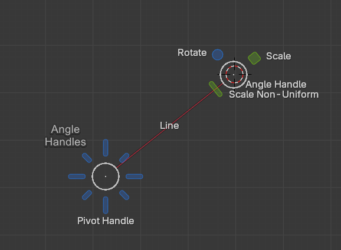
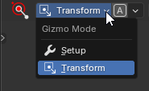
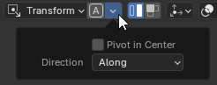
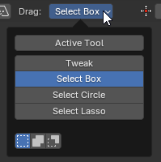
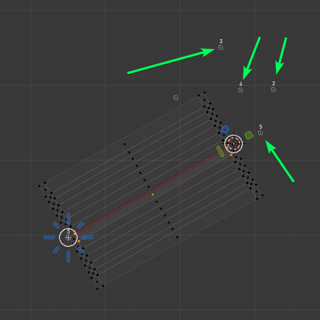
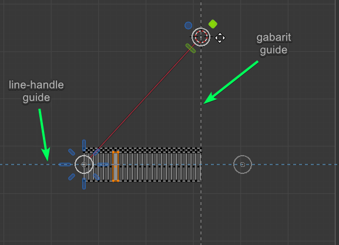
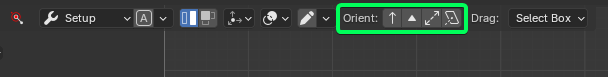
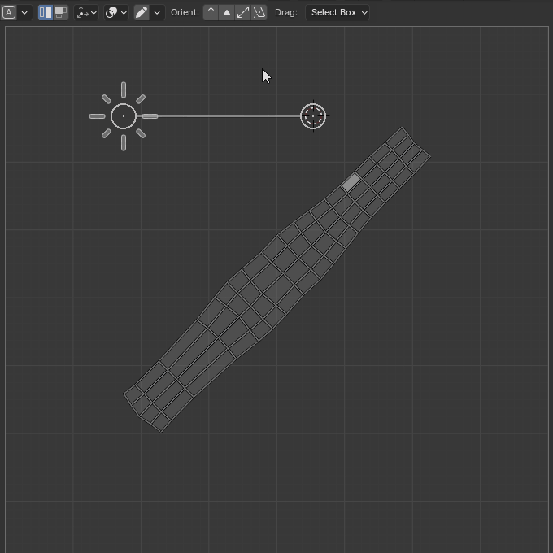
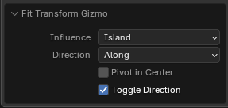
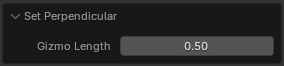

# Zen Touch Tool

## Description

**Zen Touch Tool** is a universal UV transformation tool that provides fast and intuitive control over moving, scaling, and rotating UV islands in the **UV Editor**. It allows for quick and easy execution of both basic and advanced transformations.

*"No advanced mode. Just pure magic straight from you."*

The Zen UV gizmo supports both basic transformations and advanced features such as alignment, proportional and non-uniform scaling, **Texel Density** adjustment, **Flip**, working with guidelines, and more.

---

## Gizmo Interaction

The gizmo consists of two main points, which are generally equivalent in effect, and a line.

- **Pivot-handle (P-handle)** — The primary transformation point.
- **Angle-handle (A-handle)** — The orientation and alignment point.
- **Line-handle (L-handle)** — The movement line. This handle has two states, each with a distinct appearance:
    - **Free movement** — A solid line. In this state, movement is unrestricted in any direction.
    - **Movement along the line only** — A dashed line. In this case, movement is constrained to the direction of the **Line-handle**.

Additionally, there are extra handles, most of which appear only in **Transform** mode:

- **Align-handles** — Represented by eight handles that allow alignment and transformation at specific angles based on their individual positions.
- **Rotate-handle (R-handle)** — Rotates around the **P-handle**.
- **Scale-handle (S-handle)** — Performs proportional scaling.
- **Non-uniform-handle (NU-handle)** — Scales along the **Line-handle** axis.

!!! Tip
    You can enable handle names in the gizmo properties.
    In *Tool Properties*, find the **Display Transform Handles** setting and activate **Handle Tooltip**.

---

## Operation Modes

### Setup Mode

This mode is used to position the gizmo relative to the geometry before performing transformations. In **Setup Mode**, moving the gizmo does not affect UV islands.

**Key Functions:**
- Positioning the gizmo for convenience.
- Setting its orientation.
- Defining the pivot point (**Pivot-handle**).

### Transform Mode

In this mode, the gizmo performs transformations on UV islands or selected elements (**Selection**).

Special **handles** are available in this mode:
- **Rotate-handle** (*R-handle*) — Rotates around the **P-handle**.
- **Scale-handle** (*S-handle*) — Performs proportional scaling.
- **Non-uniform-handle** (*NU-handle*) — Scales along the **Line-handle** axis.

---

## Quick Actions (Double Click & Shortcuts)

Zen Touch Tool provides **quick actions** for fast gizmo setup and transformation.  
Use **double-click** and **modifier keys** for quick alignment, scaling, snapping, and transformations.

---

### **Setup Mode (Detailed List)**

In **Setup Mode**, these actions adjust the gizmo without affecting the UV islands.

- **P-handle (Double Click)** — Align the gizmo to the island **along** its direction.  
  - If the gizmo is already aligned, it will switch to **across** the island.
- **P-handle (Ctrl + Double Click)** — Align the gizmo to the island **along** its direction and set the **P-handle** to the **center** of the island.
- **A-handle (Double Click)** — Align the gizmo to the **selection**.  
  - If already aligned, it will switch to **across** the selection.
- **A-handle (Ctrl + Double Click)** — Align the gizmo to the **selection** and set the **P-handle** at the **center** of the selection.
- **L-handle (Double Click)** — Toggle the **movement constraint mode** to move only **along the L-handle**.  
  *(Movement along the line does not work in Setup Mode, but you can enable it before switching to Transform Mode.)*

---

### **Transform Mode (Detailed List)**

In **Transform Mode**, these actions directly affect the UV islands.

- **P-handle (Double Click)** — Align the island based on **3D world orientation** (**World Align**).
- **A-handle (Double Click)** — Apply **Texel Density (Set TD)**.
- **A-handle (Ctrl + Double Click)** — Sample **Texel Density (Get TD)** from the selection.
- **L-handle (Double Click)** — Toggle **movement constraint mode** to move only **along the L-handle**.
- **R-handle (Double Click)** — Rotate the island **clockwise** by the **Snap Angle** value.
- **R-handle (Ctrl + Double Click)** — Rotate the island **counterclockwise** by the **Snap Angle** value.
- **NU-handle (Double Click)** — Scale the island **down by 50%**.
- **NU-handle (Ctrl + Double Click)** — **Scale the island to zero**.
- **S-handle (Double Click)** — Scale the island **up by 200%**.

---

## **Quick Actions Table Format**

For quick reference, here’s the same information in a compact **table format**.

### **Setup Mode (Table Format)**

| **Action** | **Effect** |
|------------|-----------|
| **P-handle (Double Click)** | Aligns the gizmo to the island **along** its direction. If already aligned, switches to **across**. |
| **P-handle (Ctrl + Double Click)** | Aligns the gizmo **along** the island and places the **P-handle** in the island **center**. |
| **A-handle (Double Click)** | Aligns the gizmo to the **selection**. If already aligned, switches to **across**. |
| **A-handle (Ctrl + Double Click)** | Aligns the gizmo to the **selection** and places the **P-handle** in the selection **center**. |
| **L-handle (Double Click)** | Toggles **movement constraint mode** (along the L-handle). *(Takes effect in Transform Mode.)* |

---

### **Transform Mode (Table Format)**

| **Action** | **Effect** |
|------------|-----------|
| **P-handle (Double Click)** | Aligns the island based on **3D world orientation (World Align)**. |
| **A-handle (Double Click)** | Apply **Texel Density (Set TD)**. |
| **A-handle (Ctrl + Double Click)** | Sample **Texel Density (Get TD)** from the selection. |
| **L-handle (Double Click)** | Toggles **movement constraint mode** (along the L-handle). |
| **R-handle (Double Click)** | Rotates the island **clockwise** by the **Snap Angle** value. |
| **R-handle (Ctrl + Double Click)** | Rotates the island **counterclockwise** by the **Snap Angle** value. |
| **NU-handle (Double Click)** | Scales the island **down by 50%**. |
| **NU-handle (Ctrl + Double Click)** | **Scales the island to zero**. |
| **S-handle (Double Click)** | Scales the island **up by 200%**. |

---

These **quick actions** significantly improve workflow efficiency by allowing **faster and more precise** UV transformations.

## Core Transformations

Zen Touch Gizmo supports a wide range of operations:

- **[Move](#move)** — Free movement, along the **L-handle**, or constrained to coordinate axes.
- **[Scale](#scale)** — Uniform scaling or scaling along a single axis.
- **[Rotate](#rotate)** — Free rotation or angle-snapped rotation.
- **[Alignment by Rotation](#alignment-by-rotation)** — Align by UV axes, by an edge, or using a custom orientation.
- **[Flip](#flip)** — Mirroring along any axis.
- **[Fit](#fit)** — Adjust the island size.
- **[Match Size](#match-size)** — Resize the island based on the size of its individual elements.
- **[Align](#align)** — Position the island based on any existing point in the UV Editor or align it to a grid guide.
- **[Verts Align](#verts-align)** — Align selected vertices into a straight line, regardless of the line's orientation.
- **[World Orient](#world-orient)** — Orient based on 3D space.
- **[Falloff](#falloff)** — Transformation with gradual attenuation.
- **[Texel Density](#texel-density)** — Set UV scale in terms of texel density.
- **[Island Draw](#island-draw)** — "Draw" the island for quick manual adjustments or to fit it into predefined boundaries.

---

## Tool Properties

The properties and operators of the gizmo are listed in the *View → Tool Settings* panel in the order they appear in the interface.

---

**Property:**

- **Gizmo Mode** - Defines what type of operation is performed by gizmo
    - *Setup* - Setting up gizmo position
    - *Transform* - Transforming UVs

---

**Operator:**

- **Auto Setup By Selection** - Gizmo handles automatically set up by selection depending on island or selection influence
    - *Pivot in Center* - Set pivot in the selection center.
    - *Direction* - Specifies how to place the gizmo. Along the selection or across it.
        - *Along* - Along the selection
        - *Across* - Across the selection

---

**Property:**

- **Influence** - Transform Influence. Affect Islands or Elements (vertices, edges, polygons)
    - *Island* - Process islands
    - *Selection* - Process selected mesh elements (vertices, edges, faces)

---

**Property:**

- **Editing Mode** - Defines how UV editing behaves in Transform Gizmo mode.
    - *Default*
    - *Radial Falloff*
        - *Invert Falloff* - Invert the falloff effect.
        - *Falloff Exponent* - Controls the strength of the falloff effect.
    - *Linear Falloff*
        - *Invert Falloff* - Invert the falloff effect.
        - *Falloff Exponent* - Controls the strength of the falloff effect.

---

**Property:**

- Display Gizmo State - Defines what parts of available transform gizmos should be displayed
    - **Align Handles** - Align handles around pivot.
    - **Scale Handle** - Uniform scale handle.
    - **Scale Non-Uniform** - Non-uniform scale handle.
    - **Rotation Handle** - Dedicated rotation handle.
    - **Guidelines** - Enable dynamic guidelines for uv transform operations.
    - **Bounding Box** - Enable bounding box for UV transform operations.
    - **Handle Name** - Display handle name in viewport.
    - **Handle Tooltip** - Display handle tooltip in viewport.

---

**Operator:**

- **Draw Transform Gizmo** - Draw UV transform gizmo using mouse.
    - **Allow Merge In Draw** - Snapped UV vertices are welded together during mouse draw.
    - **Snap Margin In Draw** - UV vertices are drawn with an offset relative to snapped points.

---

**Operators group:**

- **Fit Transform Gizmo** - Fit UV transform gizmo to islands or selection along the island.
- **Fit Transform Gizmo** - Fit UV transform gizmo to islands or selection along the island with pivot in the island center.
- **Swap Handles** - Swap transform gizmo pivot and angle handles
- **Set Perpendicular** - Set the gizmo perpendicular to the existing setup with the defined gizmo length.

---

**Property:**

- **Drag** — A standard property of all gizmos in Blender that defines behavior when dragging in the viewport. This does not refer to interacting with gizmo handles but rather to moving across empty space or over geometry.

---

**Property group:**

**User Values** display numerical transformation data for more precise gizmo adjustments
    - **Move** - Adjust value of moved UV islands (selection).
    - **Rotation Angle** - Adjust value of rotated UV islands (selection).
    - **Scale** - Adjust value of scaled (resized) UV islands (selection).

### Scale Input Behavior

There is a specific behavior associated with the **Scale** input field. Since negative scaling on both axes simultaneously is not possible ([learn more here](#flip)), this field does not accept negative values. Entering a negative value will automatically convert it to a positive value while adding a **180-degree rotation**.

However, for better clarity when transitioning through zero, the negative value remains visible during input. Once the input is confirmed, the value will revert to positive.

### N-Panel Tool Properties

Gizmo properties in the UV Editor (*N-Panel → Tool*).

This panel contains the same properties as in *View → Tool Settings*, but after the **Orient** operator group, the following additional properties are available:

- **Dial Step Angle** — Step increment for the dial angle (in degrees) in the transformation gizmo.
- **Texel Density** — Texel density value.

!!! Tip    
    **Transformation properties visibility in the N-Panel - Tool.**  
    If the gizmo is in **Setup Mode**, **User Values** will not be displayed.  
    If the gizmo is in **Transform Mode**, these properties will appear after activating the gizmo, as they reflect only the current transformation.  
    They display adjustable parameters for the last performed transformation and cannot be shown if no transformation has occurred yet.

---

### Shortcuts, Status Bar, and Axis Lock

We have already assigned essential hotkeys, but you can add your own as needed.  
One of the most important and frequently used shortcuts is for switching the gizmo mode.

- **Space** — Toggles the gizmo mode between **Transform** and **Setup**.
- **Ctrl** — Temporarily enables snapping while held down.

In the **Status Bar**, you can find hints about hotkeys for working with the gizmo during transformations. The available shortcuts may change depending on the transformation being performed.

- **Enter** — Confirm. You don’t necessarily need to use this shortcut, as transformations are confirmed automatically when you release the mouse button.
- **Esc** — Cancel transformation. You can always use *Undo*, but if you realize mid-transformation that it's not what you need, use this shortcut to revert both the geometry and gizmo to their initial state.
- **X, Y** — Lock X, Lock Y. Standard axis locks for transformations.
- **Z** — Lock Z. The UV Editor does not have a Z-axis, but for convenience, this shortcut constrains transformations **along the Line-handle**.
- **A** — Enable/Disable Angle Step. Turns off angle snapping if it interferes with your workflow.
- **Shift** — Standard shortcut for more precise positioning.

### Additional Hotkeys

In addition to the shortcuts displayed in the **Status Bar**, there are extra hotkeys for quickly executing specific transformations:

- **G** — Move
- **S** — Scale
- **R** — Rotate

These hotkeys allow transformations without needing to click on the corresponding handles.  
Simply hold the desired key, press the left mouse button anywhere on the screen, and drag.  
The transformation will behave as if you were dragging a handle.

---

### Working with Snapping

Snapping in **Zen Touch Tool** is activated and configured the same way as in Blender.

One of the most useful features is the **temporary activation** of snapping by holding **Ctrl**.  
This allows you to enable snapping on the fly during a transformation, which is especially helpful in **Setup Mode** when positioning the gizmo in preparation for a transformation.

In addition to the snap points defined in Blender’s snapping properties, we have added **[Transformation History](#transformation-history) points**.  
These points will also be considered for snapping, regardless of the main snapping settings.

---

### Transformation History

During transformations, you may notice numbered points appearing after each movement.  
These are **Transformation History** points.  
By using them with [snapping](#working-with-snapping), you can revert geometry to one of its previous states.

---

### Guidelines

Transformations performed with the tool can often be complex, especially when aligning with other islands.  
To simplify this process, we have introduced **guidelines**.

In general, guidelines fall into two categories:

#### Non-Disableable Guidelines

Following Blender’s approach to guidelines, these are always visible once a transformation begins.  
They indicate the direction of transformation when an axis lock is used. Each guideline follows the standard axis color scheme:

- **Red** — X axis
- **Green** — Y axis
- **Blue** — Since the UV Editor does not have a Z axis, this color represents movement along the **Line-handle** axis.

#### Disableable Guidelines
This group includes guidelines that display the island’s bounding box or highlight the snapping reference point.  
These guidelines are colored **gray**.

---

### Gizmo Status Button

While editing geometry, there may be cases where the gizmo is out of view, but you still need to know its mode.  
To address this, a **standard Blender gizmo button** is located near the **N-Panel**, displaying the current gizmo mode.

Additionally, you can use this button to switch between **Setup** and **Transform** modes.  

- In **Setup Mode**, the button is **gray** with a **wrench icon**.  
- In **Transform Mode**, the button is **dark red** with an **icon representing movement**.  

The visibility of this button can be toggled in the **[Addon Preferences](addon_prefs.md)**.

---

### Transformations

All transformations can be performed either freely or with high precision, depending on the initial positioning of the gizmo in **Setup Mode**.  
The examples below demonstrate both methods. However, rest assured that you can achieve **precise transformations** in any of these cases if needed.

When using **[axis locks](#shortcuts-status-bar-and-axis-lock)** or **[snapping](#working-with-snapping)**, the gizmo operates in a **"detached state"**.  
This means the gizmo itself can move freely, regardless of axis constraints.  
This allows you to clearly see where the snapping is leading or visually assess the alignment of the island.  
However, the actual transformation of the geometry will strictly follow the locking settings.

#### Move

Movement is primarily performed by dragging the **Line-handle**.  
Additionally, movement can be **complex**, involving sequential adjustments of both the **A-handle** and **P-handle**.

#### Scale

Scaling can be **proportional** or **non-proportional**.  
Non-proportional scaling is always performed along the **Line-handle**.

#### Rotate

Rotation can be **free** or **angle-snapped**.  
By default, rotation is free. At the start of the rotation, a **dial gizmo** appears on the screen, visually indicating the current angle by filling marker segments.

To activate **angle snapping**, press **"A"** during rotation.

#### Alignment by Rotation

Alignment can be performed **by UV axes, by an edge, or using a custom reference**.

The following example demonstrates **custom alignment** using snapping.

#### Flip

Flipping can be performed along **any axis**, but it is achieved **only through scaling along a single axis**.  
Flipping is **not possible** when scaling along both axes simultaneously.  
For this reason, Flip is always performed using the **non-uniform-handle**.

If you require a precise **Flip without distortions**, use the special **Flip point**, marked with an **F inside a circle**.

The example below demonstrates an attempt to flip along **both axes** using standard Blender tools.  
Due to the way transformations work technically, such an operation results in a **180-degree rotation** instead.

#### Fit

Adjusts the island size to fit within the desired bounds.

#### Match Size

Resizes the island based on the size of its individual elements.

#### Align

Aligns the island to any existing point in the **UV Editor** or to the grid guide.

#### Verts Align

Aligns selected vertices into a straight line, regardless of the line’s orientation.

#### World Orient

Aligns the UV orientation based on **3D space**.

**Double-clicking** the **Pivot-handle** executes the **World Align** operator.

#### Texel Density

Sets the UV scale based on **texel density** values.

#### Falloff

Transformation with gradual attenuation.

There are two **Falloff** modes:

- **Linear** — Controls attenuation starting from the **Pivot-handle**.  
  Vertices on the opposite side of the **Line-handle** will remain unaffected.  
  Once in **Transform Mode**, the **Pivot-handle** becomes fixed and cannot be moved.  

  This type of falloff has the following properties:

!!! Properties
    

    - **Invert Falloff** - Invert the falloff effect
    - **Falloff Exponent** - Controls the strength of the falloff effect
    - **Linear falloff type** - Select the transformation used in linear falloff mode for the angle handle
        - *Rotation* - Use rotation transformation
        - *Translation* - Use translation transformation

    - **Linear Falloff Type** — Determines which transformation will be applied when using the **Angle-handle**.  
    You can choose either one or both transformation types.

- **Radial** — Controls attenuation starting from the **Pivot-handle**.  
  Affects all vertices within the **falloff gizmo’s circular area**.  
  Once in **Transform Mode**, the **Pivot-handle** becomes fixed and cannot be moved.  

  This type of falloff has the following properties:

!!! Properties
    

    - **Invert Falloff** - Invert the falloff effect
    - **Falloff Exponent** - Controls the strength of the falloff effect

#### Island Draw

"Drawing" an island for quick manual adjustments or fitting it into predefined boundaries.

You can also "draw" the gizmo in **Setup Mode**, which is especially convenient when snapping is enabled.

---

### Orient Operators

For a successful transformation, it is crucial to set up the tool correctly.  
To simplify and speed up this process, we have developed a set of **Orient Operators**.  

These operators work in both **Setup** and **Transform** modes but never affect the selected geometry — **only the gizmo**.

---

#### Fit Transform Gizmo

Fits the UV transform gizmo to **islands** or **selection**.  
This operator is designed so that if the gizmo is already placed across the island, it will automatically switch to an along placement.  
This behavior can be disabled using the **Toggle Direction** setting.

- **Influence** — Determines what the gizmo affects: Islands or Selection.
    - *Island* — Affects entire islands.
    - *Selection* — Affects only the selected elements.
- **Direction** — Specifies how to align the gizmo with the selection.
    - *Along* — Aligns the gizmo along the selection.
    - *Across* — Aligns the gizmo across the selection.
- **Pivot in Center** — Sets the pivot at the center of the selection.
- **Toggle Direction** — Enables toggling the gizmo direction between **along** and **across** the island.

This operator is also used for **automatic gizmo setup** when changing the selection.  
The button for enabling auto-positioning is located next to the gizmo mode switch.

---

This is also **Fit Transform Gizmo**, but configured to place the **pivot at the center** of the island.  
This can be especially useful when working with circular islands.

---

#### Swap Handles

Swaps the **Pivot-handle (P-handle)** and **Angle-handle (A-handle)**.

This operator has no additional settings — it simply switches the positions of the **P-handle** and **A-handle**.  
This can be useful if you decide to rotate or scale the island from the opposite reference point.

---

#### Set Perpendicular

Sets the gizmo **perpendicular** to its current orientation while preserving its length.

This is a **specialized operator** designed to allow transformations **perpendicular to the Line-handle direction**.
This is especially useful when flattening an selection along a single axis.

- **Gizmo Length** — Adjusts the gizmo length as a percentage, where **1** represents the original length.

---

## Conclusion

**Zen Touch Tool** provides a **powerful** and **intuitive** way to work with UVs.  
Whether you use a **mouse, stylus, or even a lightsaber** — all transformations remain under your control.

