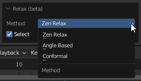
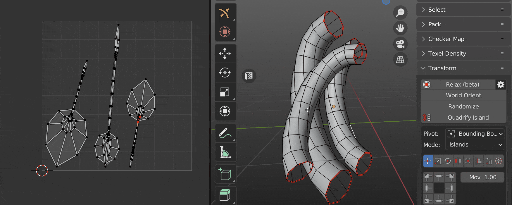
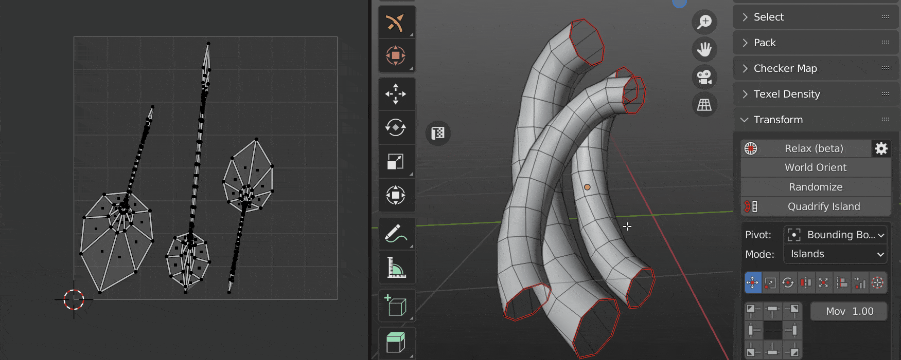
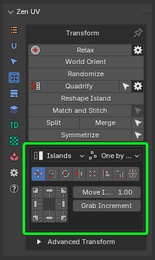
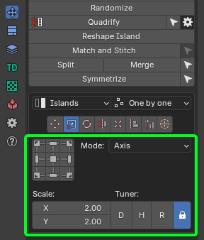
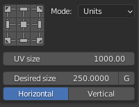
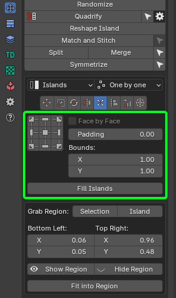

# Transform System

This panel contains tools to transform UVs.

!!! Panel
    

!!! Tip
    

    UV Editor panel contains extra operator [**Reshape Islands. Click to read full information**](operators/reshape_island.md).

---
## Independent Transform Operators

### Relax 

Allows to reduce the stretching the faces of the island. Uses three algorithms.

!!! Panel
    
     - **Zen Relax**. The algorithm is most suitable for organic objects.
     - **Angle Based**. Blender's native algorithm. Most suitable for the hard surfaces objects.
     - **Conformal**. Blender's native algorithm. Same as **Angle Based**, but much faster. However, can lead to undesired results if the island is complicated.

### World Orient.

Rotate Islands the way they are oriented on the Models. Each method (Organic/Hard Surface) uses a heuristic approach and correctly orients most of the Islands in its area.

!!! Panel
     

     - **Method: Hard Surface / Organic**. The orientation method is suitable for geometry types.
     - **Further orient**. Additional turn. Allows you to turn the island to a horizontal or vertical if the island is located at an angle in the model.
     - **Flip By Axis**. Allow changing direction of the island after basic orientation. Suitable if needed change orientation from legs to head for example.

### Randomize.
  Randomize the position, rotation, and scale of the islands or selected vertices.

!!! Panel
     

### Quadrify Islands 

Straighten rectangular-shaped Islands.

!!! Preferences

       

    - **By selected Edges**. Selected Edges will be used and marked as Seams during Quadrify Islands operation. Works only in edge selection mode.
     
    - **Mark Borders**. Mark borders as seams/sharp after Quadrify Island operation.
    - **Mark Seams**. Mark seam in case **Mark Borders** is on.
    - **Mark Sharp**. Mark sharp in case **Mark Borders** is on.
    - **Orient to**. How to orient Quadrified Islands.
        - **Initial**. Leave orientation as is.
        - **Vertical**. Set orientation vertical.
        - **Horizontal**. Set orientation horizontal. 
         

    - **Average Texel Density**. Averaging the size for the processed islands.
    - **Pack Quadrified**. Pack Islands after Quadrify Islands operation.
    - **Pin Quadrified**. Pin Islands after Quadrify Islands operation.
     
    - **Tag as Finished**. Tag Quadrified islands as finished.

!!! tip
    Tag Quadrified Islands as [**Finished**](unwrap.md#finishing-system) to preserve them from unwrapping. It's recommended to [**Tag as Finished**](unwrap.md#tag-finished) all manually changed Islands.
    

### Reshape Island

Changes the island’s shape depending on the preset. [Here is full information](operators/reshape_island.md) about Reshape Island.

!!! Panel
    

    - **Selected**. Straighten the selected Edge Loops and relax not selected vertices.
    - **U Direction / V Direction**. Edges is aligned in the indicated direction.
    - **Borders**. Straighten the edges of the island in even lines according to the given parameters.

### Match and Stitch

Matching the position, rotation, and scale of Islands. Stitch the vertices together, if possible.

!!! Panel
    

!!! tip
    Watch the video explaining how **Match and Stitch** works.

    

    <iframe src="https://www.youtube.com/embed/f9meGzMGx2k?start=974&end=1061" style="position: absolute; top: 0; left: 0; width: 100%; height: 100%;" allowfullscreen="" seamless="" frameborder="0"></iframe>
    

---

## Unified Transform System

!!! Panel
    

### Universal Control Panel

!!! Control
    **Universal Control Panel**

    

    The universal control panel has logic and different functions for different types of transformation.

---

### Transform Space

Switch between Islands and Texure-based transforms in 3D View.

!!! Panel
    
    

    - **Island**. Islands-based transforms.
    - **Texture**. Texure-based transforms. Works only for **Move** and **Rotate** tools.

### Mode

!!! Panel
    
    

    - **Islands**. Transformations will affect Islands.
    - **Selection**. Transformation will affect Selection (Faces, Edges, Vertices).

### Order

!!! Panel

    
    - **One by one**. Transformations will affect Islands.
    - **Overall**. Transformation will affect Selection (Faces, Edges, Vertices).
    - **System Pivot**. Transformations will affect Islands.

---
## Transform Types

### Move 

Move Selected Islands

!!! Info
    Buttons of the [**Universal Control Panel**](#universal-control-panel) in the Transform type **Move** represent the direction of shifting.

#### Move Increment

The value on which the island will be shifted.

---

### Scale 

Scale selected Islands.

!!! Info
    Buttons of the [**Universal Control Panel**](#universal-control-panel) in the Transform type **Scale** represent Points from where the island will be scaled.

#### Scale Mode

!!! Axis
    

    - **Scale**. The value of the scale of the island for each of the axes.
    - **Tuner**. System that helps change values quickly.
         - **"D".** Increase by two times.
         - **"H".** Decrease two times.
         - **"R".** Reset value to 1.0 .
         - **Lock.** - The Lock mode allows changing values as one.

!!! Units
    

     - **UV Size**. The estimated width of the UV area.
     - **Desired size**. The size of which should be set for selected elements relative to UV area.
     - **G**. Grab desired size from current selection. Exist only in the 3D Viewort context. Can be used only for 2 vertices or for one edge selection.
     - **Horizontal / Vertical**. What mean the Desired Size.

---
### Rotate 

Rotate selected Islands.

!!! Info

    Buttons of the [**Universal Control Panel**](#universal-control-panel) in the Transform type **Scale** works as described. Buttons located in the corners rotate the island in the specified direction.

    The central button performs the automatic aligning of the island horizontally or vertically. The buttons at the top and bottom align the island vertically. Buttons on the left and right align the island horizontally.

#### Rotate Increment

The value on which the island will be rotated.

#### Orient by selected

Reorient the island by selected elements (vertices, edges, polygons).

---
### Flip 

Flip Selected Islands.

!!! Info
    Buttons of the [**Universal Control Panel**](#universal-control-panel) in the Transform type **Flip** represent flip direction.

---
### Fit 

Fit Island to UV Square.

!!! Info
    Buttons of the [**Universal Control Panel**](#universal-control-panel) in the Transform type **Fit** represent origins from where **Fit** will be performed.

#### Face by Face

Fit Face by Face.

#### Fill Islands

Fit Islands from Center without keeping proportions.

#### Padding

Clearance between island and UV Square bounds.

#### Bounds

It makes it possible to fill out not UV Square but any other area.

### Fit into Region

!!! Panel
    

    - **Grab Region: Selection / Island**. Allow to grab Region size in different manners.
    - **Bottom Left: Top Right:**. The bounding box of the region.
    - **Fit into Region**. Fit selected island in to the Region described in the bounding box.

---

### Align 

Align selected Islands.

!!! Info
    Buttons of the [**Universal Control Panel**](#universal-control-panel) in the Transform type **Align** represent the side by which the islands will be aligned.

#### Vertex by Vertex
Mode for Vertex Alignment.

#### Center by Axis
Align selected Islands Horizontally or Vertically in Center.

#### Align to

- **Selection Bounding Box**.
- **UV Area Bounds**. 
- **Position**.
- **2D Cursor**.
- **To Active Component**.
---

### Distribute 

Distribute, Sort and Arrange selected Islands.

#### Islands Mode

 - **Distribute & Sort**. Distributes and Sorts selected Islands.
 - **Arrange**. Arrange selected Islands.

#### Selection Mode

 - **Distribute**. Distribute vertices along the line.

---

### 2D Cursor 

Align 2D Cursor over the selected island. 

!!! Info
    Buttons of the [**Universal Control Panel**](#universal-control-panel) in the Transform type **2D Cursor** represent sides of the island or selected elements.

!!! tip
    Don't forget to drink some good beer today!

---

## Advanced Transforms

Advanced Transforms panel represents transforms without **Universal Control Panel**.
Recommended to use if you want to add shortcuts for transform operations. 

!!! Panel
    

### Move 

#### By Increment
Move Islands by Increment.

#### To the Active Trim
Move Islands to the Active Trim.

#### To Position
Move Islands to Position.

#### To 2D Cursor
Move Islands to 2D Cursor.

#### To Mouse Cursor
Move Islands to Mouse Cursor.

#### To UV Area
Move Islands to UV Area.

---

### Scale 

#### By Axis
Scale Islands by Axis.

#### By Units
Scale Islands by Units.

---

### Rotate 

#### By Angle
Rotate Islands by Angle.

#### By Increment
Rotate Islands by Increment.

#### Orient by Bounding Box
Orient Islands to Bounding Box.

#### Orient by Selection
Orient Islands by Selection.

---

### Flip 

#### Horizontal
Flip Islands Horizontally.

#### Vertical
Flip Islands Vertically.

---

### Fit 

#### To UV Area
Fit Islands to UV Area.

#### To Region
Fit Islands to Region.

---

### Align 

#### To Selected BBox
Align Islands to Selected BBox.

#### To Position
Align Islands to Position.

#### To 2D Cursor
Align Islands to 2D Cursor.

#### To UV Area
Align Islands to UV Area.

#### To Active Component

Align Islands to Active Component.