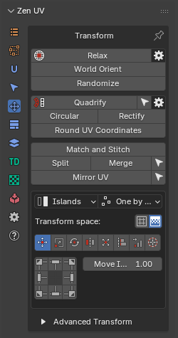
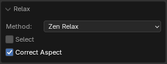
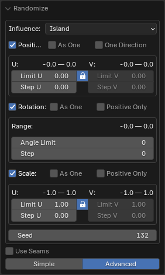
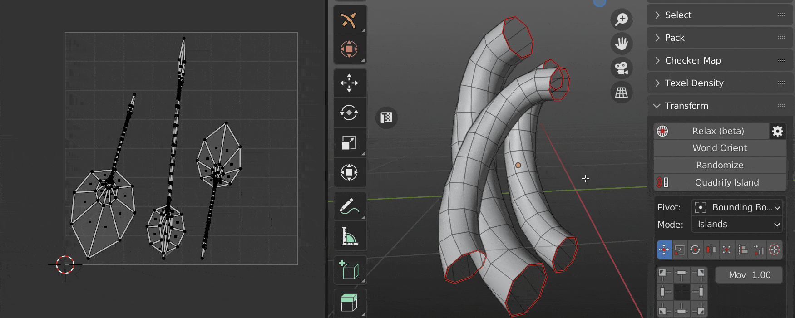
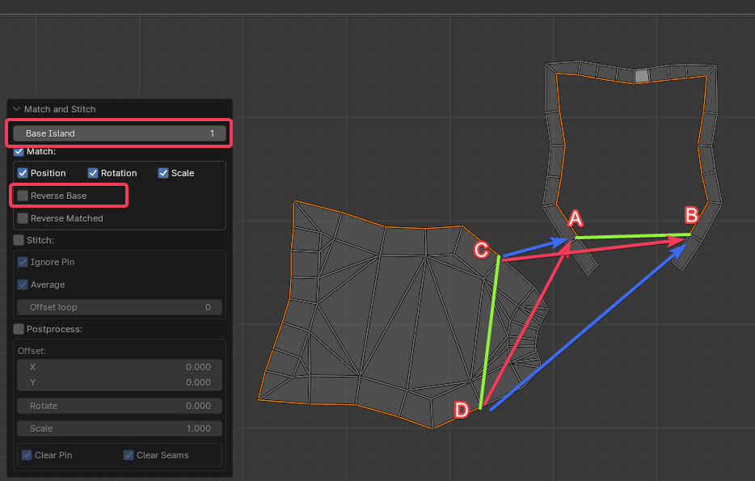
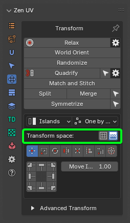
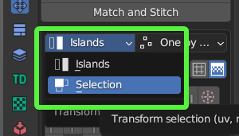
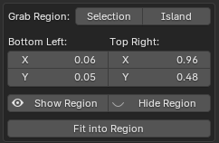
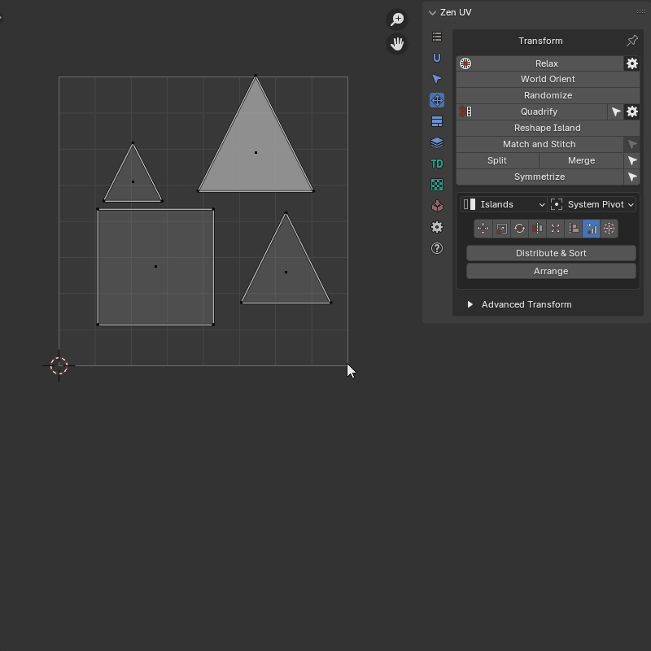

# Transform System

This panel contains tools to transform UVs.

!!! Panel
    | 3D Viewport | UV Editor| 
    |---|---|  
    |  | |

    UV Editor panel contains extra operator [**Reshape Islands. Click to read full information**](operators/reshape_island.md).

---
## Independent Transform Operators

### Relax
 Allows to reduce stretching of the faces of the island. Uses three algorithms

|  |
| --- |
| Relax |

!!! Properties
    

- **Method** - Unwrapping method
    - *Zen Relax* - The algorithm is most suitable for organic objects.
    - *Angle Based* - Blender's native algorithm. Most suitable for hard surface objects.
    - *Conformal* - Blender's native algorithm. Same as **Angle Based**, but much faster. However, can lead to undesired results if the island is complicated.
- **Select** - Select relaxed island
- **Correct Aspect** - Taking image aspect ratio into account

!!! Pproperties

    

- **Use [Zen Sets](https://blendermarket.com/products/zen-sets) to Highlight Errors** - Use [Zen Sets](https://blendermarket.com/products/zen-sets) to create [Zen Sets](https://blendermarket.com/products/zen-sets) Groups with Mesh Errors

---
### World Orient
Rotate Islands the way they are oriented on the Models. Each method (Organic/Hard Surface) uses a heuristic approach and correctly orients most of the Islands in its area.

|  |
| --- |
| World Orient |

!!! Properties
     

- **Method** - The orientation method is suitable for geometry types
    - *Hard Surface*
    - *Organic*
- **Further orient** - Additional turn. Allows you to turn the island to a horizontal or vertical if the island is located at an angle in the model.
- **Flip By Axis** - Allow changing direction of the island after basic orientation. Suitable if needed change orientation from legs to head for example
- **Reverse Axis** - Allows you to change the direction of the axis to the opposite

---
### Randomize
  Randomize the position, rotation, and scale of the islands or selected vertices. This operator can work in simple and advanced mode.

!!! Properties
    Randomize **Simple** mode

    

- **Influence** - Transform Influence. Affect Islands or Elements (vertices, edges, polygons)
    - *Island*
    - *Selection*
- **Position** - Position Range
    - *Limit U* - The range starts with a negative value U and ends with its positive value
    - *Limit V* - The range starts with a negative value V and ends with its positive value
- **Lock Axes** - Lock values for uniform transformation over the axes
- **Rotation** - Rotation angle range
    - *Angle Limit* - The range starts with a negative angle value and ends with its positive value
- **Scale** - Scale Range
    - *Limit U* - The range starts with a negative value U and ends with its positive value
    - *Limit V* - The range starts with a negative value V and ends with its positive value
- **Seed** - Change transformation in the set ranges by random value
- **Use Seams** - Use seams as an island separator to prevent stacked islands from self-welding
- **Randomize Mode** - Sets operator mode
    - *Simple* - Only basic functions are enabled
    - *Advanced* - Full control over the operator. You can specify the step, etc.

!!! Properties
    Randomize **Advanced** mode

    

- **Influence** - Transform Influence. Affect Islands or Elements (vertices, edges, polygons)
    - *Island*
    - *Selection*
---
- **Position** - Location transformation switch
- **As One** - Move the entire selection as a single unit
- **One Direction** - Turns on the mode when the beginning of the range starts from zero. All transformations will occur in the one direction
- **Limit U** - The range starts with a negative value U and ends with its positive value
- **Limit V** - The range starts with a negative value V and ends with its positive value
- **Lock Axes** - Lock values for uniform transformation over the axes
- **Step U** - The step along a U axis at which the move will be performed
- **Step V** - The step along a V axis at which the move will be performed
---
- **Rotation** - Rotation transformation switch
- **As One** - Rotate the entire selection as a single unit
- **Positive Only** - Turns on the mode when the beginning of the range starts from zero. All rotations will occur in the positive direction
- **Angle Limit** - Rotation angle range
- **Step** - The step with which the rotation will be performed
---
- **Scale** - Location transformation switch
- **As One** - Scale the entire selection as a single unit
- **Positive Only** - Turns on the mode when the beginning of the range starts from 1.0. All scaling will occur in the positive values. No islands flipping
- **Limit U** - The range starts with a negative value U and ends with its positive value
- **Limit V** - The range starts with a negative value V and ends with its positive value
- **Lock Axes** - Lock values for uniform transformation over the axes
- **Step U** - The step along a U axis at which the scaling will be performed
- **Step V** - The step along a V axis at which the scaling will be performed
---
- **Seed** - Change transformation in the set ranges by random value
- **Use Seams** - Use seams as an island separator to prevent stacked islands from self-welding
- **Randomize Mode** - Sets operator mode
    - *Simple* - Only basic functions are enabled
    - *Advanced* - Full control over the operator. It is possible to specify the step value, etc.

|  |
| --- |
| Explanation of the randomization step|

---
### Quadrify Islands

 Straighten rectangular-shaped Islands

!!! tip
    The Quadrify operator works only with quad faces. All other types of faces are ignored.
    

!!! tip
    If you work with high-poly meshes, you can customize the operator before it is launched. Use the gear button to the right of the operator in the main panel.
    

!!! Properties
    

||
|---|
||

- **Influence** - Transform Influence. Affect Islands or Selection
    - *Island*
    - *Selection*
- **Shape** - The face shape for the Zen UV algorithm
- **Average** - Averages the shape depending on the shape of the faces in the faceloop
- **Orient to** - Orient Quadrified Islands
    - *Skip* - Do not change the original orientation
    - *Align to Axis* - Align to the nearest axis
    - *Vertical* - Set orientation vertical
    - *Horizontal* - Set orientation horizontal
- **Texel Density** - Set texel density. Not available if Pack Quadrified is On
    - *Averaged* - Set averaged Texel Density
    - *Global Preset* - Set value described in the Texel Density panel as Global TD Preset
    - *Skip* - Do not make any texel density corrections
- **Pin** - Auto Pin
    - *Quads* - Perform pinning only faces that have been quadrified
    - *Island* - Pin the entire island or a selection, depending on the Influence mode
    - *Skip* - Do not perform Pinning
- **Pack Quadrified** - Pack Islands after Quadrify Islands operation
- **Tag as Finished** - Tag Quadrified island as finished
---
- **Advanced** - Advanced settings
- **Algorithm** - Calculation algorithm
    - *Zen UV* - Zen UV calculation algorithm
    - *Blender* - Native Blender follow active quad algorithm
- **Use selected Edges** - Selected Edges will be used as Seams during Quadrify Islands operation. Works only in edge selection mode
- **Limit** - The maximum number of edges used to create the seam. If the number of selected edges is greater than this number, the seams will not be created
- **Mark Borders** - Mark Island boundaries after Quadrify Islands operation
- **Skip Non Quads** - Skip islands that contain faces other than quads
- **Correct Aspect** - Map UVs taking image aspect ratio into account

!!! tip
    

    Assistant operator - [**Select Quaded Islands** - Selects islands that consist only of quads](./select.md#select-quaded-islands)

||
|---|
|Quadrify by selected Edges|

||
|---|
|Orient island|

||
|---|
|Auto Pin|

!!! tip
    Tag Quadrified Islands as [**Finished**](unwrap.md#finishing-system) to preserve them from unwrapping. It's recommended to [**Tag as Finished**](unwrap.md#tag-finished) all manually changed Islands.
    

---

### Reshape Island

Changes the island’s shape depending on the preset. [Here is full information](operators/reshape_island.md) about Reshape Island.

!!! Properties
    

    - **Selected**. Straighten the selected Edge Loops and relax not selected vertices.
    - **U Direction / V Direction**. Edges are aligned in the indicated direction.
    - **Borders**. Straighten the edges of the island in even lines according to the given parameters.

---

### Match and Stitch

Matching the position, rotation, and scale of Islands. Stitch the vertices together, if possible.

!!! Properties
    

- **Base Island** - Sets which of the selected islands will be considered the base island. That is, the one that will not be changed, will remain in place, and to which other islands will be matched or stitched.
- **Match** - Match Island parameters. Sets whether to perform the island matching procedure.
- **Position** - Match Island position
- **Rotation** - Match Island rotation
- **Scale** - Match Island size
- **Reverse Base** - Change the direction to the opposite direction for the base island
- **Reverse Matched** - Change the direction to the opposite direction for the matched island
- **Cycled Island** - Activate the option if we want to match cycled edge loops. For example a disk to a round hole
---
- **Stitch** - Stitch the vertices together, if possible
- **Ignore Pin** - Ignore Pinned vertices
- **Average** - Average Stitching
- **Offset loop** - Performs a cyclic shift of the vertices to be stitched. Use to correct if the stitching looks tangled
---
- **Postprocess** - Allow Postprocess
- **Offset** - Advanced Offset
- **Rotate** - Advanced Rotate
- **Scale** - Advanced Scale
- **Clear Pin** - Clear the Pins on the Primary edge loop
- **Clear Seams** - Clear the seams on the stitched edges

!!! tip
    

    Assistant operator - [**Select Linked Loops** - Selects all loops belonging to the mesh vertex based on any already selected loop](./select.md#select-linked-loops)

|Example of usage|
|---|
||

It is recommended that we always make the settings in sequence.
First, Match, and if we are satisfied, then turn on Stitch. Stitch can't fix mistakes made in Match. The algorithm works as follows:
- First, find the endpoints of both selections. In the picture, we got 2 groups marked as green lines:
    - 1 (AB)
    - 2 (CD)

- Now we take one of the islands and move it until the ends of the found segments match. We can get two variants.
    - C falls into B. D is in A. - The correct option (red arrows). We can turn on Stitch and finish the work.
    - C falls into A. D goes to B. - Incorrect option for our particular case (blue arrows).

- If we have a second case, we cannot turn on Stitch at this time. It will eventually do what it can, but we will get tangled edges. We need to "flip" one of the islands. This can be done using the **Reverse Base** or **Reverse Matched** option. It doesn't make much difference. Just choose the one that suits is better visually. Also, the island will not actually be turned over. Just A and B will change places. And that's it.

We can add the case when we are not satisfied with the island that the algorithm has chosen as a base. Change the **Base Island** parameter. This is an infinite cyclic value. If we have 2 islands selected, it will change the **Base Island** in turn.

!!! tip
    Watch the video explaining how **Match and Stitch** works.

    

    <iframe src="https://www.youtube.com/embed/f9meGzMGx2k?start=974&end=1061" style="position: absolute; top: 0; left: 0; width: 100%; height: 100%;" allowfullscreen="" seamless="" frameborder="0"></iframe>
    

---

### Split UV

Splits selected in the UV

!!! Properties
    

- **Minimum distance** - Sets the smallest distance sufficient for splitting but not visible to the eye
- **Distance** - The distance to which the vertices need to be moved
- **Per Vertex** - Split each vertex separately
- **Split Ends** - Splits the ends. The gap remains the same along the entire length

||
|-|
|Split UV properties|

---

### Merge UV Verts

Merge UV vertices belonging to the same mesh vertex

!!! Properties
    

- **Threshold** - Distance beyond which the merger does not take place
- **Unselected** - Merge all matching vertices. Not only the selected
- **Use Pinned** - Pinned vertices remain in place. The unpinned ones will be moved to the pinned ones
- **Use Seams** - Edges marked as seams will be ignored

!!! tip
    

    Assistant operator - [**Select UV Borders** - Select existing UV Borders](./select.md#select-uv-borders)

||
|-|
|Merghe UV example|

---

### Symmetrize UV

Symmetrize UV coordinates in a mirrored mesh
First, you need to select a part of the mesh with the correct coordinates. The operator will find the corresponding symmetrical part by itself

!!! Properties
    

- **Mesh Mirror Axis** - How the mirroring is represented in the object
- **UV Symmetry Axis** - UV Symmetry axis
- **Folded** - Creates a folded symmetry where the coordinates of one part are equal to the coordinates of the other
- **Axis Position** - Base position of the symmetry axis
    - *Manual* - Fully manual mode. The position of the symmetry axis depends only on the specified value
    - *2D Cursor* - 2D Cursor position
    - *UV Area Center* - UV Area center
    - *Active UDIM Center* - Active UDIM Tile center
    - *Bounding Box* - One side of the selection bounding box
    - *Active Trim Center* - Active trim center
- **Axis Properties** - The properties of the symmety axis.
- **Axis Offset** - Offset of the symmetry axis. This value is added to any "Axis Position" type
- **Manual Axis Position** - Position of the symmetry axis in manual mode. Active only if "Axis Position" is "Manual"
- **Symmetry Direction** - Bounding box symmetry direction. Active only if "Axis Position" is "Bounding Box"

!!! tip
    

    Assistant operator - [**Select Half** - Selects a part of the model according to its location relative to the coordinate axis](./select.md#select-half)

||
|-|
|Symmetrize UV Example|

---

## Unified Transform System

!!! Panel
    

### Universal Control Panel

!!! Control
    **Universal Control Panel**

    

    The universal control panel has logic and different functions for different types of transformation.

---

### Transform Space

Switch between Islands and Texure-based transforms in 3D View.

!!! Panel
    
    

    - **Island**. Islands-based transforms.
    - **Texture**. Texure-based transforms. Works only for **Move** and **Rotate** tools.

### Mode

!!! Panel
    
    

    - **Islands**. Transformations will affect Islands.
    - **Selection**. Transformation will affect Selection (Faces, Edges, Vertices).

### Order

!!! Panel

    
    
    - **One by one**. Transformations will affect Islands.
    - **Overall**. Transformation will affect Selection (Faces, Edges, Vertices).
    - **System Pivot**. Transformations will affect Islands.

---
## Transform Types

### Move

 Move Selected Islands 

!!! Info
    Buttons of the [**Universal Control Panel**](#universal-control-panel) in the Transform type **Move** represent the direction of shifting.

- **Move Increment** - The value on which the island will be shifted
- **Grab Increment** - Get the distance between two vertices or edge lengths and use it as the offset value for the move. The resulting value will be used as the **Move Increment** value

---

### Scale

 Scale selected Islands 

!!! Info
    Buttons of the [**Universal Control Panel**](#universal-control-panel) in the Transform type **Scale** represent Points from where the island will be scaled.

#### Scale Mode

!!! Axis
    

    - **Scale** - The value of the scale of the island for each of the axes.
    - **Tuner** - System that helps change values quickly.
        - *"D"* - Increase by two times.
        - *"H"* - Decrease two times.
        - *"R"* - Reset value to 1.0 .
        - **Lock.** - The Lock mode allows changing values as one.

!!! Units
    

     - **UV Size** - The estimated width of the UV area.
     - **Desired size** - The size of which should be set for selected elements relative to UV area.
     - **G** - Grab the desired size from the current selection. Exist only in the 3D Viewort context. Can be used only for 2 vertices or for one edge selection.
     - **Horizontal / Vertical** - What mean the desired size.

---
### Rotate

 Rotate selected Islands 

!!! Info

    Buttons of the [**Universal Control Panel**](#universal-control-panel) in the Transform type **Rotate** works as described below.
    
    - Buttons located in the corners rotate the island in the specified direction.
    - The central button performs the automatic aligning of the island horizontally or vertically.
    - The buttons at the top and bottom align the island vertically.
    - Buttons on the left and right align the island horizontally.

- **Rotate Increment** - The value on which the island will be rotated
- **Select Island by Direction** - Select island by direction (Horizontal, Vertical, Radial, Not Aligned). [Here is a full description of the operator](./select.md#select-islands-by-direction)
- **Orient by selected** - Reorient the island by selected elements (vertices, edges, faces)

---
### Flip

 Flip Selected Islands

!!! Info
    Buttons of the [**Universal Control Panel**](#universal-control-panel) in the Transform type **Flip** represent flip direction.

- **Always Center** - Always use the center of the island as a flipping pivot

---
### Fit

 Fit Island to UV Square

!!! Info
    Buttons of the [**Universal Control Panel**](#universal-control-panel) in the Transform type **Fit** represent origins from where **Fit** will be performed

- **Face by Face** - Fit Face by Face
- **Padding** - Clearance between island and UV Square bounds
- **Bounds** - It makes it possible to fill out not UV Square but any other area
- **Fill Islands** - Fit Islands from the center without keeping proportions

### Fit into Region

!!! Properties
    

- **Grab Region: Selection / Island** - Allow to grab Region size in different manners
- **Bottom Left: Top Right:** - The bounding box of the region
- **Show Region** - Show region using Annotations
- **Hide Region** - Hide Fit region
- **Fit into Region** - Fit the selected island into the Region described in the bounding box

||
|---|
|Using fit region|

---

### Align

 Align selected Islands

!!! Info
    Buttons of the [**Universal Control Panel**](#universal-control-panel) in the Transform type **Align** represent the side by which the islands will be aligned.

- **Vertex by Vertex** - Mode for vertex alignment. Aligns vertex by vertex. Transform selection mode only
- **Center by Axis** - Align selected islands horizontally or vertically in the center
- **Align to** - Relative to what to perform the alignment
    - *Selection Bounding Box*
    - *UV Area Bounds*
    - *Position*
    - *2D Cursor*
    - *To Active Component*

---

### Distribute

 Distribute, Sort and Arrange selected Islands

|||
|---|---|
|Islands mode|Selection mode|

- **Islands Mode**:
    - **Distribute & Sort** - Distributes and Sorts selected Islands
    - **Arrange** - Arrange selected Islands

- **Selection Mode**:
    - **Distribute** - Distribute vertices along the line

#### Distribute And Sort

Distributes and sorts the selected islands

!!! Properties
    

- **Direction Axis** - The axis along which distribution will take place
- **Start Point Offset** - Islands location start point
- **Sort by** - Sorting condition
    - *UV Position*
    - *UV Area*
    - *Mesh Area*
    - *Texel Density*
    - *UV Coverage*
    - *Island Mesh Position X*
    - *Island Mesh Position Y*
    - *Island Mesh Position Z*
- **Reverse** - Change the sorting direction to reverse
- **Margin** - Distance between distributed Islands
- **In Place** - Leave not active axis as is

||
|---|
|Distribute And Sort example|

---

#### Distribute vertices

Distribute vertices along the line

!!! Properties
    

- **Orient Loop Along** - Alignment options
    - *In Place* - The beginning and end of the loop remain in place
    - *U Axis* - Along U axis
    - *V Axis* - Along V axis
    - *Auto* - Will be aligned to the closer axis
- **Reverse Direction** - Change the direction of the aligned line
- **Spacing** - How to create spaces between points
    - *UV* - Like in the current uv positions
    - *Geometry* - Like in the mesh
    - *Evenly* - Spread evenly
- **Start Positions** - Position of starts of loops
    - *As Is*
    - *Max*
    - *Averaged*
    - *Min*
- **Lock** - Locks start and end positions
- **End Positions** - Position of ends of loops
    - *As Is*
    - *Max*
    - *Averaged*
    - *Min*

||
|---|
|Distribute Verts example|

---

#### Arrange

Arrange selected islands

!!! Properties
    

- **Mode** - Input mode
    - *Advanced*
    - *Simpified*
- **Quant U** - Divider for UV Area in U direction
- **Quant V** - Divider for UV Area in V direction
- **Limit** - Distribution limit
- **Position** - Offset for current position
- **Randomize** - Change transformation in the set ranges by random value
- **Scale** - Changes the scale of each island separately

||
|---|
|Arrange Islands example|

---

### 2D Cursor

 Align 2D Cursor over the selected island

!!! Info
    Buttons of the [**Universal Control Panel**](#universal-control-panel) in the Transform type **2D Cursor** represent sides of the island or selected elements.

!!! tip
    Don't forget to drink some good beer today!

---

## Advanced Transforms

Advanced Transforms panel represents transforms without **Universal Control Panel**.
Recommended to use if you want to add shortcuts for transform operations. 

!!! Panel
    

### Move

- **By Increment** - Move Islands by Increment.
- **To the Active Trim** - Move islands to the active trim.
- **To Position** - Move islands to position
- **To 2D Cursor** - Move islands to 2D Cursor
- **To Mouse Cursor** - Move islands to the mouse cursor
- **To UV Area** - Move the center of the selected Islands to the UV Area
- **Move 2D Cursor To** - Move 2D Cursor to selection
- **Move To UV Area** - Move the center of the selected islands to the UV Area using the mouse position
- **Move To UV Position** - Move the center of the selected islands to the UV coordinates defined by the mouse
---

### Scale

 

- **By Axis** - Scale Islands by Axis
- **By Units** - Scale Islands by Units

---

### Rotate

- **By Angle** - Rotate Islands by Angle
- **By Increment** - Rotate Islands by Increment
- **Orient by Bounding Box** - Orient Islands to Bounding Box
- **Orient by Selection** - Orient Islands by Selection

---

### Flip

- **Horizontal** - Flip Islands Horizontally
- **Vertical** - Flip Islands Vertically

---

### Fit

- **To UV Area** - Fit Islands to UV Area
- **To Region** - Fit Islands to Region

---

### Align

- **To Selected BBox** - Align Islands to Selected BBox
- **To Position** - Align Islands to Position
- **To 2D Cursor** - Align Islands to 2D Cursor
- **To UV Area** - Align Islands to UV Area
- **To Active Component** - Align Islands to Active Component