# Advanced Transforms

Advanced Transforms panel represents transforms without **Universal Control Panel**.
Recommended to use if you want to add shortcuts for transform operations. 

!!! Panel
    

## Move operators

- **By Increment** - Move Islands by Increment.
- **To the Active Trim** - Move islands to the active trim.
- **To Position** - Move islands to position
- **To 2D Cursor** - Move islands to 2D Cursor
- **To Mouse Cursor** - Move islands to the mouse cursor
- **To UV Area** - Move the center of the selected Islands to the UV Area
- **Move 2D Cursor To** - Move 2D Cursor to selection
- **Move To UV Area** - Move the center of the selected islands to the UV Area using the mouse position
- **Move To UV Position** - Move the center of the selected islands to the UV coordinates defined by the mouse

---

### Move island

Move island to the defined position

!!! Properties
    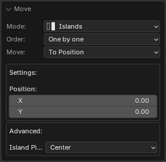

- **Mode** - Transform Mode
    - *Islands* - Transform islands
    - *Selection* - Transform selection
- **Order** - Processing order
    - *Overall* - Handle everything as one
    - *One by One* - Handle one by one
- **Move** - Transform Mode
    - *By Increment* - Move the island by a specified amount
    - *To Position* - Move the island to the specified position
    - *To 2D Cursor* - Move the island to the 2D Cursor position
    - *To Active Trim Center* - Move the island to the position of the active trim center
    - *To Mouse Cursor* - Move the island to the position of the mouse cursor
- **Position** - Position specified by coordinates to which the movement will be performed
- **Island Pivot** - The pivot of the transformed unit

---

### Move to UV Area

Move islands to UV area, active UDIM tile, or UDIM tile defined by number

!!! Properties
    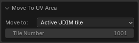

- **Move to** - Transform Mode
    - *UV Area* - Move selection to the UV Area
    - *Active UDIM Tile* - Move selection to the active UDIM tile
    - *Tile Number* - Move selection to the tile with the specified number

|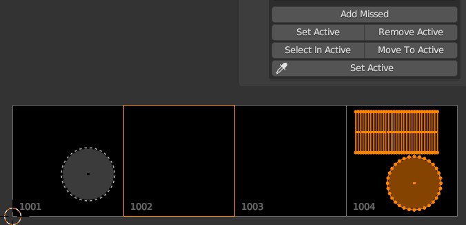|
|---|
|Move to active UDIM tile|

---

### Move 2D Cursor To

Move 2D cursor to the defined position

!!! Properties
    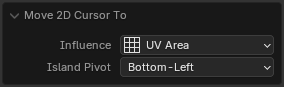

- **Influence** - How to set the 2D Cursor position
    - *Selection* - By selection
    - *Islands* - By islands
    - *UV Area* - By UV Area
    - *Active UDIM tile* - To active UDIM tile
    - *Tile Number* - To UDIM tile with the specified number
- **Island Pivot** - Selection pivot

|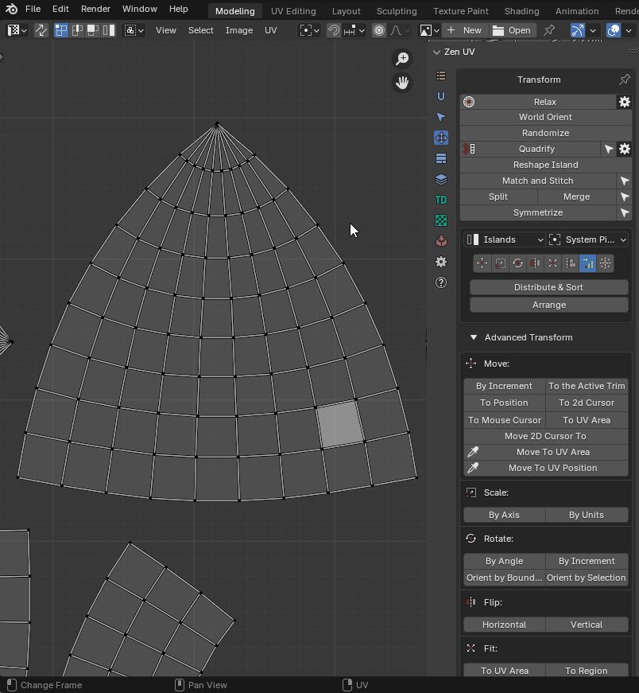|
|---|
|"**Move 2D Cursor to**" running from main panel|

|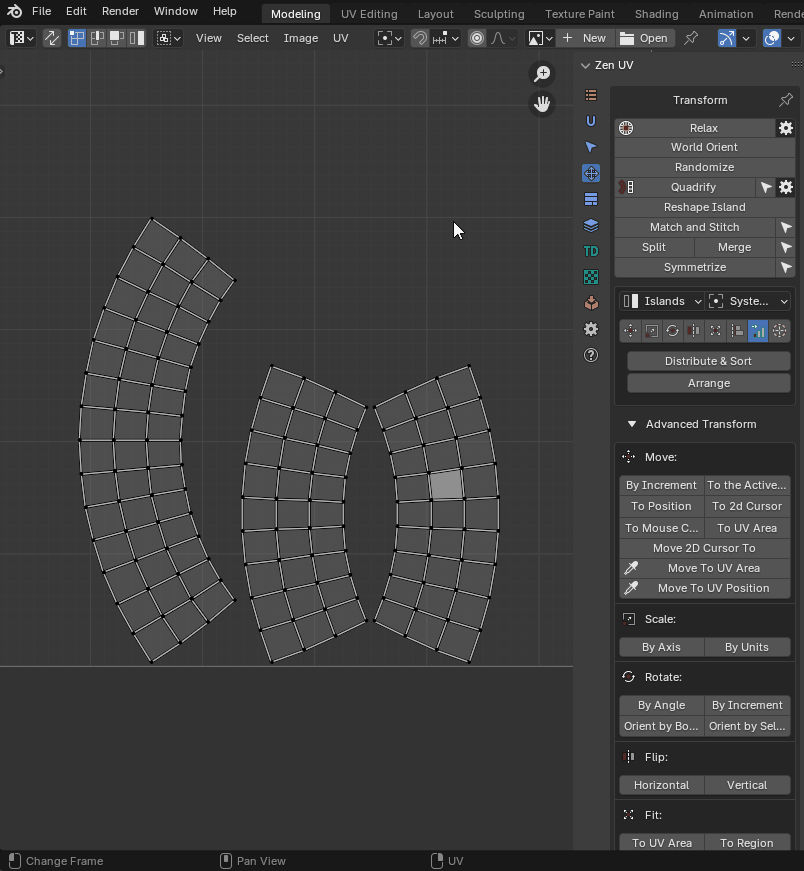|
|---|
|"**Move 2D Cursor to**" running from RMB menu|

---

### Move To UV Area (eyedropper)

Move center of the selected Islands to the UV Area using mouse position

!!! Properties
    This operator has no properties

The islands are moved to the same coordinates, only to the specified tile. So the texture on your object will not be changed

|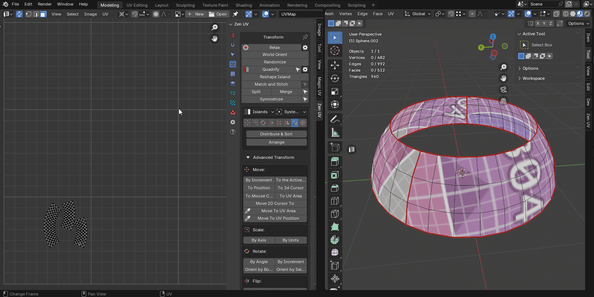|
|---|
|Move to UV area example|

---

### Move to UV position (eyedropper)

Move center of the selected Islands to the UV coordinates defined by mouse

!!! Properties
    This operator has no properties

|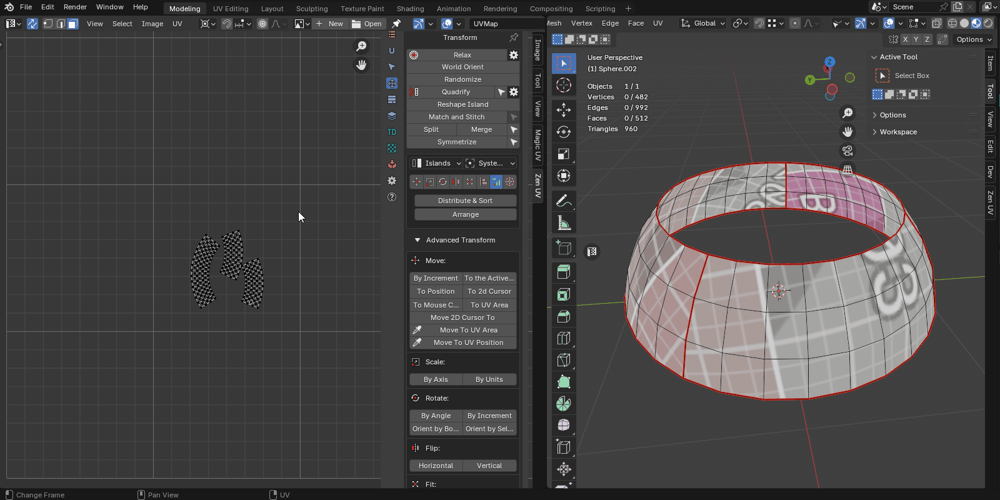|
|---|
|Move the islands to the position. Example|

---

## Scale operators

 

- **By Axis** - Scale Islands by Axis
- **By Units** - Scale Islands by Units

### Scale Island

!!! Properties in Axis mode
    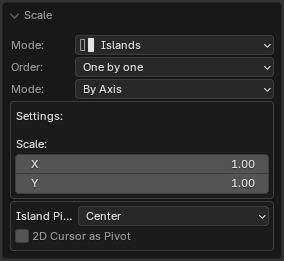

- **Mode** - Transform Mode
    - *Islands* - Transform islands
    - *Selection* - Transform selection
- **Order** - Processing order
    - *Overall* - Handle everything as one
    - *One by One* - Handle one by one
- **Mode** - Transform Mode
    - *By Axis* - The mode in which scaling is indicated by the scaling factor for each of the axes
    - *By Units* - The mode in which the size is specified relative to the size of the UV Area
- **X** - X axis scaling size
- **Y** - Y axis scaling size
- **Island Pivot** - Transformation pivot
- **2D Cursor as Pivot** - Use 2D cursor as island pivot

!!! Properties in Units mode
    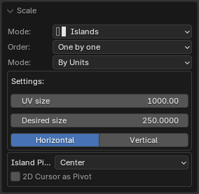

- **Mode** - Transform Mode
    - *Islands* - Transform islands
    - *Selection* - Transform selection
- **Order** - Processing order
    - *Overall* - Handle everything as one
    - *One by One* - Handle one by one
- **Mode** - Transform Mode
    - *By Axis* - The mode in which scaling is indicated by the scaling factor for each of the axes
    - *By Units* - The mode in which the size is specified relative to the size of the UV Area
- **UV size** - The estimated width of the UV area
- **Desired size** - The size of which should be set for selected elements relative to UV area
- **Calcutate** - What mean the **Desired Size**
- **Island Pivot** - Transformation pivot
- **2D Cursor as Pivot** - Use 2D cursor as island pivot

---

## Rotate operators

- **By Angle** - Rotate Islands by Angle
- **By Increment** - Rotate Islands by Increment
- **Orient by Bounding Box** - Orient Islands to Bounding Box
- **Orient by Selection** - Orient Islands by Selection

### Rotate Island

Rotate selected islands or selection

!!! Properties
    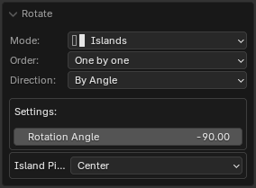

- **Mode** - Transform Mode
    - *Islands* - Transform islands
    - *Selection* - Transform selection
- **Order** - Processing order
    - *Overall* - Handle everything as one
    - *One by One* - Handle one by one
- **Mode** - Rotation mode
    - *By Angle* - Turn to the specified angle
    - *By Direction* - Rotate by a specified angle in a specified direction
- **Direction** - Direction of rotation
- **Rotation Increment** - Island rotation angle
- **Island Pivot** - The pivot of the transformed unit

### Orient Island

Orient Island

!!! Properties
    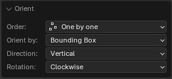

- **Order** - Processing order
    - *Overall* - Handle everything as one
    - *One by One* - Handle one by one
- **Orient by** - Orient Mode
    - *Bounding Box* - Orient by bounding box
    - *Selection* - Orient by selection
- **Direction** - Orientation in the direction of
    - *Horizontal* - Horizontal orientation
    - *Vertical* - Vertical orientation
    - *Auto* - Auto detect orientation
- **Rotation** - Direction of rotation

---

## Flip operators

- **Horizontal** - Flip Islands Horizontally
- **Vertical** - Flip Islands Vertically

### Flip Island

Flip selected Islands or Selection

!!! Properties
    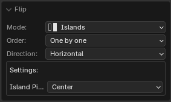

- **Mode** - Transform Mode
    - *Islands* - Transform islands
    - *Selection* - Transform selection
- **Order** - Processing order
    - *Overall* - Handle everything as one
    - *One by One* - Handle one by one
- **Direction** - Direction of flipping
    - *Horizontal* - Horizontal
    - *Vertical* - Vertical
    - *Island Pivot* - By pivot of the island
- **Island Pivot** - The pivot of the transformed unit

---

## Fit operators

- **To UV Area** - Fit Islands to UV Area
- **To Region** - Fit Islands to Region
- **Active UDIM tile** - To active UDIM tile
- **Tile Number** - To UDIM tile with the specified number

### Fit Island

Fit island into defined region

!!! Properties
    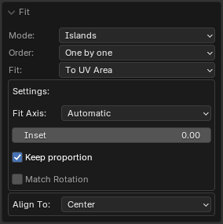

- **Mode** - Transform Mode
    - *Islands*
    - *Selection*
    - *Faces*
- **Order** - Processing order
    - *Overall* - Handle everything as one
    - *One by One* - Handle one by one
- **Fit** - Transform Mode
    - *To UV Area* - Fit selection to the UV Area bounds
    - *To Region* - Fit selection to the defined region
    - *Active UDIM tile* - To active UDIM tile
    - *Tile Number* - To UDIM tile with the specified number
    - *Fill Islands* - Fit islands to the UV Area, but not keep the proportions
- **Fit Axis** - Active Axis
    - *U* - U axis
    - *V* - V axis
    - *Min* - The minimum length axis is automatically determined
    - *Max* - The maximum length axis is automatically determined
    - *Automatic* - Automatically detected axis for full dimensional compliance
- **Inset** - The amount by which the islands should be reduced relative to the edges of the region
- **Keep proportion** - Do not change the proportions of the selected island
- **Match Rotation** - Match the rotation of the island to the rotation of the region (for rectangular regions)
- **Region** - Region in which the selected island will be fitted
- **Align To** - The region point to which the island will be adjusted

---

## Align operators

- **To Selected BBox** - Align Islands to Selected BBox
- **To Position** - Align Islands to Position
- **To 2D Cursor** - Align Islands to 2D Cursor
- **To UV Area** - Align Islands to UV Area
- **To Active Component** - Align Islands to Active Component
- **Active UDIM tile** - To active UDIM tile
- **Tile Number** - To UDIM tile with the specified number

### Align Islands

Align selected islands or selection

!!! Properties
    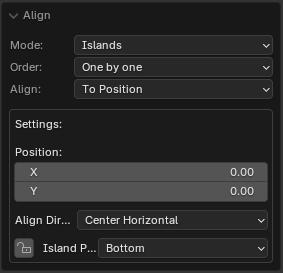

- **Mode** - Transform Mode
    - *Islands*
    - *Selection*
    - *Vertices*
- **Order** - Processing order
    - *Overall* - Handle everything as one
    - *One by One* - Handle one by one
- **Align** - Transform Mode
    - *To Selection Bounding Box* - To the bounding box of the selection
    - *To Position* - To the defined position
    - *To 2D Cursor* - To the 2D cursor
    - *To UV Area Bounding Box* - To the bounding box of the UV Area
    - *To Active Component* - To the active component (vertex, edge, face)
    - *Active UDIM tile* - To active UDIM tile
    - *Tile Number* - To UDIM tile with the specified number
- **Position** - Position specified by coordinates to which the alignment will be performed
- **Align Direction** - The point of the bounding box to which align will be performed
- **As Direction** - Set the island pivot to be the same as the alignment direction
- **Island Pivot** - The point of the island which will be aligned

---

## Distribute operators

- [**Distribute and Sort**](unified_transform_sys.md#distribute-and-sort) - Distributes and sorts selected islands
- [**Arrange**](unified_transform_sys.md#arrange) - Arrange selected islands
- [**Distribute Vertices**](unified_transform_sys.md#distribute-vertices) - Distribute vertices along the line