# Independent Transform Operators

## Relax
 Allows to reduce stretching of the faces of the island. Uses three algorithms

| 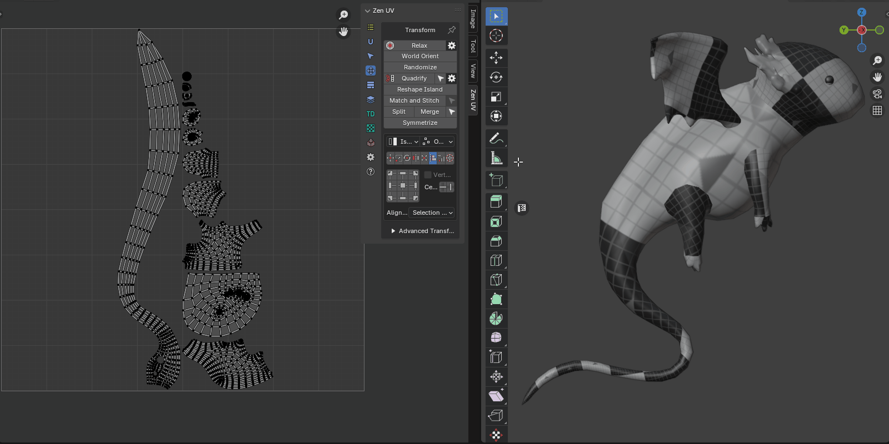 |
| --- |
| Relax |

!!! Properties
    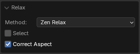

- **Method** - Unwrapping method
    - *Zen Relax* - The algorithm is most suitable for organic objects.
    - *Angle Based* - Blender's native algorithm. Most suitable for hard surface objects.
    - *Conformal* - Blender's native algorithm. Same as **Angle Based**, but much faster. However, can lead to undesired results if the island is complicated.
    - *Minimum Stretch* - Uses Scalable Locally Injective Mapping (SLIM). This tries to minimize distortion for both areas and angles.

- **Select** - Select relaxed island
- **Correct Aspect** - Taking image aspect ratio into account

!!! Pproperties

    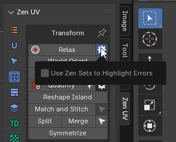

- **Use [Zen Sets](https://blendermarket.com/products/zen-sets) to Highlight Errors** - Use [Zen Sets](https://blendermarket.com/products/zen-sets) to create [Zen Sets](https://blendermarket.com/products/zen-sets) Groups with Mesh Errors

---
## World Orient
Rotate Islands the way they are oriented on the Models. Each method (Organic/Hard Surface) uses a heuristic approach and correctly orients most of the Islands in its area.

| 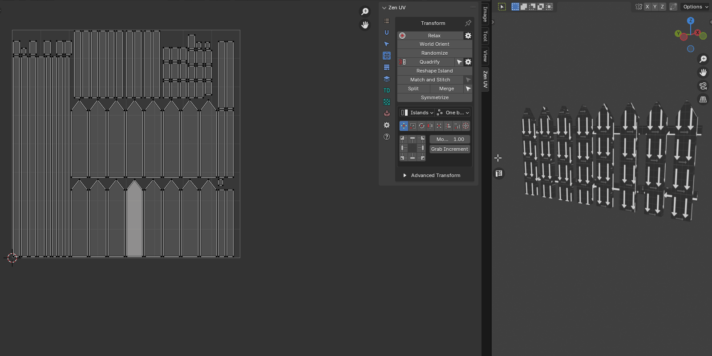 |
| --- |
| World Orient |

!!! Properties
     
- **Further orient** - Additional turn. Allows you to turn the island to a horizontal or vertical if the island is located at an angle in the model.

---
## Randomize
  Randomize the position, rotation, and scale of the islands or selected vertices. This operator can work in simple and advanced mode.

!!! Properties
    Randomize **Simple** mode

    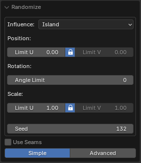

- **Influence** - Transform Influence. Affect Islands or Elements (vertices, edges, polygons)
    - *Island*
    - *Selection*
- **Position** - Position Range
    - *Limit U* - The range starts with a negative value U and ends with its positive value
    - *Limit V* - The range starts with a negative value V and ends with its positive value
- **Lock Axes** - Lock values for uniform transformation over the axes
- **Rotation** - Rotation angle range
    - *Angle Limit* - The range starts with a negative angle value and ends with its positive value
- **Scale** - Scale Range
    - *Limit U* - The range starts with a negative value U and ends with its positive value
    - *Limit V* - The range starts with a negative value V and ends with its positive value
- **Seed** - Change transformation in the set ranges by random value
- **Use Seams** - Use seams as an island separator to prevent stacked islands from self-welding
- **Randomize Mode** - Sets operator mode
    - *Simple* - Only basic functions are enabled
    - *Advanced* - Full control over the operator. You can specify the step, etc.

!!! Properties
    Randomize **Advanced** mode

    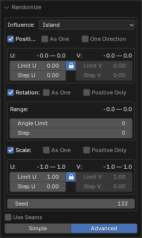

- **Influence** - Transform Influence. Affect Islands or Elements (vertices, edges, polygons)
    - *Island*
    - *Selection*
---
- **Position** - Location transformation switch
- **As One** - Move the entire selection as a single unit
- **One Direction** - Turns on the mode when the beginning of the range starts from zero. All transformations will occur in the one direction
- **Limit U** - The range starts with a negative value U and ends with its positive value
- **Limit V** - The range starts with a negative value V and ends with its positive value
- **Lock Axes** - Lock values for uniform transformation over the axes
- **Step U** - The step along a U axis at which the move will be performed
- **Step V** - The step along a V axis at which the move will be performed
---
- **Rotation** - Rotation transformation switch
- **As One** - Rotate the entire selection as a single unit
- **Positive Only** - Turns on the mode when the beginning of the range starts from zero. All rotations will occur in the positive direction
- **Angle Limit** - Rotation angle range
- **Step** - The step with which the rotation will be performed
---
- **Scale** - Location transformation switch
- **As One** - Scale the entire selection as a single unit
- **Positive Only** - Turns on the mode when the beginning of the range starts from 1.0. All scaling will occur in the positive values. No islands flipping
- **Limit U** - The range starts with a negative value U and ends with its positive value
- **Limit V** - The range starts with a negative value V and ends with its positive value
- **Lock Axes** - Lock values for uniform transformation over the axes
- **Step U** - The step along a U axis at which the scaling will be performed
- **Step V** - The step along a V axis at which the scaling will be performed
---
- **Seed** - Change transformation in the set ranges by random value
- **Use Seams** - Use seams as an island separator to prevent stacked islands from self-welding
- **Randomize Mode** - Sets operator mode
    - *Simple* - Only basic functions are enabled
    - *Advanced* - Full control over the operator. It is possible to specify the step value, etc.

|  |
| --- |
| Explanation of the randomization step|

---
## Quadrify Islands

 Straighten rectangular-shaped Islands

!!! Tip
    This operator supports the ability to [save default properties](../user_interface.md/#save-as-default-operator-properties).

!!! tip
    The Quadrify operator works only with quad faces. All other types of faces are ignored.
    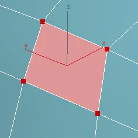

!!! tip
    If you work with high-poly meshes, you can customize the operator before it is launched. Use the gear button to the right of the operator in the main panel.
    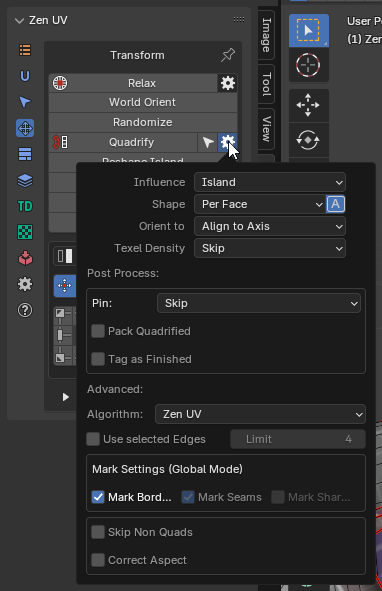

!!! Properties
    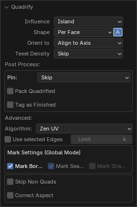

|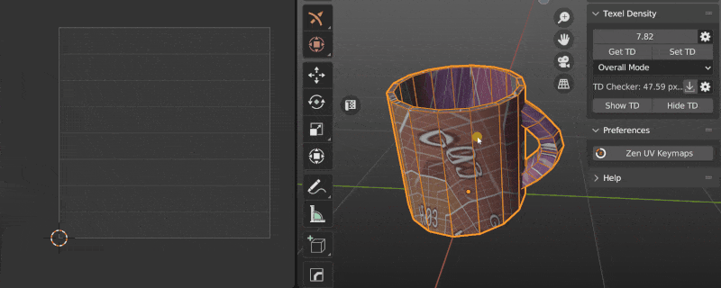|
|---|
||

- **Influence** - Transform Influence. Affect Islands or Selection
    - *Island*
    - *Selection*
- **Shape** - The face shape for the Zen UV algorithm
- **Average** - Averages the shape depending on the shape of the faces in the faceloop
- **Orient to** - Orient Quadrified Islands
    - *Skip* - Do not change the original orientation
    - *Align to Axis* - Align to the nearest axis
    - *Vertical* - Set orientation vertical
    - *Horizontal* - Set orientation horizontal
- **Texel Density** - Set texel density. Not available if Pack Quadrified is On
    - *Averaged* - Set averaged Texel Density
    - *Global Preset* - Set value described in the Texel Density panel as [Global TD Preset](../texel_density.md/#global-td-preset)
    - *Skip* - Do not make any texel density corrections
- **Pin** - Auto Pin
    - *Quads* - Perform pinning only faces that have been quadrified
    - *Island* - Pin the entire island or a selection, depending on the Influence mode
    - *Skip* - Do not perform Pinning
- **Pack Quadrified** - Pack Islands after Quadrify Islands operation
- **Tag as Finished** - Tag Quadrified island as finished
---
- **Advanced** - Advanced settings
- **Algorithm** - Calculation algorithm
    - *Zen UV* - Zen UV calculation algorithm
    - *Blender* - Native Blender follow active quad algorithm
- **Use selected Edges** - Selected Edges will be used as Seams during Quadrify Islands operation. Works only in edge selection mode
- **Limit** - The maximum number of edges used to create the seam. If the number of selected edges is greater than this number, the seams will not be created
- **Mark Borders** - Mark Island boundaries after Quadrify Islands operation
- **Skip Non Quads** - Skip islands that contain faces other than quads
- **Correct Aspect** - Map UVs taking image aspect ratio into account

!!! tip
    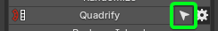

    Assistant operator: [**Select Quaded Islands**](../select.md#select-quaded-islands) - Selects islands that consist only of quads.

|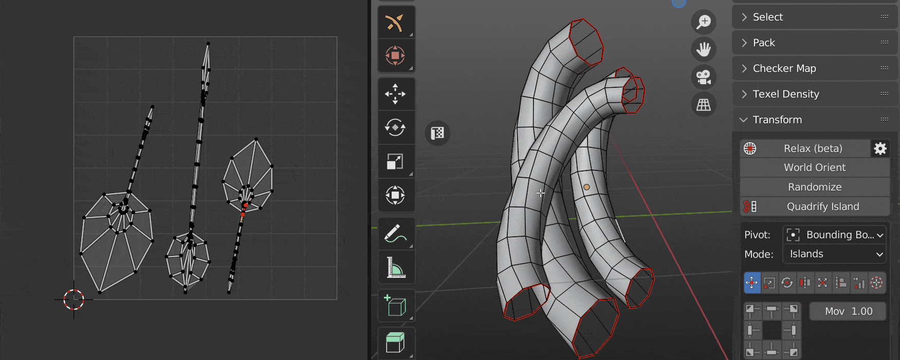|
|---|
|Quadrify by selected Edges|

|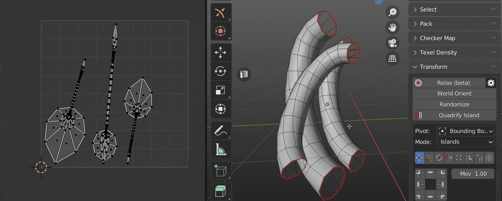|
|---|
|Orient island|

|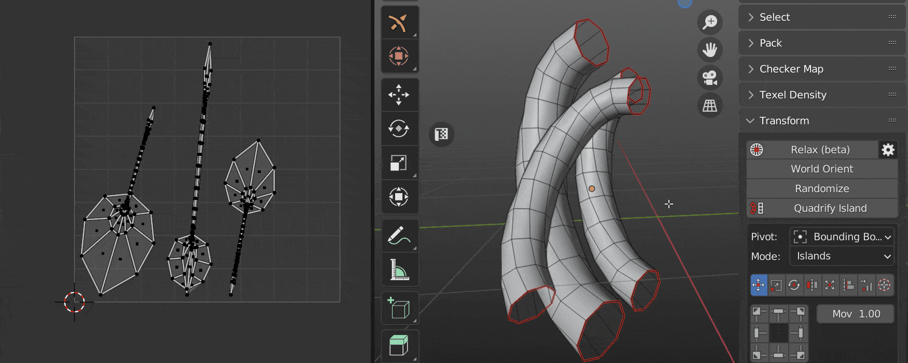|
|---|
|Auto Pin|

!!! tip
    Tag Quadrified Islands as [**Finished**](../unwrap.md#finishing-system) to preserve them from unwrapping. It's recommended to [**Tag as Finished**](../unwrap.md#tag-finished) all manually changed Islands.
    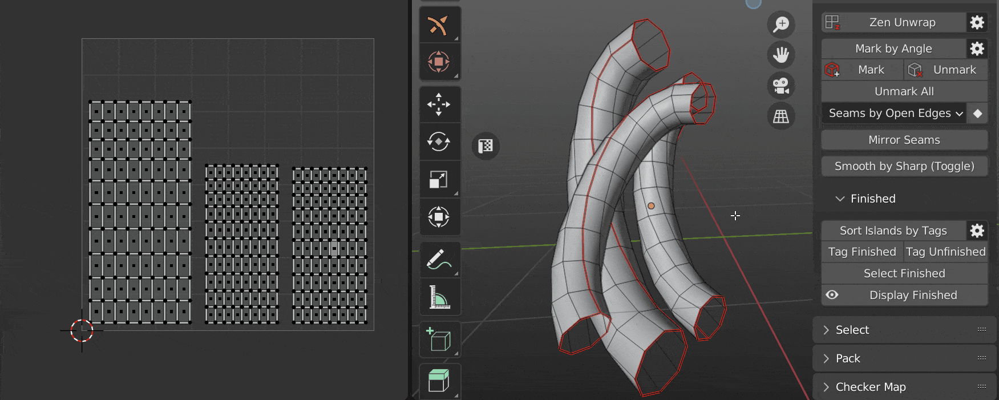

---

## Reshape Island

Changes the island’s shape depending on the preset.

!!! Properties
    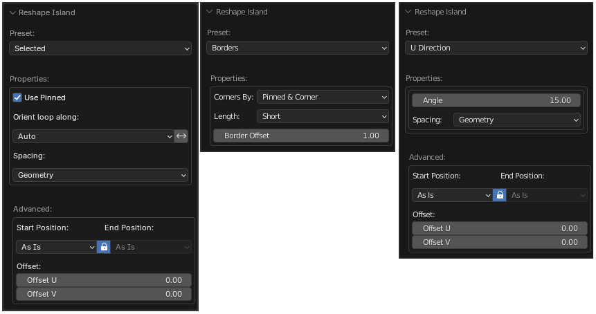

    - **Selected**. Straighten the selected Edge Loops and relax not selected vertices.
    - **U Direction / V Direction**. Edges are aligned in the indicated direction.
    - **Borders**. Straighten the edges of the island in even lines according to the given parameters.

### Preset Selected:

- Straighten the selected Edge Loops and relax not selected vertices.
  
  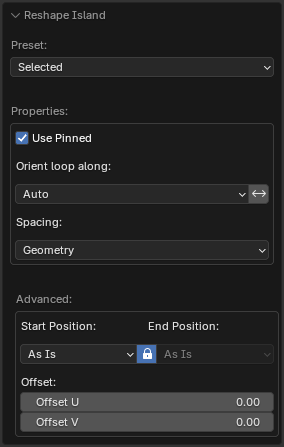

- **Use Pinned** - Take into account pinned vertices. Not used in other presets.
- **Orient loop along** - How to orient the selected loops.
    - *Auto* - Automatic finding loop orientation.
    - *U Axis* - Along the U axis.
    - *V Axis* - Along the V axis.
    - *In Place* - The beginning and end of the loop will remain such as before the operator runs.
- **Reverse Direction** - Change the direction of the loop to the opposite.
- **Spacing** - How to set the distances between the points of the loop.
    - *UV* - As in the UV Map.
    - *Geometry* - As in the mesh.
    - *Evenly* - Distribute at an equal distance.

#### Orient Along Sample:

|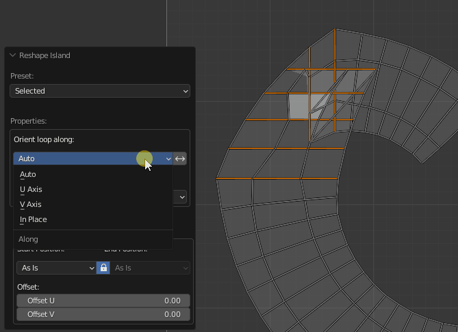|
|---|
|Loops orientation|

#### Spacing Sample:

|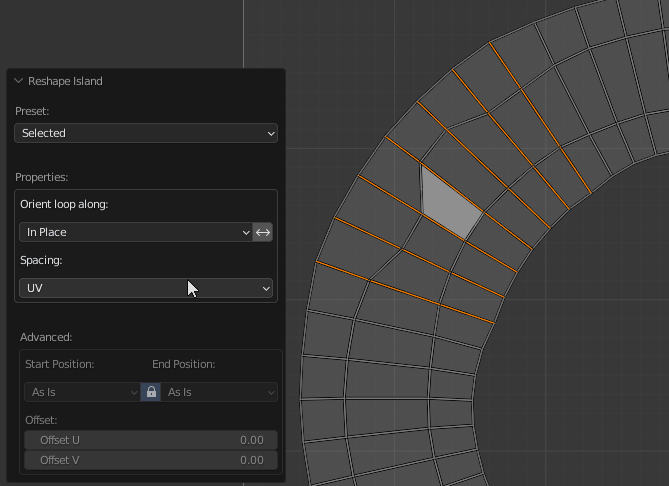|
|---|
|Set spacing|

### Advanced Properties:

 - The properties of the operator for aligning the loops relative to each other.

- **Start Position:** - How to set the beginning of the loop.
    - *As is* - Leave in place.
    - *Max* - Set to the maximal position of the loops.
    - *Averaged* - Set to the averaged position of the loops.
    - *Min* - Set to the minimal position of the loops.
- **Lock** - Lock Start Position and the End Position.
- **End Position:** - How to set the ending of the loop.
    - *As is* - Leave in place.
    - *Max* - Set to the maximal position of the loops.
    - *Averaged* - Set to the averaged position of the loops.
    - *Min* - Set to the minimal position of the loops.
- **Offset** - Indicates the offset of each next loop relative to the previous. Sorting begins on the left bottom. The red color indicates that the value is not zero.

#### Start / End Position Sample:

|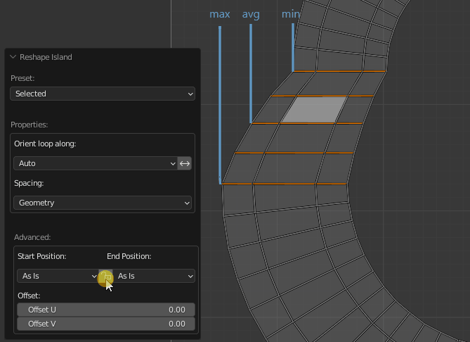|
|---|
|Set Start / End position|

#### Offset Sample:

|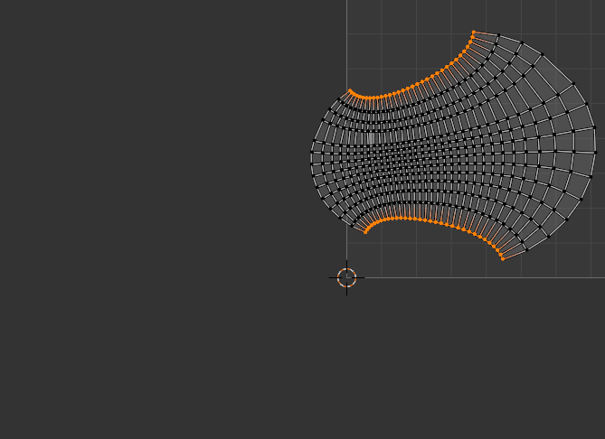|
|---|
|Offset|
---
### Preset U/V Direction:

!!! Properties
    - **Angle** - If the slope of the edge is less or equal to this value, then the edge will be selected.
    - **Spacing** - How to set the distances between the points of the loop.

  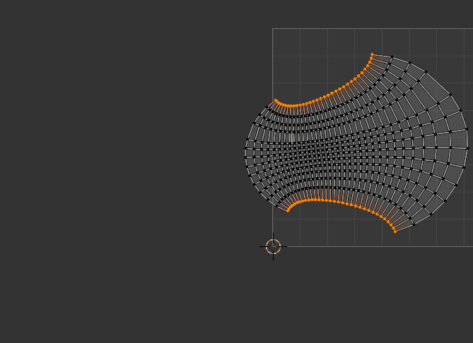

 Please refer to the [Advanced Properties](#advanced-properties) to learn more.
 
 How to work Angle value:

 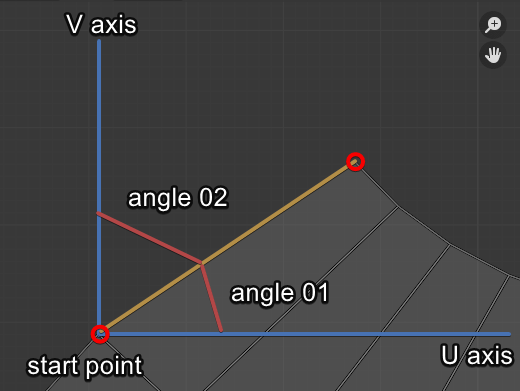

  - If **angle 01** is less than **angle 02** means the edge is aligned along the U axis. If opposite, then the edge is aligned along the V axis.
  - If the value ​​of the **Angle:** operator’s properties are less than **angle 01**, then the edge will not be selected.

### Preset Borders:

!!! Properties
  - **Corners By:** - How to detect corners of the Island.
      - **Corner** - By corner vertices.
      - **Pinned** - By pinned vertices.
      - **Pinned & Corners** - By pinned and corner vertices.
  - **Length** - How to calculate the length for each straightened border segment.
      - **UV** - As a sum of UV edges length.
      - **Geometry** - As a sum of mesh edge length.
      - **Short** - As a distance from the first point to the last point of the edge loop.
  - **Border Offset** - Offset all the vertices using the first point as a pivot. This leads to island scaling.
  
#### Corner Sample:

  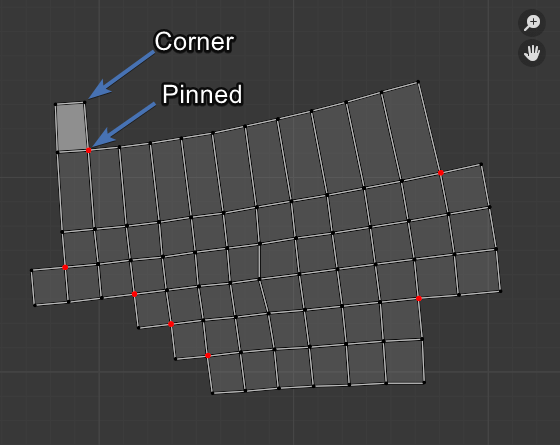

  - A Corner Point - it's a point that has 2 connected edges.
  - Pinned Point - it's a point that is pinned by Blender's native Pin operator.

#### Length Sample:

  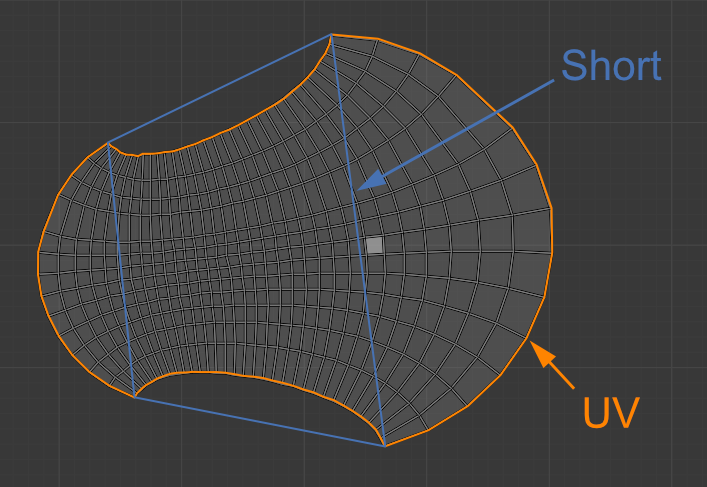

  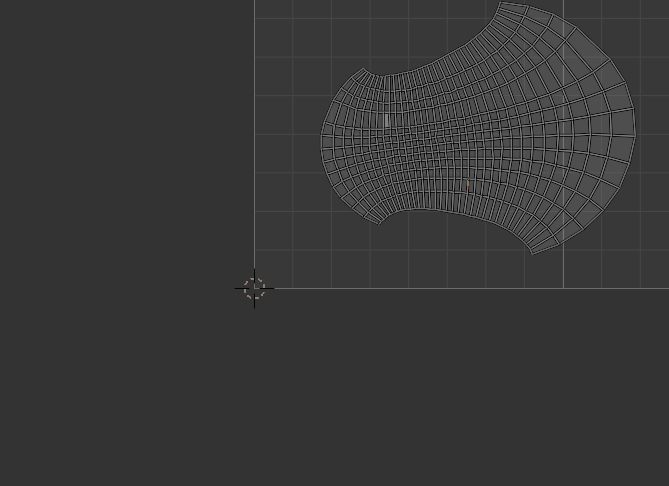

---

## Relax Along Axis

!!! Note
    This operator is only available in the UV Editor because it is not possible to define the relaxation axis in the 3D View.

Relaxes the selected vertices using an axis-constrained method. The best result is achieved when the selected vertices are relaxed relative to the unselected ones.

In the add-on panel, the operator is represented by a main execution button and additional buttons that allow you to immediately set the axis along which the relaxation will be performed.

!!! Properties
    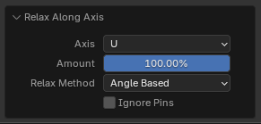

- **Axis** - Active Axis.
    - *U* - Relax along axis U.
    - *V* - Relax along axis V.
    - *Touch Tool* - Use [Zen Touch tool](../touch_tool.md) as a direction axis.
- **Amount** - Position along the direction vector from start to end, in percent (0-100)
- **Relax Method** - Method of Relaxation
    - *Angle Based* - Uses Angle Based Flattening (ABF). This method gives a good 2D representation of a mesh.
    - *Conformal* - Uses Least Squares Conformal Mapping (LSCM). This usually results in a less accurate UV mapping than Angle Based, but performs better on simpler objects.
    - *Minimum Stretch* - Uses Scalable Locally Injective Mapping (SLIM). This tries to minimize distortion for both areas and angles.
- **Ignore Pins** - Ignore Pins.

|Relaxation along U axis|
|---|
|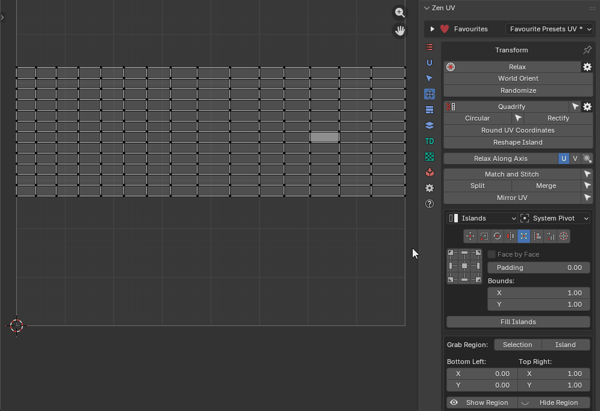|

If you need to relax the vertices in any custom direction, use the option [Along Touch Tool](../touch_tool.md) axis.

|Relaxation along the Touch Tool axis|
|---|
|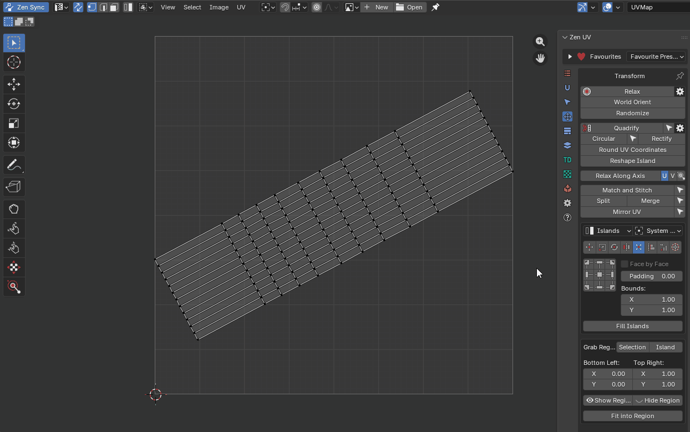|

---

## Match and Stitch

Matching the position, rotation, and scale of Islands. Stitch the vertices together, if possible.

!!! Properties
    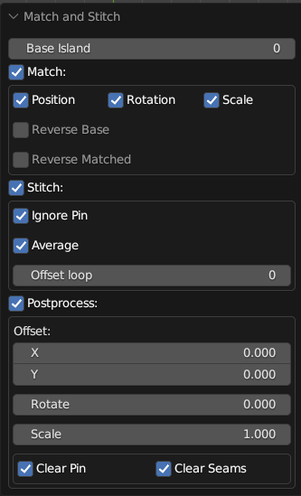

- **Base Island** - Sets which of the selected islands will be considered the base island. That is, the one that will not be changed, will remain in place, and to which other islands will be matched or stitched.
- **Match** - Match Island parameters. Sets whether to perform the island matching procedure.
- **Position** - Match Island position
- **Rotation** - Match Island rotation
- **Scale** - Match Island size
- **Reverse Base** - Change the direction to the opposite direction for the base island
- **Reverse Matched** - Change the direction to the opposite direction for the matched island
- **Cycled Island** - Activate the option if we want to match cycled edge loops. For example a disk to a round hole
---
- **Stitch** - Stitch the vertices together, if possible
- **Ignore Pin** - Ignore Pinned vertices
- **Average** - Average Stitching
- **Offset loop** - Performs a cyclic shift of the vertices to be stitched. Use to correct if the stitching looks tangled
---
- **Postprocess** - Allow Postprocess
- **Offset** - Advanced Offset
- **Rotate** - Advanced Rotate
- **Scale** - Advanced Scale
- **Clear Pin** - Clear the Pins on the Primary edge loop
- **Clear Seams** - Clear the seams on the stitched edges

!!! tip
    

    Assistant operator: [**Select Linked Loops**](../select.md#select-linked-loops) - Selects all loops belonging to the mesh vertex based on any already selected loop

|Example of usage|
|---|
|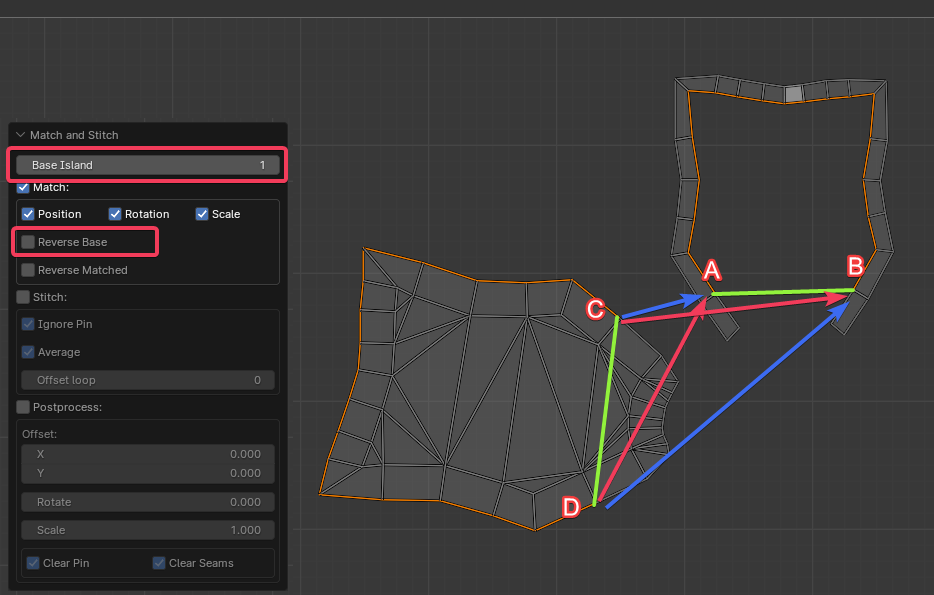|

It is recommended that we always make the settings in sequence.
First, Match, and if we are satisfied, then turn on Stitch. Stitch can't fix mistakes made in Match. The algorithm works as follows:

- First, find the endpoints of both selections. In the picture, we got 2 groups marked as green lines:
    - 1 (AB)
    - 2 (CD)

- Now we take one of the islands and move it until the ends of the found segments match. We can get two variants.
    - C falls into B. D is in A. - The correct option (red arrows). We can turn on Stitch and finish the work.
    - C falls into A. D goes to B. - Incorrect option for our particular case (blue arrows).

- If we have a second case, we cannot turn on Stitch at this time. It will eventually do what it can, but we will get tangled edges. We need to "flip" one of the islands. This can be done using the **Reverse Base** or **Reverse Matched** option. It doesn't make much difference. Just choose the one that suits is better visually. Also, the island will not actually be turned over. Just A and B will change places. And that's it.

We can add the case when we are not satisfied with the island that the algorithm has chosen as a base. Change the **Base Island** parameter. This is an infinite cyclic value. If we have 2 islands selected, it will change the **Base Island** in turn.

!!! tip
    Watch the video explaining how **Match and Stitch** works.

    

    <iframe src="https://www.youtube.com/embed/f9meGzMGx2k?start=974&end=1061" style="position: absolute; top: 0; left: 0; width: 100%; height: 100%;" allowfullscreen="" seamless="" frameborder="0"></iframe>
    

---

## Split UV

Splits selected in the UV

!!! Properties
    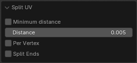

- **Minimum distance** - Sets the smallest distance sufficient for splitting but not visible to the eye
- **Distance** - The distance to which the vertices need to be moved
- **Per Vertex** - Split each vertex separately
- **Split Ends** - Splits the ends. The gap remains the same along the entire length

|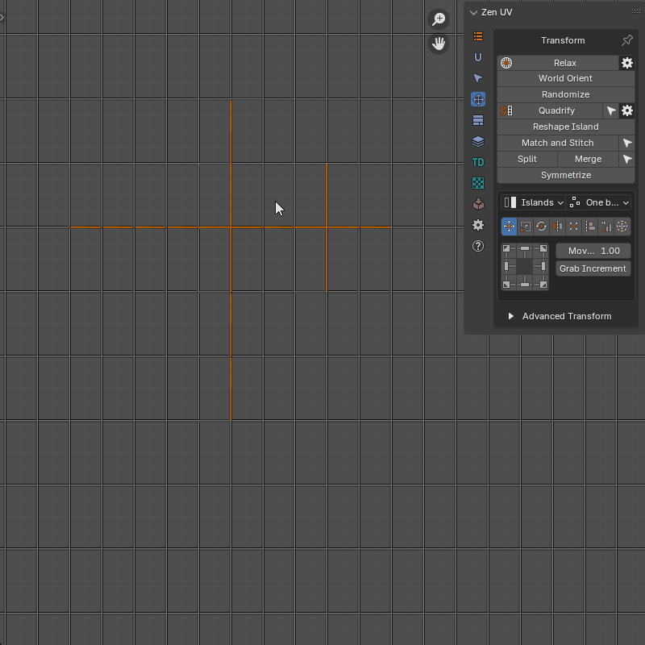|
|-|
|Split UV properties|

---

## Merge UV Verts

Merge UV vertices belonging to the same mesh vertex

!!! Properties
    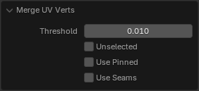

- **Threshold** - Distance beyond which the merger does not take place
- **Unselected** - Merge all matching vertices. Not only the selected
- **Use Pinned** - Pinned vertices remain in place. The unpinned ones will be moved to the pinned ones
- **Use Seams** - Edges marked as seams will be ignored

!!! tip
    

    Assistant operator: [**Select UV Borders**](../select.md#select-uv-borders) - Select existing UV Borders.

|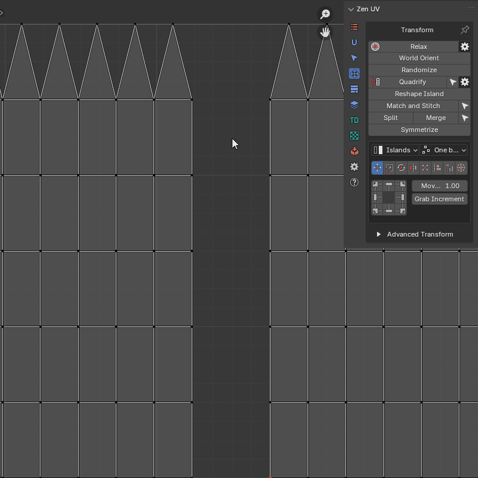|
|-|
|Merghe UV example|

---

## Mirror UV

Mirroring UV coordinates in a mirrored mesh
First, you need to select a part of the mesh with the correct coordinates. The operator will find the corresponding symmetrical part by itself

!!! Properties
    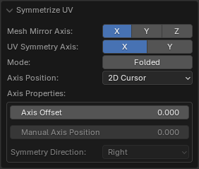

- **Mesh Mirror Axis** - How the mirroring is represented in the object
- **UV Symmetry Axis** - UV Symmetry axis
- **Folded** - Creates a folded symmetry where the coordinates of one part are equal to the coordinates of the other
- **Axis Position** - Base position of the symmetry axis
    - *Manual* - Fully manual mode. The position of the symmetry axis depends only on the specified value
    - *2D Cursor* - 2D Cursor position
    - *UV Area Center* - UV Area center
    - *Active UDIM Center* - Active UDIM Tile center
    - *Bounding Box* - One side of the selection bounding box
    - *Active Trim Center* - Active trim center
- **Axis Properties** - The properties of the symmety axis.
- **Axis Offset** - Offset of the symmetry axis. This value is added to any "Axis Position" type
- **Manual Axis Position** - Position of the symmetry axis in manual mode. Active only if "Axis Position" is "Manual"
- **Symmetry Direction** - Bounding box symmetry direction. Active only if "Axis Position" is "Bounding Box"

!!! tip
    

    Assistant operator: [**Select Half**](../select.md#select-half) - Selects a part of the model according to its location relative to the coordinate axis.

|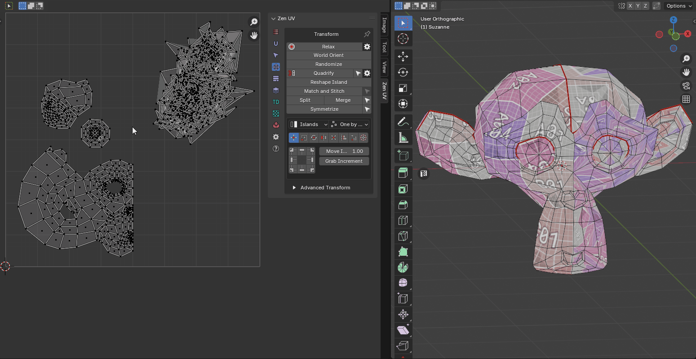|
|-|
|Mirroring UV Example|

---

## Round UV Coordinates

Rounds the value of each UV coordinate to the specified value.

!!! Properties
    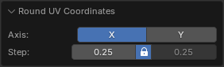

- **Axis** - Influence axis selection
    - *X* - Axis X
    - *Y* - Axis Y
- **Rounding Step X** - Step to which the value will be rounded along X axis
- **Rounding Step Y** - Step to which the value will be rounded along Y axis
- **Lock Step Values** - Lock Step Values

||
|-|
|Round UV Coordinates Example|

---

## Circular

Transform selection to the circular shape.

!!! Properties
    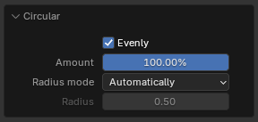

- **Evenly** - Arrange the vertices evenly
- **Amount** - Position along the vector from start to end, in percent (0-100)
- **Radius mode** - Determines how to set the radius of a circle
    - *Automatically* - Calculate radius automatically
    - *Custom* - Use manually entered radius
- **Radius** - Circle radius

|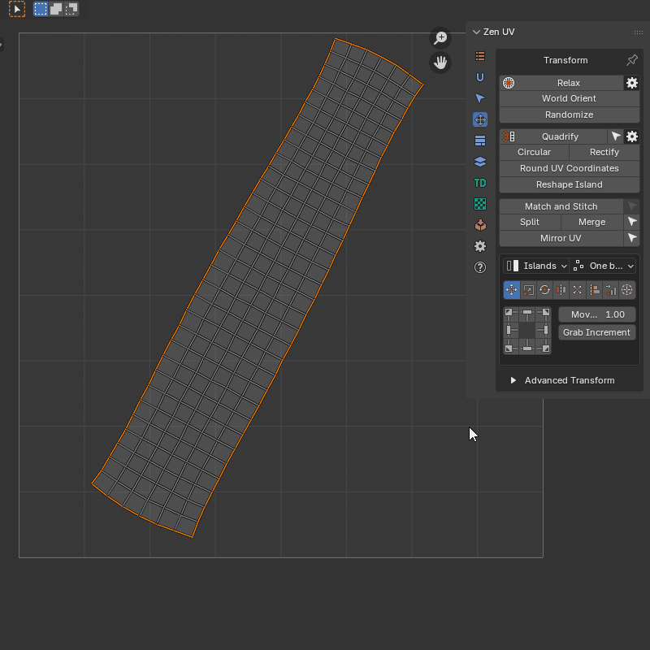|
|-|
|Circular Example|

---

## Rectify

Transforms the selected island into a rectangular shape

!!! Properties
    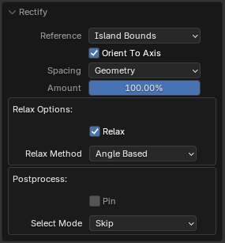

- **Reference** - Defines what the transformation is based on
    - *Island Bounds* - Use island bounds as reference
    - *Selection* - Use user selection as reference
- **Orient To Axis** - Auto-orient island to nearest axis
- **Spacing** - How to create spaces between points
    - *UV* - From current UV positions
    - *Geometry* - As it is in geometry
    - *Evenly* - Evenly
- **Amount** - Position along the vector from start to end, in percent (0-100)
- **Relax** - Enable relaxation of adjacent vertices
- **Relax Method** - Method of Relaxation
    - *Angle Based* - Uses Angle Based Flattening (ABF). This method gives a good 2D representation of a mesh
    - *Conformal* - Uses Least Squares Conformal Mapping (LSCM). This usually results in a less accurate UV mapping than Angle Based, but performs better on simpler objects
    - *Minimum Stretch* - Uses Scalable Locally Injective Mapping (SLIM). This tries to minimize distortion for both areas and angles
- **Pin** - Set the pin to the vertices to be processed
- **Select Mode** - Select vertices based on their position relative to the bounding box
    - *Skip* - Do not select vertices
    - *Border* - Select vertices on the border of the bounding box
    - *Inside* - Select vertices strictly inside the bounding box
    - *Outside* - Select vertices outside the bounding box

|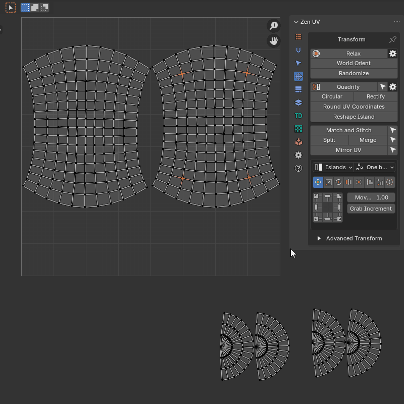|
|-|
|Rectify Example|
