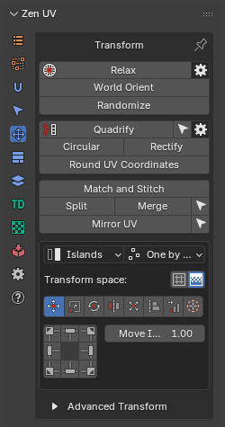
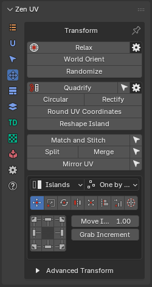
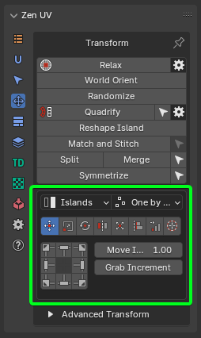
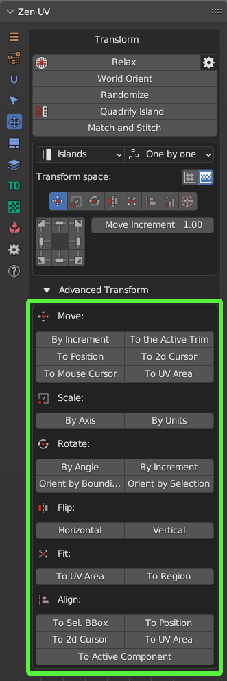
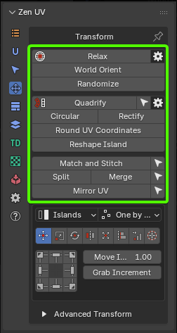

# Transform System Overview

This panel contains tools to transform UVs.

!!! Panel
    | 3D Viewport | UV Editor| 
    |---|---|  
    |  | |

    UV Editor panel contains extra operator [**Reshape Islands. Click to read full information**](independent_ops.md#reshape-island).

The Transform System is organized into three complementary subsystem tiers that cater to different interaction styles—from fast, interactive UI control to precise hotkey workflows and advanced geometric algorithms.

---

### 1. [Unified Transform System](unified_transform_sys.md)

|  |
| :---: |
| *Fig. 1. Unified Transform System Panel* |

The [Unified Transform System](unified_transform_sys.md) acts as the primary interactive hub, centering around the [Universal Control Panel](unified_transform_sys.md#universal-control-panel). It combines common spatial operations with directional controls and adaptive pivot behaviors.

* **[Universal Control Panel](unified_transform_sys.md#universal-control-panel)**: An interactive grid-based button interface whose actions dynamically update depending on the active operation type.
* **Global Scope Controls**:
  * **[Transform Space](unified_transform_sys.md#transform-space)**: Toggles between moving/scaling mesh Islands or transforming the underlying Texture directly in the 3D viewport.
  * **[Mode](unified_transform_sys.md#mode)**: Controls whether operations affect entire Islands or fine-grained sub-element Selection (faces, edges, vertices).
  * **[Order](unified_transform_sys.md#order)**: Dictates execution handling—processing items One by one, acting on Overall selection as a single unit, or anchoring relative to the System Pivot.
* **Integrated Operation Modes**:
  * **[Move](unified_transform_sys.md#move)** / **[Rotate](unified_transform_sys.md#rotate)** / **[Flip](unified_transform_sys.md#flip)**: Interactive shifting, directional alignment, and axis flipping with user-defined increments.
  * **[Scale](unified_transform_sys.md#scale)**: Includes axis-ratio controls, Quick Tuners (*"D"* double, *"H"* half, *"R"* reset), and real-world Units-based scaling relative to UV tile boundaries.
  * **[Fit](unified_transform_sys.md#fit)** / **[Fit into Region](unified_transform_sys.md#fit-into-region)**: Scales elements to fill defined bounding areas, custom regions, or active UDIM spaces while maintaining aspect ratios or filling margins.
  * **[Align](unified_transform_sys.md#align)** / **[Distribute](unified_transform_sys.md#distribute)**: Aligns components against bounding boxes, 2D cursor origins, or specific UDIM tiles, with dedicated tools to distribute, sort, or [arrange islands](unified_transform_sys.md#arrange-islands).

---

### 2. [Advanced Transforms](advanced_operators.md)

|  |
| :---: |
| *Fig. 2. Advanced Transforms Panel* |

The [Advanced Transforms](advanced_operators.md) suite provides individual, operator-level equivalents of the unified tools designed without reliance on the Universal Control Panel interface. These discrete operators are optimized for custom hotkey binding, macro setup, and direct numeric input.

* **Dedicated Operators**: Standalone versions of [Move](advanced_operators.md#move-operators), [Scale](advanced_operators.md#scale-operators), [Rotate](advanced_operators.md#rotate-operators), [Flip](advanced_operators.md#flip-operators), [Fit](advanced_operators.md#fit-operators), [Align](advanced_operators.md#align-operators), and [Distribute](advanced_operators.md#distribute-operators) that expose full property popups (`F9`) upon execution.
* **Extended Positioning & UDIM Routing**: Features precise target relocation operators, such as [Move Island](advanced_operators.md#move-island), [Move to UV Area](advanced_operators.md#move-to-uv-area), [Move 2D Cursor To](advanced_operators.md#move-2d-cursor-to), and quick eyedropper placement tools ([Move To UV Area](advanced_operators.md#move-to-uv-area-eyedropper) / [Move to UV position](advanced_operators.md#move-to-uv-position-eyedropper)) for instant target shifting across custom coordinates or UDIM tiles.
* **Granular Control**: Every operator explicitly exposes mode parameters (Islands vs. Selection, processing order, pivot anchors, custom UV axis constraints) for specialized pipeline scripting.

---

### 3. [Independent Transform Operators](independent_ops.md)

| |
| :---: |
| *Fig. 3. Independent Transform Operators Panel* |

The **Independent Transform Operators** operate outside the unified panel structure to perform complex geometric reconstruction, topology straightening, relaxation, and procedural distribution.

* **Topology & Geometry Normalization**:
  * **[Quadrify Islands](independent_ops.md#quadrify-islands)**: Converts rectangular quad meshes into perfectly straight grid UV islands.
  * **[Rectify](independent_ops.md#rectify)**: Fits complex islands into tight rectangular layouts with built-in relaxation algorithms.
  * **[Reshape Island](independent_ops.md#reshape-island)**: Straightens edge loops, aligns boundaries, or shapes UVs using specialized preset patterns (Selected, U/V Direction, Borders).
  * **[Circular](independent_ops.md#circular)**: Arranges selected UV loops into uniform circular formations.
* **Relaxation & Deformation Control**:
  * **[Relax](independent_ops.md#relax)** / **[Relax Along Axis](independent_ops.md#relax-along-axis)**: Minimizes surface area and angle distortion using specialized algorithms (Zen Relax, Angle Based, Conformal, SLIM Minimum Stretch), with support for axis constraints or custom vector directions via the Touch Tool.
* **Structural Matching & Placement**:
  * **[Match and Stitch](independent_ops.md#match-and-stitch)**: Matches position, rotation, and scale between corresponding islands and welds shared edges together.
  * **[World Orient](independent_ops.md#world-orient)**: Realigns islands in 2D space according to their 3D object-space orientation using organic or hard-surface heuristics.
  * **[Randomize](independent_ops.md#randomize)**: Applies controlled random variations to position, rotation, and scale in Simple or Advanced step modes.
  * **Utility Operations**: Includes [Split UV](independent_ops.md#split-uv), [Merge UV Verts](independent_ops.md#merge-uv-verts), [Mirror UV](independent_ops.md#mirror-uv) (symmetrical UV copying), and [Round UV Coordinates](independent_ops.md#round-uv-coordinates) for pixel-grid snapping.