# Unified Transform System

!!! Panel
    

## Universal Control Panel

!!! Control
    **Universal Control Panel**

    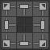

    The universal control panel has logic and different functions for different types of transformation.

---

## Transform Space

Switch between Islands and Texure-based transforms in 3D View.

!!! Panel
    
    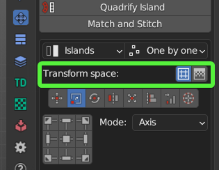

    - **Island**. Islands-based transforms.
    - **Texture**. Texure-based transforms. Works only for **Move** and **Rotate** tools.

## Mode

!!! Panel
    
    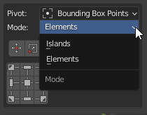

    - **Islands**. Transformations will affect Islands.
    - **Selection**. Transformation will affect Selection (Faces, Edges, Vertices).

## Order

!!! Panel

    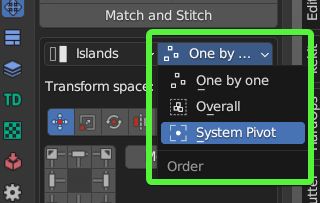
    
    - **One by one**. Transformations will affect Islands.
    - **Overall**. Transformation will affect Selection (Faces, Edges, Vertices).
    - **System Pivot**. Transformations will affect Islands.

---
## Transform Types

### Move

 Move Selected Islands 

!!! Info
    Buttons of the [**Universal Control Panel**](#universal-control-panel) in the Transform type **Move** represent the direction of shifting.

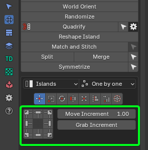

- **Move Increment** - The value on which the island will be shifted
- **Grab Increment** - Get the distance between two vertices or edge lengths and use it as the offset value for the move. The resulting value will be used as the **Move Increment** value

---

### Scale

 Scale selected Islands 

!!! Info
    Buttons of the [**Universal Control Panel**](#universal-control-panel) in the Transform type **Scale** represent Points from where the island will be scaled.

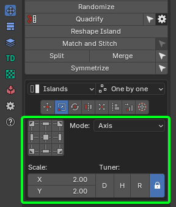

#### Scale Mode

!!! Axis
    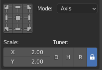

    - **Scale** - The value of the scale of the island for each of the axes.
    - **Tuner** - System that helps change values quickly.
        - *"D"* - Increase by two times.
        - *"H"* - Decrease two times.
        - *"R"* - Reset value to 1.0 .
        - **Lock.** - The Lock mode allows changing values as one.

!!! Units
    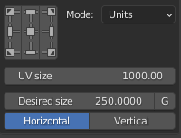

     - **UV Size** - The estimated width of the UV area.
     - **Desired size** - The size of which should be set for selected elements relative to UV area.
     - **G** - Grab the desired size from the current selection. Exist only in the 3D Viewort context. Can be used only for 2 vertices or for one edge selection.
     - **Horizontal / Vertical** - What mean the desired size.

---
### Rotate

 Rotate selected Islands 

!!! Info

    Buttons of the [**Universal Control Panel**](#universal-control-panel) in the Transform type **Rotate** works as described below.
    
    - Buttons located in the corners rotate the island in the specified direction.
    - The central button performs the automatic aligning of the island horizontally or vertically.
    - The buttons at the top and bottom align the island vertically.
    - Buttons on the left and right align the island horizontally.

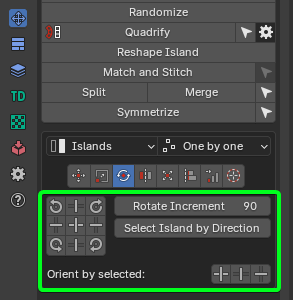

- **Rotate Increment** - The value on which the island will be rotated
- **Select Island by Direction** - Select island by direction (Horizontal, Vertical, Radial, Not Aligned). [Here is a full description of the operator](../select.md#select-islands-by-direction)
- **Orient by selected** - Reorient the island by selected elements (vertices, edges, faces)

---
### Flip

 Flip Selected Islands

!!! Info
    Buttons of the [**Universal Control Panel**](#universal-control-panel) in the Transform type **Flip** represent flip direction.

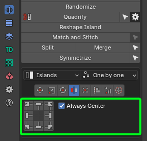

- **Always Center** - Always use the center of the island as a flipping pivot

---
### Fit

 Fit Island to UV Square

!!! Info
    Buttons of the [**Universal Control Panel**](#universal-control-panel) in the Transform type **Fit** represent origins from where **Fit** will be performed

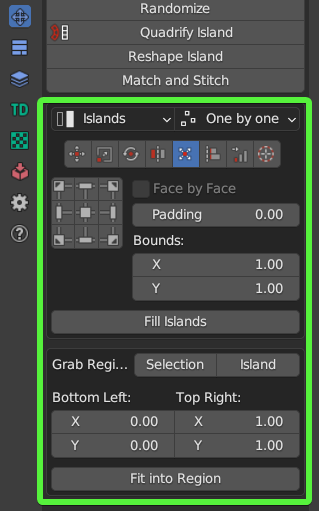

- **Face by Face** - Fit Face by Face
- **Padding** - Clearance between island and UV Square bounds
- **Bounds** - It makes it possible to fill out not UV Square but any other area
- **Fill Islands** - Fit Islands from the center without keeping proportions

### Fit into Region

!!! Properties
    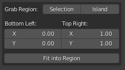

- **Grab Region: Selection / Island** - Allow to grab Region size in different manners
- **Bottom Left: Top Right:** - The bounding box of the region
- **Show Region** - Show region using Annotations
- **Hide Region** - Hide Fit region
- **Fit into Region** - Fit the selected island into the Region described in the bounding box

|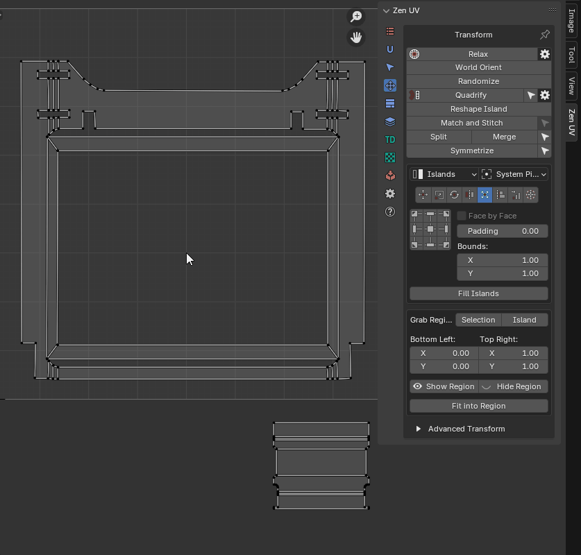|
|---|
|Using fit region|

---

### Align

 Align selected Islands

!!! Info
    Buttons of the [**Universal Control Panel**](#universal-control-panel) in the Transform type **Align** represent the side by which the islands will be aligned.

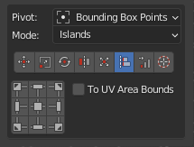

- **Vertex by Vertex** - Mode for vertex alignment. Aligns vertex by vertex. Transform selection mode only
- **Center by Axis** - Align selected islands horizontally or vertically in the center
- **Align to** - Relative to what to perform the alignment
    - *Selection Bounding Box*
    - *UV Area Bounds*
    - *Position*
    - *2D Cursor*
    - *To Active Component*
    - *Active UDIM tile* - To active UDIM tile
    - *Tile Number* - To UDIM tile with the specified number

---

### Distribute

 Distribute, Sort and Arrange selected Islands

|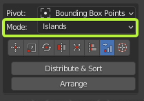|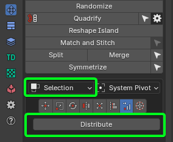|
|---|---|
|Islands mode|Selection mode|

- **Islands Mode**:
    - **Distribute & Sort** - Distributes and Sorts selected Islands
    - **Arrange** - Arrange selected Islands

- **Selection Mode**:
    - **Distribute** - Distribute vertices along the line

#### Distribute And Sort

Distributes and sorts selected islands

!!! Properties
    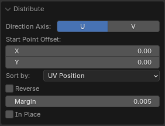

- **Direction Axis** - The axis along which distribution will take place
- **Start Point Offset** - Islands location start point
- **Sort by** - Sorting condition
    - *UV Position*
    - *UV Area*
    - *Mesh Area*
    - *Texel Density*
    - *UV Coverage*
    - *Island Mesh Position X*
    - *Island Mesh Position Y*
    - *Island Mesh Position Z*
- **Reverse** - Change the sorting direction to reverse
- **Margin** - Distance between distributed Islands
- **In Place** - Leave not active axis as is

|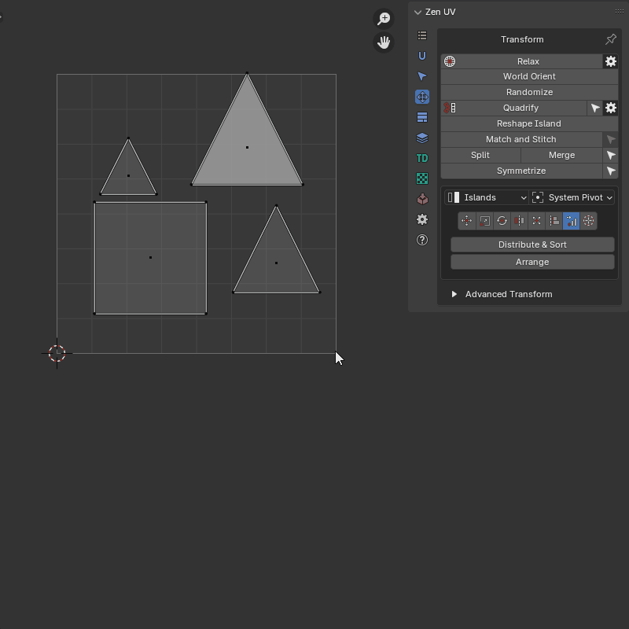|
|---|
|Distribute And Sort example|

---

#### Distribute vertices

Distribute vertices along the line

!!! Properties
    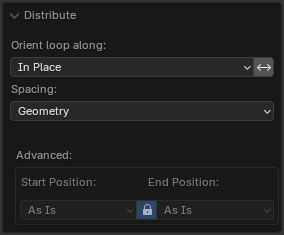

- **Orient Loop Along** - Alignment options
    - *In Place* - The beginning and end of the loop remain in place
    - *U Axis* - Along U axis
    - *V Axis* - Along V axis
    - *Auto* - Will be aligned to the closer axis
- **Reverse Direction** - Change the direction of the aligned line
- **Spacing** - How to create spaces between points
    - *UV* - Like in the current uv positions
    - *Geometry* - Like in the mesh
    - *Evenly* - Spread evenly
- **Start Positions** - Position of starts of loops
    - *As Is*
    - *Max*
    - *Averaged*
    - *Min*
- **Lock** - Locks start and end positions
- **End Positions** - Position of ends of loops
    - *As Is*
    - *Max*
    - *Averaged*
    - *Min*

|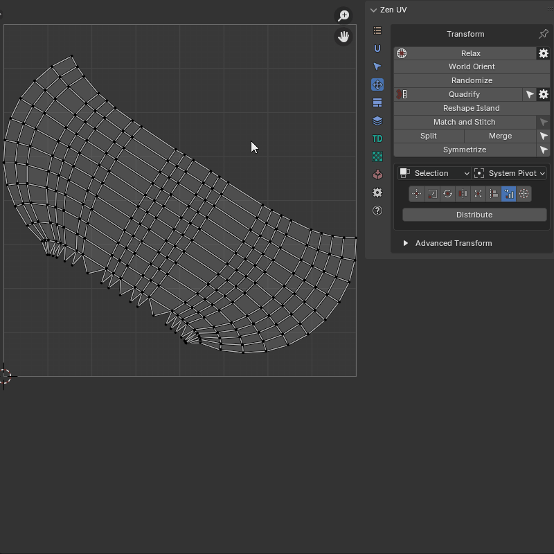|
|---|
|Distribute Verts example|

---

#### Arrange

Arrange selected islands

!!! Properties
    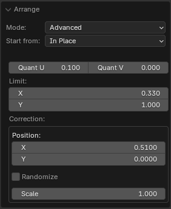

- **Mode** - Input mode
    - *Advanced*
    - *Simplified*
- **Quant U** - Divider for UV Area in U direction
- **Quant V** - Divider for UV Area in V direction
- **Limit** - Distribution limit
- **Position** - Offset for current position
- **Randomize** - Change transformation in the set ranges by random value
- **Scale** - Changes the scale of each island separately

||
|---|
|Arrange Islands example|

---

### 2D Cursor

 Align 2D Cursor over the selected island

!!! Info
    Buttons of the [**Universal Control Panel**](#universal-control-panel) in the Transform type **2D Cursor** represent sides of the island or selected elements.

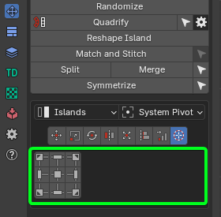

---