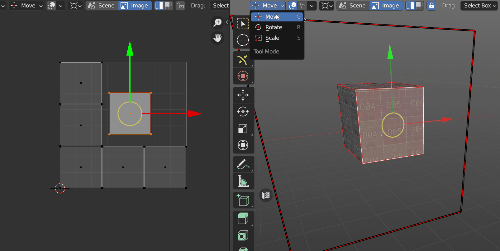
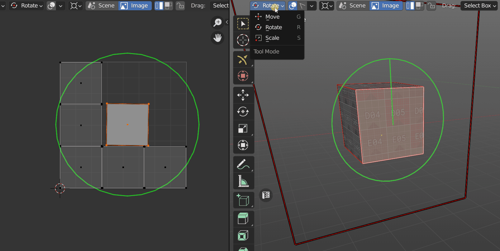
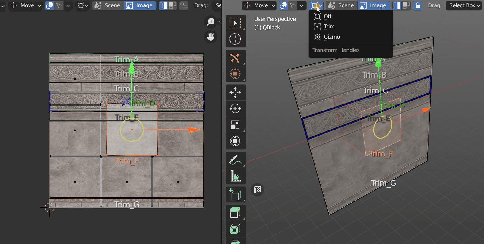
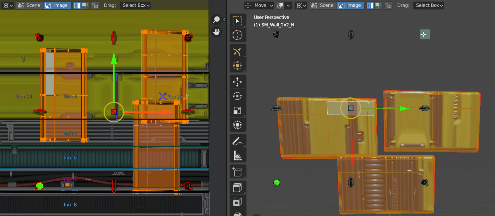
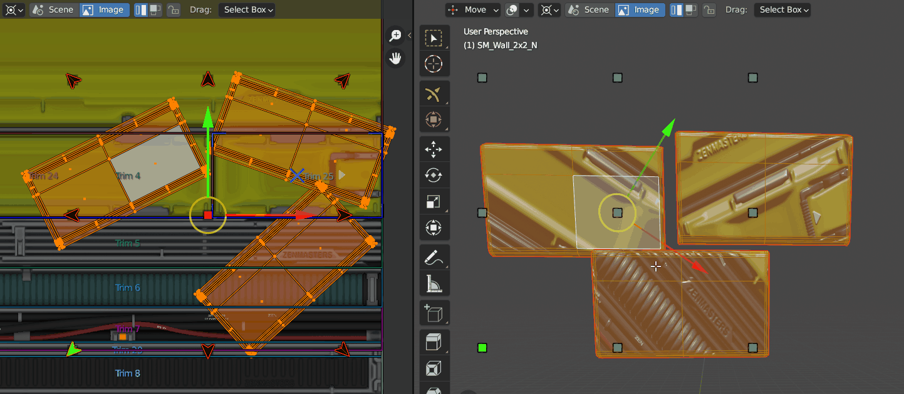
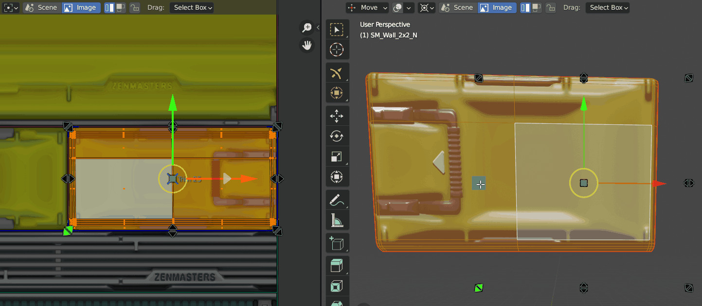
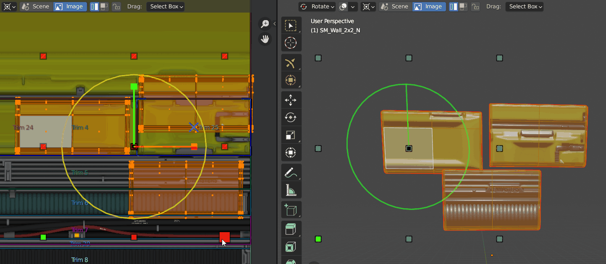
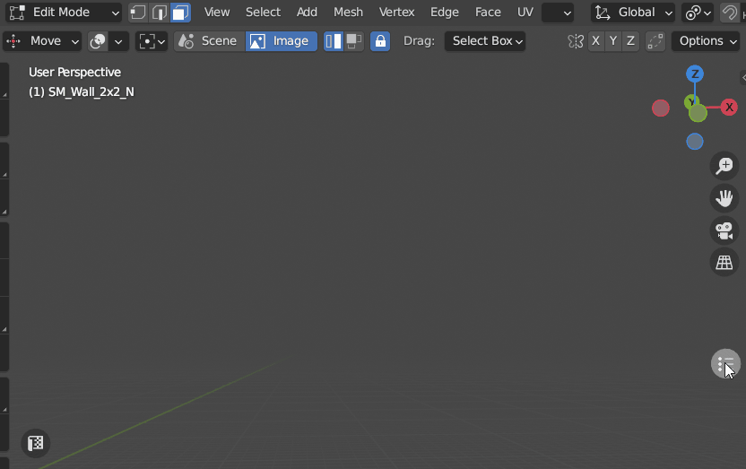
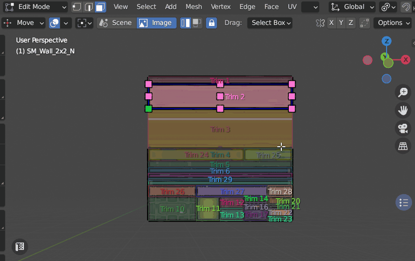

# Transform Tool

Move, Rotate, Orient, Scale, Fit, Align and Flip selected Islands or Faces/Edges/Vertices in 3D Viewport and UV Editor using Zen UV Gizmo.

!!! tip
    Watch the video explaining how **Transform Tool** works.

    

    <iframe src="https://www.youtube.com/embed/f9meGzMGx2k?start=275&end=580" style="position: absolute; top: 0; left: 0; width: 100%; height: 100%;" allowfullscreen="" seamless="" frameborder="0"></iframe>
    

You can activate it on the left bottom corner of the Tool panel.

Or from Pie Menu `Shift+U` on the **Sector 2** with holding `Shift`

## Transform Tool Panel

### Tool Modes
Using different modes you can **Move, Rotate, Scale** selected Islands or Faces/Edges/Vertices in 3D Viewport and UV Editor.

#### Move `G` 
Move Mode is representing [**Move in Trim**](trimsheet_operators.md/#move-in-trim) operator and moves selected Islands or Faces/Edges/Vertices.

#### Rotate `R`
Rotate Mode is representing [**Rotate in Trim**](trimsheet_operators.md/#rotate-in-trim) operator and rotates selected Islands or Faces/Edges/Vertices.

#### Scale `S`
Scale Mode is representing [**Scale in Trim**](trimsheet_operators.md/#scale-in-trim) operator and scales selected Islands or Faces/Edges/Vertices.

### Display Trims `D`

Activating Display Trip option in the Top part you activate Trims visibility.
If you don't have any Trims the UV Space will be counted as one Trim.

Frame around Gizmo marks the boundary of the Trim and helps to determine the location of Islands or selected faces on UVs.

If you have Trims you'll see the Trim list as well as texture assigned to the Trim.

### Trim Select `F`

When Trim Select is active you can choose active Trim.

### Display Trims Settings

!!! Panel
    

#### Main

- **Display All Trims**. Display All Trims or only active one.
- **Texture Preview**. Display Trimsheet texture.
- **Display Name**. Display Trim names.

#### Automatic Settings

- **Auto Highlight**. Enable Display Trim settings by **Default** or use custom behavior with **Manual** settings when activating Transform Tool.

!!! tip
    It's recommended to use **Manual** if you don't want to see **Display Trims** each time when you activate the tool.

- **Auto Disable Overlay**. Auto Disable **Blender** or/and **Trims** overlay when activating Transform Tool.

#### Style Settings
Trim display settings in 3D Viewport and UV Editor, including **Fill**, **Transparency**, **Font Size**.

### Transform Handles
Transform Handles provides access to such operators as **Align**, **Rotate**, **Orient**, **Fit**, **Flip**, **Set Pivot** and others. 

- **Off**. Disable Transform handles.
- **Trim**. Transform Handles Frame attached to the active Trim.
- **Gizmo**. Transform Handles Frame attached to Gizmo.

### Transform Handles Tools

#### Align `Default`
Align tool is representing [**Align to Trim**](trimsheet_operators.md/#align-to-trim) operator and align selected Islands or Faces/Edges/Vertices to active Trim.

#### Rotate 90' and Orient `Ctrl`

Corner Point rotates Islands + 90'(CW). The green corner Point - 90'(CCW).

Other Points Orients Islands Horizontally, Vertically, Automatically (Central Point).

#### Fit `Shift`
Fit tool is representing [**Fit to Trim**](trimsheet_operators.md/#fit-to-trim) operator and fits selected Islands or Faces/Edges/Vertices into active Trim.

#### Move and Fit `Ctrl + Shift + Scroll`
Using this tool you can Scroll between Trims and Fit your Islands in the same moment.

If you use names that divide trims into categories, you can enable an option that will limit trim changes to the selected category only.

#### Flip `Ctrl + Shift`
Flip tool is representing [**Flip in Trim**](trimsheet_operators.md/#flip-in-trim) operator and flips selected Islands or Faces/Edges/Vertices.

#### Set Pivot `Double Click`
Double click on Transform Handle Point sets Pivot for Transform operations. 

#### Extra Tools
Central Transform Handles Point has some extra tools.

- **Unwrap**. `Double Click + Ctrl`
- **World Orient**. `Double Click + Shift`
- **Trim by Face**. `Double Click + Ctrl + Shift`

### Trimsheet Data Storage
- **Scene**. Trim sheet is stored in a scene data-block.
- **Image**. Trim sheet is stored in an image data-block.

### Transform Mode
- **Islands**. Selected Islands are transformed.
- **Selection**. Selected Mesh Elements are transformed.

### Lock in Trim
Limit transforms by active Trim.

### Drag
Choose the tool when Drag.

- **Active Tool**. Use Active tool.
- **Tweak**. Use Tweak tool.
- **Select Box**. Use Select Box tool.
- **Select Circle**. Use Select Circle tool.
- **Select Lasso**. Use Select Lasso tool.

## Viewport Screen Selector
This widget represents one more way about how to choose active Trim in 3D Viewport.
Viewport Screen Selector will be always on top of your scene in 2D form.

You can enable it using widget button on the right top corner in 3D Viewport or press `Shift + F`.

You can change widget **Size** `Scroll` and **Position** `Shift + MMB + Drug` in 3D Viewport. 

You can **Screen Lock** the **Position** you like clicking with `Shift` on the widget button (it will change the color from Blue to Turquoise). When **Screen Lock** is active you can't change widget **Size** and **Position** using mouse. 

Also, **Position** can be **Screen Locked** and adjusted in **Display Trim Settings** when widget is active.

## UV Editor Tool Category
In UV Editor context you can switch from **Transforms** to **Trims** category where you can **Create** and **Resize** Trims.

More about the process of [**Trim Creation you can read here**](trimsheet_creation.md).