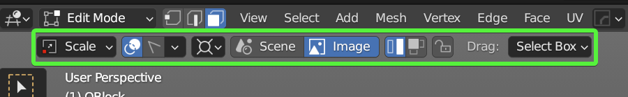
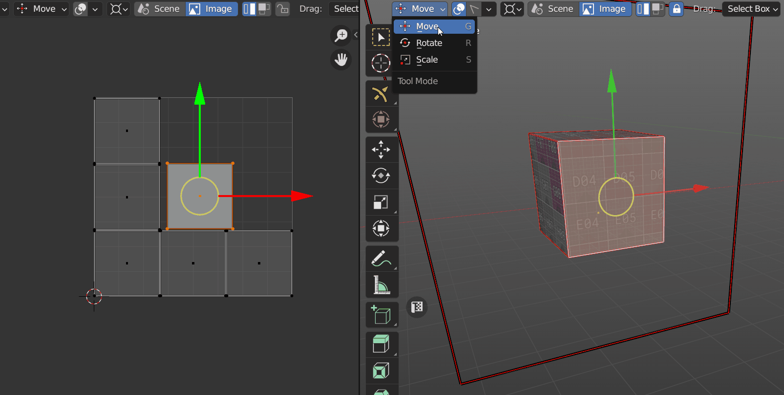

# Transform Tool

Move, Rotate, Scale, Fit, Align and Flip selected Islands or Faces/Edges/Vertices in 3D Viewport and UV Editor using Zen UV Gizmo. 

You can activate it on the left bottom corner of the Tool panel.

Or from Pie Menu `Shift+U` on the **Sector 2** with holding `Shift`

## Transform Tool Panel

### Tool Modes
Using different modes you can **Move, Rotate, Scale** selected Islands or Faces/Edges/Vertices in 3D Viewport and UV Editor.

#### Move `G`
Move Mode is representing **Move in Trim** operator and moves selected Islands or Faces/Edges/Vertices.

#### Rotate `R`
Rotate Mode is representing **Rotate in Trim** operator and rotates selected Islands or Faces/Edges/Vertices.

#### Scale `S`
Scale Mode is representing **Scale in Trim** operator and scales selected Islands or Faces/Edges/Vertices.

### Display Trims `D`

Activating Display Trip option in the Top part you activate Trims visibility.
If you don't have any Trims the UV Space will be counted as one Trim.

Frame around Gizmo marks the boundary of the Trim and helps to determine the location of Islands or selected faces on UVs.

If you have Trims you'll see the Trim list as well as texture assigned to the Trim.

### Trim Select `F`

When Trim Select is active you can choose active Trim.

### Dispay Trims Settings

!!! Panel
    

#### Display All Trims
Display All Trims or only active one.

#### Texture Preview
Display Trimsheet texture.

#### Display Name
Display Trim Names.

#### Auto Highlight

#### Trim Fill Settings

##### Opacity

#### Trim Stroke Settings

##### Default/Fixed/User

##### Transparency

#### Selected Color

### Transform Handles
Transform Handles 

#### Off

Disable Transform handles.

#### Trim

Transform Handles Frame attached to the active Trim. 

#### Gizmo

Transform Handles Frame attached to the screen. 

### Transform Handles Tools

#### Align

#### Rotate 90'

#### Fit

#### Flip

#### Set Pivot Point

#### Extra 

### Trimsheet Data Storage

### Transform Mode

### Lock in Trim

### Drug

## Viewport Screen Selector