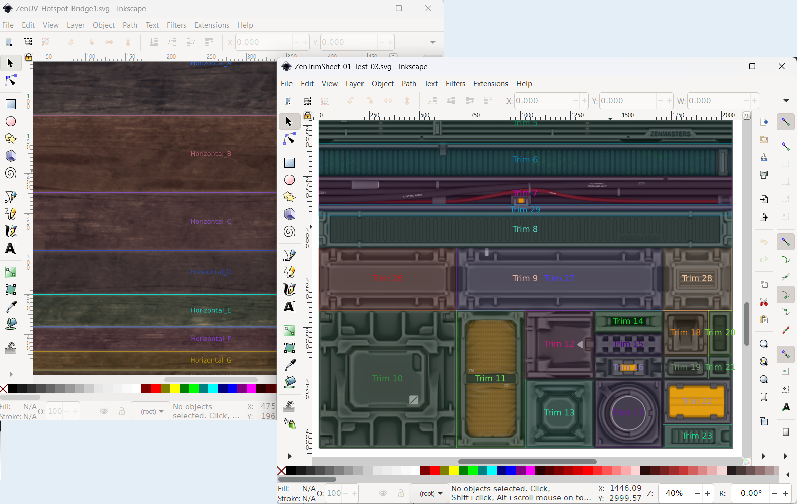
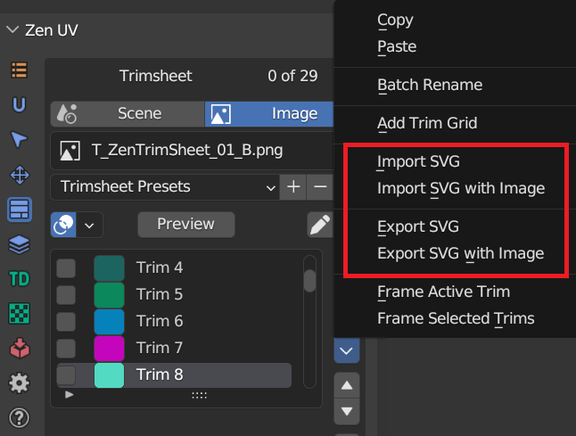

# Trim Sheets

## What is a trim sheet?
Trim sheets are a common technique to increase your texture quality on 3D assets while at the same time reducing the number of materials/textures on them. Trim sheets are a way to texture many assets with just a single set of textures, allowing for very efficient use of texture memory.

The Trim Sheet process is basically creating a texture that allows you to apply different details (from the same texture) to a model. This texture can be used on multiple objects, or even just one large one, with fantastic quality results. 
Most AAA games use this technique a lot on environment assets in order to have fantastic quality, save time on development, keep assets together with a set theme, and many other reasons.

|  |
|---|

## Why would you use a trim sheet?
The main thing which make trim sheets valuable is their reusability. If you have a scene with lots
of recurring elements those are ideal candidates for a trim sheet.

|  |
|---|

## [Create your trim sheet with Zen UV](trimsheet_creation.md)
Zen UV addon provides all necessary tools to create your trim sections

!!! Preview
    

## Create your trim sheet in any 2D Vector Editor that supports SVG
We didn't want trim sheets system to be enclosed only in Blender. So we implemented very convenient import-export trim sheets into SVG files and back. If you are a PRO in such vector editor as Inkscape, feel free to create trim sheets in your favourite software and then just export it in SVG and import in Blender.

!!! SVG
    

## Share your trim sheets as SVG files
Sometimes sharing trim sheets as blend files is inconvenient, it requires matching Blender versions, cutting all unnecessary information not related to trim sheets, etc. So we implemented easy share trim sheets as SVG files. They can be viewed in any browser and can be edited not only in Blender but in every 2D Vector Editor.

|  |
|---|

## Export trim sheets to Substance 3D Designer
Substance 3D Designer is the industry standard for procedural textures creation.
You can create Trim textures in this software using masks from Zen UV add-on. 

!!! tip
    Watch the video explaining **How to export Trim sheets to Substance 3D Designer**.

    

    <iframe src="https://www.youtube.com/embed/jFcVmGnNOho?start=127&end=193" style="position: absolute; top: 0; left: 0; width: 100%; height: 100%;" allowfullscreen="" seamless="" frameborder="0"></iframe>
    

## Import trim sheets from DECAL Machine add-on
DECAL Machine is Blender add-on for Decal and Trim sheets creation.
You can import textures and Trim layout from DECAL Machine and use them with Zen UV Trim sheet system.

!!! tip
    Watch the video explaining **How to import trim sheets from DECAL Machine add-on**.

    

    <iframe src="https://www.youtube.com/embed/jFcVmGnNOho?start=66&end=124" style="position: absolute; top: 0; left: 0; width: 100%; height: 100%;" allowfullscreen="" seamless="" frameborder="0"></iframe>
    
