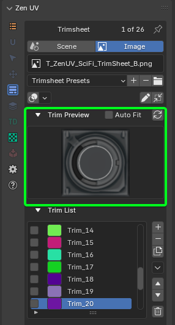
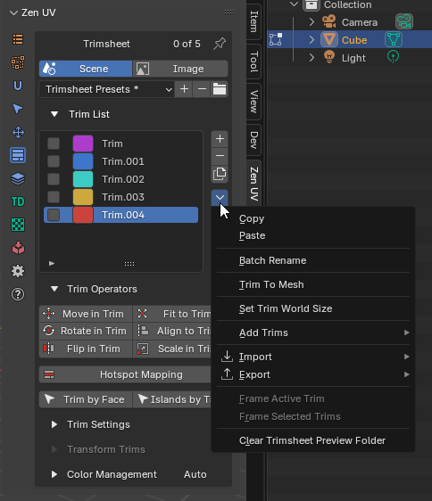
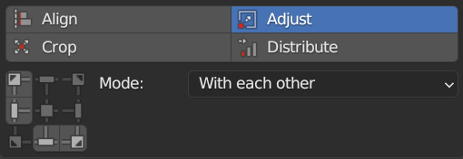

# Creating your trim sheet with Zen UV
Zen UV addon provides all necessary tools to create your trim sections

!!! tip
    Watch the video explaining how **Trimsheet Creation** works.

    

    <iframe src="https://www.youtube.com/embed/f9meGzMGx2k?start=770&end=950" style="position: absolute; top: 0; left: 0; width: 100%; height: 100%;" allowfullscreen="" seamless="" frameborder="0"></iframe>
    

!!! Panel
    

## Trim sheet data storage in blend file
Trim sheet can be stored either in a scene or in an image data-block of blend file

|  |
|---|
| Data storage modes|

| | |
|---|---|
| **Scene** | Trim sheet is stored in a scene data-block |
| **Image** | Trim sheet is stored in an image data-block |

### Active Trim Sheet
There is exactly one active trim sheet at any time in certain Blender editor (UV Image Editor, 3D Viewport).

- **Scene Mode**: never changes for the same scene
- **Image Mode**: depends on the current editor type
    - **UV Image Editor**:  
    trim sheet data is taken from the active Image Editor image
    

    - **3D Viewport**:  
    Trim sheet data is taken either from property trimsheet image of the active material or from the texture connected to the base color

        - Active Material Trimsheet Image
        

        - Active Material Base Color Image
        

## Trim Sheet Creation
Use ZenUV tool to create trims in UV Editor

|  |
|---|
| |

### Draw Trim in UV Editor
There is an option to draw a trim using mouse:

1. Activate ZenUV tool
2. Select tool category "Trims"
3. Select tool mode "Create"

|  |
|---|
| |

### Trims Snapping for Creation and Resizing
Snapping lets you easily align trims. It can be toggled by clicking the magnet icon in the ZenUV tool header

|  |
|---|
| |

| Snap Mode | Description |
|---|---|
| Pixels | Trim is snapped to image pixels if image is active in UV Editor |
| Grid | Trim is snapped to UV Grid |
| Trims | Trim is snapped to other trim borders |

|  |
|---|
| |

### Trims List
This control is useful to manage lists of trims. In the center of its area you can select, deselect, rename trims. On the right of the list view are additional buttons and button to call the additional popup menu.

### Active Trim
There is exactly one active trim in the curent trim sheet. It is highlighted in trim sheet UI list and surrounded with handles in trim editor

---

#### Select Active Trim with Preview Panel
You can select active trim with preview panel.

1. Open **Trim Preview** subpanel and press on the picture.

2. Select a corresponding trim

- **Auto Fit** - Execute fit to trim operation after trim is selected in preview. As a result, you can texture the selected island simply by choosing the appropriate image.
- **Update Trim Preview** - Rebuild trim preview icons

||
|---|
|Trim Preview and **Auto Fit** option|

---

### Selected Trims
Selected trims are indicated with tickmarks in trim sheet UI list and have a blue shape border in trim editor

#### Select Trim in UI List
To select an item in trim sheet UI list, `LMB` on it.

#### Select Trim in the Viewport
It is also possible to select trim by `LMB` in the viewport by activating selection mode

- **Rename** - By double-clicking on an item, you can edit its name via a text field. This can also be achieved by pressing `Ctrl-LMB` over it.
- **Resize** - The list view can be resized to show more or fewer items. Hover the mouse over the handle `(==)` then click and drag the handle to expand or shrink the list.
- **Filter** - Click the Show filtering options button (+) to toggle filter option buttons.

- **Search** - Type part of a list item’s name in the filter text field to filter items by part of their name.
- **Filter Include** - When the magnifying glass icon has a + sign then only items that match the text will be displayed.
- **Filter Exclude** - When the magnifying glass icon has a - sign then only items that do not match text will be displayed.
- **Sort** - Sort list items.
    - *Alphabetical* - This button switches between alphabetical and non-alphabetical ordering.
    - *Inverse* - Sort objects in ascending or descending order. This also applies to alphabetical sorting, if selected.

- **Add** - Adds a new item.
- **Remove** - Removes the selected item.
- **Duplicate** - Duplicates active or selected trim.
    - *Ignore Color* - Does not duplicate trim color settings
    - *Clear Selection* - Clear selection from source trims after duplicating

### Menu
A menu with operators e.g. copy paste, or operations on all items.

!!! Menu
    

#### Copy Trims to Clipboard

Copy [active](#active-trim), [selected](#selected-trims) or [all trims](#trims-list) to clipboard

!!! Properties
    

- *Active* - Copy active trim.
- *Selected* - Copy selected trims.
- *All* - Copy all trims in the trimsheet.

#### Paste Trims from Clipboard
Paste copied trims from clipboard.

!!! Properties
    

- *Clear* - Clear all trims before paste operation
- *Add* - Add trims to the end of trim sheet
- *Replace* - Add new trims and replace trims with the same name

#### Batch Rename
Can rename many trims at once. This uses a pop-up dialog with operations and their options to change the name. These actions are applied in order, from first to last in a trim sheet.

!!! Properties
    

- **Mode** - Trim batch rename mode.
    - *Selected* - Rename only selected trims.
    - *All* - Rename all trims.
- **Find** - The text to search for in names.
- **Replace** - The text to replace for in matching names found from the Find text.
- **Match Case** - Search results must exactly match the case of the Find text.
- **Use Regex** - Use Replace by Regular Expression.
- **Counter** - Integer value will be added to the end of the name.
- **Start from** - If Counter property is used, integer value will be started from this value.

#### Add Trim Grid
Create grid of trims inside active, selected trims, from zero coordinates or 2D cursor position.

!!! Properties
    

- **Start Position** - The starting position for creating trims.
    - *Zero Coordinates* - Start from zero coordinates x=0, y=0"),
    - *2D Cursor* - Start from 2D Cursor"),
    - *Inside of active Trim* - Creates a grid of Trims within the active Trim"),
    - *Inside of selected Trims* - Creates a grid of Trims within the selected Trims bounding box")
- **Trim Count Limit** - Limit the number of trims. A large number of trims may cause Blender to freeze. This sets the threshold at which processing will stop.
- **Trims Count U** - Trims count Horizontal.
- **Trims Count V** - Trims count Horizontal.
- **Grid Size** - Size of the grid.
- **Margin** - The gap between Trims.
- **Remove Template** - Delete the Trim that served as a template.

#### Add Trim UDIM
Creates trims in positions and with UDIM tile sizes.

!!! Properties
    

- **Mode** - Trims creation mode.
    - *Single* - Create a single trim by number.
    - *Range* - Create multiple trims in a given range.
- **Udim number** - UDIM number in single creation mode.
- **Udims start** - Udims range start.
- **Udims End** - Udims range end.
- **Trim Count Limit** - Limit the number of trims.

#### Add Trims From Color Masks
Create trims from a defined image containing color mask data.

!!! Properties
    

- **Image Name** - Source image name, which will be used for texture size.
- **Mode** - Image masking mode.
    - *Unique Color* - Image contains only one mask with given color.
    - *Multicolor* - Image contains multiple masks with the same color.
- **Color Masks Limit** - How many unique colors could be processed in image.

#### Add Trims From Zen Sets
Create trims from Zen Sets groups mesh elements with keeping its names. Available only if Zen Sets is installed.

#### Set Trim World Size
Set trim 'World Size' property based on texture size. Works on selected trims.

#### Frame Trim
Moves view to active or selected trims center in UV editor.

#### Clear Trimshet Preview Folder
Clear folder where trimsheet preview temporary icons are stored.

#### Move
Moves the selected item up/down one position. (up/down arrow icon).

#### Delete All
Deletes all trims in the trim sheet.

---
## Trim Sheet Presets
!!! Presets
    

### Preset Selector
A list of available presets. A selection will override the included properties.

!!! Notice
    If name in preset selector is marked with asterix then it shows name of category and active preset is not selected

### Add
New presets can be added based on a predefined set of properties, which will be saved for later reuse. A pop-up opens where you can set a name after which you can select it from the list and in some cases additional settings.

### Remove
Deletes the selected preset.

### Open Presets Folder
You can override the default presets folder with your own path

## Trim Settings
Trim settings property inspector shows settings of the active trim

!!! Dimensions
    

### Trim Units
By default trim units are in UV points based on values from 0 to 1, but it is possible to switch to image pixels depending on image size

- **X** - Trim left point
- **Y** - Trim bottom point
- **W** - Trim width
- **H** - Trim height

### Fit Axis

- **U** - U axis
- **V** - V axis
- **Min** - The minimum length axis is automatically determined
- **Max** - The maximum length axis is automatically determined
- **Automatic** - Automatically detected axis for full dimensional compliance

### Inset
Trim inset

### Keep Proportion
Keep trim proportions while transforming

### Match Rotation
Match trim rotation

### Align To
Align to remembered directions in Fit, Align operations

### World Size
Width and height of trim in [UV world size calculation units](#units)

### Units
UV world size calculation units

### Tags
Trim tags

### How to apply same settings to multiple trims?
|  |
|---|
| Group Apply Button-Indicator |

1. Select 2 or more trims
2. Press Apply button

#### Check the equality of properties in selected trims

| | |
|---|---|
|  | Properties are not equal |
|  | Properties are equal |

## Display Trims
Trims can be displayed in viewport with special gizmo layer

### Trims Display Overlay in UV Image Editor
|  |
|---|
| |

### Trims Display Polygon Overlay in 3D Viewport
!!! Note
    Trims display in 3D Viewport is enabled only if Zen UV Tool is active and active object has active polygon

|  |
|---|
| |

### Trims Display Overlay Widget in 3D Viewport
Trims can be displayed in overlay widget. To activate it you need to press gizmo button in the right side of 3D viewport

|  |
|---|
| |

#### Overlay Widget Locking Options
Trims display overlay widget can be moved by `Shift + Middle Mouse Button` and scaled by `Mouse Wheel Up|Down`. And its position can be locked in the settings

|  |
|---|
| |

## Transform Trims
|  |
|---|
| |

### Align Trims
Determines how selected trims will be aligned.

Use Align to align selected trims to the top, bottom, left, or right of an active trim or each other, or UV area bounds.

|  |
|---|
| |

### Crop Trims
Use Crop to crop selected trims or all trims by UV area bounds

|  |
|---|
| |

### Adjust Trims
Set the same width or height of the selected trim. You can select to use minimum or maximum value.

|  |
|---|
| |

### Distribute Trims
Use Distribute to distribute selected trims at equal distances between each other, starting distribution as is or from active trim, or from UV area bounds

|  |
|---|
| |
