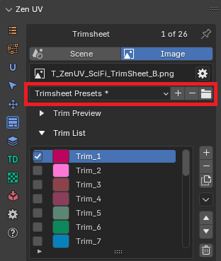
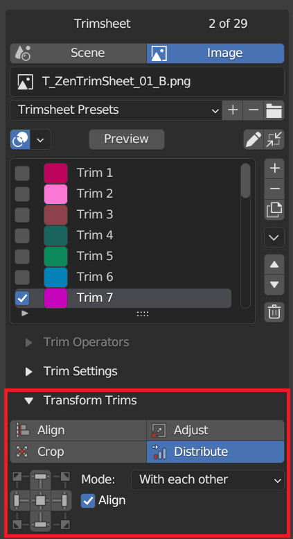

# Creating your trim sheet with Zen UV
Zen UV addon provides all necessary tools to create your trim sections

!!! Panel
    

## Trim sheet data storage in blend file
Trim sheet can be stored either in a scene or in an image data-block of blend file

|  |
|---|
| Data storage modes|

| | |
|---|---|
| **Scene** | Trim sheet is stored in a scene data-block |
| **Image** | Trim sheet is stored in an image data-block |

### Active Trim Sheet
There is exactly one active trim sheet at any time in certain Blender editor (UV Image Editor, 3D Viewport).

- **Scene Mode**: never changes for the same scene
- **Image Mode**: depends on the current editor type
    - **UV Image Editor**:  
    trim sheet data is taken from the active Image Editor image
    

    - **3D Viewport**:  
    Trim sheet data is taken either from property trimsheet image of the active material or from the texture connected to the base color

        - Active Material Trimsheet Image
        

        - Active Material Base Color Image
        

## Trim Sheet Creation

### Trims List
This control is useful to manage lists of trims. In the center of its area you can select, deselect, rename trims. On the right of the list view are additional buttons and button to call the additional popup menu.

#### Select
To select an item, `LMB` on it.

#### Rename
By double-clicking on an item, you can edit its name via a text field. This can also be achieved by pressing `Ctrl-LMB` over it.
#### Resize
The list view can be resized to show more or fewer items. Hover the mouse over the handle `(==)` then click and drag the handle to expand or shrink the list.
#### Filter
Click the Show filtering options button (+) to toggle filter option buttons.

- **Search**:  
Type part of a list item’s name in the filter text field to filter items by part of their name.
- **Filter Include**:  
When the magnifying glass icon has a + sign then only items that match the text will be displayed.
- **Filter Exclude**:  
When the magnifying glass icon has a - sign then only items that do not match text will be displayed.
- **Sort**:  
Sort list items.
    - Alphabetical:  
This button switches between alphabetical and non-alphabetical ordering.
    - Inverse:  
Sort objects in ascending or descending order. This also applies to alphabetical sorting, if selected.

### Add
Adds a new item.

### Remove
Removes the selected item.

### Menu
A menu with operators e.g. copy paste, or operations on all items.

!!! Menu
    

### Move (up/down arrow icon)
Moves the selected item up/down one position.

### Delete All
Deletes all trims in the trim sheet

## Trim Sheet Presets
!!! Presets
    

### Preset Selector
A list of available presets. A selection will override the included properties.

### Add
New presets can be added based on a predefined set of properties, which will be saved for later reuse. A pop-up opens where you can set a name after which you can select it from the list and in some cases additional settings.

### Remove
Deletes the selected preset.

### Open Presets Folder
You can override the default presets folder with your own path

## Trim Settings
Trim settings property inspector shows settings of the active trim

!!! Dimensions
    

### X
Trim left point

### Y
Trim bottom point

### W
Trim width

### H
Trim height

### Fit Axis

| | |
|---|---|
| **U** | U axis |
| **V** | V axis |
| **Min** | The minimum length axis is automatically determined |
| **Max** | The maximum length axis is automatically determined |
| **Automatic** | Automatically detected axis for full dimensional compliance |

### Inset
Trim inset

### Keep Proportion
Keep trim proportions while transforming

### Match Rotation
Match trim rotation

### Align To
Align to remembered directions in Fit, Align operations

### Tags
Trim tags

### How to apply same settings to multiple trims?
|  |
|---|
| Group Apply Button-Indicator |

1. Select 2 or more trims
2. Press Apply button

#### Check the equality of properties in selected trims

| | |
|---|---|
|  | Properties are not equal |
|  | Properties are equal |

## Display Trims
Trims can be displayed in viewport with special gizmo layer

### Trims Display Overlay in UV Image Editor
|  |
|---|
| |

### Trims Display Polygon Overlay in 3D Viewport
!!! Note
    Trims display in 3D Viewport is enabled only if Zen UV Tool is active and active object has active polygon

|  |
|---|
| |

### Trims Display Overlay Widget in 3D Viewport
Trims can be displayed in overlay widget. To activate it you need to press gizmo button in the right side of 3D viewport

|  |
|---|
| |

#### Overlay Widget Locking Options
Trims display overlay widget can be moved by `Shift + Middle Mouse Button` and scaled by `Mouse Wheel Up|Down`. And its position can be locked in the settings

|  |
|---|
| |

## Transform Trims
|  |
|---|
| |

### Align Trims
Determines how selected trims will be aligned.

Use Align to align selected trims to the top, bottom, left, or right of an active trim or each other, or UV area bounds.

|  |
|---|
| |

### Crop Trims
Use Crop to crop selected trims or all trims by UV area bounds

|  |
|---|
| |

### Adjust Trims
Set the same width or height of the selected trim. You can select to use minimum or maximum value.

|  |
|---|
| |

### Distribute Trims
Use Distribute to distribute selected trims at equal distances between each other, starting distribution as is or from active trim, or from UV area bounds

|  |
|---|
| |
