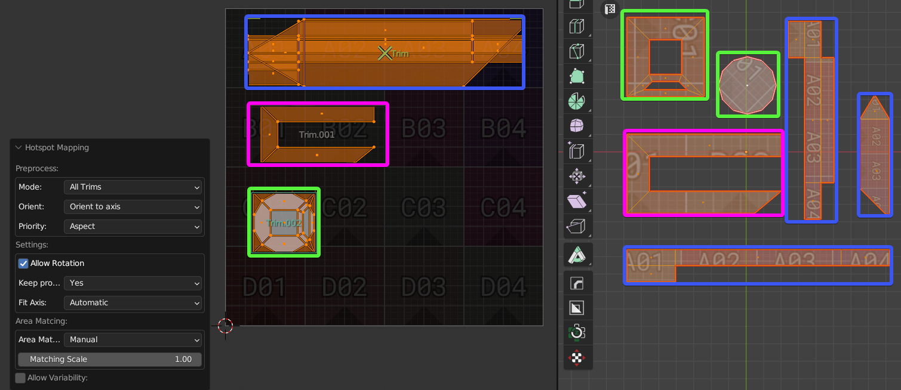
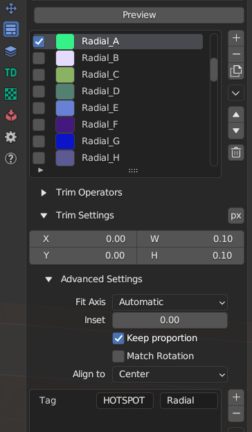

# Hotspot Mapping

Hotspot Mapping is a UV mapping method that compares the parameters of Islands and Trims and makes automatic mapping based on the given settings. [The original idea belongs to VALVE.](https://developer.valvesoftware.com/wiki/Half-Life:_Alyx_Workshop_Tools/Level_Design/Hotspot_Texturing)

!!! tip
    Watch the video explaining how **Hotspot Mapping** works.

    

    <iframe src="https://www.youtube.com/embed/f9meGzMGx2k?start=584&end=751" style="position: absolute; top: 0; left: 0; width: 100%; height: 100%;" allowfullscreen="" seamless="" frameborder="0"></iframe>
    

To activate Hotspot Mapping you need to use button from **Trim Operators** (Trimsheet Panel) or from Pie Menu `Shift+U` on the **Sector 1** with holding `Shift`.

!!! Hotspot Scene Example
    You can test Hotspot Mapping feature here.

    

## Hotspot Mapping Settings Panel
!!! Hotspot Mapping Settings Panel
    

### Preprocess

#### Mode

- **All Trims**. Map in All Trims.
- **Selected Trims**. Map only in selected Trims (Blue Frames).

#### Orient
- **As is**. No rotation at all. 
- **Orient to World**. Orient Islands to World.
- **Orient to axis**. Orient Islands to nearest axis.

#### Priority
- **Aspect**. Priority to Aspect Ratio (Height to Width) matching. Good option if you don't care about different TD between Islands.
  

- **Area**. Priority to Area matching, good for saving approximate TD.

---

### Settings

#### Allow Rotation
Allow Islands rotation 90' to achieve the best results.

#### Keep Proportions

- **Yes**. Keep Islands Proportions.
- **No**. Don't keep Islands Proportions.

- **Trim Settings**. Use particular Trim properties from **Trim Settings - Advanced Settings** panel.

#### Fit Axis

- **Automatic**. Automatically detect axis.
- **Trim Settings**. Use particular Trim properties from **Trim Settings - Advanced Settings** panel.

    !!! Trim Settings for the example above
        

---

### Area Matching

- **As is**. Islands will be located in Trim with the closest area. 
- **Max**. Islands will be located in Trim with the largest area. The highest possible TD.
- **Min**. Islands will be located in Trim with the lowest area. The lowest possible TD.
- **Manual**. Custom Scale.

#### Matching Scale

Adjust Scale for **Manual** settings of **Area Matching Conditions**.
Value 1 is equivalent to **As is** settings of **Area Matching Conditions**.

---

### Allow Variability
Variability options to make mapping more unique and less repetetive.

- **Allow Rotation Variation**. Allow Islands random rotation 180' degrees to increase Variability.
- **Allow Location Variation**. Allow Islands to be placed in other Trims with similar parameters.
- **Variation Offset**. Perform Islands Offset in the Trim if it's possible.

    

- **Detect Radial**. Detect Radial Islands and map them in Trims with Tag 'HOTSPOT Radial'. Non-Radial Islands won't be mapped to Radial Trims.
  
    
    
    !!! Tag Trim Radial
        

- **Select Radials**. Select Radial Islands.
- **Seed**. Islands Variability Seed.

    

- **Aspect Influence**. Aspect Influence for calculating the correspondence proportions between Trims and Islands.