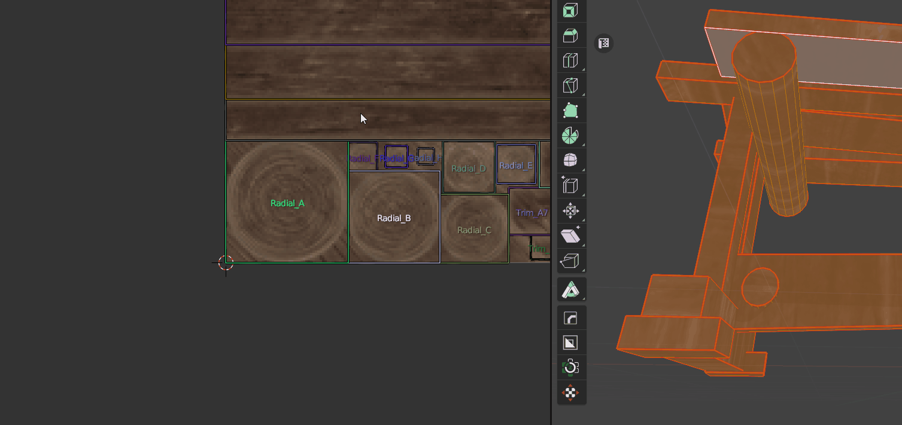

# Hotspot Mapping

Hotspot Mapping is a UV mapping method that compares the parameters of Islands and Trims and makes automatic mapping based on the given settings. [The original idea belongs to VALVE.](https://developer.valvesoftware.com/wiki/Half-Life:_Alyx_Workshop_Tools/Level_Design/Hotspot_Texturing)

!!! tip
    Watch the video explaining how **Hotspot Mapping** works.

    

    <iframe src="https://www.youtube.com/embed/f9meGzMGx2k?start=584&end=751" style="position: absolute; top: 0; left: 0; width: 100%; height: 100%;" allowfullscreen="" seamless="" frameborder="0"></iframe>
    

To activate Hotspot Mapping you need to use button from **Trim Operators** (Trimsheet Panel) or from Pie Menu `Shift+U` on the **Sector 1** with holding `Shift`.

!!! Hotspot Scene Example
    You can test Hotspot Mapping feature here.

    

---

## Hotspot Mapping Operator
!!! Properties
    

---

### Preprocess

- **Mode** - Use all trims or selected trims to map islands.
    - *All Trims* - Map in all trims.
    - *Selected Trims* - Map only in selected trims (Blue Frames).

- **Orient** - Perform some Island rotation before Hotspotting
    - *As is* - No rotation at all. 
    - *Orient to World* - Orient islands to world.
    - *Orient to Axis* - Orient islands to nearest axis.

- **Priority** - Prioritizing the similarities between the Trim and the Island.
Determines the criterion that takes effect first.
    - *Aspect* - Priority to Aspect Ratio (Height to Width) matching. Good option if you don't care about different TD between Islands.
    - *Area* - Priority to Area matching, good for saving approximate TD.
    - *World Size* - Based on the **World Size** trim property.

||
|---|
|Hotspot Priority **Aspect**|

||
|---|
|Hotspot Priority **Area**|

---

### Settings

- **Allow Rotation** - Allow Islands rotation 90' to achieve the best results.
- **Keep Proportions** - Ensures that the proportions of the UV island remain unchanged when it is moved into a trim.
    - *Yes* - Keep Islands Proportions.
    - *No* - Don't keep Islands Proportions.
    - *Trim Settings* - Use particular trim properties from **Trim Settings - Advanced Settings** panel.

||
|---|
|Hotspot **Keep Proportions**|

- **Fit Axis** - Where to get the Fit Axis parameter.
    - *Automatic* - Automatically detect axis.
    - *Trim Settings* - Use particular Trim properties from **Trim Settings - Advanced Settings** panel.

!!! Trim Settings for the example above
    

---

### Area Matching

- **Area Matching** - How to match Trim area with Island area.
    - *As is* - Islands will be located in Trim with the closest area. 
    - **Max** - Islands will be located in Trim with the largest area. The highest possible TD.
    - **Min** - Islands will be located in Trim with the lowest area. The lowest possible TD.
    - **Manual** - Custom Scale.

- **Matching Scale** - The value for manually adjusting the area matching scale. Adjust Scale for **Manual** settings of **Area Matching Conditions**. Value 1 is equivalent to **As is** settings of **Area Matching Conditions**.

---

### Variability

- **Allow Variability** - Variability options to make mapping more unique and less repetetive.

- **Allow Rotation Variation** - Allow Islands random rotation 180' degrees to increase Variability.
- **Allow Location Variation** - Allows islands to be placed in other trims with similar parameters. Requires two or more identical trims.
- **Allow Offset Variation** - Allows islands to be shifted within the trim if the trim settings permit it. This works only if the Fit Axis option is set to Trim Settings.
- **Variation Offset** - The amount by which the shift will be performed, if possible.

||
|---|
|Hotspot **Variation Offset**|

- **Detect Radial** - Detect Radial Islands and map them in Trims with Tag 'HOTSPOT Radial'. Non-Radial Islands won't be mapped to Radial Trims.
  
||
|---|
|Hotspot **Detect Radial**|
    
!!! Tag Trim Radial
    

- **Select Radials** - Select radial islands.
- **Seed** - Islands variability seed.

||
|---|
|Hotspot **Seed**|

- **Aspect Influence** - Aspect influence for calculating the correspondence proportions between Trims and Islands.