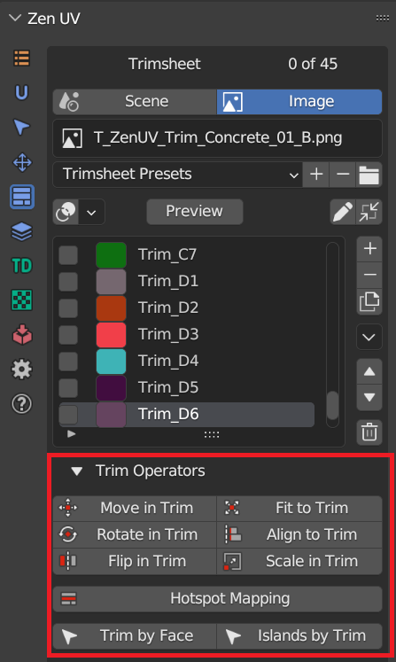
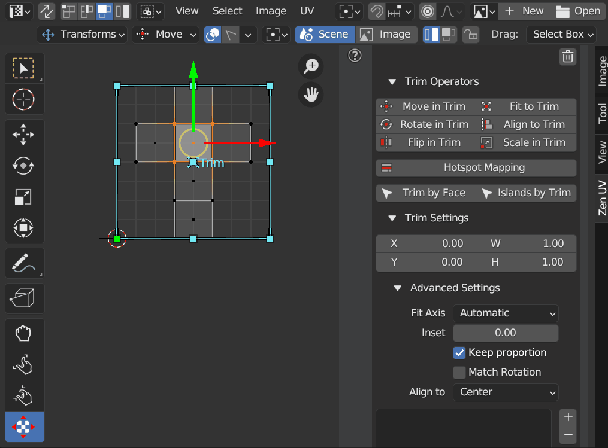
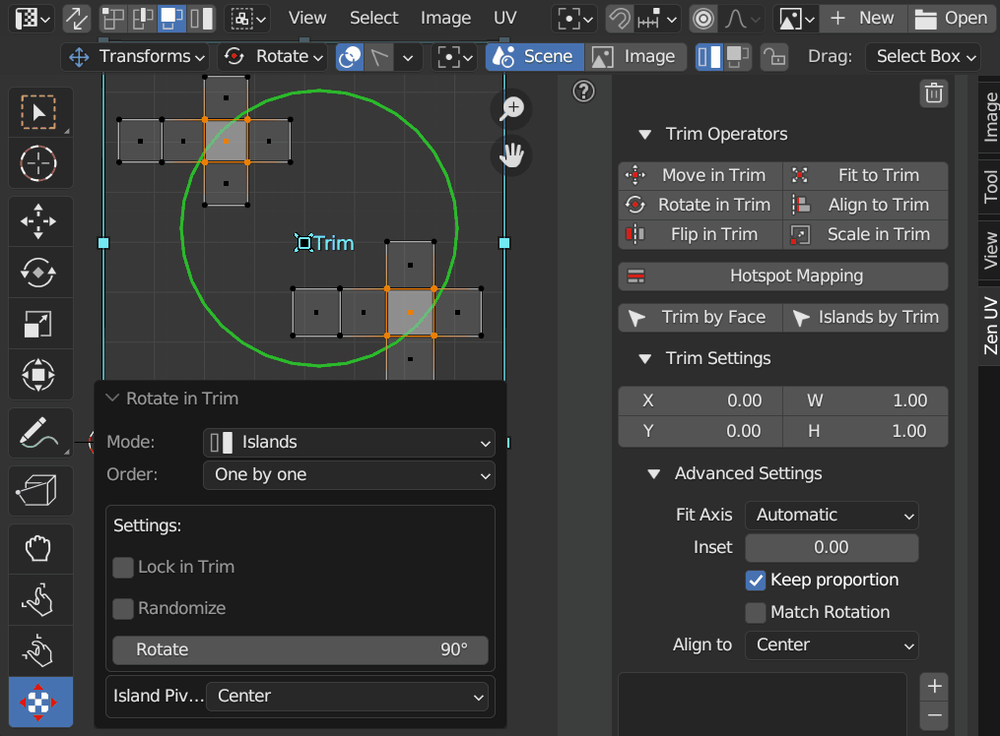
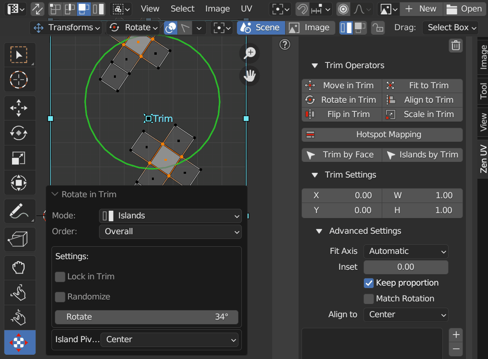
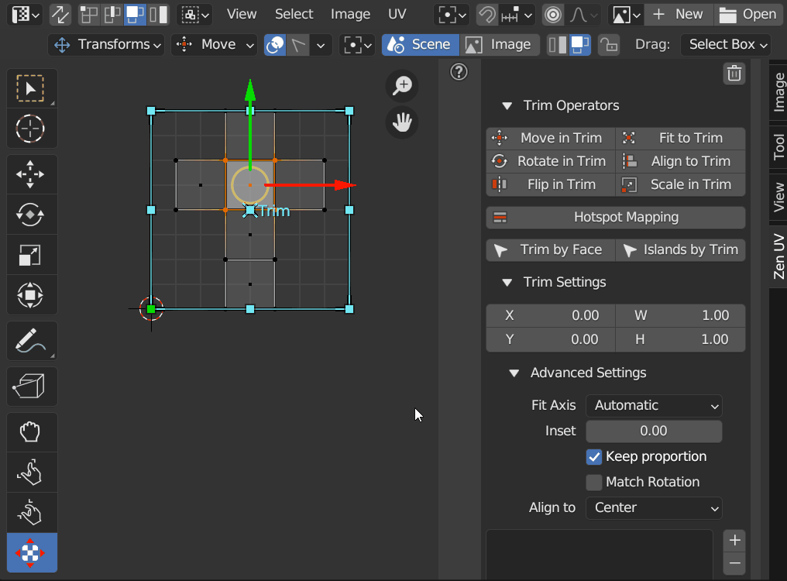

# Trim Sheet Operators

!!! Panel
    

## Mesh Selection Mode
The mode defines the behaviour what part of mesh will be transformed

### Islands
Islands that has selected mesh elements are transformed in the mode

|  |
|---|
| |

## Processing Order
### One By One
Islands are processed with separate pivots

|  |
|---|
| |

### Overall
All islands are processed with the same pivot

|  |
|---|
| |

### Selection
Only selected mesh elements are transformed in the mode

|  |
|---|
| |

## Move In Trim
Move islands inside active trim. Islands outside active trim will be ignored if **Lock in Trim** option is set

## Rotate In Trim
Rotate islands inside active trim

## Flip In Trim
Flip islands relative to the center of active trim

## Fit To Trim
Fit islands into active trim

## Align To Trim
Align islands to active trim

## Scale In Trim
Scale in active trim. Islands outside active trim will be ignored if **Lock in Trim** option is set

## Hotspot Mapping
Map islands by matching them to predefined trims in trim sheet

## Select Trim By Face
Select and activate trim by selected face

## Select Islands By Trim
Select islands inside active trim