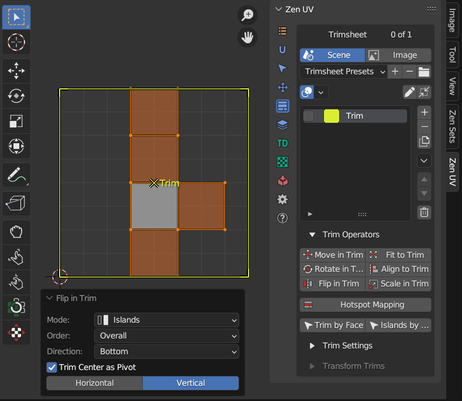
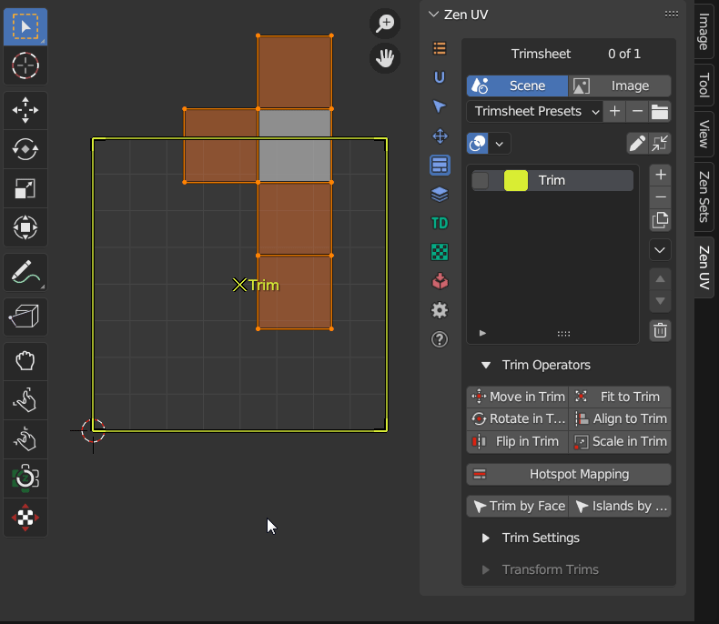
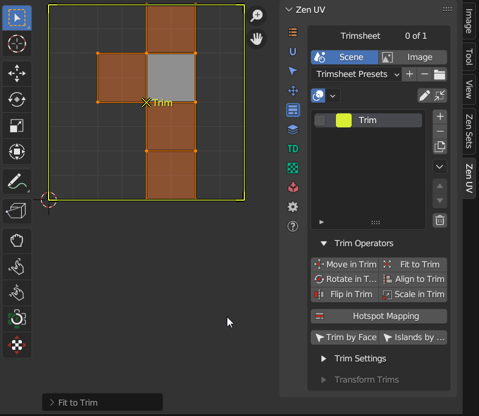
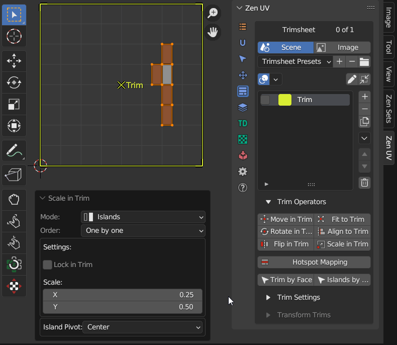
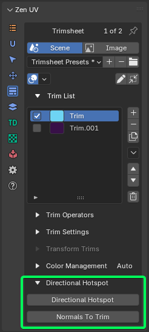
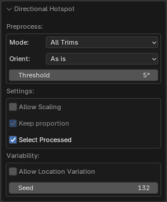
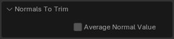

# Trim Sheet Operators

!!! Panel
    

## Mesh Selection Mode
The mode defines the behaviour what part of mesh will be transformed

### Islands
Islands that has selected mesh elements are transformed in the mode

|  |
|---|
| |

## Processing Order
### One By One
Islands are processed with separate pivots

|  |
|---|
| |

### Overall
All islands are processed with the same pivot

|  |
|---|
| |

### Selection
Only selected mesh elements are transformed in the mode

|  |
|---|
| |

## Move In Trim
Move islands inside active trim. Islands outside active trim will be ignored if **Lock in Trim** option is set

## Rotate In Trim
Rotate islands inside active trim

## Flip In Trim
Flip islands relative to the center of active trim

|  |
|---|
| |

## Fit To Trim
Fit islands into active trim

|  |
|---|
| |

## Align To Trim
Align islands to active trim

|  |
|---|
| |

## Scale In Trim
Scale in active trim. Islands outside active trim will be ignored if **Lock in Trim** option is set

|  |
|---|
| |

## Hotspot Mapping
Hotspot Mapping is a UV mapping method that compares the parameters of Islands and Trims and makes automatic mapping based on the given settings.

[**Follow the link**](trimsheet_hotspot.md) to find more information about Hotspot Mapping.

## Select Trim By Face
Select and activate trim by selected face

## Select Islands By Trim
Select islands inside active trim

---
## Directional Hotspot Mapping

### Directional Hotspot Operator

Hotspot mapping using island normal vector.

!!! Properties
    

    - **Mode** – Defines which trims will be used for mapping.  
        - *All Trims* – Uses all available trims.  
        - *Selected Trims* – Uses only the selected trims.  
    - **Orient** – Determines island rotation before mapping.  
        - *As Is* – No rotation applied.  
        - *Orient to World* – Aligns the island to the world axis.  
        - *Orient to Axis* – Auto-orients the island to the nearest axis.  
    - **Threshold** – Defines how precisely the island's normal must match the trim's normal for mapping.  
    - **Keep Proportion** – Prevents stretching or squashing by maintaining the original aspect ratio of the UV islands.  
    - **Allow Location Variation** – If enabled, islands may be placed in different trims that have similar size and orientation parameters. If disabled, islands are strictly mapped to their assigned trims.  
    - **Allow Scaling** – Automatically scales UV islands to fit the target trim while preserving proportions (unless 'Keep Proportion' is disabled).  
    - **Select Processed** – After applying the mapping, this option highlights the UV islands that were successfully adjusted to trims.  
    - **Seed** – Sets a seed value for the randomization algorithm, ensuring consistent placement variations of islands in similar trims.  

    - **Orient** - Perform some Island rotation before Hotspotting

---
### **Normals To Trim**

Retrieve the normal vector from the selected face and apply it to the active trim.

!!! Properties  
      

- **Average Normal Value** – If enabled, calculates the average normal when multiple faces are selected.  
  If disabled, only the normal of the active face will be applied to the trim.  
