# Trim Sheet Operators

!!! Panel
    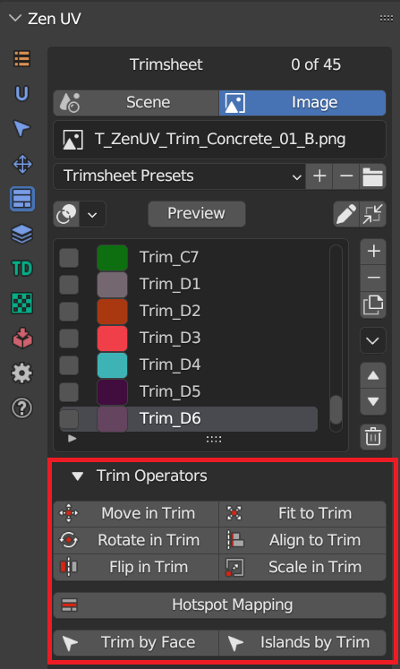

## Mesh Selection Mode
The mode defines the behaviour what part of mesh will be transformed

### Islands
Islands that has selected mesh elements are transformed in the mode

| 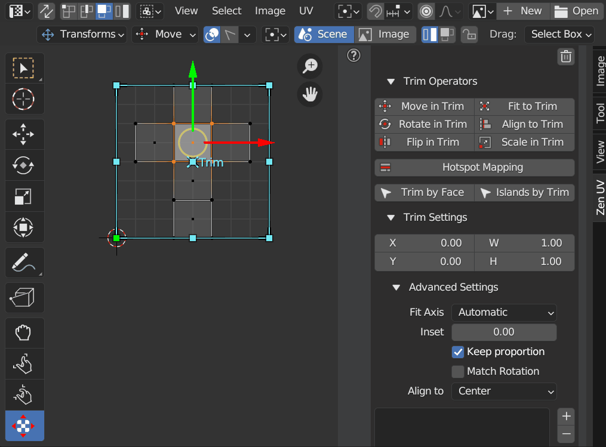 |
|---|
| |

## Processing Order
### One By One
Islands are processed with separate pivots

| 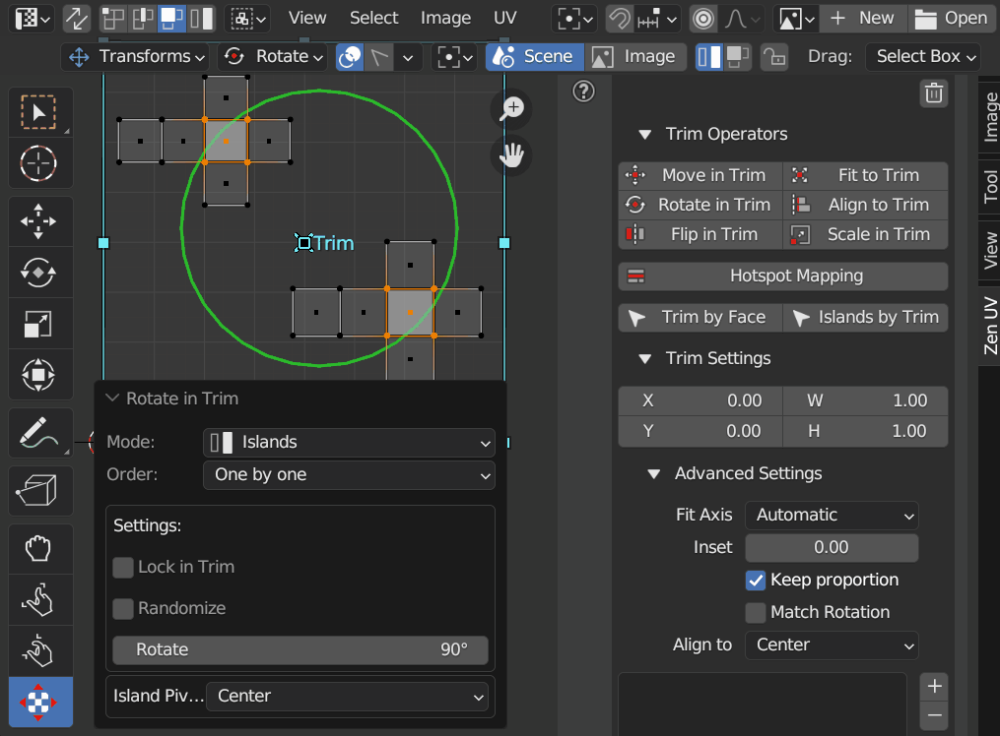 |
|---|
| |

### Overall
All islands are processed with the same pivot

| 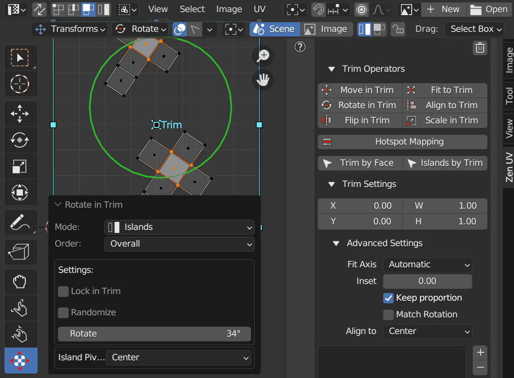 |
|---|
| |

### Selection
Only selected mesh elements are transformed in the mode

| 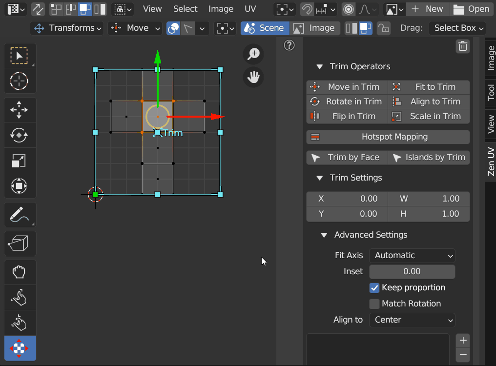 |
|---|
| |

## Move In Trim

Move islands inside active trim. Islands outside active trim will be ignored if **Lock in Trim** option is set.

- **Mode** - Transform Mode.
    - *Islands* - Transform islands mode.
    - *Selection* - Transform selection (uv, mesh) mode.

- **Order** - Processing order.
    - *One by one* - Processing islands one by one.
    - *Overall* - Processing whole selection.

- **Lock in Trim** - Perform transform operations only inside of trim.
- **Move** - The offset values by axis.

## Rotate In Trim

Rotate islands inside active trim.

- **Mode** - Transform Mode.
    - *Islands* - Transform islands mode.
    - *Selection* - Transform selection (uv, mesh) mode.

- **Order** - Processing order.
    - *One by one* - Processing islands one by one.
    - *Overall* - Processing whole selection.

- **Lock in Trim** - Perform transform operations only inside of trim.
- **Randomize** - Randomize rotation angle.
- **Rotate** - Island rotation angle.
- **Island Pivot** - Describes a center of transformation.

## Flip In Trim
Flip islands relative to the center of active trim

- **Mode** - Transform Mode.
    - *Islands* - Transform islands mode.
    - *Selection* - Transform selection (uv, mesh) mode.

- **Order** - Processing order.
    - *One by one* - Processing islands one by one.
    - *Overall* - Processing whole selection.

- **Direction** - Describes the side of the trim on which the alignment will take place.
- **Trim Center as Pivot** - Use center of Trim as transformation Pivot.
- **Direction** - To align along one axis, select horizontal or vertical. Otherwise, select both.

| 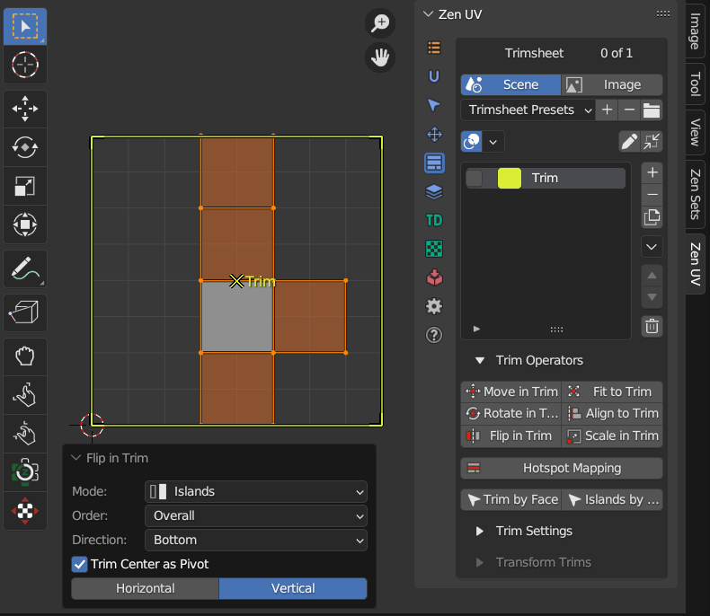 |
|---|
| |

## Fit To Trim
Fit islands into active trim

- **Transform Faces** - Treat the selected faces as if each of them were a separate island.
- **Mode** - Transform Mode.
    - *Islands* - Transform islands mode.
    - *Selection* - Transform selection (uv, mesh) mode.

- **Order** - Processing order.
    - *One by one* - Processing islands one by one.
    - *Overall* - Processing whole selection.

- **Fit** - Transform Mode.
    - *To Active Trim (Exact)* - Place the island in the trim exactly as described by the trim properties.
    - *To Active Trim (Tweak)* - Place the island in the trim as described by the trim properties, but with the option to configure it in the operator.

- **Automatic Unwrap** - Perform Unwrap Island before Fit to Active Trim.
- **Fit Axis** - Active Axis
    - *U* - U axis.
    - *V* - V axis.
    - *Min* - The minimum length axis is automatically determined.
    - *Max* - The maximum length axis is automatically determined.
    - *Automatic* - Automatically detected axis for full dimensional compliance.

- **Inset** - Inset value.
- **Keep proportion** - Do not change the proportions of the processed island.
- **Match Rotation** - Rotate the island being processed so that its orientation matches the orientation of the trim.
- **Island Pivot** - The pivot of the transformed island.

| 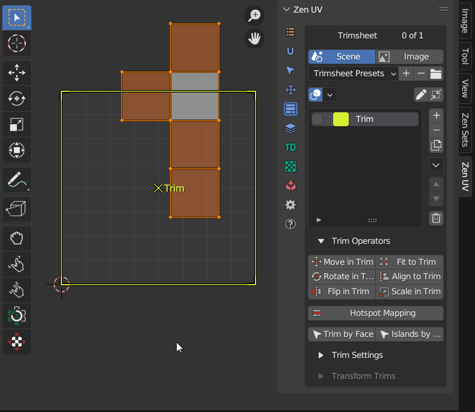 |
|---|
| |

## Align To Trim
Align islands to active trim

- **Transform Vertices** - Align each selected vertex separately.
- **Mode** - Transform Mode.
    - *Islands* - Transform islands mode.
    - *Selection* - Transform selection (uv, mesh) mode.

- **Order** - Processing order.
    - *One by one* - Processing islands one by one.
    - *Overall* - Processing whole selection.
- **Single Axis** - Align only along one axis. Works only for Top, Bottom, Left, Right
- **Align Diresction** - Describes the side of the trim on which the alignment will take place.
- **Use Trim Settings** - Use Active Trim settings "Align to" instead of operator settings.
- **Island Pivot** - The pivot of the transformed island.

| 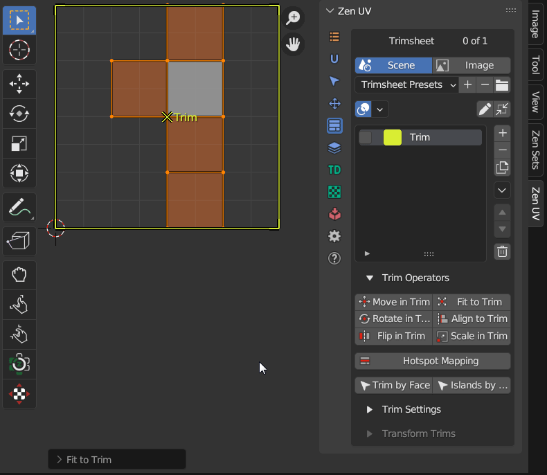 |
|---|
| |

## Scale In Trim
Scale in active trim. Islands outside active trim will be ignored if **Lock in Trim** option is set

- **Mode** - Transform Mode.
    - *Islands* - Transform islands mode.
    - *Selection* - Transform selection (uv, mesh) mode.

- **Order** - Processing order.
    - *One by one* - Processing islands one by one.
    - *Overall* - Processing whole selection.

- **Lock in Trim** - Perform transform operations only inside of trim.
- **Scale** - The scale value by axes.
- **Island Pivot** - The pivot of the transformed island.

| 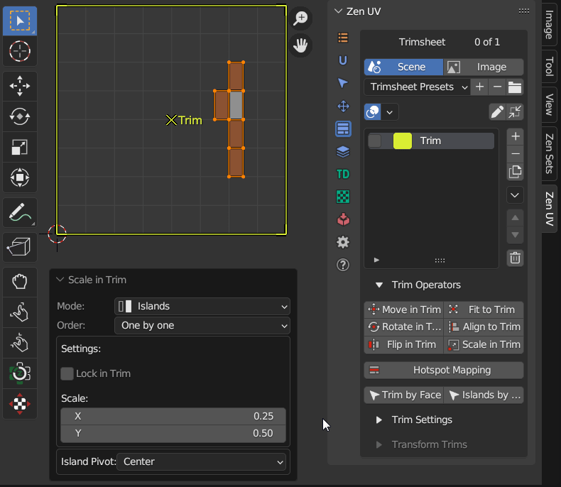 |
|---|
| |

## Hotspot Mapping
Hotspot Mapping is a UV mapping method that compares the parameters of Islands and Trims and makes automatic mapping based on the given settings.

[**Follow the link**](trimsheet_hotspot.md) to find more information about Hotspot Mapping.

---

## Quick Hotspot

The classic way to use Hotspot technology, which includes unwrap and several preprocessing steps to obtain fast results.
This operator can work with existing islands or create them based on the selected polygons.
The Quick Hotspot operator is available only in the 3D View context, since the UV Editor lacks sharp edge information, making it impossible to generate predictable islands.

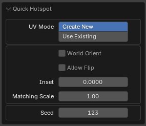

- **UV Mode** - How to process the selected faces.
    - *Create* - Create UV islands based on the current selection and existing seams. Islands will be transformed into rectangles when possible.
    - *Use Existing* - Use the current UV islands without modifying their shape.
- **World Orient** - Orient to World.
- **Allow Flip** - Allow flipping variation.
- **Inset** - Trim Inset.
- **Matching Scale** - The value for manually adjusting the area matching scale. As a result, the islands are shifted to larger or smaller trims depending on the Matching Scale value. Visually, this appears as an improvement or degradation of texture quality, while technically it corresponds to an increase or decrease in Texel Density, respectively.
- **Seed** - Seed of variable island distribution in similar trims.

---

## Select Trim By Face
Select and activate trim by selected face

## Select Islands By Trim
Select islands inside active trim

---
## Directional Hotspot Mapping

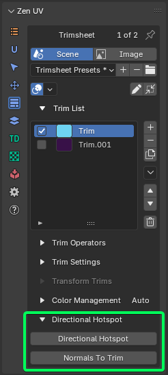

### Directional Hotspot Operator

Hotspot mapping using island normal vector.

!!! Properties
    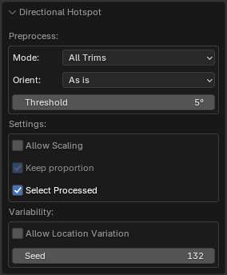

    - **Mode** – Defines which trims will be used for mapping.  
        - *All Trims* – Uses all available trims.  
        - *Selected Trims* – Uses only the selected trims.  
    - **Orient** – Determines island rotation before mapping.  
        - *As Is* – No rotation applied.  
        - *Orient to World* – Aligns the island to the world axis.  
        - *Orient to Axis* – Auto-orients the island to the nearest axis.  
    - **Threshold** – Defines how precisely the island's normal must match the trim's normal for mapping.  
    - **Keep Proportion** – Prevents stretching or squashing by maintaining the original aspect ratio of the UV islands.  
    - **Allow Location Variation** – If enabled, islands may be placed in different trims that have similar size and orientation parameters. If disabled, islands are strictly mapped to their assigned trims.  
    - **Allow Scaling** – Automatically scales UV islands to fit the target trim while preserving proportions (unless 'Keep Proportion' is disabled).  
    - **Select Processed** – After applying the mapping, this option highlights the UV islands that were successfully adjusted to trims.  
    - **Seed** – Sets a seed value for the randomization algorithm, ensuring consistent placement variations of islands in similar trims.  

    - **Orient** - Perform some Island rotation before Hotspotting

---
### **Normals To Trim**

Retrieve the normal vector from the selected face and apply it to the active trim.

!!! Properties  
      

- **Average Normal Value** – If enabled, calculates the average normal when multiple faces are selected.  
  If disabled, only the normal of the active face will be applied to the trim.  
