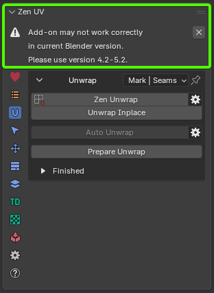

# FAQs
----
### Can I unwrap organic models using Zen UV?

**Answer:**

> Yes, among other tools Zen UV has [**Relax**](transform_sys/independent_ops.md#relax) operator that is well suited for relaxing UV Islands of organic 3D models.

----
### I can't Install or Update Zen UV.

**Answer:**

> Please visit this page [**Installation and update**](installation.md).

----
### How can I change default Zen UV shortcuts?

**Answer:**

> Go to **Edit** -> **Preferences** -> **Add-ons** -> **Zen UV** -> **Keymap**.

----

#### Why do I see the "Add-on may not work correctly in current Blender version" warning?

|  |
| :---: |
| *Fig. 1. Blender Version Compatibility Warning banner* |

**Answer:**

> This warning appears when Zen UV is launched in a Blender build (such as Alpha, Beta, or Daily Builds) that is newer than the supported version range. 

> Because experimental Blender builds undergo frequent API modifications prior to official releases, certain tools may behave unpredictably. Compatibility updates for Zen UV are released as soon as the corresponding stable Blender version is officially launched. You can safely dismiss the banner by clicking the **✕** icon and continue working.

---

If you have any questions, please let us know:
 [**Discord**](https://discord.gg/wGpFeME)