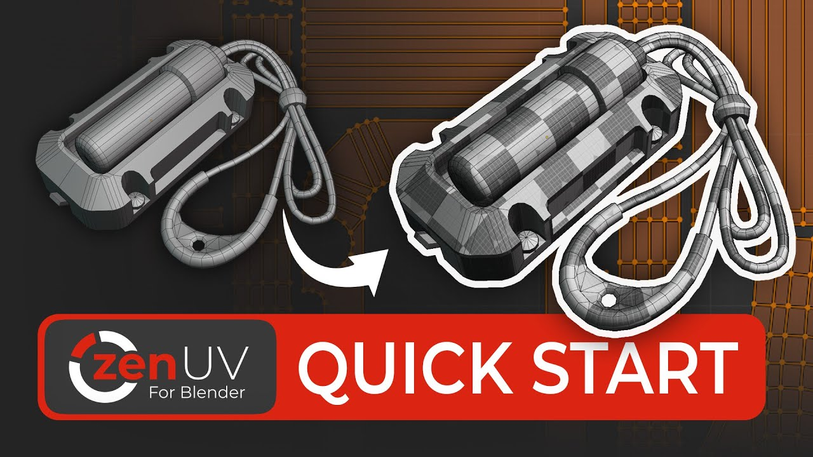

# Step-by-Step Guide Examples
A step-by-step guide is a structured set of instructions designed to lead users through a learning Zen UV in a sequential manner, breaking it down into easy-to-follow steps.

## 1. Emergency Light
A step-by-step beginner tutorial designed to learn the basics of creating UV coordinates using the Zen UV addon. In this tutorial, you will learn the basic rules of creating UV unwraps and how to use the Zen UV tools for quick and comfortable work. You will receive basic information about the rules and recommendations for creating UV coordinates for game engines.

|  {:colspan=3}|
|:---:|
| [English](tutorial/emergency_light/emergency_light_eng.md) {:rowspan=3}|
| [Ukrainian](tutorial/emergency_light/emergency_light_ukr.md) {:rowspan=3}|
| [Russian](tutorial/emergency_light/emergency_light_rus.md) {:rowspan=3}|
