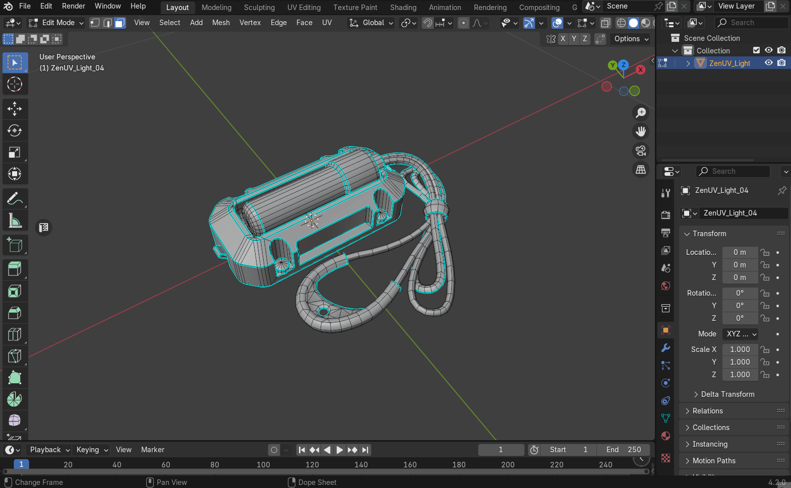
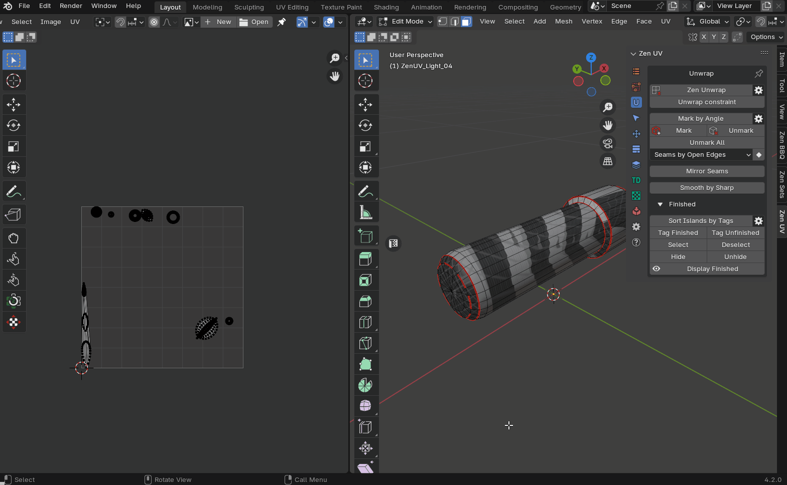
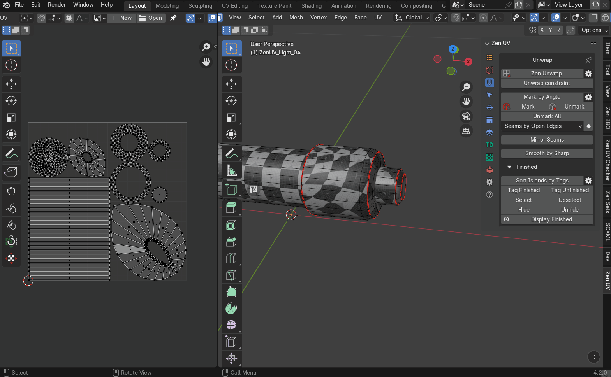
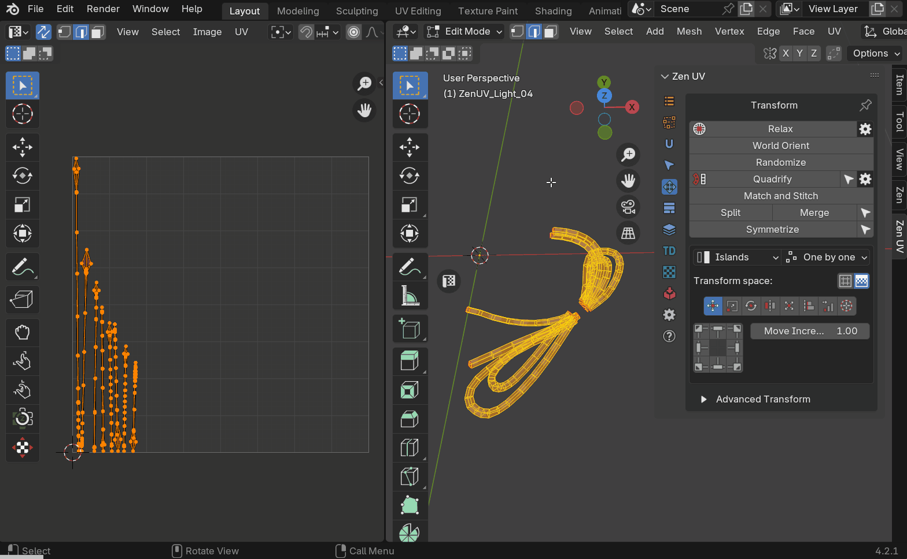
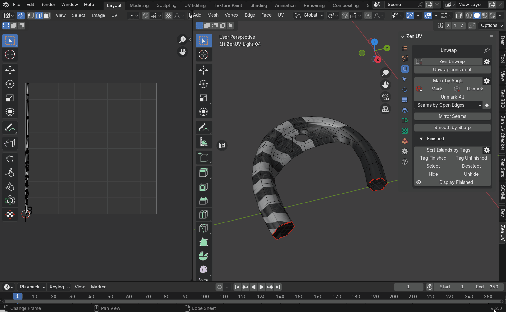
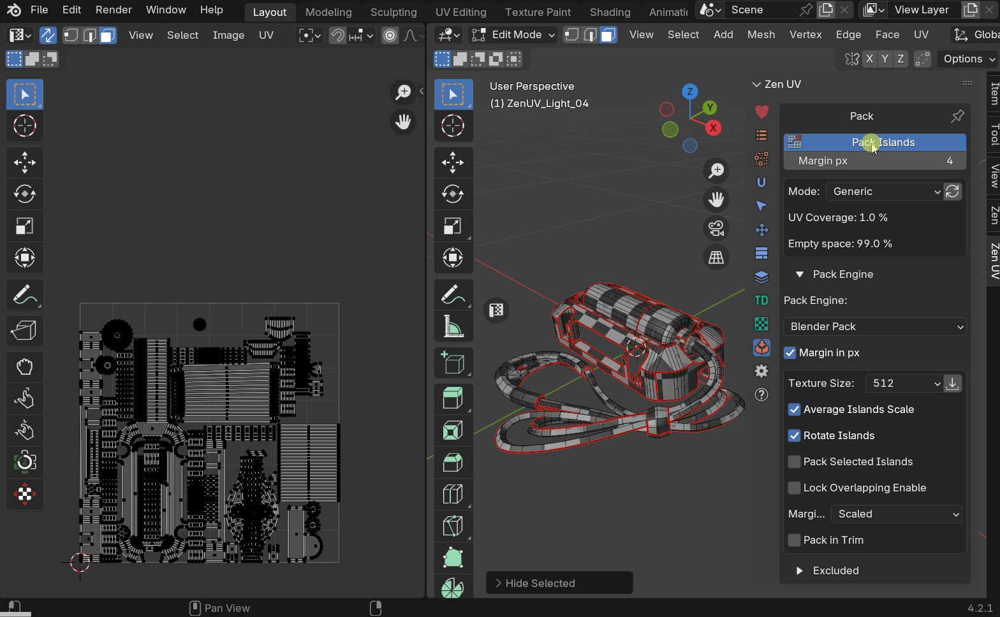
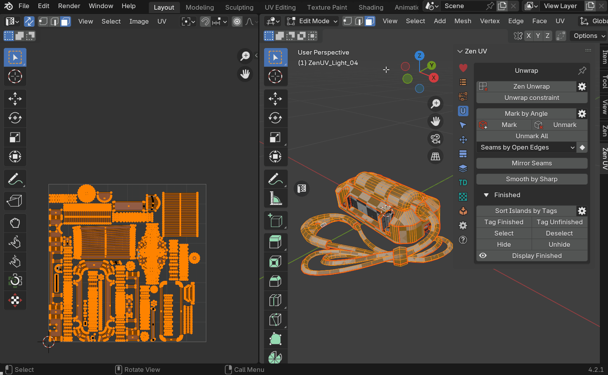

# Emergency Light

The example is maked as step-by-step guide to cover the basics of Zen UV

## Download Example
1. Download example using [examples panel](../help.md#examples)
2. Open it
3. Switch to edit mode

    

## Reset UV Maps and Unmark All
1. [Unmark all](../unwrap.md#unmark-all) (remove all seams and sharp edges from mesh)
2. Check that all islands are tagged as unfinished
3. Delete all UV maps

    

## Initial Unwrap
1. Deselect all
2. Call [Zen Unwrap](../unwrap.md#zen-unwrap-zen-unwrap)
3. Set 'Mark by angle & Unwrap'

    

!!! NOTE
    If you didn't see 'Mark by Angle' menu then it was probably something selected in the mesh or mesh was not unmarked properly

## Switch on Checker Texture
1. [Switch on checker texture](../checker.md#checker-texture)
2. [Select 'zen-mono-2048x2048' texture image](../checker.md#checker-textures-selector)
3. [Set only Seams to be displayed in the viewport](../checker.md#blender-draw-system)
4. [Open UV Editor area](../sticky_uv_editor.md#sticky-uv-editor)

    

## Adjust Viewport For Mapping
1. Close all areas except View3D and UV Editor
2. Unlink checker image in UV Editor for better view of islands

    

## Unwrap Internal Cylindrical Part
1. Select and isolate cylindrical part of the mesh

    

2. Unwrap cap 1 by selected polygons

    

3. Unwrap tube by selected edge

    

4. Unwrap cap 2 by selected polygons

    

5. Merge islands by re-unwrap

    

6. [Quadrify rectangular-shaped islands](../transform.md#quadrify-islands)

    

7. [Pack islands](../pack.md#pack-islands)
8. [Tag as finished](../unwrap.md#tag-finished)

    

## Unwrap External Cover
1. [Isolate](../select.md#isolate-islands-toggle) external cover mesh part

    

2. Re-unwrap mesh to separate rectangular-shaped island

    

3. Quadrify created island

    

4. Unwrap by side cuts

    

5. Unwrap by creating project from view

    

6. Pack islands and tag as finished

    

## Unwrap Small Parts
1. Isolate small mesh parts

    

2. Unwrap by cuts

    

3. Unwrap part by selected polygons

    

4. Unwrap by cut to get rectangular shape

    

5. Quadrify rectangular-shaped islands

    

6. Pack islands and tag as finished

    

2. Unwrap by selected polygons

    

3. Quadrify
4. Tag as finished

    

## Unwrap Handle
1. Select and isolate islands

    

2. Unwrap to create one island

    

3. Create cuts and unwrap

    

4. [Relax](../transform.md#relax) island

    

5. [Orient by selected](../transform.md#rotate)

    

6. Make rectangular-shaped island:
    - align and distribute surrounded vertices
    
        

    - unwrap with 'Unfold Vertices' mode

        

7. Tag as finished

    

## Final Pack
1. Unhide all
2. Select all
3. Pack

    

## Reduce UV Space With Stacks
1. Select islands that can be identified as [replicas](../stack.md#replicas)

    

2. Hide replicas
3. Set texture size for packing
4. Set corresponding margin for packing
5. Pack islands

    

6. [Stack](../stack.md#stack) selected replicas

    

## Set Sharp Edges
1. Set [sharp by UV borders](../unwrap.md#sharp-by-uv-borders)
2. Mark
3. Enable option 'Unmark sharp'
4. [Smooth by sharp](../unwrap.md#smooth-by-sharp-toggle)

    
